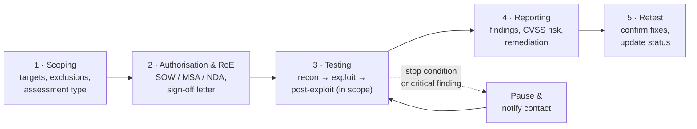
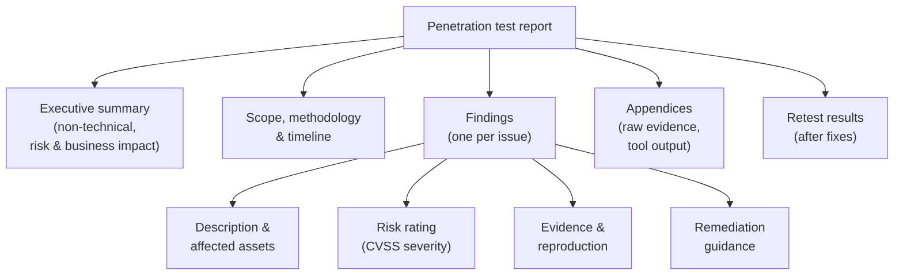

# Domain 1 — Engagement Management (13%)

**Engagement Management** is the professional spine of a penetration test: the planning,
authorisation, ethics, methodology, and reporting that wrap around the technical work. It is
weighted **13%** of CompTIA PenTest+ (PT0-003), and although it is the smallest domain by
percentage, it is the one that makes everything else **lawful, in-scope, and valuable to the
client**. A test that finds critical flaws but is unauthorised, out of scope, or poorly
reported is a liability, not a service. This page covers pre-engagement activities,
collaboration and communication during the engagement, the recognised testing methodologies
and standards, reporting and findings, and the professionalism / governance, risk, and
compliance (GRC) expectations a tester must meet.

> [!IMPORTANT]
> **Authorised use only.** Penetration testing is legal **only** with explicit **written
> authorisation** from someone with authority over the asset, a defined **scope**, and agreed
> **Rules of Engagement (RoE)**. The difference between a penetration tester and a criminal is
> **permission, not tooling**. This page is conceptual and methodology-focused; it contains no
> weaponized attack steps. The shared, fuller treatment lives in the CEH hub:
> [../../ceh/00-overview/legal-and-ethics.md](../../ceh/00-overview/legal-and-ethics.md).

> **No fabrication.** Objective sub-numbers are not invented here; this page is written
> *toward* the PT0-003 objectives. Confirm exact wording and the full term list against
> CompTIA's official objectives PDF — see [how to get it](../00-overview/exam-and-objectives.md#how-to-get-the-official-exam-objectives).

## Learning objectives

- Describe **pre-engagement** activities: scope, RoE, contracts (SOW, MSA, NDA),
  authorisation, target audience, assessment types, and regulatory/compliance considerations.
- Explain **collaboration and communication** during an engagement, including escalation and
  de-escalation.
- Recognise the major **methodologies and standards**: PTES, OWASP, NIST SP 800-115,
  MITRE ATT&CK, and OSSTMM.
- Structure a professional **report**: executive summary, findings with **CVSS** risk
  ratings, remediation, and retest.
- Apply **professionalism, ethics, and governance/risk/compliance (GRC)** throughout.

## The engagement lifecycle

A penetration test is far larger than "the hacking part." Most of the value — and all of the
legal protection — comes from the work before and after active testing. PenTest+ frames the
engagement as a lifecycle from scoping through retest.

## Pre-engagement activities

Before any testing, the tester and client agree exactly what the engagement covers and who
has authorised it. This is the **pre-engagement** phase (the first phase of PTES, the
Penetration Testing Execution Standard).

### Scope definition

**Scope** defines the precise boundaries of the engagement — what is **in** and, equally
important, what is **out**. Scope typically specifies:

- **Targets** — Internet Protocol (IP) ranges, domains, applications, accounts, and physical
  locations that are *in* scope.
- **Exclusions** — assets that must **not** be touched (e.g. production payroll, medical or
  safety systems, third-party infrastructure).
- **Permitted techniques** — whether social engineering, Denial-of-Service (DoS) testing, or
  physical entry are allowed (these are often explicitly excluded).
- **Timing windows** — when testing may occur, to limit business impact.
- **Constraints** — bandwidth/throttling limits, fragile systems, and data-handling rules.

> **Scope creep is dangerous.** "While I was in there, I also tested the adjacent server" can
> be unauthorised access even mid-engagement. Stay strictly inside the agreed scope; if the
> scope needs to change, it is re-authorised **in writing** first.

### Rules of Engagement (RoE)

The **Rules of Engagement (RoE)** is the document that turns scope and authorisation into a
working playbook. It is the tester's guide and the client's safety net. A typical RoE covers
authorised techniques and constraints, **points of contact and an escalation path**, **stop
conditions** (when to halt immediately — e.g. system instability or signs of a *real* breach),
handling of discovered sensitive data, the communication cadence, and evidence-handling and
confidentiality terms.

### Contracts and agreements (SOW, MSA, NDA, and authorisation)

Verbal permission is worthless if challenged. Engagements rest on **written** agreements:

| Document | Full name | What it does |
| --- | --- | --- |
| **SOW** | Statement of Work | Defines this specific engagement: deliverables, scope, timeline, and price. |
| **MSA** | Master Service Agreement | The overarching legal/commercial terms governing the relationship, under which SOWs sit. |
| **NDA** | Non-Disclosure Agreement | Protects the sensitive findings and client data discovered during testing. |
| **Authorisation letter** | "Get-out-of-jail-free" letter | A signed document, held by the tester, proving the asset owner authorised the testing for the stated scope and dates. |

The **authorisation letter** must come from **someone with the authority to grant it** (the
asset owner, not a single helpful employee), be **specific** about what may be tested, and be
**time-bounded**. If a tester's activity is questioned — by the client's own Security
Operations Center (SOC) or by law enforcement — this letter is the immediate proof of
authorisation. It only protects activity against the *signing* organisation's systems, within
the *stated* scope and dates; it does not authorise touching anyone else's systems and does
not override the law. If testing could touch **third-party** infrastructure (cloud providers,
hosting, Software-as-a-Service), you may also need **their** authorisation — verify each
provider's current testing policy.

### Target audience and assessment types

Knowing the **target audience** for the engagement (a development team, an executive board, a
compliance auditor) shapes both how the test is run and how the report is written. The
**assessment type** also sets expectations:

- **By knowledge given to the tester** — **black-box** (little or no prior knowledge,
  simulating an external attacker), **white-box** (full information: architecture, source,
  credentials), and **grey-box** (partial, e.g. a standard user account). See the trade-offs
  in [../../ceh/00-overview/legal-and-ethics.md](../../ceh/00-overview/legal-and-ethics.md#engagement-types-black-white-and-grey-box).
- **By target** — external network, internal network, web/API application, wireless, cloud,
  mobile, social engineering, and physical assessments — each with its own scope and risk
  profile.

### Regulatory and compliance considerations

Many engagements are driven by, or constrained by, **regulatory and compliance** requirements.
A tester must understand which apply, because they affect scope, data handling, and reporting.
Common examples (described generally — *confirm current applicability and seek qualified
advice*):

| Regime | Relevance to a test |
| --- | --- |
| **PCI DSS** (Payment Card Industry Data Security Standard) | Mandates periodic penetration testing of cardholder-data environments. |
| **HIPAA** (Health Insurance Portability and Accountability Act) | Governs protected health information; constrains what test data may touch. |
| **GDPR** (General Data Protection Regulation) | Governs personal data of EU/EEA individuals; handling and breach rules apply if testing exposes it. |
| **SOC 2 / ISO 27001** | Audits and certifications that often require evidence of security testing. |

## Collaboration and communication during the engagement

A professional engagement is **communicated continuously**, not just reported at the end:

- **Agreed cadence** — regular status updates so the client is never surprised.
- **Immediate escalation of critical findings** — a flaw that exposes the organisation right
  now is reported at once, not held for the final report.
- **Defined points of contact** — technical and management contacts, reachable during the
  testing window.
- **De-escalation** — if testing triggers an incident response, causes instability, or
  uncovers a *real, pre-existing* breach, the tester pauses, notifies the contact, and helps
  **de-escalate** rather than pressing on. Stop conditions in the RoE govern this.

> For a sysadmin: treat the client's SOC the way you would want a tester to treat yours — warn
> them of the testing window where the RoE allows, and have a "this is us, not an attacker"
> contact path ready so a real alert is never missed because everyone assumed it was the test.

## Testing methodology and standards

PenTest+ is methodology-aware: it expects you to recognise the major standards and understand
that they describe the *same* engagement lifecycle through different lenses. These are
**complementary**, not competing.

| Methodology / standard | Focus | Structure (summary) |
| --- | --- | --- |
| **PTES** (Penetration Testing Execution Standard) | The engagement *process* end to end | Seven phases: pre-engagement, intelligence gathering, threat modelling, vulnerability analysis, exploitation, post-exploitation, reporting. |
| **OWASP** (Open Worldwide Application Security Project) testing guides | Application-layer coverage | Methodology for web and API testing (e.g. the Web Security Testing Guide); the OWASP Top 10 frames common risks. |
| **NIST SP 800-115** (Technical Guide to Information Security Testing and Assessment) | US-government technical assessment baseline | Four phases: planning, discovery, attack, reporting. |
| **MITRE ATT&CK** | Adversary behaviour knowledge base | Tactics and techniques (with IDs) used to map findings and detections — not a linear process. |
| **OSSTMM** (Open Source Security Testing Methodology Manual) | Measurable, metrics-driven rigour | A scientific approach measuring operational security across channels (network, physical, wireless, human). |

> The takeaway PenTest+ wants: PTES gives you the process spine, NIST SP 800-115 a recognised
> baseline, OWASP application-layer depth, OSSTMM measurable rigour, and MITRE ATT&CK a shared
> vocabulary for adversary behaviour. A mature engagement borrows from all of them. The CEH
> hub treats these in more depth:
> [../../ceh/00-overview/engagement-methodology-and-reporting.md](../../ceh/00-overview/engagement-methodology-and-reporting.md).

## Reporting and findings

The report is the product the client pays for. A good report is **read by two very different
audiences** — executives who need the business picture, and technical staff who must reproduce
and fix each issue — so it is structured for both.

A professional report typically contains:

- **Executive summary** — a non-technical overview for leadership: overall risk posture, the
  most serious issues, and business impact. No jargon; this is what decision-makers read.
- **Scope, methodology, and timeline** — what was tested, how, when, and against which
  standards. Establishes credibility and reproducibility.
- **Findings**, one per issue, each with a **description and affected assets**, a **risk
  rating**, **evidence/reproduction** detail sufficient for the client to confirm the issue,
  and **remediation** — concrete, prioritised guidance to fix or mitigate (patch, reconfigure,
  compensating control).
- **Appendices** — raw evidence and tool output, kept out of the main narrative.
- **Retest** — after the client remediates, the tester **retests** to confirm fixes worked and
  introduced no new problems, then updates each finding's status.

### Risk ratings with CVSS

Findings are scored with the **Common Vulnerability Scoring System (CVSS)**, maintained by
**FIRST (the Forum of Incident Response and Security Teams)** — a vendor-neutral 0.0–10.0 score
mapped to None / Low / Medium / High / Critical. The score should be **adjusted for the
client's environment** (asset value, exposure, existing controls).

> **Prioritise by risk, not by raw CVSS alone.** A Medium-severity flaw on an internet-facing
> crown-jewel system can matter more than a Critical on an isolated test box. The report should
> make that prioritisation explicit so remediation effort goes where it counts. Mapping
> findings to **MITRE ATT&CK** technique IDs lets the client align detections to the very
> techniques the test demonstrated — turning the report into a defensive roadmap.

### Communication and de-escalation in delivery

Delivery is itself a communication exercise: walk the client through the findings, manage
expectations, avoid alarmist language, and **de-escalate** — frame issues as fixable risks
with a clear path, not as blame. Confidentiality (per the NDA) governs distribution: findings
go to need-to-know recipients, and evidence is securely handled and destroyed per the agreed
terms.

## Professionalism, ethics, and governance/risk/compliance (GRC)

The technical skill is only half of penetration testing. PenTest+ expects **professionalism**
throughout: integrity, confidentiality, staying strictly in scope, handling sensitive data
responsibly, and conducting yourself honestly and competently. The same actions that make you
a tester make you a criminal without authorisation — so ethics is not an add-on, it is the
licence to operate.

This connects directly to **governance, risk, and compliance (GRC)**: penetration testing is
one input to an organisation's wider risk-management and compliance programme. Findings feed
risk registers, compliance evidence, and remediation planning — the management-and-oversight
view covered by Security+ Domain 5. See the cross-links below.

## Exam tips

- **Know the documents cold.** Be able to distinguish **SOW** (this engagement), **MSA**
  (the overarching relationship), **NDA** (confidentiality), and the **authorisation letter**
  ("get-out-of-jail-free" — proof of permission). PBQs love matching these to scenarios.
- **Authorisation comes from someone with authority.** A scenario where a junior employee
  "says it's fine" is a trap — you need sign-off from the asset owner, in writing, scoped, and
  time-bounded.
- **Scope creep = unauthorised access.** If a scenario tempts you to test something outside the
  agreed targets, the correct action is to **stop and re-authorise in writing**, not proceed.
- **Stop conditions and de-escalation.** Recognise when to **pause and notify** (system
  instability, a real pre-existing breach, critical finding) rather than continuing.
- **Map methodologies to their shape.** PTES = 7-phase process; NIST SP 800-115 = plan /
  discover / attack / report; OWASP = application layer; MITRE ATT&CK = a knowledge base of
  tactics/techniques (not a linear process); OSSTMM = measurable rigour.
- **Report structure.** Executive summary (non-technical) vs. technical findings (CVSS,
  evidence, remediation); **retest** confirms fixes; **prioritise by business risk**, not raw
  CVSS.

## Where to go next

- [../00-overview/what-is-pentest-plus.md](../00-overview/what-is-pentest-plus.md) — what
  PenTest+ is and where it sits.
- [02-reconnaissance-and-enumeration.md](02-reconnaissance-and-enumeration.md) — the next
  domain: information gathering on in-scope targets.
- [../../ceh/00-overview/legal-and-ethics.md](../../ceh/00-overview/legal-and-ethics.md) —
  the shared authorisation, scope, RoE, and disclosure foundation (fuller treatment).
- [../../ceh/00-overview/engagement-methodology-and-reporting.md](../../ceh/00-overview/engagement-methodology-and-reporting.md) —
  the engagement lifecycle, evidence handling, and reporting in depth.
- [../../security-plus/domains/05-security-program-management-oversight.md](../../security-plus/domains/05-security-program-management-oversight.md) —
  the governance, risk, and compliance (GRC) view that testing feeds into.

## Sources

- CompTIA — PenTest+ (PT0-003) official certification page and exam objectives (Domain 1
  Engagement Management, weighted 13%): https://www.comptia.org/en-us/certifications/pentest/
- PTES, Penetration Testing Execution Standard — http://www.pentest-standard.org/
- NIST SP 800-115, Technical Guide to Information Security Testing and Assessment — https://csrc.nist.gov/pubs/sp/800/115/final
- OWASP, Web Security Testing Guide — https://owasp.org/www-project-web-security-testing-guide/
- MITRE ATT&CK knowledge base — https://attack.mitre.org/
- ISECOM, OSSTMM (Open Source Security Testing Methodology Manual) — https://www.isecom.org/OSSTMM.3.pdf
- FIRST, Common Vulnerability Scoring System (CVSS) — https://www.first.org/cvss/
- Related in this repo: [../../ceh/00-overview/legal-and-ethics.md](../../ceh/00-overview/legal-and-ethics.md) ·
  [../../ceh/00-overview/engagement-methodology-and-reporting.md](../../ceh/00-overview/engagement-methodology-and-reporting.md) ·
  [../../security-plus/domains/05-security-program-management-oversight.md](../../security-plus/domains/05-security-program-management-oversight.md)
- Domain weighting and objective wording are version-sensitive — *verify on CompTIA*. This page
  is educational, not legal advice; verify current law and regulation for your jurisdiction and
  seek qualified counsel.
