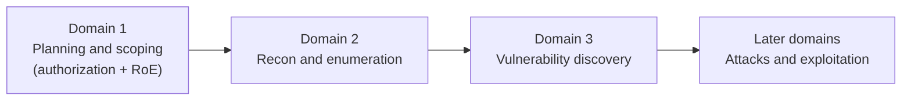
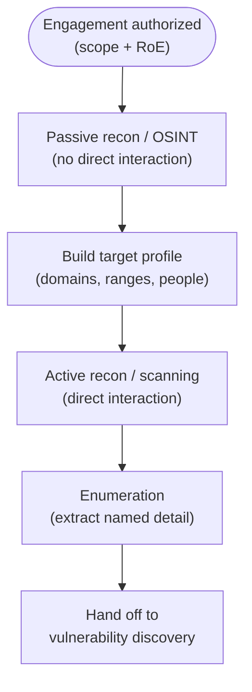

# Domain 2 — Reconnaissance and Enumeration

Reconnaissance and enumeration is the **information-gathering** stage of a penetration test: the systematic collection of data about a target's people, domains, networks, hosts, services, and exposed assets, building the map that every later phase depends on. On the **CompTIA PenTest+ (PT0-003)** exam this is **Domain 2 — Information Gathering and Vulnerability Scanning** (weighted at roughly **21%**, the largest single domain), making it the highest-value area to master. For a systems administrator moving into penetration testing, this is also the most familiar ground: it is the discipline of *knowing your own attack surface*, turned into a repeatable methodology.

> **Authorized-use note.** Everything here is **educational and defense-oriented**. Reconnaissance — especially *active* reconnaissance — interacts with systems you may not own and is legal **only** with **explicit written authorization**, a defined **scope**, and an agreed set of **Rules of Engagement (RoE)**. Gathering information against systems outside that authorization can be a crime in most jurisdictions. This page names tools by **purpose** (as CompTIA does) and provides **no weaponized scripts, command playbooks, or exploit code**. Mirror the defensive framing of the [CEH reconnaissance module](../../ceh/domains/02-footprinting-and-reconnaissance.md).

## Learning objectives

- Distinguish **passive** reconnaissance from **active** reconnaissance, with conceptual examples and a note on detectability.
- Explain **Open-Source Intelligence (OSINT)** and the categories of public sources it draws on.
- Describe **enumeration** across the major target types: hosts, services, operating systems (OS), the Domain Name System (DNS), network shares, web applications, certificates, wireless, and cloud assets.
- Recognize common **reconnaissance and enumeration tools by purpose** (for example Nmap, theHarvester, Recon-ng, Shodan, Maltego).
- Explain core **active reconnaissance / scanning** concepts (host discovery, port and service scanning, banner grabbing, OS fingerprinting).
- Understand, **conceptually**, how scripting and automation (Bash, Python, PowerShell) are used to scale enumeration — without any weaponized code.
- Map reconnaissance behavior to defensive frameworks and apply countermeasures that shrink the attack surface.

## Where this fits in PT0-003

CompTIA structures the penetration-testing engagement into phases that align with industry methodologies such as **NIST SP 800-115** (the *Technical Guide to Information Security Testing and Assessment*), the **Penetration Testing Execution Standard (PTES)**, the **Open Source Security Testing Methodology Manual (OSSTMM)**, and the **MITRE ATT&CK** knowledge base. Information gathering sits **after** scoping and engagement planning (Domain 1) and **before** attacks and exploitation (Domain 3 onward).

The MITRE ATT&CK tactics most relevant to this domain are **Reconnaissance (TA0043)** and **Resource Development (TA0042)** for the pre-engagement view, and **Discovery (TA0007)** for enumeration performed from an established foothold.

## Passive vs active reconnaissance

The defining distinction in this domain is **passive** vs **active**. CompTIA expects you to classify a given technique correctly and to understand the trade-off between *stealth* and *depth of information*.

| Aspect | Passive reconnaissance | Active reconnaissance |
| --- | --- | --- |
| Definition | Gathering information **without directly interacting** with the target's systems | Gathering information **by directly interacting** with the target's systems |
| Detectability | Very low — the target usually cannot tell it is happening | Higher — the target may log, alert on, or detect the interaction |
| Conceptual examples | Reviewing the public website, search engines, social media, job postings, third-party WHOIS/DNS databases, certificate transparency logs, public code repositories | Port and service scanning, banner grabbing, direct DNS interrogation of the target's own servers, OS fingerprinting, web crawling/spidering of the live site |
| Primary data source | Third parties and public archives | The target organization itself |
| Risk to engagement | Minimal | Can disrupt fragile systems; must stay within scope and RoE |

The guiding principle: **the more direct the interaction with the target, the more "active" — and the more detectable — it becomes.** Authorized testers often begin passively to build context with minimal footprint, then move to active techniques once the scope and timing window allow. For the deeper CEH treatment of this distinction, see [footprinting and reconnaissance](../../ceh/domains/02-footprinting-and-reconnaissance.md).

## Open-Source Intelligence (OSINT)

**Open-Source Intelligence (OSINT)** is intelligence produced from **publicly available** information — anything anyone can lawfully access without special privileges. "Open source" here means *open/public information*, not open-source software. OSINT is the foundation of passive reconnaissance and a frequent PT0-003 topic.

Common OSINT source categories:

- **Search engines** and cached/archived pages (including advanced search operators, sometimes called *Google dorking*, used only conceptually to find inadvertently exposed content).
- **Organizational websites** — about pages, leadership bios, published documents, and the **metadata** inside them (author names, software versions, internal paths).
- **Social and professional networks** — employee names, roles, reporting structure, and technologies, which feed both org-charting and social-engineering pretexts.
- **Public registries** — WHOIS, DNS, the **Regional Internet Registries (RIRs)** (ARIN, RIPE NCC, APNIC, LACNIC, AFRINIC), and **certificate transparency (CT) logs**.
- **Job and recruitment postings**, which routinely disclose the internal technology stack (exact products and versions a role requires).
- **Public code repositories, paste sites, and technical forums**, where credentials and configuration can leak.
- **Breach and credential-exposure data**, used (within scope) to identify reused or exposed credentials.

The defensive flip side is **self-OSINT**: regularly running these same searches against your own organization to discover and remediate exposure before an attacker does.

## Enumeration by target type

**Enumeration** is the active extraction of concrete, named details from the assets reconnaissance has identified — moving from *"what exists?"* to *"who and what is actually behind it, and what does it reveal?"*. It is deeper and noisier than scanning because it establishes real connections and queries. The table maps each enumeration target to what it can reveal; the CEH hub covers the mechanics in depth in [scanning networks](../../ceh/domains/03-scanning-networks.md) and [enumeration](../../ceh/domains/04-enumeration.md).

| Target | What enumeration seeks | What it can reveal |
| --- | --- | --- |
| **Hosts** | Live systems in scope | Reachable Internet Protocol (IP) addresses, network topology, host roles |
| **Services** | Listening applications and versions | Open Transmission Control Protocol (TCP)/User Datagram Protocol (UDP) ports, service banners, software versions |
| **Operating systems** | OS family and version | Inferred from response behavior (default Time To Live (TTL), TCP window size, flag handling) — *OS fingerprinting* |
| **DNS** | Domain infrastructure | A/AAAA, MX, NS, TXT, SOA, CNAME records; subdomains; mail and third-party services. A misconfigured **zone transfer (AXFR)** can dump an entire zone — a defensive checklist item |
| **Network shares** | Shared storage and access | Server Message Block (SMB)/Network File System (NFS) shares, permissions, exposed files, null-session weaknesses |
| **Web and applications** | Site structure and inputs | Directories, parameters, technologies, content management systems, application programming interface (API) endpoints, hidden fields |
| **Certificates** | TLS certificate data | Subject/SAN hostnames revealing subdomains, issuer, validity, weak algorithms — often via public **CT logs** (passive) or direct TLS handshakes (active) |
| **Wireless** | Nearby radio networks | Service Set Identifiers (SSIDs), encryption type, rogue or guest access points, signal reach (in-scope physical/RF testing only) |
| **Cloud assets** | Externally exposed cloud resources | Storage buckets, serverless endpoints, exposed management interfaces, metadata services, and misconfigured public resources across providers |

### Notes on selected targets

- **DNS enumeration** ("DNS interrogation") systematically queries each record type to map external infrastructure. Email-authentication records in **TXT** data relate to **SPF (Sender Policy Framework)**, **DKIM (DomainKeys Identified Mail)**, and **DMARC (Domain-based Message Authentication, Reporting and Conformance)**. For protocol-level depth on DNS, LDAP, Kerberos, and TLS, see the [protocols reference](../../../protocols/).
- **Network-share enumeration** (SMB/NFS) is a classic high-yield source on internal networks; null sessions and over-permissive shares frequently expose user lists and sensitive files.
- **Certificate enumeration** is especially valuable because CT logs publish every issued certificate — a passive way to discover subdomains and shadow infrastructure.
- **Cloud-asset enumeration** is a growing PT0-003 emphasis: public object storage, exposed orchestration dashboards, and cloud metadata endpoints are common findings. Keep all cloud testing strictly within the authorized account and scope.

## Active reconnaissance and scanning concepts

Active reconnaissance sends packets *to* the target and interprets the responses. The core concepts CompTIA expects:

- **Host discovery** — determining which addresses are live before deeper probing (for example, Internet Control Message Protocol (ICMP) echo / ping sweeps, or Address Resolution Protocol (ARP) discovery on the local segment).
- **Port and service scanning** — probing TCP/UDP ports to learn their **state** (open, closed, filtered) and the service/version behind each. Scan techniques (full-connect, half-open SYN, UDP, and flag-based scans) and the TCP three-way handshake are detailed conceptually in the [CEH scanning module](../../ceh/domains/03-scanning-networks.md).
- **Banner grabbing** — reading the version string a service announces on connection, to map software to known vulnerabilities.
- **OS fingerprinting** — inferring the OS from subtle response characteristics; *active* fingerprinting sends crafted probes, *passive* fingerprinting only observes traffic.
- **Web crawling / spidering** — walking a web application's links and inputs to map its structure and discover hidden content (within scope).

Throughput vs stealth is a constant trade-off: faster, broader scans are noisier and more likely to disrupt fragile hosts or trip detection, so timing and intensity must respect the RoE.

## Reconnaissance and enumeration tools (purpose only)

PT0-003 expects you to recognize tools by **purpose**, not to memorize commands. The list below is conceptual; this hub provides **no operational playbooks**. The cross-certification [tools-by-phase reference](../../ceh/tools/tools-by-phase.md) groups many of these by engagement phase.

| Tool | Category | Purpose |
| --- | --- | --- |
| **Nmap (Network Mapper)** | Active scanner | Host discovery, port scanning, service/version detection, OS detection — the reference scanning tool |
| **theHarvester** | OSINT collector | Gathers emails, subdomains, hostnames, and related data about a domain from public sources |
| **Recon-ng** | Modular OSINT framework | Structured, module-based environment for automating and organizing web-based information gathering |
| **Maltego** | Link-analysis platform | Visualizes relationships between entities (people, domains, emails, infrastructure) in OSINT data |
| **Shodan** | Internet-device search engine | Indexes internet-facing hosts, services, and banners to discover exposed devices and external exposure |
| **WHOIS / `whois`** | Registration lookup | Returns domain/IP registration data (registrar, contacts, name servers) from registries and RIRs |
| **`nslookup` / `dig`** | DNS query utilities | Query DNS records directly for detailed DNS interrogation |
| **Certificate transparency search** | Passive subdomain discovery | Reveals issued TLS certificates and the hostnames they cover, exposing subdomains |
| **Web/content discovery tools** | Web enumeration | Map directories, parameters, and hidden content on in-scope web applications |
| **Cloud enumeration tools** | Cloud-asset discovery | Identify exposed storage, endpoints, and misconfigured public resources within an authorized cloud account |

> **Defensive note.** The same tools that profile a target can be turned inward. Running Shodan, theHarvester, `dig`, and CT-log searches against *your own* domains is a legitimate, recommended way to find unintended exposure first.

## Scripting and automation for recon (conceptual)

At scale, reconnaissance and enumeration are **automated**. CompTIA expects familiarity with the *role* of scripting languages in a penetration test, not weaponized code. Conceptually:

- **Bash** — common on Linux for chaining command-line tools, iterating over host lists, and parsing output in an engagement.
- **Python** — widely used to orchestrate enumeration, call APIs (for example OSINT or cloud-provider APIs), and normalize results, thanks to its rich library ecosystem.
- **PowerShell** — the natural choice in Windows and Active Directory (AD) environments for querying hosts, services, and directory objects.

The legitimate purpose of automation here is **consistency, coverage, and speed**: running the same enumeration uniformly across a large scope and collecting results for analysis. This hub describes automation **only conceptually** and provides **no weaponized scripts**. Treat any automation as in-scope tooling that must respect rate limits, timing windows, and the RoE so it does not disrupt production systems.

## Countermeasures / Defense

Because reconnaissance largely exploits information already made public, most defenses reduce and control **exposure** rather than block a single attack. Consistent with **NIST SP 800-115** and **NIST SP 800-53** controls:

- **Minimize public disclosure.** Publish only what is necessary on websites, job postings, and social media; strip document **metadata** before release.
- **Configure DNS securely.** Restrict **zone transfers (AXFR)** to authorized secondaries, keep internal hostnames out of public DNS, and use split-horizon DNS.
- **Harden email.** Implement and correctly scope **SPF**, **DKIM**, and **DMARC**, and limit information leaked in headers and bounce messages.
- **Reduce attack surface.** Disable unnecessary services, close unused ports, and segment networks so a scan in one segment cannot reach or reveal the whole environment.
- **Suppress or genericize banners** so banner grabbing and OS fingerprinting yield less.
- **Govern cloud configuration.** Block public object storage by default, restrict management interfaces, and protect cloud metadata endpoints; use cloud security posture management to catch drift.
- **Manage the external attack surface continuously.** Run **self-OSINT** — Shodan, CT logs, and search engines against your own assets — and remediate stale subdomains and exposed services.
- **Monitor and detect.** Centralize logs and alert on patterns of active reconnaissance (anomalous DNS queries, scan signatures), mapping observed behavior to **MITRE ATT&CK** Reconnaissance (TA0043) and Discovery (TA0007). The repo's [attack-to-defense matrix](../../../attack-to-defense-matrix.md) links offensive techniques to defensive controls.

> Reminder: reconnaissance against systems you do not own requires **explicit written authorization**, a defined **scope**, and agreed **Rules of Engagement** — without them, the activity may be unlawful regardless of intent.

## Exam tips

- **Information gathering is the largest Domain 2 weighting (~21%)** — invest study time here; verify the exact percentage against the current CompTIA PT0-003 objectives.
- **Passive vs active is the core distinction:** passive = no direct interaction (stealthy, third-party sources); active = direct interaction with the target (more detectable, more disruptive).
- **OSINT = Open-Source Intelligence** = intelligence from *publicly available* sources (not open-source software).
- Know what each **enumeration target** reveals: hosts, services, OS, DNS, shares, web/apps, certificates, wireless, and **cloud assets** (a growing emphasis).
- **Certificate transparency (CT) logs** are a passive way to discover subdomains; **DNS zone transfer (AXFR)** misconfiguration can dump an entire zone.
- **Match tool to purpose:** Nmap → scanning; theHarvester → emails/subdomains; Recon-ng → modular OSINT framework; Maltego → link analysis; Shodan → internet-device search engine.
- **Scripting languages by environment:** Bash (Linux), Python (general orchestration/APIs), PowerShell (Windows/AD) — know the *role*, not weaponized code.
- This domain maps to **MITRE ATT&CK** Reconnaissance (TA0043) and Discovery (TA0007), and aligns with **NIST SP 800-115**, **PTES**, and **OSSTMM** methodologies.

## Where to go next

- [Domain 3 — Vulnerability discovery and analysis](03-vulnerability-discovery-and-analysis.md) — where enumeration output is turned into prioritized findings.
- [CEH — footprinting and reconnaissance](../../ceh/domains/02-footprinting-and-reconnaissance.md), [scanning networks](../../ceh/domains/03-scanning-networks.md), and [enumeration](../../ceh/domains/04-enumeration.md) — deeper mechanics.
- [Protocols reference](../../../protocols/) — DNS, LDAP, Kerberos, TLS, and more at message level.
- [Tools by phase](../../ceh/tools/tools-by-phase.md) — tools grouped across the engagement.

## Sources

- CompTIA, PenTest+ (PT0-003) certification and exam objectives — https://www.comptia.org/certifications/pentest
- NIST, SP 800-115, *Technical Guide to Information Security Testing and Assessment* — https://csrc.nist.gov/pubs/sp/800/115/final
- NIST, SP 800-53, *Security and Privacy Controls for Information Systems and Organizations* — https://csrc.nist.gov/pubs/sp/800/53/r5/final
- MITRE ATT&CK, Reconnaissance tactic (TA0043) — https://attack.mitre.org/tactics/TA0043/
- MITRE ATT&CK, Resource Development (TA0042) and Discovery (TA0007) — https://attack.mitre.org/tactics/
- OWASP, Web Security Testing Guide (information gathering) — https://owasp.org/www-project-web-security-testing-guide/
- The Penetration Testing Execution Standard (PTES) — http://www.pentest-standard.org/
- ISECOM, Open Source Security Testing Methodology Manual (OSSTMM) — https://www.isecom.org/OSSTMM.3.pdf
- Nmap reference documentation — https://nmap.org/book/man.html
- Exact exam objective numbers, domain percentages, and tool/version specifics: *verify against the current CompTIA PT0-003 exam objectives* — https://www.comptia.org/
