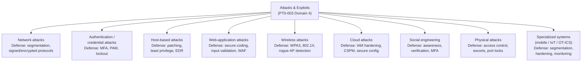

# Domain 4 — Attacks and Exploits

**Attacks and Exploits** is the largest domain on the **CompTIA PenTest+ (PT0-003)** exam, weighted at roughly **35%** (verify the current weighting on CompTIA). It is where the methodology you built in earlier domains — scoping, reconnaissance, and vulnerability analysis — turns into the *attack categories* a penetration tester must understand. For a systems administrator moving into penetration testing, this is the mirror of your day job: the same services, accounts, applications, and networks you operate are exactly what these attack categories target, so understanding them tells you precisely what to harden and how to detect abuse.

> **Authorized-use note.** Everything here is described **conceptually, for understanding and defense**. Penetration testing is legal **only with explicit written authorization**, a defined **scope**, and agreed **Rules of Engagement (RoE)**. Testing systems you do not own or have no authorization for is illegal in most jurisdictions. This page contains **no step-by-step exploitation, no exploit or payload code, and no detection-evasion recipes** — only attack categories, why they work, the **defense/countermeasure**, and **how a defender detects** each. Tools are named by **purpose only**.

## Learning objectives

- Identify the major **attack categories** PenTest+ expects: network, authentication/credential, host-based, web-application, wireless, cloud, social engineering, physical, and attacks on specialized systems (mobile, Internet of Things [IoT], Operational Technology [OT] / Industrial Control Systems [ICS]).
- For each category, explain **what it targets**, **why it works**, the **countermeasure**, and the **detection** a defender relies on.
- Map web-application attacks onto the **Open Worldwide Application Security Project (OWASP) Top 10**.
- Recognize key tools by **name and purpose** for both offensive awareness and defensive guarding.
- Connect each category to its deeper offensive treatment in the **Certified Ethical Hacker (CEH)** sibling hub and to the defensive controls in the [attack-to-defense matrix](../../../attack-to-defense-matrix.md).

## The attack-category taxonomy (defense-oriented)

PenTest+ organizes Domain 4 by the *surface* an attack targets. The taxonomy below is a navigation map, not a kill chain — a real engagement chains several of these together. Each branch is paired with the defender's primary control.

> The defender's reflex for this whole domain: **every attack category has a primary control and a detection signal.** If you can name both for each branch, you understand the domain the way a blue team does — and that is exactly the framing PenTest+ rewards.

## 1. Network attacks

**What they target.** The protocols and trust relationships that move traffic between hosts — name resolution, switching, routing, and any cleartext or unauthenticated protocol.

**Why they work.** Many foundational protocols were designed for trust, not adversaries. A **Man-in-the-Middle (MITM)** position lets an attacker observe or alter traffic; **Address Resolution Protocol (ARP) spoofing**, **Domain Name System (DNS) spoofing**, and **name-resolution poisoning** (abusing legacy Link-Local Multicast Name Resolution [LLMNR] / NetBIOS Name Service [NBT-NS]) redirect traffic through the attacker. **Relay attacks** forward captured authentication to a third system. **Denial-of-Service (DoS)** attacks exhaust a resource to break availability.

| Attack (concept) | Why it works | Defense | How a defender detects it |
| --- | --- | --- | --- |
| ARP / DNS spoofing, MITM | Stateless trust in local protocols | Dynamic ARP Inspection, DNSSEC, encrypted protocols, segmentation | Duplicate-MAC / gratuitous-ARP alerts; anomalous DNS answers |
| LLMNR/NBT-NS poisoning, relay | Legacy name resolution falls back insecurely | Disable LLMNR/NBT-NS; enforce SMB signing; channel binding | Sudden authentication to attacker-held host; relay patterns |
| DoS / DDoS | Finite capacity of a resource | Rate limiting, upstream scrubbing, redundancy | Traffic spikes, asymmetric request patterns |

**Tools (purpose only).** Network MITM/poisoning toolkits (e.g., **Responder** for name-resolution poisoning awareness), packet analyzers (**Wireshark**) for traffic inspection, and the **Metasploit Framework** as a general exploitation platform under authorization.

**Defender's takeaway.** Segment the network, retire cleartext and legacy name-resolution protocols, sign and encrypt what remains, and alert on the spoofing/relay signatures above. See CEH **[Sniffing](../../ceh/domains/08-sniffing.md)** and **[Denial-of-Service](../../ceh/domains/10-denial-of-service.md)**.

## 2. Authentication and credential attacks

**What they target.** The credentials and authentication systems that gate access — passwords, hashes, tickets, and tokens.

**Why they work.** Credentials are reused, weak, transmitted insecurely, or cached where an attacker who already has a foothold can read them. Once a **hash** or **ticket** is captured, offline cracking faces no account lockout. PenTest+ expects the *concepts* of **password spraying** (one common password against many accounts to dodge lockout), **credential stuffing** (reusing breached username/password pairs), **brute force / dictionary** cracking against captured hashes, and Windows/Active Directory credential abuses — **Pass-the-Hash (PtH)**, **Pass-the-Ticket (PtT)**, and **Kerberoasting** — covered at concept level here and in [Domain 5](05-post-exploitation-and-lateral-movement.md).

| Attack (concept) | Why it works | Defense | How a defender detects it |
| --- | --- | --- | --- |
| Password spraying | Few attempts per account evade lockout | MFA, breached-password screening, spray-aware lockout | Many accounts, one password, low per-account failures |
| Credential stuffing | Password reuse across sites | MFA, unique passwords, impossible-travel checks | Bursts of logins from one source across many accounts |
| Offline hash cracking | No rate limit on a stolen hash | Salted slow hashing; long passphrases | Detect the *theft* (LSASS access, hash-dump behavior) |
| PtH / PtT / Kerberoasting | Reusable secret material in AD | Tiered admin, PAM, strong service-account passwords, MFA | Anomalous ticket requests, lateral auth from one host |

**Tools (purpose only).** Password auditing/recovery tools (**Hydra** for online auth testing, **John the Ripper** and **Hashcat** for hash auditing), and Windows credential-material utilities (**Mimikatz**) — named for awareness so defenders know what to guard against.

**Defender's takeaway.** **Multi-Factor Authentication (MFA)** is the single highest-value control; layer it with **Privileged Access Management (PAM)** to vault and rotate privileged secrets, least privilege, and detection of credential-access behavior. See CEH **[System Hacking](../../ceh/domains/06-system-hacking.md)** and the **[attack-to-defense matrix](../../../attack-to-defense-matrix.md)** for the PAM mapping.

## 3. Host-based attacks

**What they target.** A single operating system after initial access — its services, local configuration, file/permission hygiene, and unpatched vulnerabilities.

**Why they work.** Local misconfigurations (weak service permissions, writable paths, stored secrets), unpatched **local privilege-escalation** vulnerabilities, and default or excessive privileges let a low-privilege foothold become **administrator** (Windows) or **root** (Linux). This is the **privilege-escalation** concept; the post-foothold actions that follow are in [Domain 5](05-post-exploitation-and-lateral-movement.md).

| Attack (concept) | Why it works | Defense | How a defender detects it |
| --- | --- | --- | --- |
| Local privilege escalation | Unpatched kernel/service flaws | Prompt patching; least privilege | Exploit signatures; new admin/root sessions |
| Service / permission misconfig abuse | Writable services, weak ACLs | Permission hygiene; configuration baselines | File-integrity and configuration-drift alerts |
| Stored-credential / secret harvesting | Secrets left on disk or in memory | Secret vaulting (PAM); credential protection | Access to credential stores; LSASS reads |

**Tools (purpose only).** Local enumeration helpers and the **Metasploit Framework** as an exploitation platform; **Endpoint Detection and Response (EDR)** is the corresponding *defensive* tool.

**Defender's takeaway.** Patch promptly, enforce least privilege so no day-to-day use of admin/root, fix file/service permissions, and run EDR to flag token/credential abuse and anomalous privilege grants. See CEH **[System Hacking](../../ceh/domains/06-system-hacking.md)**.

## 4. Web-application attacks (OWASP Top 10)

**What they target.** The custom code on top of a web server — logins, forms, dashboards, and Application Programming Interfaces (APIs) — which processes attacker-controlled input.

**Why they work.** The application trusts input it should not, or fails to enforce authorization server-side. The industry reference is the **OWASP Top 10 (2021)** risk categories.

| OWASP 2021 | Concept | Defense (durable fix) |
| --- | --- | --- |
| A01 Broken Access Control | Acting outside permissions (e.g., changing an ID to reach another account) | Enforce authorization **server-side** on every request/object |
| A02 Cryptographic Failures | Weak/missing encryption of sensitive data | TLS in transit; strong salted hashing at rest |
| A03 Injection (incl. **SQL injection**, **XSS**) | Input interpreted as code/query | **Parameterized queries**; **output encoding** + Content Security Policy (CSP) |
| A04 Insecure Design | Missing security controls at design time | Threat modeling in the design phase |
| A05 Security Misconfiguration | Insecure defaults, verbose errors | Hardening baselines, least privilege |
| A06 Vulnerable & Outdated Components | Known-vulnerable libraries | Software Composition Analysis (SCA); patch dependencies |
| A07 Identification & Auth Failures | Weak login/session management | MFA, strong random session IDs, secure cookie flags |
| A08 Software & Data Integrity Failures | Unverified updates / insecure deserialization | Verify update/pipeline integrity; avoid native deserialization of untrusted data |
| A09 Logging & Monitoring Failures | Cannot detect or respond | Log security events; alert on anomalies |
| A10 Server-Side Request Forgery (SSRF) | App coerced into requesting attacker-chosen URLs | Allow-list outbound; block internal ranges/metadata endpoints |

**Tools (purpose only).** Intercepting proxies and scanners (**Burp Suite**, **OWASP ZAP**) and SQL-injection demonstration tooling (**sqlmap**) — named for awareness only, no payloads or procedures. Defensive counterparts: **Static/Dynamic Application Security Testing (SAST/DAST)**, SCA, and a **Web Application Firewall (WAF)** for defense-in-depth.

**Defender's takeaway.** Security belongs in the **Software Development Life Cycle (SDLC)**: parameterized queries kill injection, output encoding kills XSS, and **server-side** authorization kills broken access control. A WAF buys time; secure code removes the flaw. See CEH **[Hacking Web Applications](../../ceh/domains/14-hacking-web-applications.md)** and **[SQL Injection](../../ceh/domains/15-sql-injection.md)**.

## 5. Wireless attacks

**What they target.** Wi-Fi and other radio networks — the access points (APs), clients, and authentication handshakes.

**Why they work.** Radio is a shared medium anyone in range can observe; legacy encryption (WEP, weak WPA/WPA2 configurations) and a lack of mutual authentication let attackers capture handshakes for offline cracking, stand up **rogue/evil-twin APs** to lure clients, or **deauthenticate** clients to force reconnection.

| Attack (concept) | Why it works | Defense | How a defender detects it |
| --- | --- | --- | --- |
| Handshake capture + offline crack | Weak/legacy encryption, short PSKs | **WPA3**; long passphrases; **802.1X/EAP** enterprise auth | Repeated deauth then reassociation patterns |
| Rogue / evil-twin AP | Clients trust SSID, not identity | 802.1X mutual auth; wireless IPS | Unknown BSSIDs broadcasting a known SSID |
| Deauthentication / disassociation | Management frames unauthenticated | 802.11w protected management frames | Bursts of deauth frames |

**Tools (purpose only).** Wireless auditing suites (e.g., **Aircrack-ng** family) and rogue-AP detection sensors — named for awareness.

**Defender's takeaway.** Use **WPA3** or 802.1X enterprise authentication, long passphrases, protected management frames, and a wireless intrusion-detection capability that flags rogue APs and deauth floods. See CEH **[Hacking Wireless Networks](../../ceh/domains/16-hacking-wireless-networks.md)**.

## 6. Cloud attacks

**What they target.** Cloud accounts, **Identity and Access Management (IAM)** configurations, storage, secrets, and metadata services — under the **shared-responsibility model**, where the customer owns configuration and identity.

**Why they work.** Most cloud incidents are **misconfiguration and identity** problems, not provider flaws: public storage buckets, over-permissive IAM roles, exposed access keys, and abuse of instance **metadata services** (often reached via SSRF) to harvest credentials.

| Attack (concept) | Why it works | Defense | How a defender detects it |
| --- | --- | --- | --- |
| Public/exposed storage | Misconfigured access policy | Deny-by-default; block public access | Config-posture scans; public-bucket alerts |
| Over-permissive IAM / key abuse | Excessive roles, leaked keys | Least-privilege IAM; short-lived credentials; key rotation | Anomalous API calls; impossible-travel for keys |
| Metadata-service abuse (via SSRF) | App reaches internal metadata endpoint | Block metadata access; SSRF allow-listing | Unexpected metadata-endpoint requests |

**Tools (purpose only).** Cloud posture/enumeration tooling and **Cloud Security Posture Management (CSPM)** as the defensive counterpart.

**Defender's takeaway.** Harden IAM to least privilege, prefer short-lived credentials, block public storage by default, protect metadata endpoints, and continuously scan configuration posture. See CEH **[Cloud Computing](../../ceh/domains/19-cloud-computing.md)**.

## 7. Social engineering

**What they target.** People — the human decision to click, open, authorize, or disclose — not the technology directly.

**Why they work.** They exploit trust, authority, urgency, and helpfulness. Concepts include **phishing** and its variants (spear-phishing, whaling, smishing via SMS, vishing via voice), **pretexting** (a fabricated scenario), and **MFA-fatigue / prompt-bombing** (repeated push prompts until a user approves).

| Attack (concept) | Why it works | Defense | How a defender detects it |
| --- | --- | --- | --- |
| Phishing / spear-phishing | Trust + urgency cues | Awareness training; email filtering; phishing-resistant MFA | Reported emails; anomalous link clicks |
| Pretexting / vishing | Authority and helpfulness | Verification procedures; callback policies | Out-of-band verification failures |
| MFA fatigue / prompt-bombing | Users approve to stop prompts | Number-matching MFA; push-rate limits | Repeated denied-then-approved MFA prompts |

**Tools (purpose only).** Phishing-simulation frameworks used in **authorized** awareness campaigns (e.g., **Social-Engineer Toolkit**, **GoPhish**) — for sanctioned testing and training only.

**Defender's takeaway.** Pair recurring awareness training with **phishing-resistant MFA**, email/domain authentication (SPF/DKIM/DMARC), verification and callback procedures, and an easy way for users to report. See CEH **[Social Engineering](../../ceh/domains/09-social-engineering.md)**.

## 8. Physical attacks

**What they target.** Physical access to facilities, devices, and ports — the layer that precedes or bypasses many technical controls.

**Why they work.** People hold doors open (**tailgating/piggybacking**), badge systems can be cloned, exposed network ports and USB sockets accept unauthorized devices, and dropped media (**baiting**) tempts a curious user.

| Attack (concept) | Why it works | Defense | How a defender detects it |
| --- | --- | --- | --- |
| Tailgating / piggybacking | Social politeness, no anti-pass-back | Mantraps, escorts, badge-in/out | Door-event anomalies; anti-pass-back violations |
| Rogue device on a port | Open network/USB ports | 802.1X port auth; USB control; port locks | New unauthorized MAC; NAC quarantine events |
| Baiting (dropped media) | Curiosity | Device control; awareness | Unknown-device insertion alerts |

**Tools (purpose only).** Badge-cloning and rogue-device hardware are named conceptually for awareness; the controls above are the focus.

**Defender's takeaway.** Layer physical access control (badges, escorts, mantraps), **Network Access Control (NAC)** / 802.1X on every port, USB/device control, and visitor procedures — physical security and network security reinforce each other.

## 9. Attacks on specialized systems (mobile, IoT, OT/ICS)

**What they target.** Devices that are not general-purpose servers: **mobile** endpoints, **Internet of Things (IoT)** devices, and **Operational Technology (OT) / Industrial Control Systems (ICS)** such as PLCs and SCADA.

**Why they work.** These systems often ship with **default or hardcoded credentials**, weak or absent update mechanisms, legacy/cleartext protocols, and long lifecycles that make patching hard. OT/ICS additionally prioritizes **availability and safety** over confidentiality, so traditional security cannot be applied blindly.

| Class | Why it is exposed | Defense | How a defender detects it |
| --- | --- | --- | --- |
| Mobile | Sideloaded apps, weak device posture | Mobile Device Management (MDM); app vetting; encryption | MDM compliance alerts; jailbreak/root detection |
| IoT | Default creds, no patching | Change defaults; segment; firmware updates | New device discovery; anomalous traffic |
| OT / ICS | Legacy protocols; can't patch live; safety-first | **Segmentation** (Purdue model), unidirectional gateways, passive monitoring | OT-aware IDS; baseline protocol deviations |

**Tools (purpose only).** OT-aware passive monitoring and protocol-inspection tools are the defensive emphasis; offensive specifics are kept conceptual.

**Defender's takeaway.** For OT/ICS especially, prefer **passive monitoring and segmentation** over intrusive scanning — an active scan can disrupt a safety-critical process. Change default credentials everywhere, segment specialized devices away from IT, and update firmware where the lifecycle allows. See CEH **[IoT and OT Hacking](../../ceh/domains/18-iot-and-ot-hacking.md)**.

## Exam tips

- Domain 4 is the **largest (~35%)** — budget the most study time here; verify the weighting on CompTIA.
- Be able to state, for **every category**, the **primary control** and the **detection signal**. PenTest+ rewards the defender's framing.
- **Injection** (incl. SQL injection) → **parameterized queries**; **XSS** → **output encoding** + CSP; **broken access control** → **server-side** authorization. Know the **OWASP Top 10 (2021)** order, especially **A01 Broken Access Control** and **A03 Injection**.
- **Password spraying** = one password across many accounts (evades lockout); **credential stuffing** = reused breached pairs. **MFA** is the strongest single defense.
- For **OT/ICS**, the differentiator is **availability/safety first** — prefer **passive monitoring** and **segmentation**, never blind active scanning.
- **Cloud** incidents are usually **misconfiguration + identity**, not provider flaws — least-privilege IAM and posture management dominate.
- Recognize **tools by purpose** (Metasploit = exploitation platform; Burp Suite/ZAP = web proxy/scanner; sqlmap = SQLi demonstration; Hydra = online auth testing; Hashcat/John = hash auditing; Aircrack-ng = wireless auditing).

> **Authorized-use reminder.** Use every technique here only under written authorization, defined scope, and Rules of Engagement. The value of knowing an attack category is knowing how to **defend and detect** it.

## Sources

- CompTIA — PenTest+ (PT0-003) official certification page (domains and weightings; verify current values): https://www.comptia.org/en-us/certifications/pentest/
- CompTIA — PenTest+ (PT0-003) exam objectives (the authoritative study checklist): https://www.comptia.org/en-us/certifications/pentest/
- OWASP — OWASP Top 10:2021: https://owasp.org/Top10/
- MITRE ATT&CK — Enterprise tactics and techniques: https://attack.mitre.org/
- NIST SP 800-115 — Technical Guide to Information Security Testing and Assessment: https://csrc.nist.gov/pubs/sp/800/115/final
- NIST SP 800-82 — Guide to Operational Technology (OT) Security: https://csrc.nist.gov/pubs/sp/800/82/r3/final
- [Domain 5 — Post-exploitation and Lateral Movement](05-post-exploitation-and-lateral-movement.md)
- [Attack-to-Defense Matrix](../../../attack-to-defense-matrix.md)
- CEH sibling modules: [System Hacking](../../ceh/domains/06-system-hacking.md) · [Social Engineering](../../ceh/domains/09-social-engineering.md) · [Hacking Web Applications](../../ceh/domains/14-hacking-web-applications.md) · [SQL Injection](../../ceh/domains/15-sql-injection.md) · [Hacking Wireless Networks](../../ceh/domains/16-hacking-wireless-networks.md) · [IoT and OT Hacking](../../ceh/domains/18-iot-and-ot-hacking.md) · [Cloud Computing](../../ceh/domains/19-cloud-computing.md)
