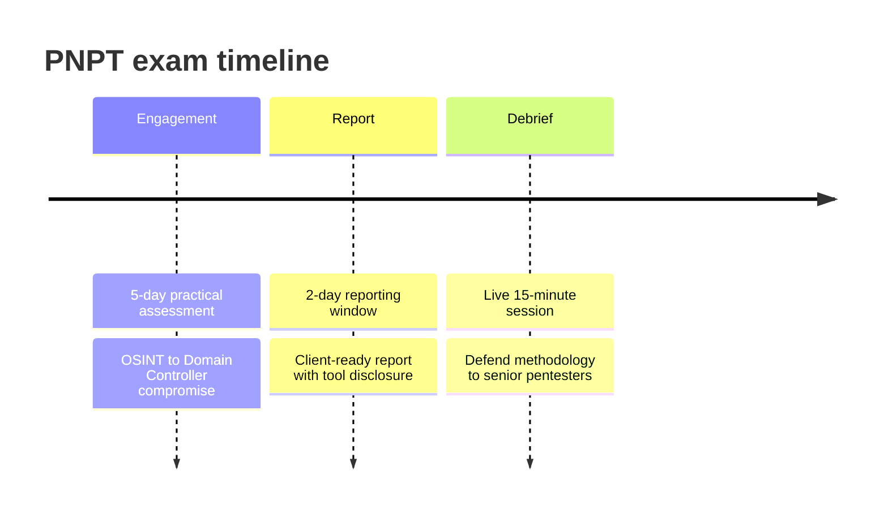

# PNPT Exam Structure

The **Practical Network Penetration Tester (PNPT)** exam is a single, continuous
**real-world engagement** rather than a set of questions. You are given a simulated
corporate network, an agreed scope, and a goal: break in, move through the **Active
Directory** environment to compromise the **Domain Controller (DC)**, and then deliver a
professional report and a live methodology defense. This page breaks down each component.

> **Educational & authorized use only.** Everything here is conceptual and for
> understanding the assessment format and defensive value. Real testing is legal only
> with written authorization and scope. See the CEH hub's
> [legal & ethics](../../ceh/00-overview/legal-and-ethics.md).

> **Unofficial & no fabrication.** From TCM Security's official PNPT page. Volatile items
> are marked **"verify on TCM"**. Compiled **2026-06-21**.

## Learning objectives

- Describe the three phases of the PNPT exam: assessment, report, and debrief.
- Explain why there are **no flags and no multiple-choice questions**.
- Understand the **all-tools-allowed (with disclosure)** rule and the retake policy.
- Treat the **live debrief** as a consultant-style methodology defense.

## The format at a glance

| Component | Detail |
| --- | --- |
| **Practical assessment** | **5 days** to compromise the environment end to end *(verify on TCM)* |
| **Report window** | **2 additional days** to write a professional penetration-test report *(verify on TCM)* |
| **Live debrief** | **15-minute** live session defending your methodology to senior TCM pentesters *(verify on TCM)* |
| **Question type** | **None** — no multiple choice |
| **Flags** | **None** — no CTF-style flag hunting; you must demonstrate real compromise |
| **Tooling** | **All tools allowed**, provided you **disclose** what you used in the report *(verify on TCM)* |
| **Attempts** | **1 attempt + 1 free retake** *(verify on TCM)* |
| **Training** | **Bundled** with the exam voucher *(verify on TCM)* |
| **Validity** | **Non-expiring** (per TCM, 2023-04-17) *(verify on TCM)* |

## Phase 1 — The 5-day assessment

You have roughly five days of hands-on access to work the full kill chain at your own
pace. The engagement is built to resemble a real external-to-internal pentest:

- Start with **OSINT** to map the organization's exposed footprint.
- Find and exploit an **external** foothold into the internal network.
- Pivot through **Active Directory**, bypassing antivirus and egress controls as needed.
- Perform **lateral and vertical movement** toward **Domain Controller compromise**.

Because there are no flags, success is judged on **whether you actually achieved
compromise and can prove it** — captured evidence, screenshots, and a coherent attack
chain — not on collecting tokens. The generous multi-day window rewards **thorough,
methodical work and good note-taking** over speed.

## Phase 2 — The 2-day report

After the assessment you have two more days to produce a **professional report**, the
same deliverable a paying client would receive. This typically includes:

- An **executive summary** framing business risk for non-technical readers.
- **Technical findings** with evidence, severity, and the attack path.
- **Remediation guidance** mapped to each finding.
- **Tool disclosure** — the tools and techniques you used, since all tools are permitted.

The report is a graded deliverable, not an afterthought: clear, accurate, client-ready
documentation is a core competency the PNPT measures. See
[../topics/05-reporting-and-the-debrief.md](../topics/05-reporting-and-the-debrief.md).

## Phase 3 — The live 15-minute debrief

The PNPT's signature step. You join a **live session with senior TCM penetration
testers** and **explain and defend your methodology** as a consultant would in a client
readout.

- **You walk the attack chain** — what you found, how you exploited it, and the impact.
- **You justify decisions** — why you chose a path, and how you would remediate it.
- **Communication counts** — articulating findings clearly is part of passing.

This is rare among offensive certifications and is what makes the PNPT feel like a real
consulting engagement rather than an exam.

## Tooling and retake policy

- **All tools are allowed** — there is no restricted toolset like some other practical
  exams impose — **as long as you disclose** your tooling in the report *(verify on TCM)*.
- **One free retake** is included, and the debrief gives **direct feedback** even when you
  do not pass on the first attempt, so a retake is a learning opportunity, not a reset.

## Exam tips

- **Take notes continuously.** With a 5-day window, disciplined logging of commands,
  evidence, and timestamps makes the report far easier and the debrief defensible.
- **Capture evidence as you go.** No flags means *proof of compromise* is what counts —
  screenshots and output, not after-the-fact reconstruction.
- **Practice explaining out loud.** Rehearse narrating your attack chain so the live
  debrief feels like a readout you have given before.
- **Disclose your tools.** Since everything is allowed, list what you used — undisclosed
  tooling undermines an otherwise strong report.

> Authorized-use note: rehearse only in lab environments you own or are explicitly
> authorized to test.

## Sources

- TCM Security — PNPT certification page: <https://certifications.tcm-sec.com/pnpt/>
  (non-expiring per TCM, 2023-04-17; volatile details marked "verify on TCM").
