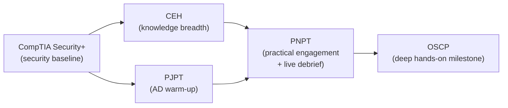

# What is the PNPT?

The **Practical Network Penetration Tester (PNPT)** is a hands-on penetration-testing
certification from **TCM Security**. Instead of multiple-choice questions or
capture-the-flag (CTF) flag-hunting, candidates run a **realistic, end-to-end network
engagement** against a simulated company, write a professional report, and then **defend
their methodology in a live debrief** with senior penetration testers. It is designed to
mirror the real day-to-day work of an external/internal penetration tester.

> **Educational & authorized use only.** Penetration testing is legal **only** with
> explicit written authorization, an agreed scope, and Rules of Engagement (RoE). This
> hub explains techniques **conceptually** — for understanding, methodology, and defense
> — and names tools by **purpose**. It contains no weaponized step-by-step playbooks or
> exploit code. See the CEH hub's [legal & ethics](../../ceh/00-overview/legal-and-ethics.md).

> **Unofficial & no fabrication.** Not affiliated with or endorsed by TCM Security. Exam
> details are from TCM Security's official PNPT page; anything volatile (price, exact
> structure, validity terms) is marked **"verify on TCM"** and should be re-checked there.
> Compiled **2026-06-21**.

## Learning objectives

- Describe what the PNPT is and how TCM Security positions it as a practical credential.
- Explain the **engagement-style** format and the signature **live debrief**.
- Identify who the PNPT is for and the assumed technical background.
- Understand the recommended preparation path (PJPT first) and bundled training.
- Place the PNPT in an offensive learning path versus OSCP and CEH.

## What it is

| Attribute | Detail |
| --- | --- |
| Provider | **TCM Security**, vendor-neutral |
| Style | **Fully practical** — a simulated real-world network engagement, then a report and a live debrief |
| Format | **No multiple choice, no flags** — you must compromise the environment as a consultant would |
| Structure | **5-day** practical assessment + **2-day** report window + a **live 15-minute debrief** *(verify on TCM)* |
| Attempts | **1 attempt + 1 free retake** *(verify on TCM)* |
| Training | **Bundled training** is included with the exam voucher *(verify on TCM)* |
| Validity | **Non-expiring** (per TCM, 2023-04-17) *(verify on TCM)* |
| Level | Intermediate; a practical milestone, often a budget-friendly lead-in to OSCP |

The PNPT is not a quiz. The exam **is** the engagement: you perform Open-Source
Intelligence (OSINT), break in from the outside, pivot through an internal **Active
Directory** environment to compromise a Domain Controller, and document everything.

## The signature live debrief

The feature that most distinguishes the PNPT from other practical certifications is the
**live 15-minute debrief**. After submitting the report, you present and **defend your
methodology** to senior TCM penetration testers — exactly as a consultant would walk a
client through findings.

- **Communication is graded, not just exploitation.** You explain *what* you did, *why*,
  and *how* you would remediate it.
- **It rewards clear thinking.** Being able to articulate the attack chain and its
  business impact is a core consulting skill the debrief tests directly.
- **It is feedback-rich.** Even on a retake, the debrief surfaces gaps in methodology and
  reporting, not just technical misses.

This mirrors a real client-facing pentest readout and is rare among offensive certs,
where exploitation alone usually decides a pass.

## The engagement scope (conceptual)

The PNPT engagement walks the full external-to-internal kill chain:

| Phase | Focus |
| --- | --- |
| **OSINT & reconnaissance** | Passive intelligence on the target organization |
| **External penetration testing** | Finding and exploiting an internet-facing foothold |
| **Active Directory exploitation** | Internal movement to Domain Controller compromise |
| **AV / egress bypass** | Evading antivirus and restrictive egress controls |
| **Lateral & vertical movement** | Pivoting across hosts and escalating privilege |
| **Reporting & debrief** | A professional report plus the live methodology defense |

These phases map to the five topic pages in this hub — see
[../topics/README.md](../topics/README.md).

## Who it's for

- Aspiring **penetration testers** who want a realistic, engagement-based proof of skill.
- **Sysadmins and security pros moving into offensive work** who already operate Windows,
  Linux, and networking day to day and want hands-on credibility.

## Recommended preparation

TCM Security recommends taking the **Practical Junior Penetration Tester (PJPT)** first.
The PJPT focuses on the **Active Directory** attack chain at a smaller scale and is an
ideal warm-up for the AD-heavy PNPT engagement.

| Prep step | Why |
| --- | --- |
| **PJPT first** | Builds the AD exploitation reflexes the PNPT depends on *(verify on TCM)* |
| **Bundled training** | The PNPT voucher includes the supporting courses *(verify on TCM)* |
| **Strong fundamentals** | Comfort with networking, Windows/AD, Linux, and basic scripting |

A sysadmin baseline helps: see
[../../prerequisites/windows-and-active-directory.md](../../../prerequisites/windows-and-active-directory.md)
and [../../prerequisites/networking-and-protocols.md](../../../prerequisites/networking-and-protocols.md)
where available.

## Where the PNPT sits in an offensive path

The PNPT is widely seen as a **budget-friendly, engagement-realistic lead-in or
alternative to OSCP**, sitting above breadth-oriented knowledge certs.

- **vs CEH** — CEH proves **knowledge breadth** via a multiple-choice exam; the PNPT
  proves **hands-on engagement skill** end to end. They are complementary. See
  [../../ceh/README.md](../../ceh/README.md).
- **vs OSCP** — Both are practical. The PNPT is generally **more approachable and
  budget-friendly**, adds the **live debrief**, and emphasizes a single coherent
  AD-focused engagement; OSCP is a longer, harder multi-target hands-on milestone. See
  [../../oscp/00-overview/what-is-oscp.md](../../oscp/00-overview/what-is-oscp.md).
- **Foundation** — A security baseline like CompTIA Security+ helps first. See
  [../../security-plus/README.md](../../security-plus/README.md).

## Sources

- TCM Security — PNPT certification page: <https://certifications.tcm-sec.com/pnpt/>
  (non-expiring statement per TCM, 2023-04-17; volatile details marked "verify on TCM").
