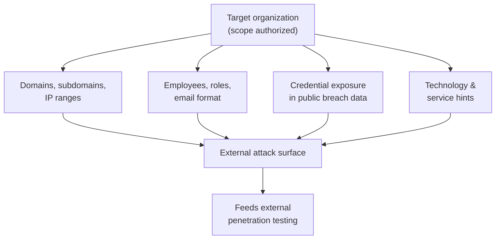

# 01 — OSINT & Reconnaissance

The **Practical Network Penetration Tester (PNPT)** engagement **starts with OSINT** —
**Open-Source Intelligence**. Before touching the target network directly, a tester builds
a picture of the organization from **publicly available information**: domains, employees,
leaked credentials, and exposed services. This page covers the concepts of passive
reconnaissance and, just as importantly, how defenders **shrink the footprint** an
attacker can see.

> **Authorized-use note.** Reconnaissance is part of a sanctioned engagement only under
> written authorization and an agreed scope. This page is **conceptual** and names tools
> by **purpose**, not as step-by-step attack recipes. See the CEH hub's
> [legal & ethics](../../ceh/00-overview/legal-and-ethics.md).

## Learning objectives

- Explain what OSINT is and why the PNPT engagement begins with it.
- Describe the categories of intelligence an attacker gathers passively.
- Understand the **attacker's external view** of an organization.
- Apply **defensive** measures: attack-surface reduction and exposure monitoring.
- Name reconnaissance tooling by purpose (e.g. theHarvester).

## What OSINT is

**OSINT** is intelligence collected from **public, legally accessible sources** — no
intrusion required. In a pentest it is the foundation: the more an attacker learns before
engaging, the more targeted and effective every later phase becomes. Crucially, much of
this is **passive**: the target sees little or no direct interaction, so it is hard to
detect.

| Property | Why it matters |
| --- | --- |
| **Public** | Drawn from sources anyone can reach — no unauthorized access |
| **Passive** | Often leaves little trace on the target, so it is low-risk for the attacker |
| **Foundational** | Feeds target selection for the external phase that follows |

## What an attacker gathers

| Intelligence category | Examples (conceptual) | Why it is useful |
| --- | --- | --- |
| **Organization footprint** | Domains, subdomains, IP ranges, public services | Maps the external attack surface to probe |
| **People** | Employee names, roles, email-address format | Builds username lists and social-engineering targets |
| **Credential exposure** | Emails/usernames appearing in public breach data | Suggests password-spray or reuse candidates |
| **Technology hints** | Job posts, public docs, metadata | Reveals software, vendors, and naming conventions |
| **Exposed assets** | Forgotten subdomains, dev/test hosts, open ports | Surfaces weak, under-monitored entry points |

## The attacker's external view

OSINT lets a tester see the organization **the way an outside attacker does** — only what
is publicly visible. This "outside-in" perspective is exactly what a real adversary starts
from, which is why the PNPT mirrors it.

The output of recon is a prioritized **external attack surface** that drives the next
phase — see [02 — External penetration testing](02-external-penetration-testing.md).

## Tools by purpose

| Purpose | Example tool | What it does (conceptually) |
| --- | --- | --- |
| **Email / subdomain / host gathering** | **theHarvester** | Aggregates emails, names, subdomains, and hosts from public sources for a domain |
| **Breach-exposure awareness** | Public breach-notification services | Checks whether an organization's addresses appear in known public data leaks |
| **Footprint mapping** | Search engines, certificate transparency logs, DNS records | Enumerate public assets tied to the target's domains |

These are named by **purpose only**. For the broader recon toolkit and phase mapping, see
the CEH hub: [tools by phase](../../ceh/tools/tools-by-phase.md).

## Defense — reducing what attackers can see

Recon is one-sided in the attacker's favor, but defenders can **shrink and monitor** the
exposed footprint:

| Defensive measure | Effect |
| --- | --- |
| **Attack-surface reduction** | Decommission forgotten subdomains, dev/test hosts, and unused services; close unnecessary public ports |
| **Asset inventory** | Maintain an authoritative list of internet-facing assets so nothing is "forgotten" |
| **Metadata hygiene** | Strip identifying metadata from public documents; limit detail in job posts |
| **Credential-exposure monitoring** | Watch breach-notification feeds for organizational addresses and force resets on hits |
| **Email/DNS hardening** | Lock down DNS records and email configuration that leak internal structure |
| **Phishing-resistant MFA** | Reduces the value of any exposed or sprayed credentials |

The defensive goal is simple: **the less an attacker can learn passively, the weaker every
later phase becomes.**

## Exam tips

- **Document every source.** In the report, recon findings should trace to where you found
  them — this supports the live debrief.
- **Prioritize, don't dump.** Turn raw OSINT into a ranked attack surface; the value is in
  what you *do* with it.
- **Tie findings to defense.** For each exposure you note, be ready to recommend a
  remediation — the debrief rewards consultant-style thinking.

> Authorized-use note: practice OSINT only against assets you own or are explicitly
> authorized, in scope, to assess.

## Sources

- TCM Security — PNPT certification page: <https://certifications.tcm-sec.com/pnpt/>
  (engagement begins with OSINT; volatile details marked "verify on TCM").
- Cross-reference — CEH hub:
  [footprinting & reconnaissance](../../ceh/domains/02-footprinting-and-reconnaissance.md),
  [tools by phase](../../ceh/tools/tools-by-phase.md). Compiled **2026-06-21**.
