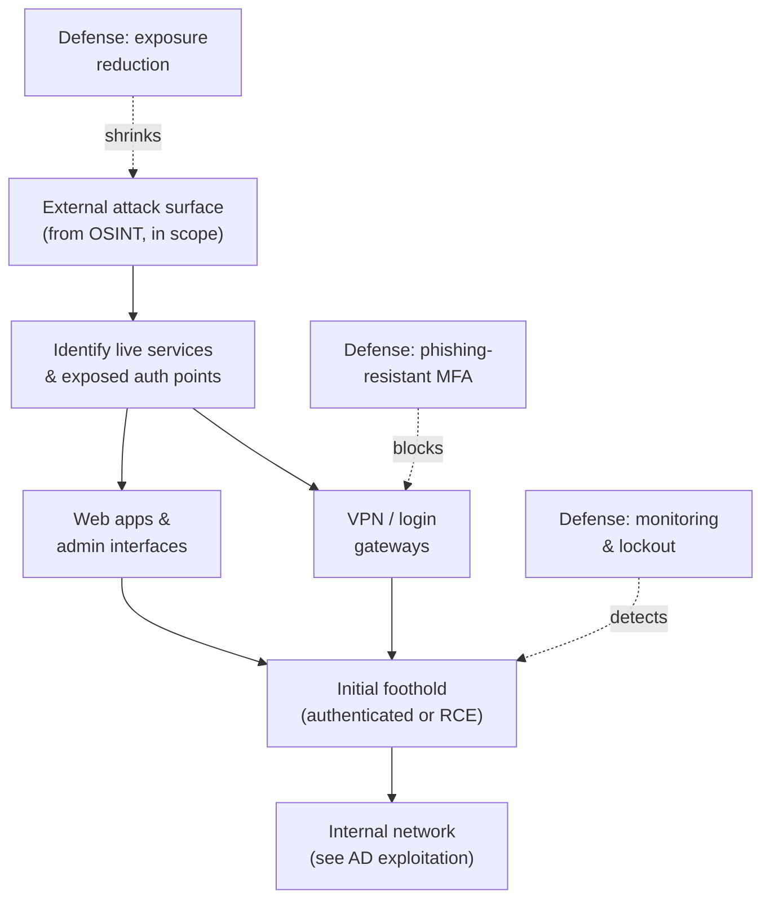

# 02 — External Penetration Testing

After **OSINT** (Open-Source Intelligence) maps the target's exposed footprint, the
**Practical Network Penetration Tester (PNPT)** engagement moves to **external penetration
testing**: assessing the **internet-facing services** an organization exposes and trying
to turn one of them into an **initial foothold** inside the network. This page is
**conceptual** — it explains *how* an outside attacker thinks about the perimeter and,
just as importantly, *how defenders harden it*.

> **Authorized-use note.** External testing is legal **only** under written authorization,
> an agreed scope, and Rules of Engagement (RoE). This page names tools and techniques by
> **purpose**, not as weaponized step-by-step recipes. See the CEH hub's
> [legal & ethics](../../ceh/00-overview/legal-and-ethics.md).

## Learning objectives

- Explain what "external penetration testing" assesses and where it fits in the PNPT.
- Describe how internet-facing services are discovered and assessed (conceptually).
- Understand **password attacks against external services** at a concept level, including
  **password spraying**.
- Explain what "gaining an initial foothold" means and why it is the pivot point.
- Apply **perimeter defenses**: Multi-Factor Authentication (MFA), exposure reduction,
  monitoring, and account lockout.

## What external testing assesses

The **external attack surface** is everything an organization exposes to the public
internet: web applications, Virtual Private Network (VPN) portals, email and remote-access
gateways, and forgotten dev/test hosts. The tester evaluates each as a potential way in.

| Surface element | Why an attacker cares |
| --- | --- |
| **Web applications** | Public, complex, and often the softest target — see web app attacks |
| **VPN / remote-access portals** | A single valid credential can yield internal access |
| **Email / login gateways** | Username formats and authentication endpoints to test |
| **Exposed management interfaces** | Admin panels and APIs that should never be public |
| **Forgotten / shadow assets** | Under-patched, unmonitored hosts surfaced during OSINT |

## Finding and assessing internet-facing services

Discovery turns the OSINT picture into a **prioritized list of live services**. Conceptually
this means identifying which hosts and ports respond, what software and versions they run,
and which expose authentication. This is the bridge from passive recon to active probing —
covered in depth in the CEH hub:
[scanning networks](../../ceh/domains/03-scanning-networks.md).

## Password attacks against external services (concept)

Many footholds come not from a software exploit but from **valid credentials** against an
exposed login. Two ideas matter at concept level:

| Concept | What it is (conceptual) | Why it works |
| --- | --- | --- |
| **Credential reuse** | Trying credentials exposed in public breaches against the org's portals | People reuse passwords across services |
| **Password spraying** | Trying **one common password against many usernames** | Stays under per-account lockout thresholds that block traditional brute force |

**Password spraying** is the key concept to understand: rather than guessing many passwords
for one account (which trips lockout), an attacker tries a *single* plausible password
across the *whole* username list harvested during OSINT. The defense is precisely about
breaking that economics — see below. No spraying procedure or tooling syntax is given here;
the point is the **pattern and its countermeasures**.

## Gaining an initial foothold

The **foothold** is the moment external access becomes internal access — a valid VPN login,
an authenticated web session, or remote code execution (RCE) on an exposed host. It is the
**pivot point** of the whole engagement: everything in
[03 — Active Directory exploitation](03-active-directory-exploitation.md) depends on first
getting a foothold here. Web application weaknesses are a common foothold path — see the
OSCP hub's [web application attacks](../../oscp/topics/02-web-application-attacks.md).

Transport security matters too: weak or misconfigured Transport Layer Security (TLS) on
external services can leak information or weaken authentication — see
[../../protocols/tls.md](../../../protocols/tls.md).

## Defense — hardening the perimeter

| Defensive measure | Effect on the attack |
| --- | --- |
| **Phishing-resistant MFA** | Even valid sprayed/reused credentials fail without the second factor — the single highest-value control |
| **Exposure reduction** | Decommission shadow/dev hosts, close unneeded ports, remove public admin interfaces — shrinks what can be probed |
| **Strong TLS configuration** | Modern TLS, no weak ciphers, valid certificates — closes downgrade/info-leak paths |
| **Account lockout & throttling** | Rate-limit and lock repeated failures to blunt spraying and brute force |
| **Authentication monitoring** | Alert on spray patterns: many accounts, one password, from few sources, in a short window |
| **Conditional access / geo-velocity** | Block logins from anomalous locations or impossible travel |
| **Patch management** | Keep internet-facing software current so version-specific exploits don't apply |

The strategic point for a sysadmin moving into offense: **the perimeter falls to weak
authentication far more often than to exotic exploits.** MFA plus exposure reduction
removes most realistic external footholds. For the full mapping of these attacks to
controls, see [../../attack-to-defense-matrix.md](../../../attack-to-defense-matrix.md).

## Exam tips

- **Treat every exposed login as a foothold candidate**, and document why each control
  (MFA, lockout) would or would not stop you — the debrief rewards this.
- **Tie a foothold to its remediation.** Each external finding in the report should pair an
  impact with a concrete fix.
- **Mind scope.** Only assess hosts explicitly in the authorized scope; note out-of-scope
  exposures separately for the client.

> Authorized-use note: practice external techniques only against assets you own or are
> explicitly authorized, in scope, to test.

## Sources

- TCM Security — PNPT certification page: <https://certifications.tcm-sec.com/pnpt/>
  (engagement: external testing → initial foothold; volatile details marked "verify on
  TCM").
- Cross-reference — CEH hub:
  [scanning networks](../../ceh/domains/03-scanning-networks.md); OSCP hub:
  [web application attacks](../../oscp/topics/02-web-application-attacks.md). Compiled
  **2026-06-21**.
