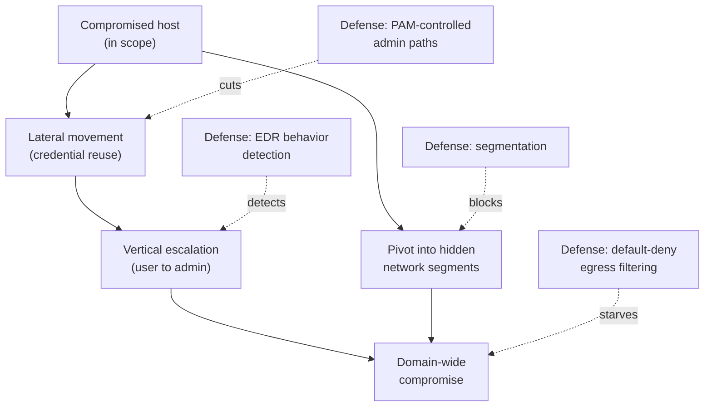

# 04 — Lateral Movement & Pivoting

Once a **Practical Network Penetration Tester (PNPT)** candidate has internal access and
some credentials (from
[03 — Active Directory exploitation](03-active-directory-exploitation.md)), the engagement
expands: **lateral movement** (host to host), **vertical movement** (privilege escalation),
and **pivoting** (using a compromised host as a route into networks the attacker cannot
reach directly). The PNPT also tests working under **antivirus (AV)** and **egress
filtering** constraints. This page stays **high-level and conceptual** — it explains how
movement and detection work and how defenders tune controls, **not** how to evade them.

> **Authorized-use note.** These techniques are legal **only** under written authorization
> and scope. This page is **conceptual** and names tools by **purpose**. It contains **no
> evasion recipe, payload, or command syntax**. See the CEH hub's
> [legal & ethics](../../ceh/00-overview/legal-and-ethics.md).

## Learning objectives

- Distinguish **lateral**, **vertical**, and **pivoting** movement.
- Understand pivoting/tunneling as a routing concept, not a tooling drill.
- Explain at a high level what **AV** and **egress filtering** detect — and how defenders
  **tune** them.
- Map movement techniques to **segmentation, EDR, egress filtering, PAM-controlled admin
  paths, and monitoring**.

## Three kinds of movement

| Movement | Direction | Concept |
| --- | --- | --- |
| **Lateral** | Host → host, same privilege level | Reuse credentials/sessions to reach new machines and widen access |
| **Vertical** | Lower → higher privilege | Escalate from user to local admin, then toward domain dominance |
| **Pivoting** | Through a host into hidden networks | Use a compromised host as a relay to reach segments the attacker cannot route to directly |

The combination is what turns a single foothold into **domain-wide** compromise. In AD
environments lateral movement usually rides on the credential attacks from topic 03 — which
is why cutting credential reuse (PAM, tiering) is so effective here.

## Pivoting and tunneling (concept)

**Pivoting** is fundamentally a **routing** problem: a host the attacker controls sits on
two networks, so traffic is relayed *through* it to reach otherwise-unreachable internal
systems. Conceptually this is the same idea as a proxy or VPN, repurposed by an attacker.
The defensive counterpart is **segmentation** that prevents any single host from bridging
trust zones. For the routing mechanics covered at the practical level, see the OSCP hub's
[pivoting & tunneling](../../oscp/topics/06-pivoting-and-tunneling.md).

## AV and egress bypass — how detection works (not how to evade)

The PNPT tests whether you can operate when **endpoint AV** and **egress filtering** are
present. The useful, defensible knowledge is **how those controls detect activity**, so a
defender can tune them — not a recipe for slipping past them.

| Control | What it inspects | How defenders tune it |
| --- | --- | --- |
| **Antivirus / EDR** | Known signatures **and** behaviors (process injection, credential access, suspicious child processes) | Enable behavioral detection, attack-surface-reduction rules, and tamper protection; keep definitions current |
| **Egress filtering** | Which destinations, ports, and protocols a host may reach **outbound** | Default-deny outbound, allow only known destinations, inspect/limit DNS and proxy traffic to spot command-and-control |

The takeaway for a defender: **bypass attempts succeed against loose configuration.** A
default-deny egress posture and behavior-based EDR raise the cost of every movement step.
No evasion technique is described here.

## Defense — containing movement

| Defense | Effect |
| --- | --- |
| **Network segmentation & micro-segmentation** | Stops a single host from bridging zones; contains pivoting and blast radius. See [../../security-plus/domains/03-security-architecture.md](../../security-plus/domains/03-security-architecture.md) |
| **PAM-controlled admin paths** | Administration flows through a brokered, recorded bastion, so there are **no standing admin credentials on endpoints** to reuse laterally. See [../../docs/pam-bastion/README.md](../../wallix/pam-bastion/README.md) |
| **EDR with behavioral detection** | Flags lateral-movement and escalation behavior, not just known malware |
| **Default-deny egress filtering** | Limits outbound paths attackers use for pivoting relays and command-and-control |
| **Least privilege & local-admin reduction** | Removes the privilege an attacker needs to move and escalate |
| **Logging & correlation** | Detects unusual host-to-host authentication and admin logons in time to respond |

The strategic point: **lateral movement is a credential-and-routing problem.** PAM removes
the reusable credentials; segmentation and egress control remove the routes; EDR and
logging catch what is left. For the full attack-to-control mapping see
[../../attack-to-defense-matrix.md](../../../attack-to-defense-matrix.md).

## Exam tips

- **Show the pivot path in your notes and report** — diagram which host reached which
  network. The debrief expects you to explain *how* you crossed segments.
- **Frame AV/egress findings as tuning recommendations**, not as "how I evaded it" — that is
  what a consultant delivers.
- **Pair every movement step with a containing control** (segmentation, PAM, EDR) in the
  remediation section.

> Authorized-use note: practice movement and pivoting only in a lab you own or an
> environment you are explicitly authorized, in scope, to assess.

## Sources

- TCM Security — PNPT certification page: <https://certifications.tcm-sec.com/pnpt/>
  (AV/egress bypass + lateral & vertical movement; volatile details marked "verify on
  TCM").
- Cross-reference — OSCP hub:
  [pivoting & tunneling](../../oscp/topics/06-pivoting-and-tunneling.md); Security+ hub:
  [security architecture](../../security-plus/domains/03-security-architecture.md).
  Compiled **2026-06-21**.
