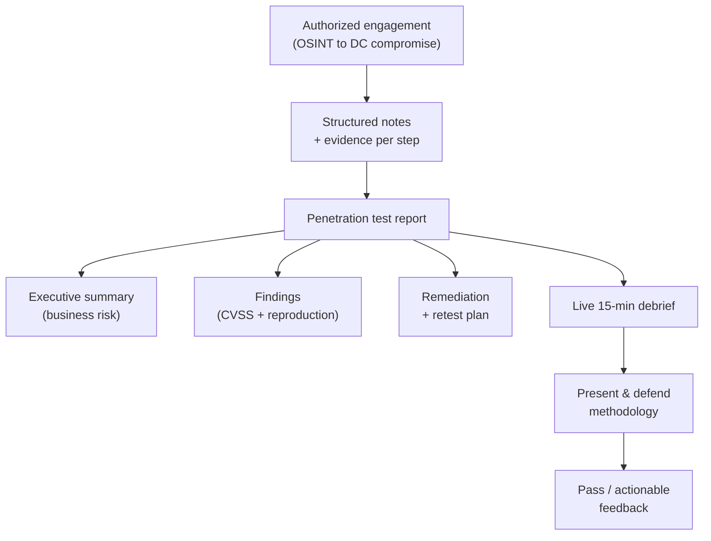

# 05 — Reporting & the Debrief

The signature of the **Practical Network Penetration Tester (PNPT)** is that the engagement
does **not** end when you compromise the Domain Controller. You then write a **professional
penetration-test report** (a 2-day window after the 5-day assessment) and **present it in a
live 15-minute debrief** to senior TCM Security penetration testers — defending your
methodology like a consultant in front of a client. *(Structure volatile — verify on TCM.)*
This is what makes the PNPT a test of **consulting skill**, not just exploitation.

> **Authorized-use note.** Reporting describes findings from an **authorized, in-scope**
> engagement only. This page covers communication and documentation method, not attack
> execution.

## Learning objectives

- Structure a professional pentest report: executive summary, findings, remediation,
  retest.
- Use **CVSS** (Common Vulnerability Scoring System) risk ratings to prioritize findings.
- Write findings that are **reproducible** and **actionable**.
- Prepare for and deliver the **live 15-minute debrief** as a consultant would.
- Communicate impact to **non-technical stakeholders**.

## Why reporting is graded

A pentest's value to a client is the **report**, not the access itself. The PNPT mirrors
real consulting: a finding nobody can understand, reproduce, or fix has no value. The
report is the deliverable; the debrief proves you can stand behind it.

## Report structure

| Section | Audience | Purpose |
| --- | --- | --- |
| **Executive summary** | Leadership, non-technical | Business-language overview: overall risk, key themes, what to fix first — **no jargon** |
| **Methodology / scope** | Technical + audit | What was authorized, what was tested, how — establishes rigor and boundaries |
| **Findings** | Technical owners | Each issue with **CVSS risk rating**, evidence, and the attack path |
| **Reproduction steps** | Engineers | Enough detail to **reliably re-trigger** and verify the issue |
| **Remediation** | Engineers, management | Concrete, prioritized fixes per finding |
| **Retest** | Project owner | Confirmation the fixes worked after remediation |
| **Appendices** | Technical | Raw evidence, tool output, full asset/exposure lists |

### Findings and CVSS

Each finding pairs an **impact** with a **CVSS** severity so the client can **prioritize**.
CVSS turns "this is bad" into a comparable score across findings, but the **executive
summary should translate scores into business risk** — a critical on an internet-facing
auth bypass is not the same business story as a critical buried in an isolated lab.

## The live debrief

After submitting the report you join a **live 15-minute debrief** *(verify on TCM)* and
**defend your methodology** to senior assessors. It tests skills exploitation alone does
not.

| What it evaluates | What good looks like |
| --- | --- |
| **Communication** | Explain the attack chain clearly, at the listener's level |
| **Prioritization** | Lead with the highest-impact issues and the "fix this first" story |
| **Non-technical translation** | Frame risk in business terms for stakeholders |
| **Methodology defense** | Justify *why* you took each step and how you confirmed findings |
| **Remediation thinking** | Recommend practical, prioritized fixes — consultant, not just operator |

### Preparing for it

- **Rehearse a 2-minute executive summary** you could give a CEO, and a deeper technical
  walk-through for engineers.
- **Know your own path.** Be able to explain every step from OSINT to DC and why it worked.
- **Lead with impact, not tools.** Stakeholders care about business risk, not tool names.

## Defense angle

The report's **remediation** section is where offense converts into defense: each finding
should name the control that closes it (MFA, segmentation, PAM, EDR, patching). A strong
PNPT report reads like a **prioritized hardening roadmap** for the client — the same
attack-to-control thinking captured in
[../../attack-to-defense-matrix.md](../../../attack-to-defense-matrix.md).

## Exam tips

- **Take notes continuously during the assessment** — screenshots and command logs as you
  go. Reconstructing a report from memory in the 2-day window is the classic failure mode.
- **Map findings to CVSS and to business impact**, not just to severity labels.
- **Practice the debrief out loud.** Articulating the chain is a graded skill; silence or
  rambling costs the pass.
- **Use a consistent template** so nothing (reproduction, remediation, retest) is missing.

## Sources

- TCM Security — PNPT certification page: <https://certifications.tcm-sec.com/pnpt/>
  (2-day report window + live 15-minute debrief; volatile details marked "verify on TCM").
- Cross-reference — CEH hub:
  [engagement methodology & reporting](../../ceh/00-overview/engagement-methodology-and-reporting.md);
  CySA+ hub:
  [reporting & communication](../../cysa-plus/domains/04-reporting-and-communication.md);
  PenTest+ hub:
  [engagement management](../../pentest-plus/domains/01-engagement-management.md). Compiled
  **2026-06-21**.
