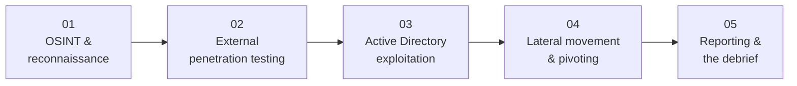

# PNPT Topics — Engagement Phases

The **Practical Network Penetration Tester (PNPT)** exam is one continuous engagement, so
these topic pages follow the **engagement workflow** rather than an abstract syllabus.
Each page covers the concepts and **defensive countermeasures** for one phase of the
attack chain, from reconnaissance to the final report and live debrief.

> **Authorized-use note.** Penetration testing is legal **only** with explicit written
> authorization, an agreed scope, and Rules of Engagement (RoE). These pages are
> **conceptual** — for understanding methodology and defense — and name tools by
> **purpose**, not as weaponized playbooks. See the CEH hub's
> [legal & ethics](../../ceh/00-overview/legal-and-ethics.md).

## Learning objectives

- Map the five PNPT topic pages to the phases of a real network engagement.
- Use this index to navigate the external-to-internal kill chain in order.
- Connect each offensive phase to its defensive countermeasures.

## The engagement workflow

## Topic index

| # | Page | Engagement phase | What it covers |
| --- | --- | --- | --- |
| 01 | [OSINT & reconnaissance](01-osint-and-reconnaissance.md) | Recon | Passive intelligence on the target's exposed footprint, plus attack-surface reduction |
| 02 | [External penetration testing](02-external-penetration-testing.md) | Initial access | Finding and exploiting an internet-facing foothold; perimeter defense |
| 03 | [Active Directory exploitation](03-active-directory-exploitation.md) | Internal compromise | Moving through AD toward Domain Controller compromise; AD hardening |
| 04 | [Lateral movement & pivoting](04-lateral-movement-and-pivoting.md) | Expansion | Pivoting across hosts, vertical privilege escalation, AV/egress bypass; detection |
| 05 | [Reporting & the debrief](05-reporting-and-the-debrief.md) | Deliverable | Writing a client-ready report and defending methodology in the live debrief |

## How the phases map to the exam

| Exam component | Topic pages involved |
| --- | --- |
| **5-day assessment** | 01 → 02 → 03 → 04 |
| **2-day report** | 05 |
| **Live 15-minute debrief** | 05 |

For the exam format itself, see
[../00-overview/exam-structure.md](../00-overview/exam-structure.md). For what the PNPT is
and where it sits, see [../00-overview/what-is-pnpt.md](../00-overview/what-is-pnpt.md).

## Sources

- TCM Security — PNPT certification page: <https://certifications.tcm-sec.com/pnpt/>
  (engagement scope: OSINT → external → AD → bypass → movement → report + debrief;
  volatile details marked "verify on TCM"). Compiled **2026-06-21**.
