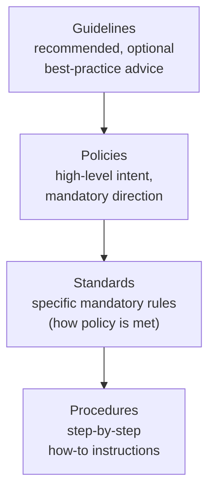
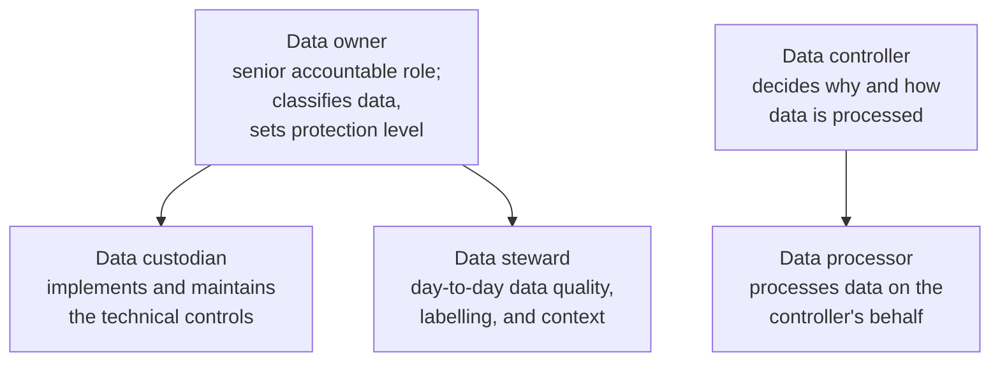
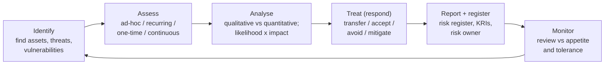
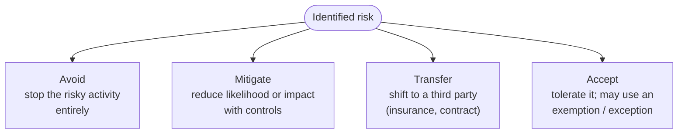
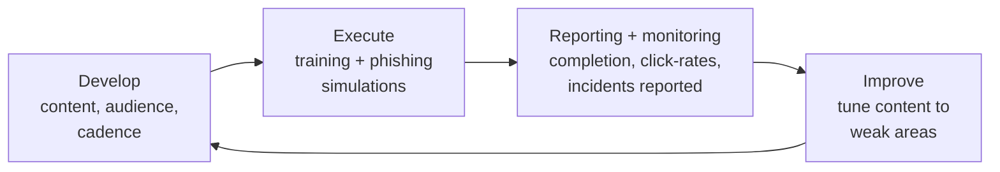

# Domain 5 — Security Program Management and Oversight

**Domain 5 of CompTIA Security+ (SY0-701)** is the **governance, risk, and compliance (GRC)** domain. It is worth **20% of the exam** — the third-largest domain — and it is the least technical: instead of configuring controls, it asks *who decides*, *how risk is measured and treated*, *how third parties are managed*, *how compliance and audits work*, and *how people are trained*. For a systems administrator moving into security, this is often the least familiar territory, because it sits with management, legal, and procurement rather than on the command line. This page walks the SY0-701 objectives for Domain 5 with the vocabulary, formulas, and acronyms the exam expects.

> **Acronyms are expanded on first use.** GRC = Governance, Risk, and Compliance. A consolidated list lives in [../reference/acronyms.md](../reference/acronyms.md).

## Learning objectives

- Summarise the elements of effective **security governance**: guidelines, policies, standards, procedures, external considerations, governance structures, and data roles.
- Explain the **risk-management process**: identification, assessment, analysis (qualitative vs quantitative, with the SLE/ALE/ARO formulas), the risk register, risk strategies, and business impact analysis.
- Describe **third-party (vendor) risk management**: assessment, the agreement acronyms, due diligence, and ongoing monitoring.
- Explain **compliance**: reporting, the consequences of non-compliance, compliance monitoring, and privacy concepts (controller vs processor, data subject, right to be forgotten).
- Distinguish the types of **audits and assessments**, including internal vs external and the penetration-testing variants.
- Outline the components of an effective **security awareness** program.

## Where Domain 5 fits

Domain 5 is the "oversight" layer that sits **above** the technical domains. Domains 2–4 secure the systems; Domain 5 decides *what to secure, how much risk is acceptable, who is accountable,* and *how the organisation proves it is compliant*. It leans heavily on the access-control, least-privilege, and identity concepts in [../../foundations/core-concepts-least-privilege-jit-zero-trust.md](../../../foundations/core-concepts-least-privilege-jit-zero-trust.md), and on the compliance frameworks catalogued in [../../reference/compliance-and-standards.md](../../../reference/compliance-and-standards.md). Where it touches penetration testing and authorisation, the legal/ethics framing is the same one used by the CEH hub — see [../../ceh/00-overview/legal-and-ethics.md](../../ceh/00-overview/legal-and-ethics.md).

## 1. Security governance

**Governance** is the framework of rules, roles, and decision-making that directs and controls a security program. It is built from a hierarchy of documents, from the most general (guidelines) to the most specific (procedures).

### The document hierarchy

| Document | Binding? | What it does | Examples |
| --- | --- | --- | --- |
| **Guidelines** | Recommended | Optional best-practice advice; flexible | "Prefer passphrases over complex short passwords" |
| **Policies** | Mandatory | High-level statements of intent and management direction | See policy types below |
| **Standards** | Mandatory | Specific, measurable rules that make a policy enforceable | Password, access-control, physical, encryption standards |
| **Procedures** | Mandatory | Detailed step-by-step instructions to carry out a task | Change-management, onboarding/offboarding, playbooks |

**Policy types the objectives list:**

- **Acceptable Use Policy (AUP)** — what users may and may not do with organisational systems and data.
- **Information security policy** — the overarching statement of how the organisation protects its data.
- **Business continuity (BC) policy** — keeping critical functions running during a disruption.
- **Disaster recovery (DR) policy** — restoring IT systems and data after a major incident.
- **Incident response (IR) policy** — how the organisation prepares for, detects, and handles incidents.
- **Software Development Lifecycle (SDLC) policy** — building security into how software is designed, built, and maintained.
- **Change management policy** — how changes to systems are requested, reviewed, approved, and recorded.

**Standards** turn policy into enforceable rules: a **password standard** (length, complexity, rotation), an **access-control standard** (how rights are granted/reviewed), a **physical standard** (badges, locks, visitor handling), and an **encryption standard** (approved algorithms and key lengths).

**Procedures** are the concrete how-tos: **change-management** procedures, **onboarding/offboarding** (provisioning and deprovisioning accounts and access — a classic least-privilege control), and **playbooks** (pre-written response steps for a specific incident type, such as ransomware or phishing).

### External considerations

Governance is shaped by forces outside the organisation. The objectives group these as **regulatory, legal, industry, and geographic** considerations — and the geographic ones cascade from local to global:

| Consideration | Meaning | Example |
| --- | --- | --- |
| Regulatory | Rules from government regulators | Data-protection regulators |
| Legal | Laws and liability | Breach-notification statutes |
| Industry | Sector-specific mandates | Payment-card rules for retail |
| Local / regional | City, state, or province rules | A state privacy law |
| National | Country-wide law | A national data-protection act |
| Global | Cross-border obligations | A regulation covering many countries |

### Monitoring and revision

Governance documents are **living**: they must be **monitored** (are people following them? are they still adequate?) and **revised** on a schedule or after a triggering event (a breach, a new law, a reorganisation). Stale policy is a common audit finding.

### Governance structures

| Structure | What it is |
| --- | --- |
| **Boards** | A board of directors sets top-level direction and accepts ultimate risk |
| **Committees** | Working groups (e.g., a security steering committee) that make focused decisions |
| **Government entities** | Public-sector bodies that impose or oversee requirements |
| **Centralised** | One central team/authority sets and enforces policy org-wide (consistent, but less local flexibility) |
| **Decentralised** | Business units set their own policy within a framework (flexible, but harder to keep consistent) |

### Data roles and responsibilities

Knowing *who is accountable for data* is heavily tested. Memorise these:

| Role | Responsibility |
| --- | --- |
| **Owner** | Senior person ultimately accountable for a data asset; assigns classification and acceptable use |
| **Controller** | Determines the **purposes and means** of processing personal data (a privacy-law term) |
| **Processor** | Processes data **on behalf of** the controller, only as instructed |
| **Custodian** | Implements and maintains the controls protecting the data (often IT/sysadmin) |
| **Steward** | Ensures data quality, metadata, and appropriate use day to day |

> As a sysadmin, you are usually the **custodian** — you apply the backups, encryption, and access controls — while the business **owner** decides classification and the **controller** sets the lawful purpose.

## 2. Risk management

**Risk** is the chance that a threat exploits a vulnerability and causes harm. Risk management is the repeatable process of finding risk, sizing it, deciding what to do about it, and reporting on it.

### The risk-management lifecycle

### Risk identification and assessment frequency

You first **identify** risks (to assets, processes, and data). You then run a **risk assessment**, and the objectives distinguish assessments by *when and how often* they run:

| Assessment type | When it runs |
| --- | --- |
| **Ad-hoc** | Triggered by a specific event (a new threat, a merger) |
| **One-time** | A single, bounded assessment (e.g., for a new project) |
| **Recurring** | On a fixed schedule (e.g., annually) |
| **Continuous** | Ongoing, automated, near-real-time monitoring of risk |

### Risk analysis: qualitative vs quantitative

| Approach | How it scores risk | Strength | Weakness |
| --- | --- | --- | --- |
| **Qualitative** | Subjective ratings — Low/Medium/High, heat maps | Fast, intuitive, needs no hard data | Imprecise, hard to compare |
| **Quantitative** | Money and probability — the SLE/ALE/ARO formulas | Objective, supports cost-benefit | Needs reliable data; time-consuming |

**Quantitative formulas you must know cold:**

| Term | Meaning | Formula |
| --- | --- | --- |
| **AV** (Asset Value) | What the asset is worth | input |
| **EF** (Exposure Factor) | Percentage of the asset lost in one event | input (e.g., 25%) |
| **SLE** (Single Loss Expectancy) | Expected loss from **one** occurrence | **SLE = AV × EF** |
| **ARO** (Annualised Rate of Occurrence) | Expected number of occurrences per year | input (e.g., 0.5 = once every 2 years) |
| **ALE** (Annualised Loss Expectancy) | Expected loss **per year** | **ALE = SLE × ARO** |

> **Worked example.** A server is worth **$100,000 (AV)**. A flood would destroy 50% of it (**EF = 0.5**), so **SLE = 100,000 × 0.5 = $50,000**. Floods occur about once every four years (**ARO = 0.25**), so **ALE = 50,000 × 0.25 = $12,500/year**. If a control costs **less** than $12,500/year and meaningfully cuts the ALE, it is justified on cost-benefit grounds.

Both approaches estimate **probability/likelihood** (how likely) and **impact** (how bad) — quantitative just expresses them in money and frequency.

### Tracking and owning risk

- **Risk register** — the central log of identified risks, each with its likelihood, impact, owner, treatment, and status. It is the single source of truth for risk.
- **Key Risk Indicator (KRI)** — a metric that signals rising risk (e.g., a climbing count of unpatched critical systems).
- **Risk owner** — the named person accountable for managing a specific risk (not necessarily the person who fixes it).
- **Risk threshold / appetite / tolerance** — **appetite** is how much risk the organisation is *willing to take* to meet objectives; **tolerance** is the acceptable *variation* around that; the **threshold** is the line that, once crossed, forces action.

### Risk response strategies

| Strategy | What you do | Example |
| --- | --- | --- |
| **Avoid** | Eliminate the risk by not doing the activity | Cancel a risky feature |
| **Mitigate** | Reduce likelihood or impact with controls | Patch, segment, add MFA |
| **Transfer** | Move the financial risk to another party | Buy cyber-insurance; contractual shift |
| **Accept** | Knowingly tolerate the residual risk | Document an **exemption/exception** and sign off |

> "Accept with **exemption/exception**" means leadership formally records that a risk is being accepted despite a policy — a documented, signed decision, not silent inaction. **Residual risk** is what remains after treatment.

### Risk reporting

**Risk reporting** communicates the risk picture to decision-makers — typically a summary of the register, top risks, trends, and KRIs, pitched to a board or committee so they can act within the organisation's appetite.

### Business impact analysis (BIA)

A **Business Impact Analysis (BIA)** identifies the organisation's critical processes and the consequences of their disruption, producing the recovery targets that drive continuity and disaster-recovery planning. The four metrics are high-yield:

| Metric | Expansion | Question it answers |
| --- | --- | --- |
| **RTO** | Recovery Time Objective | How fast must we **restore** the service? |
| **RPO** | Recovery Point Objective | How much **data loss** (time) is acceptable? (drives backup frequency) |
| **MTTR** | Mean Time To Repair/Recover | On average, how long does a repair take? |
| **MTBF** | Mean Time Between Failures | On average, how long between failures? (reliability) |

> **Mnemonic:** **RTO = time to recover** (downtime tolerance); **RPO = point to recover to** (data-loss tolerance). RPO drives how often you back up.

## 3. Third-party (vendor) risk management

Outsourcing moves work to a vendor but **not** the accountability. Third-party risk management governs the vendors, suppliers, and partners that touch your data or systems, across their whole lifecycle.

### Vendor assessment and selection

- **Vendor assessment** — evaluating a vendor's security posture, often via **questionnaires**, evidence review, **penetration testing**, and a **right-to-audit** clause that lets you inspect the vendor.
- **Right-to-audit clause** — a contractual right to audit the vendor's controls.
- **Vendor selection** — choosing a vendor through **due diligence** (investigating their financials, security, and references) while screening for **conflicts of interest**.
- **Rules of engagement** — the agreed scope and constraints for activities such as vendor penetration testing (what may be tested, when, and how).

### Agreement types (memorise the acronyms)

| Acronym | Agreement | Purpose |
| --- | --- | --- |
| **SLA** | Service Level Agreement | Defines measurable service levels (uptime, response time) and penalties |
| **MOA** | Memorandum of Agreement | A more formal cooperative agreement of roles/responsibilities |
| **MOU** | Memorandum of Understanding | A less formal statement of intent to cooperate (often non-binding) |
| **MSA** | Master Service Agreement | An umbrella contract of general terms governing future work |
| **SOW / WO** | Statement of Work / Work Order | The specific deliverables, timeline, and tasks (usually under an MSA) |
| **NDA** | Non-Disclosure Agreement | Protects confidential information shared between parties |
| **BPA** | Business Partners Agreement | Terms between business partners (responsibilities, profit/loss) |

> **High-yield distinction:** an **SLA** is about *service performance*; an **MOU** is a *softer statement of intent*; an **MSA** is the *umbrella contract* and the **SOW** is the *specific job* under it.

### Ongoing vendor monitoring

Vendor risk is not a one-time gate. **Vendor monitoring** continues for the life of the relationship — re-running **questionnaires**, reviewing SLA performance, and reassessing after the vendor's own changes or incidents.

## 4. Compliance

**Compliance** is conforming to laws, regulations, standards, and contractual obligations. Security+ frames it around reporting, consequences, monitoring, and privacy. For the underlying frameworks (PCI DSS, HIPAA, GDPR, SOX, ISO 27001, NIST, etc.) see [../../reference/compliance-and-standards.md](../../../reference/compliance-and-standards.md).

### Compliance reporting and consequences

- **Reporting** can be **internal** (to management/the board) or **external** (to regulators, auditors, customers).
- **Consequences of non-compliance** are tested as a list:

| Consequence | What it means |
| --- | --- |
| **Fines** | Monetary penalties from regulators |
| **Sanctions** | Restrictions or penalties imposed by authorities |
| **Reputational damage** | Lost customer trust and brand harm |
| **Contractual impacts** | Breach of customer/partner contract terms |
| **Loss of license** | Losing the legal authorisation to operate |

### Compliance monitoring

| Element | Meaning |
| --- | --- |
| **Due diligence** | Investigating to understand risk *before* acting (the homework) |
| **Due care** | Taking reasonable, ongoing steps to protect assets (the action) |
| **Attestation / acknowledgement** | A formal statement (often signed) that a control or policy is in place or understood |
| **Internal vs external** | Monitoring done in-house vs by an outside party |
| **Automation** | Tooling that checks compliance continuously rather than via manual audit |

> **Due diligence vs due care:** *diligence* is investigating before you act; *care* is the reasonable, continuous effort afterwards. Both are needed to show an organisation behaved responsibly.

### Privacy

Privacy concerns the lawful, fair handling of **personal data**. Key concepts:

- **Legal implications** cascade by geography — **local, regional, national, and global** privacy laws may all apply, and the strictest often wins for cross-border data.
- **Data subject** — the individual the personal data is about.
- **Controller vs processor** — the **controller** decides *why and how* data is processed; the **processor** acts *on the controller's instructions* (same roles as in §1).
- **Ownership** — who owns/controls the data and is accountable for it.
- **Data inventory and retention** — knowing **what** personal data you hold and **where** (inventory), and keeping it only **as long as needed** (retention).
- **Right to be forgotten** — a data subject's right to have their personal data erased on request (a privacy-law right).

## 5. Audits and assessments

Audits and assessments **verify** that controls exist and work. They legally and ethically require authorisation — the same written-authorisation, scoped-engagement principle the CEH hub stresses; see [../../ceh/00-overview/legal-and-ethics.md](../../ceh/00-overview/legal-and-ethics.md).

### Attestation, internal, and external

- **Attestation** — a formal declaration (often by an auditor) that controls meet a standard.
- **Internal audits/assessments** — performed in-house, including a **compliance** function, an **audit committee** (board-level oversight), and **self-assessment** (a team rating its own controls).
- **External audits/assessments** — performed by outsiders: **regulatory** audits, **examinations**, third-party **assessments**, and an **independent third-party** audit (the most objective, used for formal certification).

### Penetration testing

A **penetration test (pentest)** is an authorised, simulated attack that goes beyond a scan to actually exploit weaknesses and prove impact. The objectives classify it two ways — by **type** and by **knowledge of the environment**:

| By type | Meaning |
| --- | --- |
| **Physical** | Testing physical security (doors, badges, tailgating) |
| **Offensive** | Red team — actively attacking to find and exploit weaknesses |
| **Defensive** | Blue team — defending, detecting, and responding |
| **Integrated** | Combined offence and defence (purple-team style) |

| By environment knowledge | Tester is given |
| --- | --- |
| **Known environment** | Full information (white-box) — efficient, thorough |
| **Partially known environment** | Some information (grey-box) — a realistic blend |
| **Unknown environment** | No information (black-box) — mimics an outside attacker |

**Reconnaissance** within a pentest is **active** (interacting with the target — scanning, probing) or **passive** (gathering public information without touching the target). This mirrors the recon split in the CEH hub.

## 6. Security awareness

People are a primary attack surface, so a security program must **train** them. The objectives lay out an awareness program's components:

- **Phishing** — running internal **phishing campaigns**, teaching **recognition** of phishing, and making **reporting** easy and blame-free.
- **Anomalous behaviour recognition** — helping users (and analysts) spot **risky, unexpected, or unintentional** behaviour that signals compromise or insider risk.
- **User guidance and training** — covering **policies/handbooks**, **situational** awareness, **social-engineering** resistance, **operational security (OPSEC)**, and the specific risks of **hybrid/remote work**.
- **Reporting and monitoring** — channels for users to report concerns, and monitoring of who has completed training and how the program performs.
- **Development and execution** — awareness is a **lifecycle**: you **develop** the program (content, audience, cadence) and **execute** it (delivery, phishing simulations, metrics), then refine it.

## Exam tips

- **Memorise the formulas.** **SLE = AV × EF** and **ALE = SLE × ARO** appear in calculation questions and PBQs. Practise plugging in numbers until it is automatic.
- **RTO vs RPO** is a guaranteed trap. RTO = *time* to recover (downtime); RPO = *data* you can lose (drives backup frequency). MTTR = repair time; MTBF = reliability.
- **Know the agreement acronyms** (SLA / MOU / MOA / MSA / SOW / NDA / BPA) and which is the umbrella (MSA) vs the specific job (SOW) vs the soft intent (MOU).
- **Controller vs processor** and the data roles (owner/controller/processor/custodian/steward) are frequently confused — drill them. The **controller decides**, the **processor acts on instruction**, the **custodian implements controls**.
- **Due diligence vs due care:** diligence = investigate *before*; care = reasonable effort *ongoing*.
- **Document hierarchy:** guidelines (optional) → policies (intent) → standards (specific rules) → procedures (steps). Only **guidelines** are non-mandatory.
- **Risk strategies:** avoid / mitigate / transfer / accept. Buying insurance = **transfer**; adding a control = **mitigate**; signing off residual risk = **accept**.
- **Watch qualifiers** like *best*, *most likely*, *first*, and *least* — Domain 5 questions often hinge on choosing the *most appropriate governance response*, not a purely technical one.
- This domain is **non-technical** but high-weight (20%); a sysadmin should give it deliberate study time rather than leaning only on hands-on intuition.

## Where to go next

- [README.md](README.md) — the five-domain index and weightings.
- [04-security-operations.md](04-security-operations.md) — the largest domain (28%); where governance decisions become daily operations.
- [../exam-prep/study-plan.md](../exam-prep/study-plan.md) · [../exam-prep/practice-questions.md](../exam-prep/practice-questions.md) · [../exam-prep/cheat-sheet.md](../exam-prep/cheat-sheet.md)
- [../../reference/compliance-and-standards.md](../../../reference/compliance-and-standards.md) — the underlying compliance frameworks and standards.
- [../../foundations/core-concepts-least-privilege-jit-zero-trust.md](../../../foundations/core-concepts-least-privilege-jit-zero-trust.md) — least-privilege and access-control concepts behind these policies.
- [../../ceh/00-overview/legal-and-ethics.md](../../ceh/00-overview/legal-and-ethics.md) — the written-authorisation/scope framing shared with penetration testing.

## Sources

- CompTIA — Security+ (SY0-701) exam objectives, Domain 5 "Security Program Management and Oversight" (governance, risk management, third-party risk, compliance, audits/assessments, security awareness) and the 20% weighting: https://www.comptia.org/en-us/certifications/security/
- NIST — Risk Management Framework and SP 800-30 (Guide for Conducting Risk Assessments; qualitative/quantitative analysis, likelihood and impact): https://csrc.nist.gov/projects/risk-management
- NIST — SP 800-37 Risk Management Framework for Information Systems: https://csrc.nist.gov/pubs/sp/800/37/r2/final
- Sibling hub pages: [../../reference/compliance-and-standards.md](../../../reference/compliance-and-standards.md) · [../../foundations/core-concepts-least-privilege-jit-zero-trust.md](../../../foundations/core-concepts-least-privilege-jit-zero-trust.md) · [../../ceh/00-overview/legal-and-ethics.md](../../ceh/00-overview/legal-and-ethics.md)
- Verified ground truth for this hub: SY0-701, Domain 5 weight 20%; five domains 12 / 22 / 18 / 28 / 20 percent.
- Volatile specifics (exact objectives wording, weightings) are version-sensitive — *verify on CompTIA*.
