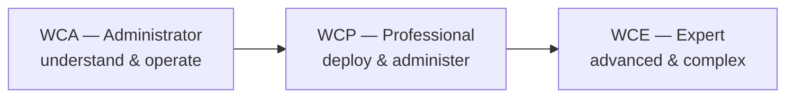

# 🛡️ WALLIX / PAM — Study Hub

### A source-grounded study hub for **WALLIX** and **Privileged Access Management (PAM)**

The repo's primary track: the WALLIX product portfolio, the **WCA → WCP → WCE** certification
ladder, deep technical dives into Bastion and the wider suite, labs, exam prep, and a career path.

---

> [!NOTE]
> **Unofficial & no fabrication.** Not affiliated with or endorsed by WALLIX. Facts are tied to
> official WALLIX documents (cited per page); unknowns are marked *"not specified in sources."*
> Foundations that this hub builds on — [foundations/](../../foundations/README.md),
> [prerequisites/](../../prerequisites/README.md), [protocols/](../../protocols/README.md) — live at the
> repo root because they're shared across all the certification hubs.

## 📦 What's inside

| Section | Contents |
|---------|----------|
| **[Overview](overview/product-portfolio.md)** | [Product portfolio](overview/product-portfolio.md) · [Certification framework](overview/certification-framework.md) |
| **[PAM / Bastion track](pam-bastion/README.md)** | **WCA-P → WCP-P → WCE-P** — curricula, scope, exam focus, study tips |
| **[OT track](ot-pam4ot/ewcp-p-ot-professional.md)** · **[IDaaS](idaas/ewcp-i-professional.md)** · **[IAG](iag/README.md)** | The eWCP-P-OT, eWCP-I, and eWCP-G / WCA-G tracks |
| **[Deep dives](deep-dives/README.md)** | 13 docs — Bastion architecture, data model, sessions, secrets, auth, HA/DR, REST API, PAM4OT, IDaaS, IAG, EPM, WALLIX One |
| **[Labs](labs/README.md)** · **[Exam prep](exam-prep/README.md)** · **[Career](career/README.md)** | Build a lab, exercises, study plan, practice questions, cheat sheet, sysadmin→PAM roadmap |

## 🎓 The certification ladder

| Track | Product | Administrator | Professional | Expert |
|-------|---------|---------------|--------------|--------|
| **PAM / Bastion** | WALLIX Bastion | [WCA-P](pam-bastion/wca-p-administrator.md) | [WCP-P](pam-bastion/wcp-p-professional.md) | [WCE-P](pam-bastion/wce-p-expert.md) |
| **IAG** | WALLIX IAG | [WCA-G](iag/wca-g-administrator.md) *(soon)* | [WCP-G](iag/ewcp-g-professional.md) | — |
| **IDaaS** | WALLIX One IDaaS (Trustelem) | — | [WCP-I](idaas/ewcp-i-professional.md) | — |
| **OT** | WALLIX PAM4OT | — | [eWCP-P-OT](ot-pam4ot/ewcp-p-ot-professional.md) | — |

Full detail: the [certification framework](overview/certification-framework.md).

## 🧭 Beyond WALLIX

This hub is one of several in the repo. See the [root README](../../README.md) for the other cert
hubs (CEH, Security+, CySA+, PenTest+, OSCP, PNPT), the [learning roadmap](../../learning/roadmap.md),
and the [attack → defense matrix](../../attack-to-defense-matrix.md) (how attacks map to PAM controls).

## Sources

- WALLIX Academy: https://www.wallix.com/support-services/wallix-academy/
- Per-page Sources lists cite the specific official WALLIX documents used. See also
  [reference/sources.md](../../reference/sources.md).
