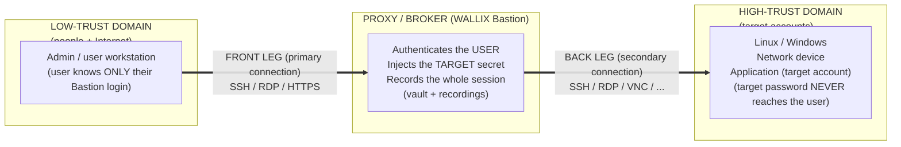
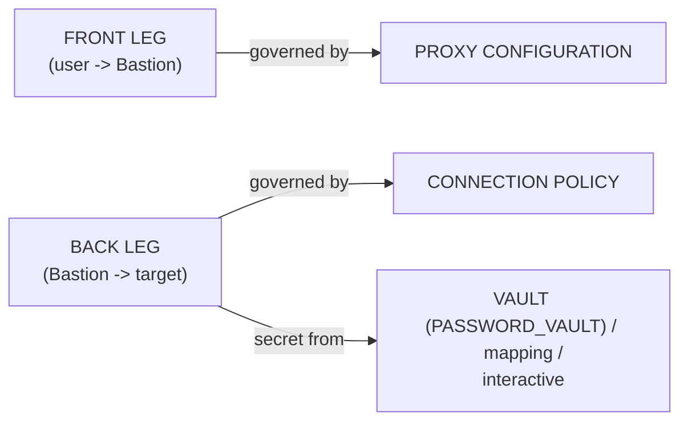
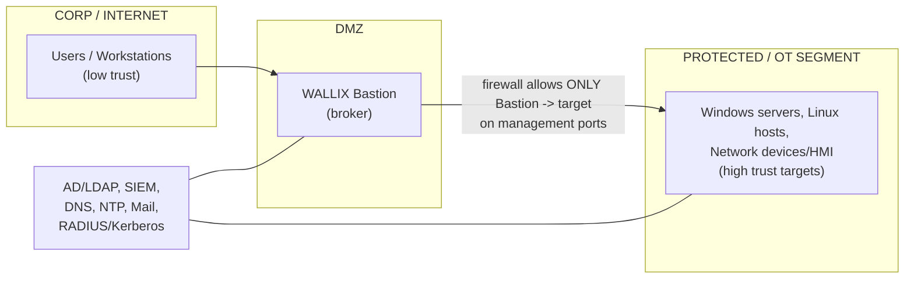
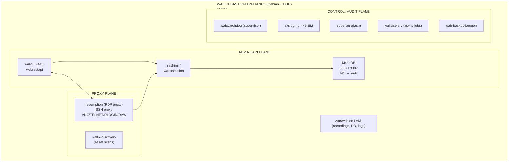
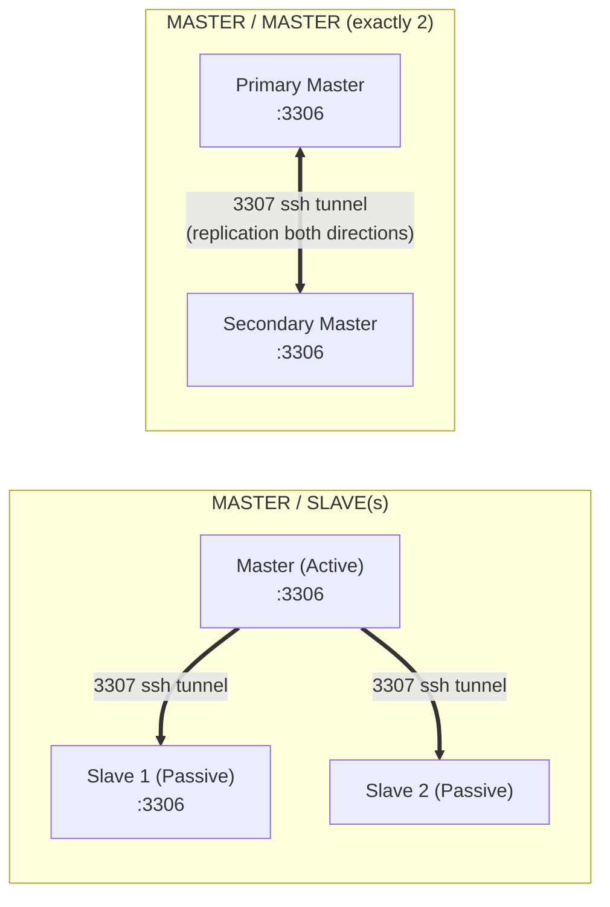
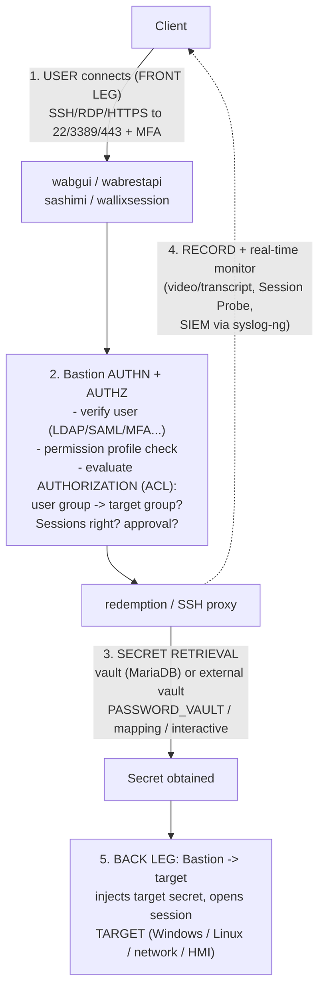

# WALLIX Bastion Architecture — Proxy/Gateway, Internal Services, and Deployment

WALLIX Bastion is a **Privileged Access Management (PAM)** appliance that operates as a **trusted proxy/gateway** sitting between a *low-trust domain* (the people and the Internet) and a *high-trust domain* (the sensitive servers, network gear, and applications). Every privileged connection is *brokered* by the Bastion: the user authenticates to the Bastion, the Bastion authenticates to the target on the user's behalf (injecting vaulted credentials), and the entire session is proxied, recorded, and auditable. The user never needs to know — and ideally never sees — the target's credentials.

This file goes deeper than the [product portfolio](../overview/product-portfolio.md#1-wallix-bastion--privileged-access-management-pam) on **how the box is built and placed**. For the rights/object model see [./bastion-data-model.md](bastion-data-model.md); for the proxy/recording engine see [./session-management.md](session-management.md); for the vault see [./secrets-and-password-management.md](secrets-and-password-management.md). Acronyms are collected in [../reference/acronyms.md](../../../reference/acronyms.md).

> **Served document versions used here:** WALLIX Bastion **12.3.2** *Functional Administration Guide* (the live PDF at the WALLIX docs portal; PDF title page reads 12.3.2, dated 2026) and the WALLIX Bastion **12.0.2** *Deployment Guide*. Version-specific facts are flagged inline.

---

## Key points

- Bastion is positioned **between a low-trust domain and a high-trust domain**; the high-trust devices and their accounts are called **target accounts** in WALLIX terminology.
- It is **agentless on the targets** — it speaks the native protocols (SSH, RDP, VNC, TELNET, RLOGIN, RAW TCP/IP) over the network; no software is installed on the protected servers.
- The connection is **two-legged**: a **front leg** (user/client ↔ Bastion, the *primary connection*) and a **back leg** (Bastion ↔ target, the *secondary connection*). The two legs are *decoupled* — different protocols, credentials, and policies can apply to each.
- Internally the appliance is a hardened **Debian Linux** host running a set of named **systemd services** (MariaDB, `redemption` RDP proxy, `wabgui`, `wabrestapi`, `sashimi`, `wallixsession`, `wallixcelery`, `wallix-discovery`, `superset`, `syslog-ng`, `wab-backupdaemon`, `wabwatchdog`, and more).
- Ships as **physical or virtual appliances**, plus **cloud marketplace images** (AWS, Azure, GCP, Alibaba, Outscale) and a **GPG-signed generic ISO** for on-prem hypervisors.
- Encryption at rest is **LUKS** (dm-crypt); the cryptographic policy is selectable via `WABSecurityLevel`, with **SOG-IS CES 1.3** recommended.
- High Availability in v12 is **HA Database Replication** over an `autossh` SSH tunnel (3307→3306) — the old DRBD file-system replication was removed.

---

## 1. The proxy/gateway model — why a Bastion exists

A Bastion solves the **credential-exposure and accountability problem** of privileged access. Without it, administrators connect *directly* to servers using shared root/Administrator passwords; the passwords spread across laptops and scripts, sessions are invisible, and a single stolen credential opens the whole estate.

The Bastion inserts a **mandatory chokepoint**:



Three properties follow directly from this design:

1. **No standing knowledge of target secrets.** The user authenticates to the Bastion; the *target* password lives in the vault and is injected on the back leg. (See secondary-connection modes in [./bastion-data-model.md](bastion-data-model.md#5-user-mapping--secondary-connection-modes).)
2. **Total session traceability.** Because traffic transits the proxy, the Bastion can record video/transcripts, apply real-time restrictions, and stream metadata to a **SIEM** (Security Information and Event Management).
3. **Centralised authorization.** Access is decided by **Access Control Lists (ACLs)** evaluated at connection time — *who* may reach *what*, *when*, and with *which protocols*.

> Glossary (12.3.2): *Client* = "Application connecting to a company's IT resources via communication protocols (SSH or RDP) through WALLIX Bastion." *Session* = "Period of time during which the user (or a service account) is connected to a system … through WALLIX Bastion."

---

## 2. Front leg vs. back leg — the two-legged connection model

WALLIX splits a connection into a **primary connection** (front leg) and a **secondary connection** (back leg). This separation is the architectural heart of the product and is explicit in the 12.3.2 glossary.

| | **Front leg (primary connection)** | **Back leg (secondary connection)** |
|---|---|---|
| Endpoints | User's client ↔ Bastion | Bastion ↔ target |
| Who authenticates | The **human user** authenticates *to the Bastion* (local, LDAP/AD, SAML, OIDC, Kerberos, X.509, plus MFA) | The **Bastion** authenticates *to the target* as the target account |
| Credential | The user's own Bastion/directory credential | The **vaulted target secret**, or a mapped/interactive credential |
| Governed by | **Proxy configuration** (`Configuration > Proxy configurations`) | **Connection policy** attached to the target/service |
| Glossary term | "Primary connection mode … Automatic logon" | "secondary connection … takes place after user authentication" |

A **connection policy** is defined as the rules that apply "when the Bastion connects to a target using a supported protocol. This connection, known as a *secondary connection*, takes place after user authentication." Built-in policies exist per protocol (`SSH`, `RDP`, `VNC`, `TELNET`, `RLOGIN`, `RAWTCPIP`, `WEBAPP`), plus hardened **CCN-STIC** (`SSH-ccn`, `RDP-ccn`) and **SOG-IS CES 1.3** variants (`SSH-sogisces_1.3_2030`, `RDP-sogisces_1.3_2030`).



Because the legs are decoupled, you can (for example) let a user reach the Bastion over RDP with SAML+MFA on the front leg, while the back leg uses `PASSWORD_VAULT` with a vaulted Windows account — and the user never types or sees that Windows password.

---

## 3. Network placement — the DMZ and connection direction

WALLIX states plainly: *"WALLIX Bastion is positioned between a low trust domain and a high trust domain,"* and *"access to the target accounts (in the high trust domain) is only possible through WALLIX Bastion."* In practice the appliance is placed in (or adjacent to) a **DMZ (Demilitarized Zone)** so that:

- the **only** path from users/Internet into the protected segment is the Bastion;
- firewall rules between the DMZ and the high-trust segment allow *only the Bastion's source IP* to reach the targets on management ports.



**Front-leg (inbound to Bastion) ports** — factory defaults from the 12.0.2 Deployment Guide:

| Service | Port | Direction |
|---|---|---|
| Web interface / GUI / REST API (HTTPS) | **TCP 443** | client → Bastion |
| SSH proxy | **TCP 22** | client → Bastion |
| RDP proxy | **TCP 3389** | client → Bastion |
| SSH for **administration** (CLI) | **TCP 2242** | admin → Bastion |

**Back-leg (Bastion → target) protocols:** SSH/SFTP (22), RDP/RDS (3389), VNC, TELNET/RLOGIN, plus **RAW TCP/IP / Universal Tunneling** for arbitrary forwarded ports (e.g. industrial protocols tunnelled inside SSH — see [PAM4OT](../overview/product-portfolio.md#6-wallix-pam4ot--operational-technology-ot-security)).

**Supporting/outbound flows:** LDAP/AD, DNS, NTP, Kerberos, RADIUS/TACACS+, SMTP (mail notifications), and **Syslog to SIEM (UDP/TCP 514)**.

> **SaaS variant (WALLIX One PAM):** the same Bastion engine runs as managed SaaS, but connectivity reverses — an **IPSec tunnel is initiated outbound from the client network** to the WALLIX One PAM gateway, so *no inbound ports are opened on the client side*. (Source: WALLIX One PAM architecture page.) See the [WALLIX One section](../overview/product-portfolio.md#2-wallix-one--the-cybersecurity-saas-platform) of the portfolio.

---

## 4. Internal components / services

The Bastion is a single hardened **Debian Linux** appliance running a set of cooperating **systemd services**. The exact service names are confirmed in the 12.0.2 Deployment Guide, where the documented "stop the WALLIX Bastion services" command iterates over them:

```
wabwatchdog  wabrestapi  wabgui  redemption  sashimi  wallix-validator
superset  wallix-discovery  wallixsession  wallixcelery
wabsystemconfiguration  syslog-ng  acpid  cron  wab-backupdaemon  mariadb
```

> **Naming note (12.1.1+):** the 12.1.1 release renamed watchdog labels for readability — `wabrest` → **`wabrestapi`** and `rdb` → **`redemption`**. Use the new names on current versions.

| Service | Role | Notes |
|---|---|---|
| **mariadb** | The **configuration + audit database** (ACLs, users, authorizations, session metadata). | Listens **3306** (and **3307** for HA replication). Audit/session tables are *per-node* and **not replicated** in HA. |
| **redemption** | The **RDP proxy engine** (WALLIX's open-source "Redemption"). | Terminates the client RDP, opens RDP to the target, records video, hosts the **Session Probe** virtual channel. |
| **wabgui** | The **web administration GUI** (HTTPS, port 443). | "Graphical User Interface" used to configure ACLs and monitor activity. |
| **wabrestapi** | The **REST API** service. | Drives automation, **AAPM/WAAPM** secret retrieval, the remote-**Bastion vault plugin**, and Access Manager integration. Restart required after some config changes (e.g. session timeout). |
| **sashimi** | Internal **proxy/session orchestration** glue between the GUI/API and the proxies. | (Exact internal contract not detailed in public sources — *not specified in sources*.) |
| **wallixsession** | **Session management** back-end (lifecycle of in-progress sessions, sharing, monitoring). | Underpins real-time monitoring and session sharing. |
| **wallixcelery** | **Celery** task worker — runs **asynchronous/scheduled jobs** (secret rotation, notifications, periodic tasks). | Celery is a Python distributed task queue. |
| **wallix-discovery** | **Assets Discovery** engine. | Network/AD/Azure-AD scans for devices and accounts, then onboarding. |
| **superset** | **Apache Superset** — analytics/dashboards. | Powers the Administration and Audit **dashboards** (toggle: `Enable dashboards`). |
| **syslog-ng** | **SIEM log forwarder** (Syslog, port 514). | Streams events/session metadata to external SIEM. |
| **wab-backupdaemon** | **Backup** daemon. | Configuration backups; supports the nightly GPG-encrypted **Break-Glass** export (see [secrets file](secrets-and-password-management.md#6-break-glass)). |
| **wabwatchdog** | **Process watchdog**. | Supervises the other services and restarts/raises alerts on failure. |
| **wallix-validator** | Internal **validation** service. | Used during upgrade/config validation. |
| **wabsystemconfiguration** | **System configuration** service. | Applies appliance/system settings. |

Storage sits on **LVM** under `/var/wab` (recordings, database, logs), encrypted with **LUKS**; the volume can be extended to grow recording retention.



> **Hardening note:** WALLIX explicitly **forbids installing external agents** (EDR, backup, monitoring) on the appliance and treats any change outside the GUI/CLI as a violation of the terms. During upgrades a **lock-down mechanism** disables services and access until the system is verified safe. This is why third-party EDR/backup must integrate via the API/SIEM, not by installing on the box.

---

## 5. Appliance types and deployment options

WALLIX Bastion is delivered as an **appliance** (glossary: "either physical … or virtual"):

| Type | What you get | Source notes |
|---|---|---|
| **Physical appliance** | Pre-mounted, configured hardware (redundant PSUs on the rackmount models). | Plug in and boot. |
| **Virtual appliance — cloud images** | Vendor-specific tenant images: **AWS** (Marketplace), **Microsoft Azure** (Marketplace), **GCP**, **Alibaba Cloud**, **Outscale** (Marketplace). | 12.0.2 Deployment Guide. |
| **Virtual appliance — on-prem hypervisors** | **KVM, Microsoft Hyper-V, Nutanix AHV, OpenStack, VMware vSphere**. | A platform-specific image is recommended; otherwise a **generic GPG-signed ISO** is provided. |
| **SaaS** | **WALLIX One PAM** = Bastion + Access Manager delivered/managed by WALLIX. | Outbound IPSec model; *Session Invite not supported on SaaS*. |

**Factory defaults (12.0.2):** `eth0` `192.168.10.5/24`, gateway `192.168.10.1`, admin SSH on **2242**, GUI on **443**; first super-admin login `admin`/`admin` (must be changed/deleted after setup). RSA private keys (SSH 2242, HTTPS, RDP) must be **≥ 3072 bits**.

### Front-end: Access Manager (WAM)

For remote/external access, a separate **Access Manager (WAM)** component is placed in front of one or more Bastions as an **HTML5 reverse proxy** — a single HTTPS entry point, no browser plug-in. WAM is required for **Session Invite** and cross-Bastion audit. See the [portfolio's WAM section](../overview/product-portfolio.md#access-manager-web-portal--single-point-of-access--gateway).

---

## 6. High Availability and scaling

### HA Database Replication (v12)

> **Major change:** WALLIX Bastion **12 removed the DRBD file-system replication**. HA is now **HA Database Replication**.

An **`autossh`-managed SSH tunnel** with port forwarding links the Bastion databases so they replicate *without* exposing the DB to the network. Slaves/peers pull updates using **outbound source port 3307 → inbound destination port 3306**.



**Key HA constraints (from the portfolio + deployment guide):**

- **Audit/session tables are NOT replicated** — each node keeps its own live audit tables (replicating them would corrupt during active sessions). Recordings are likewise local to the node that created them and **only that Bastion can decrypt/replay them** (see [session-management](session-management.md#4-session-recording-and-the-audit-pipeline)).
- **All nodes must run the same version.**
- HA is managed via the `bastion-replication` CLI; **Master/Master is limited to exactly two nodes**.

### Clusters and load balancing

- **Application clusters** = groups of **jump servers** for standard-application sessions; the Bastion sorts servers by *fewest open sessions* and tries each until one succeeds (load sharing + HA).
- **Access Manager** can load-balance a pool of Bastions, routing new sessions to the Bastion with the fewest in-progress sessions.
- **RD Connection Broker** load balancing is supported for RDP jump-server farms.

### Scaling

No fixed concurrent-session numbers are published in the deployment guide (deferred to the WALLIX support sizing article). Vertical scaling is via CPU/RAM and **LVM extension** of `/var/wab` for recording retention.

---

## 7. Putting it together — end-to-end session flow



Each numbered step maps to a sibling deep-dive: authorization evaluation → [bastion-data-model.md](bastion-data-model.md); recording/monitoring/approval → [session-management.md](session-management.md); secret retrieval/rotation → [secrets-and-password-management.md](secrets-and-password-management.md).

---

## Acronyms

| Acronym | Expansion |
|---|---|
| PAM | Privileged Access Management |
| ACL | Access Control List |
| DMZ | Demilitarized Zone |
| GUI | Graphical User Interface |
| API / REST | Application Programming Interface / Representational State Transfer |
| RDP | Remote Desktop Protocol |
| SSH / SFTP | Secure Shell / SSH File Transfer Protocol |
| VNC | Virtual Network Computing |
| RDS | Remote Desktop Services |
| HA | High Availability |
| DRBD | Distributed Replicated Block Device |
| LUKS | Linux Unified Key Setup (dm-crypt disk encryption) |
| LVM | Logical Volume Manager |
| SIEM | Security Information and Event Management |
| WAM | WALLIX Access Manager |
| AAPM / WAAPM | Application-to-Application Password Management / WALLIX App-to-App Password Manager |
| SOG-IS CES | Senior Officials Group – Information Systems Security, Crypto Evaluation Scheme |
| CCN-STIC | (Spanish CCN) Security guidelines series |
| MFA | Multi-Factor Authentication |
| OT / HMI | Operational Technology / Human-Machine Interface |

See the full list in [../reference/acronyms.md](../../../reference/acronyms.md).

---

## Sources

- WALLIX Bastion **12.3.2** *Functional Administration Guide* — sections 5 (Getting started: "WALLIX Bastion in the network infrastructure", "WALLIX Bastion ACLs"), 11.4 (Connection policies), 18.1 (Glossary). https://pam.wallix.one/documentation/admin-doc/bastion_en_administration_guide.pdf
- WALLIX Bastion **12.0.2** *Deployment Guide* — sections 1–3 (appliance/cloud/virtualization images, factory defaults, ports), the service-stop command listing internal services, section 5 (HA Database Replication), LUKS/`WABSecurityLevel`. https://marketplace-wallix.s3.amazonaws.com/bastion_12.0.2_en_deployment_guide.pdf
- WALLIX Bastion 12.1.1 Release Notes (service rename `wabrest`→`wabrestapi`, `rdb`→`redemption`). https://pam.wallix.one/documentation/release-notes/1.5.1/bastion-rn-en.html
- WALLIX One PAM architecture (outbound IPSec, network-flows/ports). https://pam.wallix.one/documentation/deployment/getting-started/architecture.html
- Cross-reference: [../docs/00-overview/product-portfolio.md](../overview/product-portfolio.md) (architecture/deployment/HA subsection, with its own sources).

> **Flagged uncertainties:** the precise internal responsibilities of `sashimi` and `wabsystemconfiguration` are not described in the public guides — *not specified in sources*. The OS base is documented by WALLIX as Debian-derived but the exact Debian version is not printed in the served guides.
