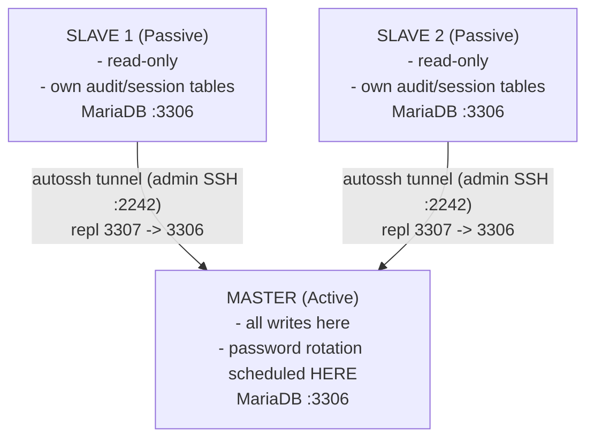
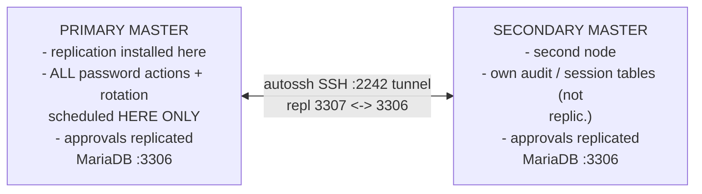
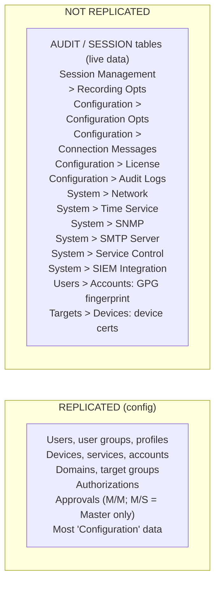
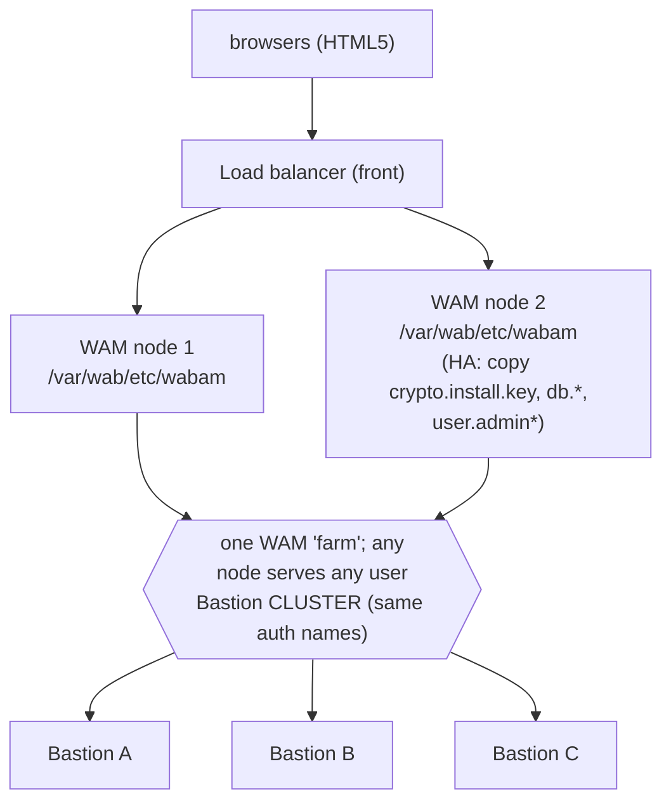
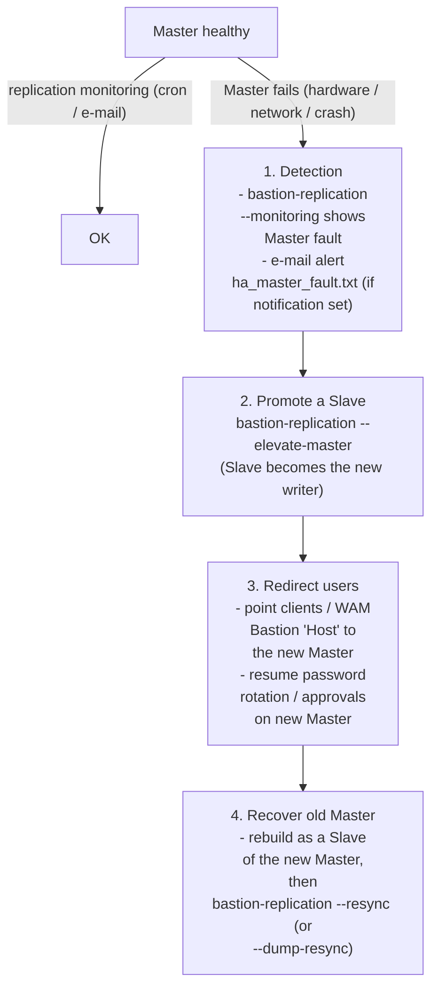

# High Availability (HA) & Disaster Recovery (DR)

How **WALLIX Bastion 12** keeps the PAM service running and how you recover it. The single
biggest v12 change: **DRBD file-system replication is gone** — HA is now **HA Database
Replication** over an `autossh` SSH tunnel, driven by the **`bastion-replication`** CLI.
This file maps to **WCE-P (WALLIX Certified Expert – PAM)** topics "Active/Active
architecture" and "disaster recovery"; see [wce-p-expert.md](../pam-bastion/wce-p-expert.md).

For the layer *in front of* the Bastions (WAM load-balancing, Bastion clustering), see also
[authentication-and-access-manager.md](authentication-and-access-manager.md#3-wallix-access-manager-wam).

**Acronyms first use:** HA = High Availability · DR = Disaster Recovery · DRBD = Distributed
Replicated Block Device · PAM = Privileged Access Management · SQL = Structured Query
Language · UUID = Universally Unique Identifier · FQDN = Fully Qualified Domain Name · SPOF =
Single Point Of Failure · SMTP = Simple Mail Transfer Protocol · GPG = GNU Privacy Guard ·
ISO = (here) optical disc image · WAM = WALLIX Access Manager. Full list:
[../reference/acronyms.md](../../../reference/acronyms.md).

---

## Key points

- **DRBD removed in v12.** *"WALLIX Bastion 12 removed the High-Availability File System
  Replication (DRBD) feature."* Restoring a DRBD-era backup onto v12 is possible but the
  Bastion becomes **standalone**.
- HA = **database replication** between Bastions, secured by an **`autossh` SSH tunnel with
  port forwarding** (so the database is never exposed for remote access). The tunnel rides
  the admin SSH port **2242**; the MySQL/MariaDB replication flows **outbound 3307 → inbound
  3306**.
- Two modes: **Master/Slave(s)** (one Active Master → one or more passive Slaves) and
  **Master/Master** (bidirectional, but **exactly two nodes**, with a *primary* and a
  *secondary* Master).
- **Audit / session tables are NOT replicated** — *"they are live and provide dynamic updates
  … which can lead to database corruption in replications. As a consequence, all Bastions
  have their own audit session tables."* Several other config pages are also excluded.
- **IPv4 only** for HA: *"FQDN and IPv6 are not supported in the HA feature configuration.
  You must only use the IPv4 address for Bastions."*
- **Same version** on all nodes is mandatory before installing replication; encryption must
  be initialized first; never set up replication from cloned VMs (UUID clash).
- DR = **Backup/Restore** (encrypted, 16-char key) + recordings export/import; the
  controlled/auto-deployment upgrade procedures double as a DR/migration playbook.

---

## 1. Why DRBD is gone, and what replaced it

| | DRBD (≤ v11) | HA Database Replication (v12) |
|---|---|---|
| What replicates | Whole **file system** block device | The **database** (config), table-level |
| Transport | DRBD block protocol | **`autossh` SSH tunnel** (kept always up), port-forwarded |
| Audit/sessions | replicated with the block device | **NOT replicated** — each node keeps its own |
| Modes | active/passive | **Master/Slave(s)**, **Master/Master** (2 nodes) |
| Tooling | DRBD/pacemaker stack | **`bastion-replication`** CLI |
| Addressing | – | **IPv4 only**, no FQDN/IPv6 |

> Migration reality: a backup taken on a DRBD HA pair *can* be restored onto v12, but the
> result is a **standalone** Bastion — you must then rebuild HA with `bastion-replication`.
> Custom plug-ins must be re-applied; contact WALLIX support for compatibility.

---

## 2. Replication topology diagrams

### 2.1 Master / Slave(s)

One **Active** node (Master) takes all changes; one or more **Passive** Slaves pull updates.
*"No modification must be performed by the Slaves."* Slaves request updates from the Master
on **outbound 3307 → inbound 3306** through the `autossh` tunnel.



*Master / Slave(s): one writer, N readers.* Rules: schedule password change only on
Master; do NOT use "Change password at check-in"; approvals requested/validated on Master only.

### 2.2 Master / Master (exactly two nodes)

Bidirectional, but **only two nodes**. There is still a **primary Master** (the one the
replication was *installed* on) and a **secondary Master**. Each node requests updates from
the other on **outbound 3307 → inbound 3306**.



*Master / Master: exactly 2 nodes, bidirectional.* API provisioning must NOT run
simultaneously on both (duplicate IDs / UUID issues). Password rotation scheduled on the
PRIMARY only (else passwords updated twice).

---

## 3. What IS vs. IS NOT replicated



**Consequence for DR/audit:** because each node keeps its *own* audit and session
recordings, a full audit picture across the cluster comes from **WAM centralized audit**
(Elasticsearch-backed cross-Bastion search), not from the replication itself — see
[authentication-and-access-manager.md](authentication-and-access-manager.md#36-centralized-cross-bastion-audit).

Other limitations: in **Master/Master**, do not run **API provisioning** from both nodes at
once (duplicate items with different IDs); never **clone VMs** to seed replication (UUID
errors); in **Master/Slave**, do **not** use the *Change password at check-in* option (the
change would land on a Slave and not replicate back).

---

## 4. The `bastion-replication` CLI

Run as root (`super` → `sudo -i`). Config file lives at **`/etc/sqlreplication`**.

```
# bastion-replication --help
usage: replication [-h] [--debug] [--create-conf-file] [--install]
                   [--prerequisite-check] [--resync] [--dump-resync] [--status]
                   [--uninstall] [--stop] [--start] [--version] [--add-slave]
                   [--elevate-master] [--monitoring] [--install-monitoring]
                   [--uninstall-monitoring] [--install-notification]
                   [--uninstall-notification] [--notification NOTIFICATION]
```

| Option | Purpose |
|---|---|
| `--create-conf-file` | Interactive build of `/etc/sqlreplication` (choose mode, enter each node's IPv4 + `wabadmin`/`wabsuper` passwords, decide per-node password-rotation) |
| `--prerequisite-check` | Validate prerequisites before installing |
| `--install` | Install replication (run on the (primary) Master) |
| `--monitoring` | Show SQL replication status on all Bastions (verify install) |
| `--status` | Check replication status from a log file |
| `--resync` | Resynchronize all Slaves with the Master |
| `--dump-resync` | SQL dump **without** auth/session history, ship to Slave, resync |
| `--add-slave` | Add a Slave to an existing cluster |
| `--elevate-master` | Promote a Slave to Master (Master/Slave) — **failover** |
| `--stop` / `--start` | Stop / start replication |
| `--uninstall` | Uninstall replication on every node (run on Master) |
| `--install-monitoring` / `--uninstall-monitoring` | (Un)install a cron job that logs replication status |
| `--install-notification` / `--uninstall-notification` / `--notification` | (Un)set / send e-mail alerts when replication is down |
| `--version` / `--debug` | Show Bastion version / verbose mode |

**Options that cannot run on a Slave node (Master/Slave mode):** `--resync`,
`--dump-resync`, `--install-monitoring`, `--install-notification`, `--notification`,
`--monitoring`.

**Side-effects of key options:**

| Option | Restarts (primary) Master DB | Restarts Slave/secondary Master DB | Erases DB on all but (primary) Master¹ |
|---|---|---|---|
| `--install` | yes | yes | yes |
| `--dump-resync` | no | yes | yes |
| `--resync` | no | yes | no |
| `--uninstall` | yes | yes | no |

¹ Not all tables are affected. **The primary Master's database erases the database of the
other node(s) at install** — so install on the node holding the authoritative data.

### 4.1 Install — Master/Master (abridged)

```bash
wabadmin$ super                    # then sudo -i to become root
# bastion-replication --create-conf-file
#   choose 1 (Master/Master)
#   Bastion No 1 IP: 10.10.54.44   + wabadmin/wabsuper passwords  (PRIMARY master)
#   Bastion No 2 IP: 10.10.54.46   + wabadmin/wabsuper passwords  (secondary)
#   passphrase: <blank if none>
# bastion-replication --install
# bastion-replication --monitoring          # verify
# bastion-replication --install-monitoring  # optional: cron status logging
# bastion-replication --install-notification# optional: e-mail on failure
```

Master/Slave is identical except you pick **2** and define the **number of Slaves**.

### 4.2 Prerequisites checklist

- All Bastions on the **same WALLIX Bastion version**.
- **Encryption initialized** on every node *before* install (else install errors).
- **IPv4 addresses only** (no FQDN, no IPv6).
- Recommended: configure **SMTP on the (primary) Master** and put all nodes in the **same
  timezone** to avoid information discrepancies.
- Do not seed from cloned VMs.

---

## 5. Load-balancing Bastions behind Access Manager

Replication gives you data redundancy; **WAM** gives you *session* load-balancing and a
single entry point. Two complementary WAM mechanisms (WAM Administration Guide §20):



*Bastion cluster behind Access Manager.* Target connection routed to the Bastion with the
FEWEST sessions in progress within the WAM farm.

- **Several WAM instances** behind a load balancer = WAM HA (removes WAM as a SPOF). Extra
  instances copy `crypto.install.key`, `db.connections*`, `user.admin*` from the first; if
  the WAM databases are replicated, skip duplicating `db.connections`.
- **Bastion cluster inside one WAM**: Bastions sharing identical authorization *names* are
  grouped; a target connection goes to *"the bastion with the fewest sessions in progress."*
  Authorizations then appear **under the cluster name**, not the individual Bastion. Enable
  `bastion.cluster.identical.mode` (Settings > Application > Bastion) when all cluster nodes
  share configuration/proxy certs — only one node's info is stored/synced, a big perf win.
- Caveat: a Bastion cluster is **not compatible with displaying target passwords** in WAM
  (an external vault can be used instead).

> Pairing pattern: a **Master/Master Bastion pair** (config replicated) placed in a **WAM
> Bastion cluster** (sessions load-balanced) is the textbook "Active/Active" WCE-P design —
> config stays consistent via replication; live sessions spread across nodes via WAM.

---

## 6. Failover flow



*Failover (Master/Slave example).* E-mail templates: `ha_master_fault.txt` /
`ha_master_up.txt` / `ha_slave_missing.txt`.

> Failover is **operator-driven** (promote with `--elevate-master`, redirect clients), not
> a fully automatic VIP cutover from the Bastion itself. WAM in front can mask node loss for
> *session* routing within a Bastion cluster; client/DB redirection to the new Master is a
> manual/scripted step. *The guide does not document an automatic Master-election daemon —
> treat HA here as "warm" rather than fully transparent.*

---

## 7. Backup / Restore and DR

### 7.1 Configuration backup (the DR cornerstone)

**System > Backup/Restore**: set a **Backup key exactly 16 characters**, *Create*,
*Download created backup file*. Store the key safely (and the encryption passphrase if one
is set). Restore = enter key (+ passphrase), import file, *Restore*.

CLI restore (used in HA upgrade/DR procedures):

```bash
wallix-config-restore.py --testing-mode -f <BACKUP_FILE>   # --testing-mode disables all
                                                           # interaction workflows (safe DR test)
```

### 7.2 Session recordings (local storage)

Because audit/recordings are **not** replicated, protect them separately:

```bash
WABSessionLogExport     # export recordings (local storage)
WABSessionLogImport     # import recordings on the new/restored node
```

Connect over the admin SSH port for these: `ssh -p 2242 wabadmin@<bastion_ip>`. Remote
storage (NFS/CIFS) sidesteps per-node export.

### 7.3 DR via the HA upgrade procedures

The v12 upgrade docs describe two patterns that are also a **DR/migration playbook** —
build a parallel cluster from backups, validate, then cut over:

| Pattern | Idea | Risk |
|---|---|---|
| **Controlled deployment** | Restore backups into a *parallel* cluster in `--testing-mode` (interactions disabled), test all workflows, then sync latest data and promote. | Lower — testable |
| **Auto-deployment** | Restore into a *copy* cluster that takes over immediately when upgrade finishes. | Higher — no test window, data during migration is lost |

In both, mask `cron` during the data freeze (`systemctl mask --now cron`; reverse with
`systemctl unmask cron && systemctl start cron`) to stop background password rotation, and
on the parallel cluster bracket the recording re-import with `bastion-replication --stop` /
`--start`. Promotion re-enables rotation (Configuration > Configuration options > Global:
deactivate *Disable password rotation* and *Disable remote trace write*).

### 7.4 Compatible-version & DR constraints

- Migrate to v12 only from **9.0 / 9.1 / 10.x / 11.0** (recommended hotfixes 9.0.10, 9.1.0,
  10.0.7, 10.1.0, 10.3.0, 10.4.3, 11.0.0). **Pre-9.0 cannot** use the v12 Backup/Restore.
- In HA mode, **all nodes must be on a compatible version**.
- Old appliances **Dell R310/R510/R810** are unsupported (best-effort only).
- A backup is restorable only with the **16-char key** (+ passphrase) — losing the key loses
  the backup. Also keep a nightly **GPG-encrypted credential export** (break-glass).

### 7.5 Cluster-wide minor upgrade note

A minor upgrade uses a **protective system lock-down** that disables services until done; on
failure, keep lock-down on, reboot into **rescue mode**, audit, then unlock:

```bash
/opt/wab/bin/BastionSecureUpgrade --unlock-system
```

Upgrade itself (over admin SSH, signature-verified):

```bash
ssh -p 2242 wabupgrade@<bastion_ip>
# place <ISO> and <ISO>.sha256sum.sig in /home/wabupgrade/, then:
BastionSecureUpgrade -i /home/wabupgrade/<ISO>.iso \
  -c /home/wabupgrade/<ISO>.iso.sha256sum \
  -s /home/wabupgrade/<ISO>.iso.sha256sum.sig
```

---

## 8. Ports cheat-sheet (HA-relevant)

| Port | Use |
|---|---|
| **2242** | Bastion admin CLI (SSHADMIN console); the `autossh` tunnel rides here |
| **3306** | MariaDB — replication **destination** (inbound) |
| **3307** | MariaDB — replication **source** (outbound) |
| 443 | Bastion admin web GUI |
| 22 | SSH/SFTP/TELNET/RLOGIN proxy (user sessions) |
| 3389 | RDP/VNC proxy |

---

## Sources

Primary WALLIX documentation, fetched 2026-06-17 (deployment guide downloaded and
text-extracted locally after WebFetch returned compressed binary; PDF validated complete via
`%%EOF`):

- **WALLIX Bastion Deployment Guide** — served version **12.0.2** (PDF title "Deployment
  Guide", 51 pp.). §5 HA Database Replication (DRBD removal note, Modes, Limitations,
  Exclusion list, install procedures, `bastion-replication --help`, option side-effect
  table), §6 Major upgrade (compatible versions, controlled/auto-deployment), §7 Minor
  upgrade + rescue/`--unlock-system`, port tables. **All quoted text is from this guide.**
  https://marketplace-wallix.s3.amazonaws.com/bastion_12.0.2_en_deployment_guide.pdf
- **WALLIX Bastion Administration Guide** — served version **12.3.2** (374 pp.). Used for
  the replication *exclusion* page list cross-check (Configuration/System pages), HA e-mail
  notification templates (`ha_master_fault.txt`, `ha_master_up.txt`, `ha_slave_missing.txt`),
  and Backup/Restore right.
  https://pam.wallix.one/documentation/admin-doc/bastion_en_administration_guide.pdf
- **WALLIX Access Manager Administration Guide** — served version **5.2.4.0** (82 pp.). §20
  Scalability & High-availability (several WAM instances behind a load balancer;
  Bastion-cluster routing to the node with the fewest in-progress sessions;
  `bastion.cluster.identical.mode`; `wabam.properties` keys).
  https://pam.wallix.one/documentation/admin-doc/am-admin-guide_en.pdf

Detailed `WABSessionLogExport`/`WABSessionLogImport`/`WABChangeDbRootPassword` options and
the automatic-failover specifics beyond `--elevate-master` are deferred by the deployment
guide to the **System Operations Guide** (not fetched here — flagged as *not specified in
these sources*). Cross-references: [product portfolio](../overview/product-portfolio.md#architecture-deployment-ha-integrations)
· [authentication & WAM](authentication-and-access-manager.md) ·
[troubleshooting & logs](troubleshooting-and-logs.md) · [acronyms](../../../reference/acronyms.md).
