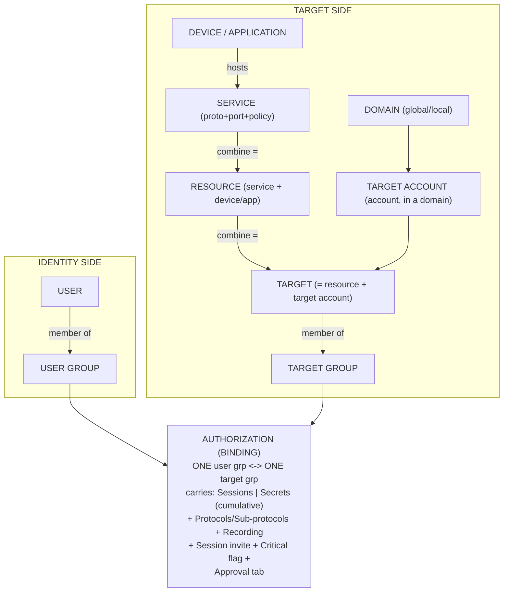

# WALLIX PAM — Exam Cheat Sheet (Quick Reference)

A dense, scannable last-minute reference for the WALLIX Bastion (PAM) certifications.
Everything here is grounded in the repo's sourced docs (Bastion **12.3.2** Functional
Administration Guide, Bastion **12.0.2** Deployment Guide, Access Manager **5.2.4.0**
Administration Guide, the WALLIX Academy catalog). For practice, see
[practice-questions.md](practice-questions.md). Full acronym list:
[../reference/acronyms.md](../../../reference/acronyms.md).

> **Served document versions:** Bastion **12.3.2** · Deployment **12.0.2** · Access
> Manager **5.2.4.0**. Some facts are version-specific (flagged inline).

---

## Exam-day facts (cite the framework)

- **Final exam = a multiple-choice questionnaire (MCQ); ≥ 70 % to pass** → digital badge
  + diploma. (Source:
  [certification-framework.md](../overview/certification-framework.md#common-exam--assessment-model).)
- Also assessed: a **pre-test** at the start + **continuous assessment** (oral, MCQs,
  hands-on labs) throughout.
- **Number of exam questions** and any **validity/renewal period** are **NOT specified**
  in official sources (a web snippet said "2 years" but is unconfirmed). Don't assert them.
- **Levels & prerequisites:** WCA-P (Administrator, 1 day, no prereq) → WCP-P
  (Professional, install/deploy) → WCE-P (Expert; requires prior WCP-P + Linux CLI).
  WCP-I (IDaaS) and eWCP-P-OT (OT) require a prior WCP-P; WCP-G (IAG) has no PAM prereq.
- **Naming:** `W C x-y` → Level x = A/P/E (Administrator/Professional/Expert); Track y =
  P (PAM) / G (IAG) / I (IDaaS) / P-OT (OT). An `e` prefix = e-learning variant.

---

## The Bastion object model at a glance

| Object | One-liner |
|---|---|
| **User** | A physical person (local, LDAP/AD, SAML, OIDC, Kerberos, X.509). |
| **User group** | A set of users — the **only** thing an authorization binds on the user side; **time frames / restrictions attach here**. |
| **Device** | Physical/virtual equipment (name, IP/FQDN, or CIDR subnet). |
| **Service** | Protocol + port + connection policy declared **on a device** (e.g. `SSH:22`). |
| **Application** | App on a Windows **jump server** (grant one app, no full desktop). |
| **Resource** | **Service + (device or application)** — the "where you connect" half. |
| **Account (target account)** | **Device + service + account** — the "as whom". **An account ALWAYS belongs to a domain.** |
| **Domain** | Groups accounts: **global** (across devices; Local *or* External vault) / **local** (single device; Local vault). |
| **Target** | **Resource + target account** — what an authorization reaches. |
| **Target group** | A set of targets — the **only** thing an authorization binds on the target side. |
| **Authorization** | Binds **exactly ONE user group ↔ ONE target group**. Carries **Sessions** + **Secrets** rights (cumulative). |
| **Permission profile** | **Separate axis** — admin rights to GUI features (None/View/Modify); highest level per feature wins; assignable to users, groups, **or API keys**. |

### Compact relationship diagram

**Chain:** `users → user groups → (AUTHORIZATION) → target groups → targets`

### Cardinal rules (exam traps)

- **One authorization = one user-group ↔ one target-group pair.** No duplicate pairs;
  refine the single one. Access is the **union** of all authorizations a user inherits.
- Editing an authorization: **User group & Target group are fixed** at creation — delete
  and recreate to re-pair.
- Rights are **cumulative** across authorizations; profiles take the **highest level per
  feature**.
- **Two orthogonal questions:** *Can they reach target X / pull its secret?* →
  **Authorization**. *Can they create users / edit config / view audit?* →
  **Permission profile**.

(Source: [bastion-data-model.md](../deep-dives/bastion-data-model.md).)

### User-mapping (secondary-connection) modes

| Mode | Back-leg credential | Requires |
|---|---|---|
| **Account mapping** | User's **own** Bastion/dir credential, auto-injected | `PASSWORD_MAPPING` (or a **VTR** for non-password primary auth) |
| **Specific / session account** | **Vaulted** account, auto-injected | `PASSWORD_VAULT` |
| **Interactive login** | User **types** target creds | `PASSWORD_INTERACTIVE` (no injection) |

---

## Default ports

| Port | Service | Leg / direction |
|---|---|---|
| **443** | Web GUI / REST API (HTTPS) | client → Bastion (front); WAM front door |
| **22** | SSH / SFTP / TELNET / RLOGIN proxy | client → Bastion (front), and Bastion → target (back) |
| **3389** | RDP (and VNC) proxy | client → Bastion (front), Bastion → target (back) |
| **2242** | Bastion **admin** SSH (CLI); the HA `autossh` tunnel rides here | admin → Bastion |
| **3306** | MariaDB — config + audit DB; HA replication **destination** (inbound) | internal / HA |
| **3307** | MariaDB — HA replication **source** (outbound) | HA |
| **514** | Syslog → SIEM (`syslog-ng`, UDP/TCP) | Bastion → SIEM |
| **88** | Kerberos KDC | Bastion → KDC |
| **389 / 636** | LDAP / LDAPS | Bastion → directory |
| **1812** | RADIUS (challenge-response; push 2FA) | Bastion → RADIUS |
| **49** | TACACS+ | Bastion → TACACS+ |

(Sources: [bastion-architecture.md](../deep-dives/bastion-architecture.md#3-network-placement--the-dmz-and-connection-direction),
[high-availability-and-dr.md](../deep-dives/high-availability-and-dr.md#8-ports-cheat-sheet-ha-relevant),
[authentication-and-access-manager.md](../deep-dives/authentication-and-access-manager.md).)

> **Factory defaults (12.0.2):** `eth0` `192.168.10.5/24`, gw `192.168.10.1`, admin SSH
> on **2242**, GUI on **443**, first super-admin `admin`/`admin` (change/delete it). RSA
> private keys (SSH 2242, HTTPS, RDP) must be **≥ 3072 bits**.

---

## Authentication methods (primary / front leg)

- **Local password** · **LDAP/AD bind** (use StartTLS/SSL; GSS-API for AD **Protected
  Users**) · **Kerberos Ticket** (transparent, *recommended*) · **Kerberos-Password**
  (explicit, **deprecated v12.X** — SPOF risk) · **RADIUS** (push 2FA, challenge-response,
  no VSAs) · **TACACS+** · **X.509 client cert** (GUI-only validation; CRL/OCSP) ·
  **SAML 2.0** (Bastion = SP; only **SAML Generic** works with WAM) · **OIDC**
  (Authorization Code Flow **only**) · **SSH Key / SSH CA** (SSH only) · **PingID**.

Key rules:
- **Authorization is checked at the PRIMARY auth only.** A secondary factor adds
  assurance but does **no** authorization check.
- Bastion does **SFA + 2FA** natively; for **> 2 factors, delegate MFA to the IdP**
  (SAML/OIDC) or use RADIUS push.
- **WAM MFA** = per-domain **Factor** (challenge ORDER / the MFA chain — all must pass) +
  **Priority** (HA failover among same-factor servers; same priority = load-balancing).
- WAM domain/authenticator types: **local, LDAP, SAML, OIDC, RADIUS, BASTION** (+ X.509
  toggle). Federated IdPs include **WALLIX Trustelem** (→ Authenticator push/TOTP/FIDO2),
  Entra ID, Okta, PingOne, ADFS, Shibboleth.

(Source: [authentication-and-access-manager.md](../deep-dives/authentication-and-access-manager.md).)

---

## Session management quick facts

- **Protocols:** SSH (+SFTP/sub-systems), TELNET, RLOGIN, RDP, VNC, **RAW TCP/IP
  (Universal Tunneling / UT)**, WEBAPP, standard apps/RemoteApp via Windows jump server.
- **RDP proxy engine** = WALLIX's open-source **"Redemption"** (`redemption` service).
- **Sub-protocols** are authorization-gated (e.g. `SSH_SCP_UP/DOWN`, `SFTP_SESSION`,
  `RDP_CLIPBOARD_UP/DOWN`, `RDP_DRIVE`, `RDP_PRINTER`, `RDP_SMARTCARD`). SCP is risky
  (**CVE-2020-15778**) — allow only with `SSH_SHELL_SESSION`; prefer SFTP.
- **Recordings are Bastion-bound** — only the **originating Bastion** can replay them;
  cross-Bastion replay/search is via **Access Manager** (Elasticsearch-backed).
- **Session Probe** = RDP/**Windows-only**, passive metadata, runs at the user's
  privilege; **pauses keystroke capture on password fields / UAC**. Enabled by default.
- **Restriction rules:** actions `kill` / `notify`; regex on client→server data;
  **most-restrictive wins**; RDP supports **OCR of window titles** (`$ocr:` / `$kbd:`).
- **Real-time:** **4-eyes** = watch only · **4-hands** = take control.
- **Session Invite:** RDP/VNC only · needs **Access Manager 5+** · **not on SaaS** · not
  for SSH/apps · expiring link (default **600 s**) · guest bound to host's session.
- **Approval workflows:** two rule sets — **inside** time frame (No approval / Automatic /
  **Quorum N**) vs **outside** (Access blocked / Automatic / Quorum N); options: mandatory
  comment, mandatory ticket, timeout, single connection, self-approval toggle.
  - **Trap:** an approval that **starts inside** the time frame may **continue into blocked
    hours** (only start time is checked). **Scenario accounts can't use approval workflows.**

(Source: [session-management.md](../deep-dives/session-management.md).)

---

## Password-policy defaults (cite)

- **Default password change policy** (`default`, not editable/deletable): **≥ 16
  characters** with **≥ 1 special, 1 number, 1 uppercase, 1 lowercase**; SSH key **RSA,
  size 4096**; **NO automatic scheduled rotation by default**.
- **Version note:** the default minimum **rose from 8 → 16 characters in 12.0.6**;
  upgrading preserves the old policy as **`default (legacy)`**. Supports RSA/DSA/ECDSA.
- **Checkout policy** fields: Enable lock (block concurrent use), checkout duration,
  duration extension, maximum duration, **Change password at check-in** (forces rotation
  on return = the one-time-password pattern).
- **Reconciliation (admin) account:** optional but **recommended** — recovers when the
  Bastion's stored secret has drifted (can't set a new secret if the old one is unknown).
- **External vault plugins:** **CyberArk**, **HashiCorp Vault (API v1)**, **Thycotic
  Secret Server**, **remote Bastion Vault** — mapped via **global domains** (retrieve
  only; Bastion does not rotate them).
- **Break-Glass (standard):** GPG-encrypted archive emailed **nightly at 02:34** (Bastion
  TZ); needs **Credential recovery = Execute** + a valid GPG key. (Alternative variant:
  writes to a directory/remote storage.)
- **AAPM / WAAPM:** apps fetch secrets at runtime via the **REST API** (API-key auth) — no
  hard-coded passwords.

(Source: [secrets-and-password-management.md](../deep-dives/secrets-and-password-management.md), and
[product-portfolio.md](../overview/product-portfolio.md#password--secrets-management).)

---

## High availability (HA) facts

- **v12 removed DRBD** (file-system replication). HA is now **HA Database Replication**
  over an **`autossh` SSH tunnel** (rides admin port **2242**; replication **3307 →
  3306**), driven by the **`bastion-replication`** CLI.
- **Two modes:** **Master/Slave(s)** (one writer, N read-only Slaves) and **Master/Master**
  (bidirectional, **exactly 2 nodes**, with a primary + secondary Master).
- **NOT replicated:** **audit / session tables** (live data) and **recordings** — each
  node keeps its own. (Also excluded: License, Audit Logs, SNMP, SMTP, Network, Time
  Service, SIEM integration, GPG fingerprints, device certs.)
- **REPLICATED:** users, groups, profiles, devices, services, accounts, domains, target
  groups, authorizations, most "Configuration" data (approvals: M/M replicated, M/S on
  Master only).
- **IPv4 only** for HA (no FQDN, no IPv6). All nodes **same version**; encryption
  initialized first; never seed from cloned VMs (UUID clash).
- Cross-cluster audit picture comes from **WAM** (Elasticsearch), not from replication.
- **Failover is operator-driven** (`bastion-replication --elevate-master` + redirect
  clients) — "warm," not a transparent VIP cutover.
- **Backup key = exactly 16 characters** (System > Backup/Restore); losing it loses the
  backup. Recordings protected via `WABSessionLogExport` / `WABSessionLogImport`.
- **WAM HA:** multiple WAM instances behind a load balancer; a **Bastion cluster** inside
  WAM routes a connection to **the Bastion with the fewest sessions in progress**. A
  Master/Master pair inside a WAM cluster = the textbook **Active/Active** design.
- **Contrast trap:** Bastion **HA = IPv4 only**, but **WAM supports IPv4 *and* IPv6** for
  registering Bastions.

(Source: [high-availability-and-dr.md](../deep-dives/high-availability-and-dr.md).)

---

## Compliance & standards (quick)

- **Product certifications:** **ANSSI CSPN** (France) + **BSI BSZ** (Germany), with
  **ANSSI↔BSI mutual recognition**. **No Common Criteria EAL level is confirmed** — do not
  assert one.
- **Encryption:** AES-256, SHA-2, ECC; **at rest = LUKS** (dm-crypt); RSA private keys
  ≥ 3072-bit; crypto policy via `WABSecurityLevel`, with **SOG-IS CES 1.3 (valid to 2030)**
  recommended. Hardened connection policies: `*-ccn` (CCN-STIC) and `*-sogisces_1.3_2030`.
- **Company:** **ISO/IEC 27001:2022**.
- **Regulatory drivers (not product certs):** **NIS2**, **DORA**, **GDPR**, **ISA/IEC
  62443** (OT), NIST CSF / SP 800-82, NERC CIP.
- **Analyst placement:** Gartner MQ for PAM = **Visionary** (2023–2025, only European
  vendor); KuppingerCole Leadership Compass for PAM = **Overall Leader** (5th consecutive
  year, 2026 edition).

(Sources: [product-portfolio.md](../overview/product-portfolio.md#product-certifications--standards),
[pam-market-landscape.md](../../../foundations/pam-market-landscape.md).)

---

## Key acronyms

Full list: [../reference/acronyms.md](../../../reference/acronyms.md).

| Acronym | Expansion |
|---|---|
| **PAM** | Privileged Access Management |
| **ACL** | Access Control List |
| **PoLP / JIT / ZSP** | Principle of Least Privilege / Just-In-Time / Zero Standing Privileges |
| **ZTNA** | Zero Trust Network Access |
| **SoD** | Separation of Duties |
| **AuthN / AuthZ** | Authentication / Authorization |
| **MFA / 2FA / SFA** | Multi- / Two- / Single-Factor Authentication |
| **OTP / TOTP** | One-Time Password / Time-based OTP |
| **WAM** | WALLIX Access Manager |
| **IdP / SP / ACS** | Identity Provider / Service Provider / Assertion Consumer Service |
| **SAML / OIDC / SCIM** | Security Assertion Markup Language / OpenID Connect / System for Cross-domain Identity Mgmt |
| **LDAP / AD / KDC** | Lightweight Directory Access Protocol / Active Directory / Key Distribution Center |
| **CRL / OCSP** | Certificate Revocation List / Online Certificate Status Protocol |
| **VTR** | Vault Transformation Rule |
| **UT** | Universal Tunneling (RAW TCP/IP) |
| **OCR / UAC / NLA** | Optical Character Recognition / User Account Control / Network Level Authentication |
| **AAPM / WAAPM** | Application-to-Application Password Management / WALLIX App-to-App PM |
| **HA / DR / SPOF** | High Availability / Disaster Recovery / Single Point Of Failure |
| **DRBD / LUKS / LVM** | Distributed Replicated Block Device / Linux Unified Key Setup / Logical Volume Manager |
| **SIEM / DMZ** | Security Information & Event Mgmt / Demilitarized Zone |
| **IAM / IGA / IAG / IDaaS / EPM / PEDM** | Identity & Access Mgmt / Identity Governance & Admin / Identity & Access Governance / Identity-as-a-Service / Endpoint Privilege Mgmt / Privilege Elevation & Delegation Mgmt |
| **CSPN / BSZ / ANSSI / BSI** | Certification de Sécurité de Premier Niveau / Beschleunigte Sicherheitszertifizierung / FR & DE cyber agencies |
| **SOG-IS CES / CCN-STIC** | SOG-IS Crypto Evaluation Scheme / Spanish CCN security guidelines |

---

## See also

- [Practice questions](practice-questions.md)
- [Certification framework](../overview/certification-framework.md) · [Product portfolio](../overview/product-portfolio.md)
- Deep dives: [data model](../deep-dives/bastion-data-model.md) · [architecture](../deep-dives/bastion-architecture.md) · [sessions](../deep-dives/session-management.md) · [secrets](../deep-dives/secrets-and-password-management.md) · [auth & WAM](../deep-dives/authentication-and-access-manager.md) · [HA & DR](../deep-dives/high-availability-and-dr.md)
- [Acronyms](../../../reference/acronyms.md)

---

## Sources

- [docs/00-overview/certification-framework.md](../overview/certification-framework.md) (final MCQ, 70% pass, levels/prereqs)
- [docs/00-overview/product-portfolio.md](../overview/product-portfolio.md) (object model, certifications, encryption)
- [deep-dives/bastion-data-model.md](../deep-dives/bastion-data-model.md), [bastion-architecture.md](../deep-dives/bastion-architecture.md), [session-management.md](../deep-dives/session-management.md), [secrets-and-password-management.md](../deep-dives/secrets-and-password-management.md), [authentication-and-access-manager.md](../deep-dives/authentication-and-access-manager.md), [high-availability-and-dr.md](../deep-dives/high-availability-and-dr.md)
- [foundations/pam-market-landscape.md](../../../foundations/pam-market-landscape.md) (analyst placements, sovereign certs)

Underlying WALLIX primary documentation:
- WALLIX Bastion 12.3.2 Functional Administration Guide: https://pam.wallix.one/documentation/admin-doc/bastion_en_administration_guide.pdf
- WALLIX Bastion 12.0.2 Deployment Guide: https://marketplace-wallix.s3.amazonaws.com/bastion_12.0.2_en_deployment_guide.pdf
- WALLIX Access Manager 5.2.4.0 Administration Guide: https://pam.wallix.one/documentation/admin-doc/am-admin-guide_en.pdf
- WALLIX Academy training catalog 2025–2026: https://www.wallix.com/wp-content/uploads/2024/04/WALLIX_TRAINING_2025-2026_ENG.pdf
