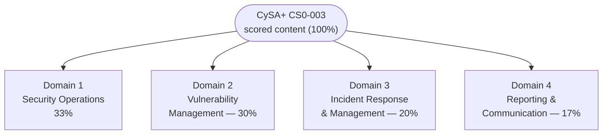

# CySA+ (CS0-003) Exam Format and Objectives

This page explains how the CompTIA **CySA+ (Cybersecurity Analyst, exam CS0-003)** is
structured — question count and types, duration, and scoring — and lays out the **four exam
domains and their weightings**. It also explains what performance-based questions are, notes
renewal, and explains how to download CompTIA's official exam objectives. Figures that change
between exam versions are flagged so you verify them on CompTIA before relying on them.

> **Verify volatile details.** The verified facts below come from CompTIA's official CySA+
> page. CompTIA rotates exam codes roughly every three years and revises price and renewal
> terms, so re-check anything marked **"verify on CompTIA"**:
> <https://www.comptia.org/en-us/certifications/cybersecurity-analyst/>

## Learning objectives

- State the verified CySA+ exam format: question count, types, duration, and scoring.
- Explain what performance-based questions (PBQs) are and why they reward hands-on practice.
- List the four CS0-003 domains and their published weightings.
- Describe how to obtain CompTIA's official exam objectives PDF and why it is the study
  spine.
- Identify which details are version-sensitive and must be verified on CompTIA.

## Exam format at a glance

| Item | Detail | Note |
| --- | --- | --- |
| Exam code | **CS0-003** | CompTIA rotates codes ~every 3 years, so a future revision is plausible — *verify on CompTIA* |
| Number of questions | **Maximum 85** | The cap is 85; some forms present fewer |
| Question types | **Multiple-choice questions (MCQ)** + **performance-based questions (PBQs)** | See PBQ section below |
| Duration | **165 minutes** | CompTIA official page |
| Passing score | **750** on a scale of **100–900** | This is a *scaled* score, not a raw percentage |
| Level | **Intermediate**, **vendor-neutral**, **defensive (blue-team / analyst)** | Sits above Security+ |
| Recommended experience | **CompTIA Security+** and **~4 years** hands-on incident-response / analyst experience | Recommended, **not required** *(verify on CompTIA)* |
| Price / renewal (CEUs) | **Not quoted here — verify on CompTIA** | Omitted to avoid stale figures |

> The **750 / 100–900** scale is a scaled score, not "750 out of 900 = 83%." CompTIA does
> not publish a fixed percentage of questions you must answer correctly; the raw-to-scaled
> mapping is not disclosed. Treat any flat "you need X%" claim from third-party sites with
> suspicion.

## What are performance-based questions (PBQs)?

**Performance-based questions (PBQs)** are interactive tasks that ask you to **do** something
rather than pick an answer — for example, **analyzing log or packet-capture output**,
**triaging and prioritizing vulnerability-scan results**, **matching indicators to attack
types**, **ordering incident-response steps**, or interpreting SIEM alerts. They simulate
the realistic, hands-on work of a SOC analyst, which is exactly what CySA+ certifies.

Key points for planning:

- PBQs typically appear **at the start** of the exam and are usually the most time-consuming
  items. A common strategy is to **flag and skip** difficult PBQs, complete the
  multiple-choice questions, then return to the PBQs with the remaining time. *(Verify
  whether the current exam delivery permits skipping/returning — CompTIA's interface and
  rules can change.)*
- They are **why hands-on familiarity matters most for CySA+.** An analyst who has actually
  read logs, run a vulnerability scanner, and triaged alerts has a real advantage. The exact
  number of PBQs on any given form is **not published by CompTIA** — do not rely on a
  specific count.

## The four domains and their weightings

CS0-003 is organised into **four domains**. CompTIA publishes the following weightings (the
percentage of scored content each domain contributes) *(verify on CompTIA — weightings change
per exam version)*:

| # | Domain | Weight |
| --- | --- | --- |
| 1 | [Security Operations](../domains/01-security-operations.md) | **33%** |
| 2 | [Vulnerability Management](../domains/02-vulnerability-management.md) | **30%** |
| 3 | [Incident Response and Management](../domains/03-incident-response-and-management.md) | **20%** |
| 4 | [Reporting and Communication](../domains/04-reporting-and-communication.md) | **17%** |

Two takeaways from the weightings:

- **Security Operations (33%)** is the single largest domain — analyzing indicators of
  malicious activity, the tooling to find them, and threat intelligence/hunting. This is the
  core analyst skill set and where most of your study time should go.
- **Security Operations + Vulnerability Management together are ~63%** of the exam, so the
  bulk of CySA+ is *technical detection and remediation work*. Incident Response (20%) and
  Reporting & Communication (17%) cover the **process and the people side** — handling an
  incident end to end and communicating it — and together still make up over a third of the
  exam.

See [../domains/README.md](../domains/README.md) for the full domain index and the
per-domain pages.

## How to get the official exam objectives

CompTIA publishes a free, downloadable **exam objectives** document (often called the
"objectives PDF" or "exam blueprint") for CS0-003. It is the **authoritative, comprehensive
list** of every topic, term, and acronym that can appear on the exam, broken down by domain
and sub-objective. It is the single most important study artefact.

To obtain it:

1. Go to the official CompTIA CySA+ page:
   <https://www.comptia.org/en-us/certifications/cybersecurity-analyst/> *(verify — the page
   layout changes)*.
2. Look for **"Download the exam objectives"** (CompTIA may ask for an email address).
3. Confirm the document is for **CS0-003** — older objectives (e.g., CS0-002) cover a retired
   exam and differ.

The domain pages in this hub are written **to the CS0-003 objectives**, but the objectives
PDF is the canonical checklist — use it to track coverage and to confirm exact wording,
because CompTIA can issue minor revisions.

## Renewal and continuing education (CEUs) *(verify on CompTIA)*

CySA+ is **not permanent**; it must be maintained. CompTIA certifications are renewed through
the **Continuing Education (CE) program**, primarily by earning **Continuing Education Units
(CEUs)** over a fixed validity period (for example, by completing training, earning a
higher-level certification, or other approved activities).

- The **exact validity period, the number of CEUs required, and any renewal fee are not
  quoted here** — these terms change and must be confirmed on CompTIA's Continuing Education
  page. **Verify on CompTIA.**
- Earning a higher CompTIA certification (e.g. CASP+/SecurityX) can also renew CySA+
  automatically under the CE program *(verify current rules)*.

## Where to go next

- [what-is-cysa-plus.md](./what-is-cysa-plus.md) — what the credential is and where it sits.
- [../domains/README.md](../domains/README.md) — the four domain pages written to the CS0-003
  objectives.
- [../../security-plus/00-overview/exam-and-objectives.md](../../security-plus/00-overview/exam-and-objectives.md)
  — the equivalent exam page for the foundational Security+ sibling.
- [../../reference/README.md](../../reference/README.md) — repo-wide glossary, acronyms, and
  standards.

## Sources

- CompTIA — CySA+ (CS0-003) official certification page (max 85 questions, MCQ + PBQ, 165
  minutes, 750 on a 100–900 scale, four domains and weightings, recommended experience):
  <https://www.comptia.org/en-us/certifications/cybersecurity-analyst/>
- CompTIA — CySA+ exam objectives (CS0-003) download (authoritative topic blueprint):
  <https://www.comptia.org/en-us/certifications/cybersecurity-analyst/>
- CompTIA — Continuing Education (CE) program / CEU renewal terms (validity period, CEU
  count, fees — verify; not quoted here): <https://www.comptia.org/continuing-education>
- Verified ground truth for this hub: CS0-003 — max 85 questions (MCQ + PBQ); 165 minutes;
  passing 750 on 100–900; four domains with weights 33 / 30 / 20 / 17 percent.
- All volatile specifics (exam code, retirement date, price, languages, CEU renewal terms)
  are version-sensitive — *verify on CompTIA*.
