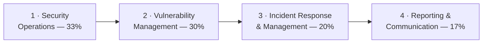

# 🔵 CompTIA CySA+ — Study Hub

### A source-grounded study hub for **CompTIA CySA+ (CS0-003)**

*Concepts, real diagrams, and exam prep* — the **vendor-neutral, defensive (blue-team / SOC
analyst)** certification for detection, threat hunting, and incident response.

---

> [!NOTE]
> **Unofficial & no fabrication.** Not affiliated with or endorsed by CompTIA. Exam specifics
> are from CompTIA's official CySA+ page; volatile items (price, exam code, CEU renewal) should
> be re-checked there — codes rotate ~every 3 years. Compiled **2026-06-20**.

## 📋 At a glance

| Item | Detail |
|------|--------|
| **Exam** | CS0-003 *(verify — codes rotate)* |
| **Format** | Max **85 questions** — multiple-choice + **performance-based (PBQ)** |
| **Duration / pass** | **165 minutes** · **750** on a 100–900 scale |
| **Level / focus** | Intermediate, **vendor-neutral**, **defensive** (SOC analyst / detection & response) |
| **Recommended** | Security+ and ~4 years hands-on experience *(not required)* |

Full details: **[exam & objectives](00-overview/exam-and-objectives.md)**.

## 🗺️ The four domains

| # | Domain | Weight | Page |
|---|--------|--------|------|
| 1 | Security Operations | 33% | [01-security-operations.md](domains/01-security-operations.md) |
| 2 | Vulnerability Management | 30% | [02-vulnerability-management.md](domains/02-vulnerability-management.md) |
| 3 | Incident Response and Management | 20% | [03-incident-response-and-management.md](domains/03-incident-response-and-management.md) |
| 4 | Reporting and Communication | 17% | [04-reporting-and-communication.md](domains/04-reporting-and-communication.md) |

## 📦 What's inside

| Section | Contents |
|---------|----------|
| **[Overview](00-overview/what-is-cysa-plus.md)** | [What is CySA+](00-overview/what-is-cysa-plus.md) · [Exam & objectives](00-overview/exam-and-objectives.md) |
| **[The 4 domains](domains/README.md)** | SOC operations, vulnerability management, incident response, reporting — taught to the CS0-003 objectives |
| **[Exam prep](exam-prep/study-plan.md)** | [Study plan](exam-prep/study-plan.md) · [Practice questions](exam-prep/practice-questions.md) |
| **[Reference](reference/glossary.md)** | [Glossary](reference/glossary.md) (SOC / blue-team terms) — acronyms cross-link the [Security+ list](../security-plus/reference/acronyms.md) |

## 🧭 Where it fits

CySA+ is the **detection-and-response** analyst credential — the blue-team counterpart to the
offensive [CEH](../ceh/README.md) and [PenTest+](../pentest-plus/README.md) hubs, and a natural
step **after** [Security+](../security-plus/README.md).

- **Operationalizes** the monitoring, SIEM, and incident-response topics from
  [Security+ Domain 4](../security-plus/domains/04-security-operations.md).
- **Pairs with** the [attack → defense matrix](../attack-to-defense-matrix.md): CySA+ is the
  defender reading the telemetry the attacks generate.
- **Connects to PAM** — privileged-session monitoring and audit ([WALLIX deep dives](../wallix/deep-dives/session-management.md)) feed SOC detection.

## 🔗 Quick links

- 🎓 [CompTIA CySA+ (official)](https://www.comptia.org/en-us/certifications/cybersecurity-analyst/)
- 🧠 [Glossary](reference/glossary.md) · [Security+ acronyms](../security-plus/reference/acronyms.md)
- 🧪 [The 4 domains](domains/README.md)

> CompTIA and CySA+ are trademarks of CompTIA, used here for identification and educational
> purposes only.
