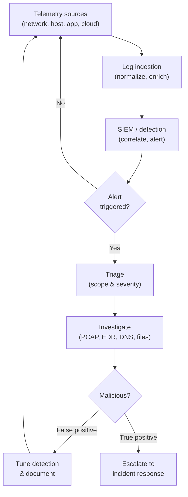
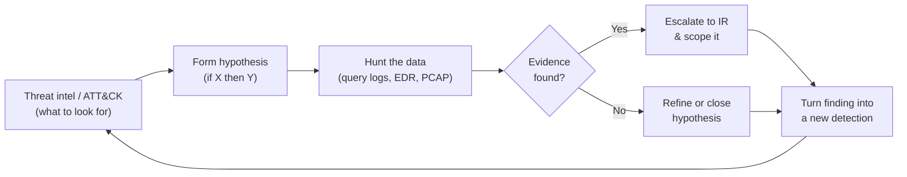

# Domain 1 — Security Operations

This is the first and **largest** of the four domains in the **CompTIA CySA+ (Cybersecurity
Analyst, exam CS0-003)** exam, accounting for roughly **33%** of the scored questions. It is
the heart of the **Security Operations Center (SOC)** analyst's day job: knowing the
**system and network architecture** you defend, **analyzing indicators of potentially
malicious activity** across the network, hosts, and applications, wielding the **tools and
techniques** that surface that activity, applying **threat intelligence and threat hunting**
to get ahead of attackers, and **improving the efficiency** of security operations through
standardization and automation. Coming from a system-administration background, you already
generate and read much of the telemetry this domain analyzes; CySA+ reframes it as the raw
material of detection and response.

> **Note on objective numbering.** CompTIA organizes CS0-003 Domain 1 into numbered
> objectives. This page is organized by *topic area* to match those objectives faithfully; it
> describes the objective topics rather than reproducing CompTIA's sub-numbering verbatim.
> Always confirm the current breakdown against the official **CompTIA CS0-003 Exam
> Objectives** PDF (linked in Sources).

## Learning objectives

After working through this page you should be able to:

- Explain the **system and network architecture** an analyst monitors: **log ingestion**;
  operating-system, process, and hardware concepts; **network architecture, segmentation, and
  Zero Trust**; **identity and access management (IAM)**; **encryption**; and **sensitive-data
  protection**.
- **Analyze indicators of potentially malicious activity** and classify them as
  **network-related**, **host-related**, or **application-related**.
- Select the right **tools and techniques** to determine whether activity is malicious —
  **packet capture**, **logs/SIEM**, **endpoint/EDR**, **DNS/whois**, **file analysis**, and
  **sandboxing**.
- Apply **threat intelligence** and run **threat hunting**: cyber threat intelligence (CTI),
  threat actors and their **tactics, techniques, and procedures (TTPs)**, **MITRE ATT&CK**,
  **indicators of compromise/attack (IoC/IoA)**, **hunting hypotheses**, **OSINT**, and
  **information-sharing communities (ISAC)**.
- Improve **efficiency and process** in security operations: standardize processes,
  streamline operations, apply **automation/SOAR**, integrate technologies, and work toward a
  **single pane of glass**.

---

## 1. System and network architecture concepts in operations

An analyst cannot tell *abnormal* from *normal* without knowing the architecture being
defended. CySA+ expects you to understand the moving parts that generate telemetry and shape
where an attacker can go.

### Log ingestion

**Log ingestion** is the pipeline that collects telemetry from across the estate and lands it
where analysts can search it — typically a **Security Information and Event Management (SIEM)**
platform. Concepts CompTIA stresses:

| Concept | What it means for the analyst |
| --- | --- |
| **Time synchronization** | Hosts must share a clock (e.g. **NTP**) so events across sources can be correlated into one timeline. |
| **Logging levels** | The verbosity captured (debug → informational → warning → error → critical); too low hides attacks, too high buries them. |
| **Log aggregation & normalization** | Collecting many formats and mapping them to common fields so a single query spans firewalls, hosts, and apps. |
| **Parsing & enrichment** | Adding context (geo-IP, asset owner, threat-intel tags) so a raw line becomes an actionable event. |

> A sysadmin's habit of centralizing logs (syslog, the Windows Event Forwarding) *is* the
> first half of detection engineering. CySA+ adds the analyst's question: *can I correlate and
> alert on what I collect?*

### Operating system, process, and hardware concepts

To judge host activity you must know what *healthy* looks like:

- **OS concepts** — the **Windows Registry**, system processes and services, scheduled
  tasks/cron, file systems and permissions, and the **boot process** are all places attackers
  hide persistence.
- **Processes** — legitimate parent/child relationships (e.g. which process *should* spawn a
  shell). Anomalies here are core host indicators (see §2).
- **Hardware architecture** — the **Trusted Platform Module (TPM)**, **Unified Extensible
  Firmware Interface (UEFI)**/Secure Boot, and **hardware root of trust** establish whether a
  machine booted into a trustworthy state.

### Network architecture, segmentation, and Zero Trust

- **Segmentation** divides the network into zones so a compromise in one cannot freely reach
  others — it both **limits blast radius** and **creates chokepoints** where an analyst can
  monitor traffic. **Microsegmentation** takes this down to the workload level.
- **Zero Trust** ("never trust, always verify") removes implicit trust from the network
  location: every request is authenticated and authorized continuously. For an analyst it
  means **more identity-anchored telemetry** and clearer policy-enforcement points to monitor.
  The foundations of Zero Trust (control plane vs. data plane, policy engine/administrator/
  enforcement point) are covered in
  [Security+ Domain 1](../../security-plus/domains/01-general-security-concepts.md#5-zero-trust);
  the PAM angle is in
  [Core Concepts: Least Privilege, JIT & Zero Trust](../../foundations/core-concepts-least-privilege-jit-zero-trust.md).
- **Software-defined networking (SDN)**, cloud **security groups**, and **on-prem vs. cloud
  vs. hybrid** placement all change where logs come from and where you can capture traffic.

### Identity and access management (IAM)

Identity is the new perimeter, and most modern intrusions ride **valid credentials**. An
analyst must understand:

- **Authentication, Authorization, Accounting (AAA)**, **multi-factor authentication (MFA)**,
  **single sign-on (SSO)**, and **federation**.
- **Privileged access management (PAM)** — controlling, vaulting, and recording privileged
  sessions; privileged-account misuse is one of the highest-value things a SOC hunts (see
  [the PAM threat landscape](../../foundations/pam-threat-landscape.md)).
- The protocols that carry identity, covered in depth in this repo:
  [Kerberos](../../protocols/kerberos.md), [LDAP / Active Directory](../../protocols/active-directory.md),
  [SAML](../../protocols/saml.md), [OIDC/OAuth2](../../protocols/oidc-oauth2.md), and
  [RADIUS](../../protocols/radius.md). Attacks against them (e.g. Kerberoasting, abuse of SAML
  tokens) leave distinctive log signatures.

### Encryption and sensitive-data protection

- **Encryption** in transit (**TLS**, IPsec, [SSH](../../protocols/ssh.md)) and at rest
  protects confidentiality — but also **blinds the analyst**, so the SOC must plan for
  **decryption/inspection points** or rely on metadata.
- **Sensitive-data protection** — **data loss prevention (DLP)**, classification, **data
  masking/tokenization**, and monitoring for **personally identifiable information (PII)**,
  **protected health information (PHI)**, and cardholder data leaving the environment.

---

## 2. Analyze indicators of potentially malicious activity

The analyst's central skill is reading telemetry and deciding **benign, suspicious, or
malicious**. CompTIA groups indicators into three families.

### Network-related indicators

| Indicator | What it suggests |
| --- | --- |
| **Bandwidth/traffic spikes** | Possible exfiltration, **distributed denial-of-service (DDoS)**, or staging. |
| **Beaconing** | Regular, periodic callbacks to a host — classic **command-and-control (C2)**. |
| **Irregular peer-to-peer / unexpected ports** | Lateral movement, tunneling, or rogue services. |
| **Rogue devices / unusual DNS** | Unmanaged assets; DNS to newly-registered or algorithmically-generated domains (DGA). |
| **Activity on non-standard ports** | Evasion — a protocol running where it should not. |

### Host-related indicators

| Indicator | What it suggests |
| --- | --- |
| **High/abnormal resource consumption** | Cryptomining, ransomware encryption, or a runaway implant. |
| **Unauthorized changes / software** | Persistence, backdoors, or unapproved tools. |
| **Suspicious processes / parent-child chains** | E.g. a document app spawning a shell — likely code execution. |
| **Unusual registry/scheduled-task entries** | Persistence mechanisms. |
| **Account anomalies** | New privileged accounts, impossible-travel logins, off-hours access. |

### Application-related indicators

| Indicator | What it suggests |
| --- | --- |
| **Anomalous activity / new accounts** | Application abuse or compromise. |
| **Unexpected output / errors** | Injection attempts (SQL, command), fuzzing, or exploitation. |
| **Service interruption / introduction of new artifacts** | Web shells, defacement, or tampering. |
| **Unusual outbound connections from an app server** | The app reaching attacker infrastructure. |

These map directly to the attacker techniques taught defensively in the
[CEH hub](../../ceh/domains/01-introduction-to-ethical-hacking.md) — each indicator is the
*footprint* of an attack step. The
[attack-to-defense matrix](../../attack-to-defense-matrix.md) ties specific attacks to the
controls and signals that catch them.

---

## 3. Tools and techniques to determine malicious activity

Knowing *what* an indicator means is only useful if you can *find and confirm* it. CySA+
expects familiarity with categories of tooling (vendor-neutral) and what each is good for.

| Technique / tool category | Purpose | Common examples (illustrative) |
| --- | --- | --- |
| **Packet capture** | Inspect raw traffic to confirm C2, exfil, or protocol abuse. | tcpdump, Wireshark |
| **Logs & SIEM** | Aggregate, correlate, and alert across sources. | SIEM platforms; log queries |
| **Endpoint / EDR** | Deep host visibility — processes, files, memory, response actions. | **Endpoint detection and response (EDR)** agents |
| **DNS & whois / reputation** | Investigate domains/IPs — age, owner, reputation, resolution. | nslookup/dig, whois, threat-intel lookups |
| **File analysis** | Examine suspect files — hashes, strings, type, metadata. | hashing (SHA-256), `strings`, `file`, hash reputation |
| **Email analysis** | Inspect headers, links, and attachments for phishing. | header parsing, URL/attachment detonation |
| **Sandboxing** | Detonate a sample in isolation to observe behavior safely. | automated malware sandboxes |

> **Defensive discipline.** This hub treats tooling **conceptually and defensively** — when
> to reach for packet capture vs. EDR, how to read the output — never as weaponized how-tos.
> Any active testing belongs in an authorized lab under written authorization.

A typical **SOC monitoring and analysis flow** ties these together:

(The handoff at the bottom feeds
[Domain 3 — Incident Response and Management](03-incident-response-and-management.md).)

---

## 4. Threat intelligence and threat hunting

Detection is reactive; **threat intelligence** and **threat hunting** make the SOC proactive.

### Cyber threat intelligence (CTI)

**Cyber threat intelligence (CTI)** is curated, contextualized information about adversaries —
who they are, what they target, and how they operate — used to inform detection and defense.
CompTIA distinguishes:

- **Strategic** (long-term, risk-and-trend level for leadership), **operational** (campaigns
  and adversary intent), and **tactical** (specific TTPs and IoCs the SOC can action).
- **Sources:** open-source intelligence (**OSINT**), commercial feeds, government advisories,
  and **information sharing and analysis centers (ISACs)** — sector-specific communities that
  share threat data among members.
- **Confidence levels** and **timeliness/relevance** — intel must be scored and aged, not
  trusted blindly.

### Threat actors and TTPs

Understand **threat-actor types** — nation-state/**advanced persistent threat (APT)**,
organized crime, hacktivists, insiders — and their motivations. **Tactics, techniques, and
procedures (TTPs)** describe *how* an actor operates at increasing levels of detail.

### MITRE ATT&CK, IoC vs. IoA

- **MITRE ATT&CK** is a curated knowledge base of adversary **tactics and techniques** based
  on real-world observation. Analysts use it to **map detections to technique coverage**,
  describe an intrusion in shared language, and find gaps. (See also the
  [attack-to-defense matrix](../../attack-to-defense-matrix.md), which maps techniques to
  PAM/WALLIX controls.)
- **Indicator of compromise (IoC)** — evidence an intrusion *has occurred* (a malicious hash,
  IP, domain, or registry key). **Indicator of attack (IoA)** — behavior suggesting an attack
  is *in progress* (the *actions*, not the artifacts). IoAs are harder to evade because they
  describe technique, not a swappable artifact.

### Threat hunting

**Threat hunting** is the **hypothesis-driven**, proactive search for adversaries that have
evaded automated detection. A hunt starts from a hypothesis — often derived from CTI or an
ATT&CK technique ("if an actor used technique X, we'd see Y in our logs") — then tests it
against the data.

The loop's payoff: every hunt, whether it finds something or not, should **harden detection** —
a successful hunt becomes a new automated rule so the same threat is caught next time.

---

## 5. Efficiency and process improvement in security operations

A SOC drowns without process. CySA+ expects you to recognize how to make operations faster and
more consistent — a major theme given alert volumes.

| Lever | What it does |
| --- | --- |
| **Standardize processes** | Document repeatable workflows so any analyst handles an alert the same way (e.g. **playbooks**, **runbooks**). |
| **Streamline operations** | Remove low-value manual steps; reduce alert fatigue and **mean time to detect/respond (MTTD/MTTR)**. |
| **Automation & orchestration (SOAR)** | **Security orchestration, automation, and response (SOAR)** auto-executes playbooks — enrich, triage, contain — at machine speed. |
| **Technology / tool integration** | Connect SIEM, EDR, ticketing, and threat-intel via **APIs** so data and actions flow without copy-paste. |
| **Single pane of glass** | One consolidated console/view so analysts aren't switching between many tools to investigate. |

> **Where automation fits:** automate the **repetitive and deterministic** (enrichment,
> known-bad blocking, ticket creation) and keep **human judgment** for scoping, analysis, and
> decisions. The goal is to free analyst time for hunting and investigation, not to remove the
> analyst. This connects to the operations discipline surveyed in
> [Security+ Domain 4 — Security Operations](../../security-plus/domains/04-security-operations.md).

---

## Exam tips

- Domain 1 is **33% — the biggest single domain**. The two heaviest sub-areas are
  **analyzing indicators** and **tools/techniques** — be fluent in matching an indicator
  (beaconing, suspicious parent-child process, anomalous outbound connection) to its likely
  cause.
- **Classify indicators** correctly: **network** (traffic, beaconing, DNS), **host**
  (processes, registry, resource use, accounts), **application** (errors, new artifacts,
  anomalous output). PBQs love giving you log/output and asking you to categorize and
  conclude.
- **IoC vs. IoA:** IoC = an **artifact** that something happened (hash/IP/domain); IoA = a
  **behavior** showing an attack in progress. IoAs survive artifact changes.
- **MITRE ATT&CK = tactics and techniques** from real-world observation; use it to map
  coverage and describe intrusions — don't confuse it with the **Cyber Kill Chain** or the
  **Diamond Model** (those appear in Domain 3).
- **Threat hunting is hypothesis-driven and proactive** — it looks for what automated
  detection *missed*; every hunt should produce a new detection.
- **SOAR automates playbooks; SIEM correlates and alerts; EDR gives host depth.** Know which
  tool you reach for: PCAP to confirm traffic, EDR to inspect a host, sandbox to detonate a
  file, whois/DNS to investigate infrastructure.
- **Log ingestion fundamentals:** time synchronization (NTP) and normalization are what make
  cross-source correlation possible — a favorite "why didn't the correlation work?" angle.
- **Efficiency terms:** standardization → playbooks/runbooks; **single pane of glass** =
  consolidated view; integration via APIs; automation cuts **MTTD/MTTR**.

---

## Sources

- CompTIA — CySA+ (CS0-003) certification page and exam objectives (Domain 1 — Security
  Operations, ~33%): <https://www.comptia.org/en-us/certifications/cybersecurity-analyst/>
- MITRE ATT&CK — adversary tactics and techniques knowledge base:
  <https://attack.mitre.org/>
- NIST SP 800-207 — *Zero Trust Architecture* (segmentation, control/data plane):
  <https://csrc.nist.gov/pubs/sp/800/207/final>
- NIST SP 800-92 — *Guide to Computer Security Log Management* (log ingestion, aggregation,
  retention): <https://csrc.nist.gov/pubs/sp/800/92/final>
- NIST SP 800-150 — *Guide to Cyber Threat Information Sharing* (CTI, ISACs):
  <https://csrc.nist.gov/pubs/sp/800/150/final>
- FIRST — Cyber Threat Intelligence resources and best practices:
  <https://www.first.org/global/sigs/cti/>
- Related in this repo: [../../protocols/README.md](../../protocols/README.md) ·
  [../../ceh/domains/01-introduction-to-ethical-hacking.md](../../ceh/domains/01-introduction-to-ethical-hacking.md) ·
  [../../foundations/pam-threat-landscape.md](../../foundations/pam-threat-landscape.md) ·
  [../../attack-to-defense-matrix.md](../../attack-to-defense-matrix.md) ·
  [../../security-plus/domains/04-security-operations.md](../../security-plus/domains/04-security-operations.md)
- Verify all volatile specifics (exam code, domain weighting) on CompTIA's site — programs
  change.

---

*Related: [Domain 2 — Vulnerability Management](02-vulnerability-management.md) ·
[Domain 3 — Incident Response and Management](03-incident-response-and-management.md) ·
[Domain 4 — Reporting and Communication](04-reporting-and-communication.md) ·
[Exam & objectives](../00-overview/exam-and-objectives.md)*
