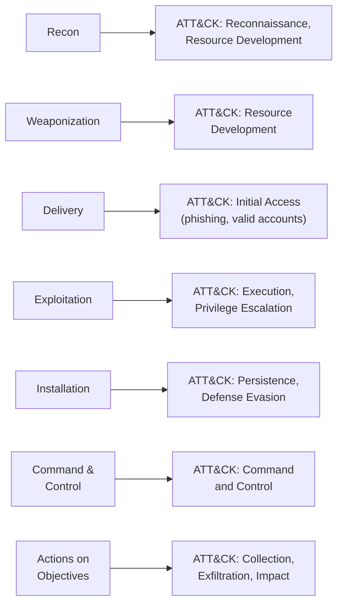
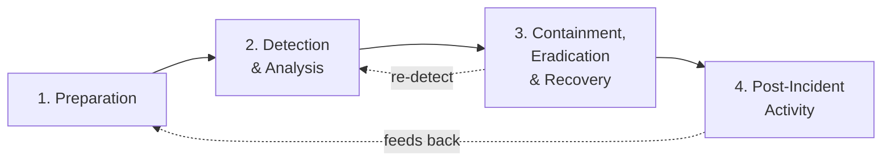

# Domain 3 — Incident Response and Management

This domain is about **20%** of the **CompTIA Cybersecurity Analyst (CySA+) CS0-003** exam. It is where the analyst stops watching and starts *acting*: an alert fires, and you must decide whether it is an incident, scope how far it has spread, contain it before it grows, remove the adversary, restore the business, and capture what you learned so it does not happen again. CompTIA grounds this in the industry-standard process from **NIST SP 800-61** (the *Computer Security Incident Handling Guide*) and pairs it with the **attack-methodology frameworks** that help you reason about an adversary's moves. For a system administrator joining a Security Operations Center (SOC), this is the on-call playbook: calm, ordered, evidence-aware response under pressure. The Security+ companion, [Domain 4 — Security Operations](../../security-plus/domains/04-security-operations.md), covers the surrounding monitoring and tooling.

> **Note on objective numbering.** CompTIA groups this domain into objectives 3.1–3.3. This page follows those topic areas faithfully without reproducing CompTIA's numbering verbatim — confirm the exact breakdown against the official **CS0-003 Exam Objectives** (Sources). The NIST phase names below are quoted from SP 800-61; nothing here is invented.

## Learning objectives

After working through this page you should be able to:

- Explain the **attack-methodology frameworks** — Cyber Kill Chain, Diamond Model, MITRE ATT&CK, OWASP — and map one to another.
- Walk the **NIST SP 800-61 incident-response life cycle**: preparation; detection & analysis; containment, eradication & recovery; post-incident activity.
- Perform **incident management** tasks: detection and analysis, evidence acquisition, data and log analysis, scope and impact determination, and severity/prioritization.
- Generate **indicators of compromise (IoCs)** and conduct **root-cause** and **lessons-learned** review after an incident.

---

## 1. Attack-methodology frameworks

Before you can respond, you need a mental model of how attacks unfold. CompTIA tests four complementary frameworks — they describe the same reality from different angles.

| Framework | Shape | What it gives the responder |
|---|---|---|
| **Cyber Kill Chain** (Lockheed Martin) | **Linear**, 7 stages | A sense of *where in the attack* you are, and the earlier you break the chain the cheaper the defense. |
| **MITRE ATT&CK** | **Matrix** of tactics × techniques | A catalog of real-world **tactics** (the adversary's goal) and **techniques** (the method, each a `T####` ID) to map detections and gaps. |
| **Diamond Model** | **Four vertices** | Relates every event by **adversary, capability, infrastructure, victim** — the backbone of analytic pivoting and attribution. |
| **OWASP** | Web-app risk taxonomy | The **Top 10** and testing guides for classifying application-layer attacks. |

### The Cyber Kill Chain stages

1. **Reconnaissance** — research and target selection.
2. **Weaponization** — couple an exploit with a deliverable payload.
3. **Delivery** — transmit it (email, web, USB).
4. **Exploitation** — trigger the vulnerability.
5. **Installation** — drop persistence (a backdoor).
6. **Command & Control (C2)** — establish remote control.
7. **Actions on Objectives** — exfiltrate, encrypt, destroy.

### Kill Chain vs. ATT&CK

The Kill Chain is the **sequential story**; ATT&CK is the **detailed playbook** of techniques that can occur at each stage (and ATT&CK does not assume strict order). Analysts map one to the other:

The repo's [attack-to-defense matrix](../../attack-to-defense-matrix.md) maps these techniques to the controls that detect or stop them, and the offensive-engagement view is in [CEH — Engagement Methodology and Reporting](../../ceh/00-overview/engagement-methodology-and-reporting.md).

---

## 2. The NIST SP 800-61 incident-response life cycle

CompTIA aligns its IR process to **NIST SP 800-61**, which defines **four phases** in a loop (note that containment, eradication, and recovery are grouped into one phase):

### Phase 1 — Preparation

Everything you do *before* an incident: an **incident-response plan** and playbooks, a defined **CSIRT (Computer Security Incident Response Team)**, a **communication plan** and call tree, tooling (SIEM, EDR, forensic kit, out-of-band comms), training, and tabletop exercises. Preparation also means **hardening** to reduce the number of incidents in the first place.

### Phase 2 — Detection and Analysis

Recognize that something is happening and characterize it. Sources include SIEM correlation, **IDS/IPS** and EDR alerts, log anomalies, and user/third-party reports. The analyst's job here:

- **Validate** the alert (true incident vs. false positive — see [Domain 2 validation](02-vulnerability-management.md)).
- **Triage and classify** by type (malware, intrusion, data breach, denial-of-service, insider, policy violation).
- Determine **scope** (which assets/accounts/data), **impact**, and **severity** (see §3).
- Document a **timeline** and preserve evidence from the start.

### Phase 3 — Containment, Eradication, and Recovery

- **Containment** — stop the spread. **Short-term** containment (isolate a host, pull a network cable, disable an account) buys time; **long-term** containment applies temporary fixes so the business can keep running while you prepare to eradicate. Containment decisions weigh evidence preservation, service availability, and the risk of tipping off the adversary.
- **Eradication** — remove the root cause: delete malware, close the exploited vulnerability, disable compromised accounts, rebuild affected systems from known-good images.
- **Recovery** — restore systems to normal operation, validate they are clean, **monitor** closely for recurrence, and return to production in a controlled way.

### Phase 4 — Post-Incident Activity

The improvement loop, and the one analysts most often skip:

- **Lessons-learned** meeting — held promptly, blameless, asking what happened, how well we responded, and what to change.
- **Root-cause analysis (RCA)** — determine the *underlying* cause, not just the symptom, so the fix is durable.
- **IoC generation** — turn what you found (malicious hashes, domains/IPs, registry keys, behaviors) into **indicators of compromise** you push into detection tooling and share with peers/ISACs.
- **Reporting** and evidence retention per policy and regulation (covered in [Domain 4](04-reporting-and-communication.md)).
- Update the **plan, playbooks, and controls** with what you learned — closing the loop back to Preparation.

---

## 3. Incident management in practice

Beyond the named phases, CompTIA tests the analyst's hands-on management activities:

| Activity | What the analyst does |
|---|---|
| **Detection & analysis** | Correlate alerts, separate signal from noise, confirm an incident. |
| **Evidence acquisition** | Preserve data defensibly — maintain **chain of custody**, follow the **order of volatility** (capture RAM/cache before disk before archives), hash to prove integrity, work on copies. |
| **Data and log analysis** | Examine SIEM, endpoint, network, DNS, authentication, and application logs to reconstruct the attack. See [Troubleshooting & Logs](../../wallix/deep-dives/troubleshooting-and-logs.md). |
| **Scope and impact** | Identify every affected system, account, and data set, and the business consequence (downtime, data loss, regulatory exposure). |
| **Severity / prioritization** | Rank the incident using functional impact, information impact, and recoverability — drives resourcing and escalation. |

> **Order of volatility (analyst reflex):** capture the most fleeting evidence first — CPU registers/cache → RAM → network state/connections → running processes → disk → logs/archives → physical media. Acting in the wrong order destroys evidence you cannot recover.

A clear, well-managed incident produces three durable outputs: a **timeline** of what happened, a set of **IoCs** for future detection, and a **root cause** that drives lasting fixes.

---

## Exam tips

- Memorize the **NIST SP 800-61 phases**: Preparation → Detection & Analysis → **Containment, Eradication & Recovery** (one combined phase) → Post-Incident Activity. CompTIA's wording mirrors NIST.
- **Containment comes before eradication** — never wipe a box before you have contained the spread and preserved evidence. **Short-term** vs. **long-term** containment is a tested distinction.
- **Lessons learned / root-cause analysis** belong to the **post-incident** phase; **IoC generation** also happens here and feeds back into preparation/detection.
- **Cyber Kill Chain** is **linear (7 stages)**; **MITRE ATT&CK** is a **non-linear matrix** of tactics and techniques; the **Diamond Model** has **four vertices** (adversary, capability, infrastructure, victim).
- Evidence handling: maintain **chain of custody** and follow the **order of volatility** (RAM before disk). This is frequently tested.
- **Severity** is judged by functional impact, information impact, and recoverability — not just by one number.
- **Detection & Analysis** is also where you decide *whether an alert is even an incident* (true vs. false positive).

---

## Sources

- CompTIA — Cybersecurity Analyst (CySA+) CS0-003 certification and exam objectives: <https://www.comptia.org/certifications/cybersecurity-analyst>
- NIST SP 800-61 Rev. 2 — *Computer Security Incident Handling Guide*: <https://csrc.nist.gov/pubs/sp/800/61/r2/final>
- NIST SP 800-86 — *Guide to Integrating Forensic Techniques into Incident Response* (order of volatility, evidence): <https://csrc.nist.gov/pubs/sp/800/86/final>
- MITRE ATT&CK — adversary tactics and techniques: <https://attack.mitre.org/>
- Lockheed Martin — Cyber Kill Chain: <https://www.lockheedmartin.com/en-us/capabilities/cyber/cyber-kill-chain.html>
- The Diamond Model of Intrusion Analysis (Caltagirone, Pendergast, Betz): <https://www.threatintel.academy/wp-content/uploads/2020/07/diamond-model.pdf>
- OWASP Top 10 — web application security risks: <https://owasp.org/www-project-top-ten/>

---

*Related: [Domain 2 — Vulnerability Management](02-vulnerability-management.md) · [Domain 4 — Reporting & Communication](04-reporting-and-communication.md) · [Security+ — Security Operations](../../security-plus/domains/04-security-operations.md) · [CEH — Engagement Methodology & Reporting](../../ceh/00-overview/engagement-methodology-and-reporting.md) · [Troubleshooting & Logs](../../wallix/deep-dives/troubleshooting-and-logs.md) · [Attack-to-Defense Matrix](../../attack-to-defense-matrix.md) · [Acronyms](../../security-plus/reference/acronyms.md)*
