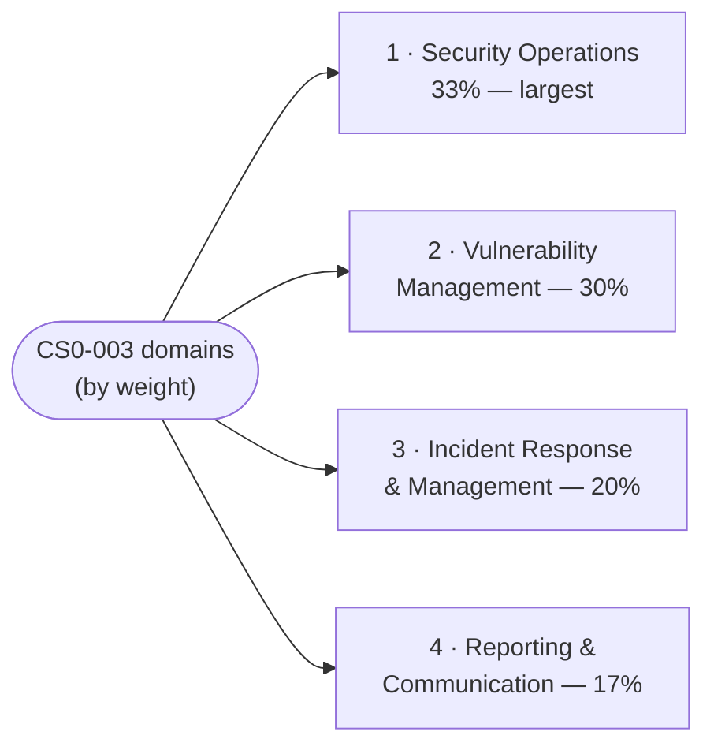

# The Four CySA+ (CS0-003) Domains

The core knowledge areas of the CompTIA **CySA+ (Cybersecurity Analyst, exam CS0-003)**.
Each page below is written **to the official CS0-003 exam objectives** and covers the
domain's concepts, Mermaid diagrams, and the key terms a sysadmin moving into a **blue-team /
SOC-analyst** role needs — with a **defensive framing** throughout. The percentages are
CompTIA's published weightings (the share of scored content per domain) *(verify on
[CompTIA](https://www.comptia.org/en-us/certifications/cybersecurity-analyst/) — weightings
change per exam version)*.

> The objectives PDF is the canonical checklist for exact wording and every listed term — see
> [how to get it](../00-overview/exam-and-objectives.md#how-to-get-the-official-exam-objectives).
> These pages follow it but do not replace it.

## Learning objectives

- Identify the four CS0-003 domains, their weightings, and their themes.
- Use the weightings to prioritise study time (Security Operations is the largest, at 33%).
- Navigate to the per-domain page written to the official objectives.

## Domain index

| # | Domain | Weight | Theme (one line) |
| --- | --- | --- | --- |
| 1 | [Security Operations](01-security-operations.md) | **33%** | System/network architecture, analyzing indicators of malicious activity, detection tooling, threat intel & hunting, SOC efficiency/SOAR |
| 2 | [Vulnerability Management](02-vulnerability-management.md) | **30%** | Scanning, scoring (CVSS), validation, prioritization, remediation, and secure-coding/attack-surface controls |
| 3 | [Incident Response and Management](03-incident-response-and-management.md) | **20%** | Attack frameworks, the IR lifecycle, detection & analysis, containment/eradication/recovery, post-incident activity |
| 4 | [Reporting and Communication](04-reporting-and-communication.md) | **17%** | Vulnerability and incident reporting, metrics/KPIs, stakeholder communication, and compliance |

## How to use these pages

- **Prioritise by weight.** Domain 1 (Security Operations, 33%) and Domain 2 (Vulnerability
  Management, 30%) together are ~63% of the exam — the technical detection-and-remediation
  core. Start there. Domains 3 and 4 cover the **process and people** side (running an
  incident, reporting it) and together are still over a third of the exam, so do not skip
  them.
- **Pair with the objectives PDF.** Track each sub-objective against the official list; these
  pages are written to those objectives but the PDF is the authoritative checklist — see
  [exam-and-objectives.md](../00-overview/exam-and-objectives.md).
- **Cross-reference the offensive view.** Where this hub covers attacks defensively, the
  [CEH modules](../../ceh/domains/README.md) cover the same techniques from the attacker's
  side; the [attack-to-defense matrix](../../attack-to-defense-matrix.md),
  [protocols reference](../../protocols/README.md), and [repo glossary](../../reference/README.md)
  reinforce shared fundamentals.

## Where to go next

- [../00-overview/what-is-cysa-plus.md](../00-overview/what-is-cysa-plus.md) — what CySA+ is
  and where it sits.
- [../00-overview/exam-and-objectives.md](../00-overview/exam-and-objectives.md) — exam
  format, the weightings, PBQs, and the objectives PDF.
- [../../security-plus/domains/04-security-operations.md](../../security-plus/domains/04-security-operations.md)
  — the foundational Security+ operations domain CySA+ builds on.
- [../../ceh/domains/README.md](../../ceh/domains/README.md) — the offensive sibling: the same
  topics from the attacker's side.

## Sources

- CompTIA — CySA+ (CS0-003) official certification page and exam objectives (four domains and
  published weightings 33 / 30 / 20 / 17 percent):
  <https://www.comptia.org/en-us/certifications/cybersecurity-analyst/>
- Related in this repo: [../../ceh/domains/README.md](../../ceh/domains/README.md) ·
  [../../security-plus/domains/README.md](../../security-plus/domains/README.md) ·
  [../../attack-to-defense-matrix.md](../../attack-to-defense-matrix.md) ·
  [../../reference/README.md](../../reference/README.md)
- Domain weightings are version-sensitive — *verify on CompTIA* before relying on them.
