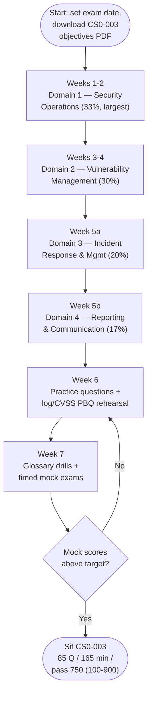

# CySA+ (CS0-003) Study Plan

An ordered route through this `cysa-plus/` hub for the **CompTIA Cybersecurity Analyst (CySA+) CS0-003** exam. It sequences the four domains by **exam weighting** — so your time lands where the points are — gives **performance-based question (PBQ)** practice tips tuned to CySA+'s analysis-heavy items, lays out **exam-day logistics**, and shows how a systems administrator moving into a **blue-team / Security Operations Center (SOC) analyst** role can lean on existing skills.

> **Time estimates below are SUGGESTIONS, not requirements.** They assume a working sysadmin studying part-time. CompTIA does not mandate a study duration — compress or stretch the plan to fit your pace, prior knowledge, and exam date. Re-check all volatile exam specifics on CompTIA: https://www.comptia.org/en-us/certifications/cybersecurity-analyst/

## Learning objectives

- Follow a **weight-prioritised** path through the four CS0-003 domain pages, front-loading Domain 1 (33%) and Domain 2 (30%).
- Allocate study time in proportion to each domain's exam weighting.
- Prepare specifically for **PBQs**, which on CySA+ are **analysis-heavy** — reading logs and Security Information and Event Management (SIEM) output, scoring vulnerabilities with the Common Vulnerability Scoring System (CVSS), and triaging alerts.
- Know the exam-day logistics: **maximum 85 questions, 165 minutes, pass = 750 on a 100–900 scale**.
- Recognise how a sysadmin's background (log reading, patching, scripting) maps onto a SOC analyst's daily work.

## How this plan is organised

Use the hub in three passes:

1. **Pass 1 — Learn (Weeks 1–5):** read each [domain page](../domains/README.md) in priority order, build SOC vocabulary, and expand every acronym on first use.
2. **Pass 2 — Practise (Week 6):** work the [practice questions](./practice-questions.md) and rehearse PBQ-style analysis hands-on (read real log excerpts, score sample Common Vulnerabilities and Exposures (CVEs) with CVSS).
3. **Pass 3 — Polish (Week 7):** drill the [glossary](../reference/glossary.md), take timed mock exams, and fix weak areas.

> **Always study against the official objectives PDF.** It is the authoritative checklist of every term and acronym for CS0-003 — download it from CompTIA and tick off coverage as you go. See [../00-overview/exam-and-objectives.md](../00-overview/exam-and-objectives.md).

## Weight-driven priority

CySA+ is heavily front-loaded: the two operational domains — **Security Operations (33%)** and **Vulnerability Management (30%)** — together make up **63%** of the exam. Spend most of your time there; give **Incident Response and Management (20%)** solid coverage; and treat **Reporting and Communication (17%)** as the domain that ties the analyst's findings to action.

| Order | Domain | Weight | Suggested study share | Why this slot |
| --- | --- | --- | --- | --- |
| 1 | [Domain 1 — Security Operations](../domains/01-security-operations.md) | **33%** | **~33%** | Largest domain and the core of SOC analysis — read first and deepest |
| 2 | [Domain 2 — Vulnerability Management](../domains/02-vulnerability-management.md) | **30%** | **~30%** | Second-largest; scanning, CVSS scoring, and prioritisation |
| 3 | [Domain 3 — Incident Response and Management](../domains/03-incident-response-and-management.md) | 20% | ~20% | The NIST-aligned lifecycle and forensics fundamentals |
| 4 | [Domain 4 — Reporting and Communication](../domains/04-reporting-and-communication.md) | 17% | ~17% | Smallest, least technical — turning analysis into clear reports and metrics |

> Domains 1 and 2 are the exam. If time is short, protect those two first — they are also the closest to a sysadmin's hands-on strengths.

## The study path at a glance

## Week-by-week milestones

### Weeks 1–2 — Domain 1: Security Operations (33%, largest) — suggested ~14–18 h
- Read [Domain 1](../domains/01-security-operations.md). This is the heart of the SOC analyst role: **system and network architecture concepts**, **log and event analysis**, **malicious-activity indicators**, **threat intelligence and threat hunting**, and the **tools** of the trade — SIEM, Endpoint Detection and Response (EDR), Security Orchestration, Automation, and Response (SOAR), and packet/protocol analysis.
- Lock down the analyst's mental models: the **Cyber Kill Chain**, **MITRE ATT&CK**, and the **Diamond Model** of intrusion analysis; **Indicators of Compromise (IoCs)** vs **Indicators of Attack (IoAs)**; and **Tactics, Techniques, and Procedures (TTPs)**.
- **Milestone:** you can read a SIEM alert or log excerpt and explain what it suggests, and map an observed behaviour to a MITRE ATT&CK technique.

### Weeks 3–4 — Domain 2: Vulnerability Management (30%) — suggested ~12–16 h
- Read [Domain 2](../domains/02-vulnerability-management.md). Cover the **vulnerability management lifecycle**, **scan types and configuration** (credentialed vs non-credentialed, agent vs agentless, active vs passive), **analysing scanner output**, and **prioritisation and remediation**.
- Get fluent with **CVSS**: the **base / temporal / environmental** metric groups, what drives a score up or down, and how **Exploit Prediction Scoring System (EPSS)** and the **CISA Known Exploited Vulnerabilities (KEV)** catalog add real-world exploitability to raw severity.
- **Milestone:** given a CVSS vector string or a scanner finding, you can reason about its severity and justify a remediation priority.

### Week 5a — Domain 3: Incident Response and Management (20%) — suggested ~8–10 h
- Read [Domain 3](../domains/03-incident-response-and-management.md). Cover **attack frameworks applied to IR**, the **incident-response lifecycle**, **detection and analysis**, **containment / eradication / recovery**, and **post-incident** activities including root-cause analysis and lessons learned. Touch on **forensics** fundamentals (evidence handling, chain of custody, order of volatility).
- **Milestone:** you can recite the NIST-aligned IR lifecycle and explain what happens in each phase.

### Week 5b — Domain 4: Reporting and Communication (17%) — suggested ~6–8 h
- Read [Domain 4](../domains/04-reporting-and-communication.md). Cover **vulnerability-management reporting** (compliance reports, action plans, metrics, stakeholder communication) and **incident-response reporting** (stakeholder identification, escalation, lessons learned, indicators of compromise sharing).
- Learn the **metrics** that matter: **Mean Time To Detect (MTTD)**, **Mean Time To Respond (MTTR)**, dwell time, and how to tailor a message to a technical vs executive audience.
- **Milestone:** you can describe what a remediation report and an incident report each contain and who reads them.

### Week 6 — Practice & PBQ rehearsal — suggested ~8–10 h
- Work the [practice questions](./practice-questions.md) domain by domain; review every miss against the relevant domain page.
- Rehearse **CySA+ PBQ-style analysis hands-on** (see tips below): read real log/SIEM excerpts, decode CVSS vectors, and order IR steps.
- **Milestone:** consistently above your target score on each domain set.

### Week 7 — Consolidation — suggested ~6–8 h
- Drill the [glossary](../reference/glossary.md) until SOC vocabulary, CVSS metric groups, frameworks, and metrics are automatic.
- Take **full-length timed mock exams** under exam conditions; re-read your two weakest domains.
- **Milestone:** you finish a full mock within 165 minutes with margin above a 750-equivalent.

## Performance-based questions (PBQ) practice tips

CySA+ PBQs are **analysis-heavy** — they reflect the analyst's day rather than a configuration screen. Expect to **read logs, SIEM alerts, or scanner output and draw a conclusion**; **decode or compare CVSS vectors**; **match observed behaviour to a framework** (MITRE ATT&CK technique, kill-chain phase); or **order incident-response steps**. They typically appear **at the start** and are the most time-consuming items.

- **Practise reading real output, not just theory.** Pull sample web-server, firewall, DNS, and authentication logs and walk them line by line. Open a SIEM's free tier or a public dataset and learn what normal vs anomalous looks like. A sysadmin who already reads logs has a genuine edge here.
- **Drill CVSS by hand.** Take a vector string such as `CVSS:3.1/AV:N/AC:L/PR:N/UI:N/S:U/C:H/I:H/A:H` and reason about each metric (Attack Vector, Attack Complexity, Privileges Required, User Interaction, Scope, Confidentiality/Integrity/Availability impact). Know *why* network + no-auth + no-user-interaction pushes a score toward critical, and how **EPSS** and the **CISA KEV** catalog change your priority even when two CVEs share a base score.
- **Know the orderings cold.** The IR lifecycle, the vulnerability-management lifecycle, and the kill-chain phases are natural drag-to-order PBQs.
- **Flag and skip first.** If the interface allows it, **flag a long analysis PBQ, clear the multiple-choice questions, then return.** Do not let one log-analysis item burn 15 minutes early. *(Verify the current interface permits skipping/returning — CompTIA's delivery can change.)*
- **Read the whole scenario before answering.** Analysis PBQs bury the deciding detail (a timestamp, a source IP, a single odd field) in the data — one missed line changes the right answer.
- **Budget time.** With **max 85 questions in 165 minutes** you average **~1.9 minutes/item** — more breathing room than Security+, but PBQs still eat several minutes each, so front-load the quick MCQs.

## Exam-day logistics

| Item | Detail |
| --- | --- |
| Exam code | **CS0-003** |
| Questions | **Maximum 85** (some forms fewer); **multiple-choice + PBQ** |
| Duration | **165 minutes** |
| Passing score | **750** on a **100–900** scale (a *scaled* score, not a flat percentage) |
| Level / focus | **Intermediate**, vendor-neutral, **defensive / SOC analyst** |
| Delivery | Testing centre or online proctoring — *verify current options on CompTIA* |
| Recommended experience | Security+ and ~3–4 years of hands-on security/IT experience (recommended, **not** required) |
| Price / renewal (Continuing Education Units, CEUs) | **Not quoted here — verify on CompTIA**; programs change |

- **The 750 / 100–900 score is scaled**, not "750 out of 900." CompTIA does not publish a fixed percentage-correct threshold — ignore third-party "you need X%" claims.
- **Pacing:** roughly 1.9 minutes per item on average. Answer every question — there is no penalty for guessing, so never leave a blank.
- **On the day:** read each question fully, watch qualifier words (*best*, *most likely*, *first*, *next*), eliminate obviously wrong options, and use the flag-and-review feature for anything uncertain.

See [../00-overview/exam-and-objectives.md](../00-overview/exam-and-objectives.md) for the full format detail and how to download the objectives PDF.

## How a sysadmin's background maps in

CySA+ rewards the operational instincts a sysadmin already has — reading logs, patching, scripting, and understanding how systems and networks actually behave. The exam mostly **reframes** that experience as analyst work.

| You already... | ...maps to CySA+ |
| --- | --- |
| Read system, web, firewall, and authentication logs to troubleshoot | Domain 1 log and event analysis; SIEM correlation |
| Patch and track vulnerabilities across a fleet | Domain 2 vulnerability-management lifecycle and remediation |
| Prioritise which fixes go first under pressure | Domain 2 CVSS / EPSS / KEV-driven prioritisation |
| Respond to outages and incidents with a runbook | Domain 3 incident-response lifecycle and playbooks/runbooks |
| Understand TCP/IP, DNS, and how services talk | Domain 1 network architecture and protocol/packet analysis |
| Write status updates and post-incident write-ups | Domain 4 reporting, metrics (MTTD/MTTR), and stakeholder communication |
| Script repetitive tasks (Bash/PowerShell/Python) | Domain 1 automation and SOAR — turning manual triage into playbooks |

- **Lean into Domains 1 and 2 for quick wins** — they are the largest domains and your strongest ground.
- **Invest deliberately in Domain 4** — clear written reporting and the right metrics are the least intuitive for a hands-on admin, and they are how analyst findings drive action.
- **Use the offensive sibling hubs** to deepen Domain 1: seeing an attack from the attacker's side (the [CEH modules](../../ceh/domains/README.md) and the [PenTest+ hub](../../pentest-plus/)) makes the defensive indicators and ATT&CK techniques memorable. The [Security+ hub](../../security-plus/) is the recommended foundation before CySA+.

## Where to go next

- [practice-questions.md](./practice-questions.md) — 45+ unofficial practice questions grouped by domain, including CVSS-reasoning and log-analysis items.
- [../reference/glossary.md](../reference/glossary.md) — CySA+ / SOC / blue-team term reference.
- [../domains/README.md](../domains/README.md) — the four domain pages, written to the objectives.
- [../00-overview/exam-and-objectives.md](../00-overview/exam-and-objectives.md) — exam format, weightings, PBQs, and the objectives PDF.
- [../../security-plus/exam-prep/study-plan.md](../../security-plus/exam-prep/study-plan.md) — the foundation-level sibling study plan.

## Sources

- CompTIA — Cybersecurity Analyst (CySA+) CS0-003 official certification page (max 85 questions, MCQ + PBQ, 165 minutes, 750 on 100–900, four domains and weightings): https://www.comptia.org/en-us/certifications/cybersecurity-analyst/
- CompTIA — CySA+ (CS0-003) exam objectives download (the authoritative study checklist): https://www.comptia.org/en-us/certifications/cybersecurity-analyst/
- NIST — SP 800-61 Computer Security Incident Handling Guide (incident-response lifecycle): https://csrc.nist.gov/pubs/sp/800/61/r2/final
- FIRST — Common Vulnerability Scoring System (CVSS) specification (base/temporal/environmental metrics): https://www.first.org/cvss/
- FIRST — Exploit Prediction Scoring System (EPSS): https://www.first.org/epss/
- CISA — Known Exploited Vulnerabilities (KEV) Catalog: https://www.cisa.gov/known-exploited-vulnerabilities-catalog
- MITRE ATT&CK — adversary tactics and techniques knowledge base: https://attack.mitre.org/
- Sibling hub pages: [../00-overview/exam-and-objectives.md](../00-overview/exam-and-objectives.md) · [../domains/README.md](../domains/README.md) · [../../security-plus/exam-prep/study-plan.md](../../security-plus/exam-prep/study-plan.md)
- Verified ground truth for this hub: CS0-003; max 85 questions (MCQ + PBQ); 165 minutes; passing 750 on a 100–900 scale; domain weights 33 / 30 / 20 / 17 percent.
- All volatile specifics (price, delivery, CEU renewal, recommended experience) are version-sensitive — *verify on CompTIA*.
