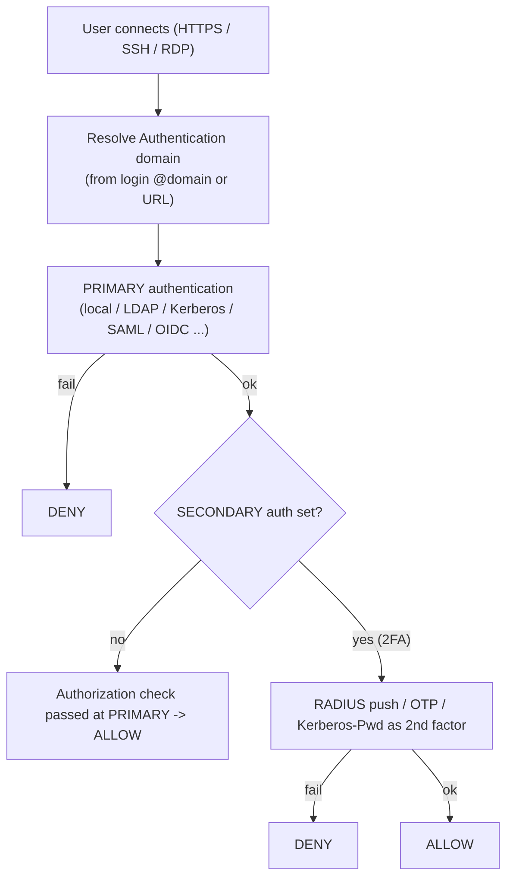
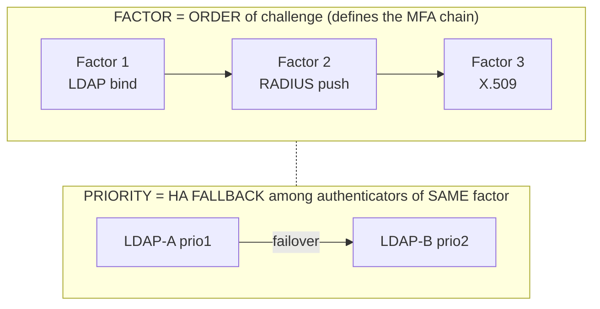
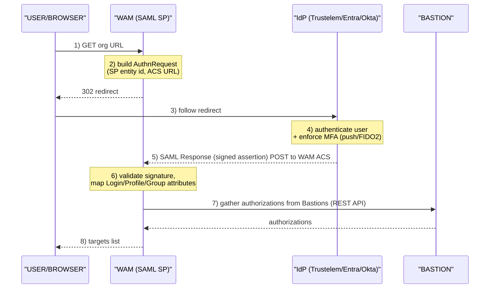

# Authentication & WALLIX Access Manager (WAM)

How users prove who they are to **WALLIX Bastion** (the PAM proxy) and to **WALLIX
Access Manager (WAM)** (the HTML5 web gateway in front of one or more Bastions), and
how WAM federates that identity out to external Identity Providers (IdPs). This is the
*primary* (Bastion / WAM) connection leg — distinct from the *secondary* leg where the
Bastion authenticates onward to the **target** (account mapping, vault account,
interactive login) covered in the [product portfolio ACL model](../docs/00-overview/product-portfolio.md#core-pam-conceptsthe-acl-data-model).

This file maps directly to **WCE-P (WALLIX Certified Expert – PAM)** Module 1 "Advanced
authentication" (Bastion: RADIUS, Kerberos explicit/transparent, X.509, SAML, 2-Factor;
Access Manager: X.509, SAML). See [wce-p-expert.md](../docs/pam-bastion/wce-p-expert.md).

**Acronyms first use:** PAM = Privileged Access Management · WAM = WALLIX Access
Manager · IdP = Identity Provider · SP = Service Provider · SAML = Security Assertion
Markup Language · OIDC = OpenID Connect · MFA = Multi-Factor Authentication · 2FA =
Two-Factor Authentication · SFA = Single-Factor Authentication · LDAP = Lightweight
Directory Access Protocol · AD = Active Directory · KDC = Key Distribution Center · CRL =
Certificate Revocation List · OCSP = Online Certificate Status Protocol · ACS = Assertion
Consumer Service · NLA = Network Level Authentication · GSS-API = Generic Security
Services Application Program Interface · TLV = Type-Length-Value · VSA = Vendor-Specific
Attribute · FQDN = Fully Qualified Domain Name. Full list: [../reference/acronyms.md](../reference/acronyms.md).

---

## Key points

- The Bastion separates **authentication** (who you are) from **authorization** (what you
  may reach). *"In WALLIX Bastion, the first authentication also assumes the authorization
  check. If there is a secondary authentication, no authorization check is performed."*
- A user identity is either **local** (stored in the Bastion) or **external** (LDAP/AD,
  or self-contained SAML/OIDC). External users are only resolved/displayed on demand for a
  given domain.
- Two construction objects: an **External authentication** (the *method* — a Kerberos,
  RADIUS, SAML, OIDC, TACACS+, X.509… definition) is created, then **linked to an
  Authentication domain** (the namespace that groups users and maps their groups to Bastion
  profiles). A domain has a **Primary** and optional **Secondary** authentication.
- Bastion supports **SFA and 2FA natively**; it does **not** configure full N-factor MFA
  itself — *"If you require more than a two-factor authentication, WALLIX recommends that
  you configure MFA directly inside your identity and access management solution."* True
  MFA arrives via the IdP (Entra ID, Okta, Trustelem…) over SAML/OIDC, or via RADIUS push.
- **WAM** is an HTML5 reverse-proxy gateway: it authenticates the browser user, gathers
  their authorizations from the registered Bastions via the REST API, and brokers
  RDP/SSH/Universal-Tunneling sessions over HTTPS — **no VPN, no browser plug-in**.
- WAM organises everything into **Organizations** (multi-tenancy) and uses a per-domain
  **Factor + Priority** model to chain authenticators (factor = order of challenge;
  priority = HA fallback among equivalent servers).

---

## 1. Bastion authentication building blocks

### 1.1 Network protocols vs. authentication protocols

Users reach the Bastion over three network protocols, and not every auth protocol works
on every one (Bastion Administration Guide §7.1.1 "Overview of authentication protocols"):

**Authentication protocol availability (primary leg):**

| Auth protocol | HTTPS | SSH | RDP |
|---|:---:|:---:|:---:|
| LDAP/AD bind password | ✅ | ✅ | ✅ |
| Local password | ✅ | ✅ | ✅ |
| RADIUS | ✅ | ✅ | ✅ |
| TACACS+ | ✅ | ✅ | ✅ |
| Kerberos-Password *(deprecated)* | ✅ | ✅ | ✅ |
| Kerberos Ticket (standard) | ✅ | ✅ | ✅ |
| SSH Key / SSH CA | — | ✅ | — |
| X.509 certificate | ✅ | (2) | (2) |
| SAML | ✅ | (1) | (1) |
| OIDC | ✅ | (1) | (1) |
| PingID | ✅ | ✅ | ✅ |

> **(1)** Supported but workflow not fully integrated: the user copies a provided link
> into a browser to retrieve a token, then pastes the token into the client.
> **(2)** Supported but not fully integrated: the user authenticates first over HTTPS,
> then confirms the request on the SSH/RDP client.

**One-Time Password (OTP):** once authenticated to the web interface (by *any* protocol),
a user can download an SSH/RDP connection file from **My authorizations > Sessions** that
embeds a single-use, time-limited token, letting the client identify the user without
re-typing credentials.

### 1.2 Local authentication

Local users live in the Bastion's own database. Authentication protocols available for a
local user: **Local password**, **X.509 certificate**, **SSH Key**, **RADIUS**,
**TACACS+**, **PingID** (configured under **Configuration > External authentication** then
attached to the user). The default local password policy is strict (≥16 chars, complexity,
forbidden-password and weak-pattern checks). Default super-admin = `admin` / `admin`
(delete after creating a real product administrator).

### 1.3 LDAP / Active Directory

Configured under **Configuration > External authentication > Add > Active Directory** (or
LDAP), then linked to an **Authentication domain** whose **Authentication domain name** must
match the directory/Kerberos realm. Bind methods:

- **Simple (password) bind** — login + password validated against the directory. Use
  **StartTLS or SSL** or the password crosses the network in cleartext.
- **GSS-API bind** — required for AD **Protected Users** (a security group that hardens
  against credential theft). Protected Users *can only* authenticate with **Kerberos Ticket**.
- **SSH Key (LDAP/AD)** — public keys read from a configured directory attribute; if no
  attribute is set, auth falls back to password-only. **SSH CA** is additionally available
  for LDAP/AD users.

Group membership in the directory maps to Bastion user groups (and thus profiles) via the
domain's **Mappings** tab.

### 1.4 Kerberos — explicit vs. transparent

Both modes are Kerberos, the difference is *who holds the ticket* (this is the WCE-P
"Kerberos Explicit" vs. "Kerberos Transparent" distinction):

| Mode (guide name) | WCE-P term | How it works | Status |
|---|---|---|---|
| **Kerberos-Password** | Kerberos *explicit* | User types login+password; **Bastion acts as a Kerberos client** and gets the ticket from the KDC on the user's behalf. Feels like a normal login. | **Deprecated as of v12.X** (Single-Point-of-Failure risk) — migrate to Kerberos Ticket |
| **Kerberos Ticket (standard)** | Kerberos *transparent* | The **client (browser / SSH client) already holds a Kerberos ticket** (e.g. from Windows SSO) and presents it; Bastion validates it against a **keytab**. No password typed. | Recommended |

Configuration of **Kerberos Ticket** (`Add > Kerberos`):

- **Realm name** — must equal the **Authentication domain name**, in **UPPERCASE**.
- **Key distribution center** — KDC host/IP; **port 88** by default.
- **Keytab file** — uploaded; merged with prior keytabs unless *Overwrite* is enabled. The
  *service* in the keytab dictates where Kerberos is activated:
  - **HTTP** service → Kerberos on the web interface (URL must use the `/ui` suffix:
    `https://<bastion_name>/ui`).
  - **host** service → Kerberos on the **SSH proxy** (enables forwardable tickets to reach
    a target in the same realm via account mapping).
  - **TERMSRV** service → Kerberos on the **RDP proxy** (requires **Enable NLA** under
    *Configuration > Configuration options > RDP proxy > client*).
- **Use primary domain name for 2FA** — forces `user@domain` form when Kerberos is used as
  a *second* factor after an LDAP first factor.

> Flow note: with Kerberos Ticket, *"If a Kerberos ticket is configured on the SSH client
> or web browser, WALLIX Bastion prioritizes it. However, if no Kerberos ticket is
> configured, WALLIX Bastion attempts to log in with the provided credentials."* — i.e.
> the Bastion cannot *force* exclusive ticket use; it falls back to bind password.

### 1.5 RADIUS

`Add > RADIUS`. Works for LDAP/AD users (as a **secondary** factor) or local users (as the
*only* method). Supports the **challenge-response** mechanism; RFC 2865 + RFC 8044; standard
TLV attributes only (**no VSAs**).

| Attribute | Type | Description | Example |
|---|---|---|---|
| `User-Name` | Text | primary username | `MyUser` |
| `User-Password` | String | encrypted password | `c6153abb…f9` |
| `State` | String | auth-process state (challenge) | `3732726d…` |
| `NAS-Identifier` | Text | always `WAB` | `WAB` |
| `Framed-IP-Address` | IPv4Addr | client IP | `192.168.12.2` |

Settings: server IP/FQDN, **port 1812** (default), **Timeout** 5 s (default), shared
**secret**. Two MFA-relevant toggles: **Use mobile device for 2FA** (shows a "approve the
push on your phone" message) and **Use primary domain name for 2FA**.

### 1.6 TACACS+

`Add > TACACS+` — IP/FQDN, **port 49** (default), shared **secret**. Same pairing rule as
RADIUS (secondary for LDAP/AD; only-method for local). Terminal Access Controller Access
Control System Plus.

### 1.7 X.509 client certificate (with CRL / OCSP)

Strong auth via a client certificate, **only from the GUI** — proxy users are redirected to
the GUI to validate, then continue on the proxy. The certificate can be a file imported
into the browser or held on a smart card / USB token (which must stay inserted).

Enable under **Configuration > X.509 configuration > Certificates**: toggle *Enable X.509
authentication*, upload **User CA certificate(s)** in PEM. Revocation is checked via:

- **Configuration > X509 configuration > CRL** — Certificate Revocation List.
- **Configuration > X509 configuration > OCSP** — Online Certificate Status Protocol.

Certificate-to-user matching uses Bastion **variables** (the same syntax as REST API
advanced-search filters, see [rest-api-and-automation.md](./rest-api-and-automation.md)):
`${issuer_o}`, `${issuer_cn}`, `${subject_cn}`, `${subject_ou}`, `${subject_uid}`,
`${mail}`, `${msupn}` (Microsoft UPN), `${dns}`, `${username}`. Example matching condition:

```
${issuer_o}~Company Ltd. || ${issuer_cn}~Security Cert && ${subject_ou}=Finance&Accounting
```

…and an LDAP/AD **Search filter** that uses those variables to find the matching directory
user:

```
(&(|(cn=${subject_cn})(uid=${subject_uid}))(preferredLanguage=fr))
```

To disable, untoggle the option (does **not** delete imported certs or kill live sessions);
*Reset X.509 configuration* deletes imported certs and regenerates self-signed certs.

### 1.8 SAML 2.0 (Bastion as Service Provider)

`Add > SAML`. Bastion is the **SP**; the external IdP authenticates the user and returns an
assertion carrying identity + groups. Supports **IdP-initiated** and **SP-initiated** flows.

Key configuration fields (Bastion Administration Guide §7.3.1):
- **IdP metadata** XML upload → pre-fills **IdP claim customization** (Username, Display
  name, Email, Group).
- **SP entity ID** / **SP assertion consumer service (ACS)** — exported for the IdP; the SP
  entity ID can be repointed to a **load balancer FQDN** (Bastion uses a SAML *dynamic flow*).
- **Timeout** default 900 s (from the click on the IdP button).
- **Name ID format = email address**, and the email domain must equal the authentication
  domain name.
- Domain options: **Default domain** (strips `@domain` from the login), **IdP initiated
  URL**, **Force authentication** (re-auth at the IdP even with an active session; native
  for Entra ID & Okta).
- **Mappings** tab maps an IdP group value → Bastion user group + profile (case-insensitive).

> **Critical WAM rule:** *"Only SAML Generic is compatible with WALLIX Access Manager.
> The configuration of a SAML authentication with WALLIX Access Manager means that it is
> impossible to authenticate directly to WALLIX Bastion in SAML."* The Entra ID + Graph API
> variant is **not** WAM-compatible.

### 1.9 OpenID Connect (OIDC)

`Add > OIDC`. Bastion supports **only the Authorization Code Flow**. Use OIDC **discovery**
(`…/.well-known/openid-configuration` + *Match*) to auto-fill endpoints. Provide **Client
ID** and **Client Secret**; **Grant type** and **Response type** cannot be changed; **Username**
and **Group** claim mappings are mandatory. Works in a clustered environment (auth via any
FQDN in the cluster). Domain + group mappings mirror SAML.

---

## 2. The 2FA / MFA decision model



> Note: authorization is decided at PRIMARY auth only; the secondary
> factor adds assurance but performs no authorization check.
> For >2 factors, delegate MFA to the IdP (SAML/OIDC) or RADIUS.

- **SFA** = primary only. **2FA** = primary + one secondary (RADIUS push, OTP, PingID,
  Kerberos-Password as 2nd factor).
- **More than 2 factors** is not configured in the Bastion — push it to the IdP. The
  Bastion simply inherits whatever the IdP enforces (e.g. Entra Conditional Access, Okta MFA,
  Trustelem WALLIX Authenticator push/TOTP/FIDO2).

---

## 3. WALLIX Access Manager (WAM)

WAM (Administration Guide served **v5.2.4.0**) *"provides connection services between web
browsers and targets … through Wallix Bastion appliances. The connections are done using
HTML5 clients; no browser plug-in is required."* It is the single hardened HTTPS front door
that reduces the external attack surface and lets remote/3rd-party users reach targets
without a VPN. Authorizations are **not** stored in WAM — they are gathered from the
Bastions at each login.

### 3.1 Browser → target request flow (HTML5, no VPN)

```mermaid
sequenceDiagram
    participant Browser as "BROWSER (HTML5)"
    participant WAM as "WAM (reverse proxy)<br/>/var/wab/etc/wabam"
    participant Bastion as "BASTION(s)<br/>REST API key"
    participant Target as "TARGET"
    Browser->>WAM: 1) HTTPS login
    Note over WAM: 2) authenticate user<br/>(Org domain: local/LDAP/<br/>RADIUS/SAML/OIDC/X.509/<br/>BASTION) + factors
    WAM->>Bastion: 3) GET authorizations over REST API (api_key)<br/>(per registered Bastion in Org)
    Bastion-->>WAM: authorizations
    WAM-->>Browser: 4) show "My targets"
    Browser->>WAM: 5) click a target (RDP/SSH/UT)
    WAM->>Bastion: 6) open session via Bastion proxy, stream as HTML5
    Bastion->>Target: 7) proxy to target
    Target-->>Bastion: RDP/SSH/UT proxy
    Bastion-->>WAM: RDP/SSH/UT proxy
    WAM-->>Browser: HTML5 pixels/keys
    Note over Browser,Target: session recorded on the Bastion; auditable centrally in WAM
```

There is **no inbound path from the browser to the target** — WAM speaks to the Bastion,
the Bastion speaks to the target, and the user only ever sees rendered HTML5.

> WAM session limits (Administration Guide §2): some RDP and SSH session limitations apply
> to the HTML5 client vs. a native fat client — *not specified in detail here*; consult §2.1
> / §2.2 of the WAM guide for the exact list.

### 3.2 Registering a Bastion in WAM

**Configuration > Bastions**, a Bastion is defined by:

- **Name** (1–128 chars), **Host** (the *user-service* IP/FQDN of the Bastion — distinct from
  its admin interface), **API Key** (a Bastion REST API key, shown only at creation).
- WAM supports **IPv4 and IPv6** for Bastions (unlike Bastion *HA replication*, which is
  IPv4-only — see [high-availability-and-dr.md](./high-availability-and-dr.md)).
- From **Bastion v12.1**, three API-key profiles scope WAM's access:

  | API-key profile | Grants |
  |---|---|
  | `wallix_access_manager_session_audit` *(recommended)* | session access + password checkout + approval management + session auditing |
  | `wallix_access_manager_session` | session access + password checkout + approval management |
  | `wallix_access_manager_audit` | session auditing only |

  (Before 12.1, a single key covered everything.)
- Other toggles: **Reset Bastion / SSH / RDP fingerprint**, **Strip Domain** (maps external
  WAM users to Bastion-side external users by dropping `@domain`), **Approval Time Zone**,
  and **Cluster** (see §3.5).

### 3.3 Multi-tenancy — Organizations

*"An organization is a set of users and a set of WALLIX Bastion instances. A user and a
WALLIX Bastion can belong only to a single organization."*

- **Identifier** (≤64 chars) selects the org from the URL path or FQDN:
  `https://mycompany.tld/wabam/myorg` (path) or `https://myorg.mycompany.tld/wabam` (FQDN).
- **global** organization (built-in): only its users may *create* organizations and
  administer others; **its users cannot connect to targets**.
- **default** organization: created at deploy, usable, renamable/deletable.
- Per-org **Password policy**, **Theme**, **Default Domain**, **Local Domain Name**.

### 3.4 WAM authentication domains + Factor/Priority MFA model

WAM domains (**Configuration > Domains**) of type **local**, **LDAP**, **SAML**, **OIDC**,
plus authenticators **RADIUS** and **BASTION**; X.509 cert auth can be toggled on a domain
(*Allow X509 Cert. Authentication*). The MFA engine is built from two orthogonal fields:



- **FACTOR** = order of challenge: each authenticator in the factor order must return a
  positive response, in order. All must pass -> success. Any one fails -> authentication fails.
- **PRIORITY** = HA fallback among authenticators of the same factor: priority 1 server
  queried first; if no response, the next is tried, etc. No server responds -> auth fails.
  (Same priority on several servers = load-balancing.)

- **Factor Used for Account Mapping** — which factor's credentials are reused on the
  Bastion→target account-mapping leg in an MFA flow.
- **SAML domain** name in WAM must equal the **Server domain name** of the matching Bastion
  authentication domain. WAM is the **SP**; a SAML domain may hold several IdPs (equivalent,
  for HA). **Both IdP-initiated and SP-initiated** modes supported. SP signing key/cert and
  optional message encryption are configured per IdP — but **encryption must be disabled**
  when SAML is used to authenticate *through WAM to the Bastion*.
- **OIDC** domains use the IdP's Authorization Code Flow.
- **Federated IdPs** include **WALLIX Trustelem** (WALLIX IDaaS) — which then layers
  WALLIX Authenticator push / TOTP / FIDO2 — and Entra ID, Okta, PingOne, ADFS, Shibboleth,
  TrustBuilder, etc.

### 3.5 SAML federation sequence (SP-initiated, through WAM)



IdP-initiated is the mirror: the user starts at the IdP portal, the IdP posts the assertion
to WAM's ACS, and WAM logs the user straight in (using the **IdP initiated URL**).

### 3.6 Centralized cross-Bastion audit

WAM **Audit > Session Audit** searches **current and closed** sessions across all Bastions in
the org (keyword + wildcard `*` + advanced form). Per session it shows date/time/duration,
Bastion name, user, protocol, target device, target account, status — and offers:
**View session** (live HTML5 viewer, current sessions only), **Replay session** + **Download
video** (recorded sessions only), and per-action chronological entries (if session-log
redirection is enabled on the Bastion). The audit store is **Elasticsearch-backed** (WAM
guide Chapter 16 covers Elasticsearch root-certificate management). Audit purge is
configurable; with several WAM instances, `purge.audit.active` governs which instance purges.

### 3.7 WAM logs & troubleshooting (preview)

- **Settings > Logs** (global-org admins only) sets per-module log levels; **Download Logs
  Archive (ZIP)** bundles `access.log`, `error.log`, `tech.log`. *Warning:* TRACE/ALL may
  expose passwords — switch to DEBUG before sharing with support.
- `access.log` (Apache-style) also lives at **`/var/log/wallix/wabam`**.
- Config: **`/var/wab/etc/wabam/wabam.properties`** (+ `wabam.vmoptions` for JVM heap
  `-Xmx`). Restart the Access Manager service after editing.

Full troubleshooting + log tables: [troubleshooting-and-logs.md](./troubleshooting-and-logs.md).

### 3.8 WAM high availability (preview)

Multiple WAM instances behind a load balancer (copy `crypto.install.key`, `db.connections*`,
`user.admin*` from the first instance); and **clustering a set of Bastions** inside one WAM
so a target connection routes to *"the bastion with the fewest sessions in progress."* Full
detail: [high-availability-and-dr.md](./high-availability-and-dr.md#5-load-balancing-bastions-behind-access-manager).

---

## 4. Quick reference — auth method → where configured

| Method | Bastion menu | Local users | LDAP/AD users | WAM | Notes |
|---|---|---|---|---|---|
| Local password | External auth / per user | yes | – | yes | strict policy |
| LDAP/AD bind | External auth → AD/LDAP | – | yes (primary) | yes | use StartTLS/SSL |
| Kerberos Ticket (transparent) | External auth → Kerberos | – | yes (primary) | – | KDC :88, keytab, realm UPPERCASE |
| Kerberos-Password (explicit) | External auth → Kerberos-Password | yes | yes (1st/2nd) | – | **deprecated v12.X** |
| RADIUS | External auth → RADIUS | only-method | secondary | authenticator | :1812, challenge-response, push 2FA |
| TACACS+ | External auth → TACACS+ | only-method | secondary | – | :49 |
| X.509 cert (CRL/OCSP) | X.509 configuration | yes | yes | per-domain toggle | GUI-only validation |
| SAML 2.0 | External auth → SAML | – | – (self-contained) | SAML domain + IdP | only SAML Generic w/ WAM |
| OIDC | External auth → OIDC | – | – (self-contained) | OIDC domain | Authorization Code Flow only |
| SSH Key / SSH CA | per user / AD attribute | yes | yes | – | SSH only |

---

## Sources

Primary WALLIX documentation, fetched 2026-06-17 (retry succeeded after initial size-limit
errors; PDFs downloaded and text-extracted locally):

- **WALLIX Bastion Administration Guide** — served version **12.3.2** (PDF title
  "Functional Administration Guide", 374 pp.). Auth chapters: §2 (login methods), §7
  (External sources, §7.1 overview matrix, §7.2 Directory users, §7.2.5.1–7.2.5.6 LDAP/AD
  bind/Kerberos/RADIUS/TACACS+/SSH-Key, §7.3.1 SAML 2.0, §7.3.2 OIDC, §7.5.4 X.509 + CRL/OCSP).
  https://pam.wallix.one/documentation/admin-doc/bastion_en_administration_guide.pdf
- **WALLIX Access Manager Administration Guide** — served version **5.2.4.0** (82 pp.).
  Chapters: §3 Overview, §8 Multi-tenancy/Organizations, §9 X.509, §10 Authentication domains
  (LDAP/SAML/OIDC), §11 RADIUS, §13 Bastions (registration + API-key profiles), §19 Session
  audit data, §20 Scalability & High-availability.
  https://pam.wallix.one/documentation/admin-doc/am-admin-guide_en.pdf
- **WALLIX Bastion Deployment Guide** — served version **12.0.2** (PDF title "Deployment
  Guide", 51 pp.). Used here for the external-auth port table (Kerberos 88, LDAP 389/636,
  RADIUS 1812, TACACS+ 49) and SAML IdP compatibility list.
  https://marketplace-wallix.s3.amazonaws.com/bastion_12.0.2_en_deployment_guide.pdf

Cross-references: [product portfolio](../docs/00-overview/product-portfolio.md) ·
[WCE-P expert curriculum](../docs/pam-bastion/wce-p-expert.md) ·
[acronyms](../reference/acronyms.md). The exact per-Bastion REST API endpoint catalog is
served at `https://<bastion>/api/doc/Usage.html` (not a public PDF) — see
[rest-api-and-automation.md](./rest-api-and-automation.md).
