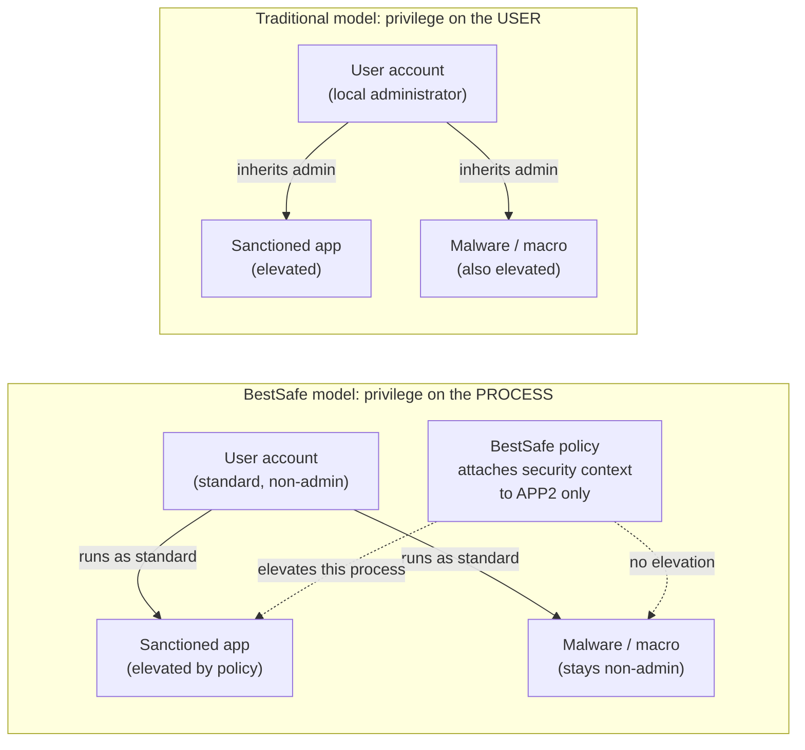
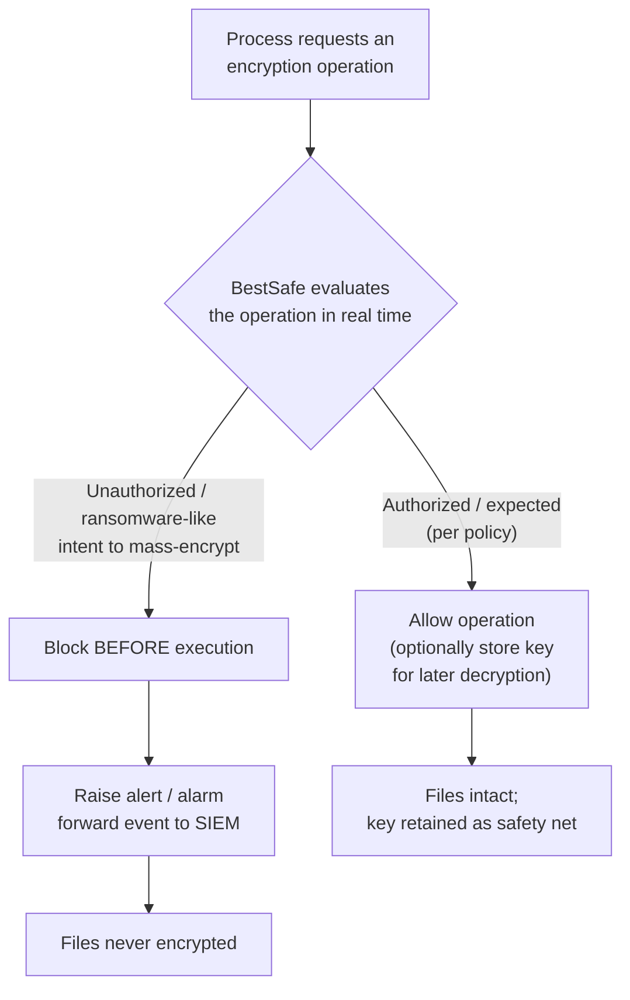
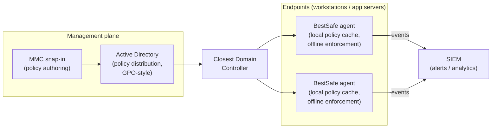
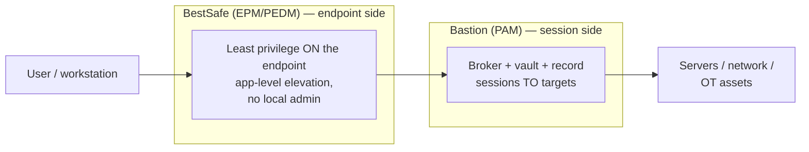

# WALLIX BestSafe — Endpoint Privilege Management (EPM) Deep Dive

**WALLIX BestSafe** is WALLIX's **Endpoint Privilege Management (EPM)** product — the
endpoint half of WALLIX's least-privilege story. Where Bastion (Privileged Access
Management, PAM) controls the *session* an administrator opens *to* a server, BestSafe
controls *what privileges run on the workstation or server itself*. Its defining idea is
unusual: instead of elevating the **user**, it elevates the **process or application**.
This page explains the problem it solves, that patented approach, its feature set and
architecture, and exactly how it complements Bastion under WALLIX's **"PAM4ALL"**
least-privilege vision.

This is the endpoint-side companion to the session-side deep dives
([session-management.md](session-management.md),
[secrets-and-password-management.md](secrets-and-password-management.md)). For where EPM
sits among the other identity disciplines, see
[../foundations/pam-iam-iga-idaas-epm.md](../foundations/pam-iam-iga-idaas-epm.md); the
authoritative product facts live in
[../docs/00-overview/product-portfolio.md](../docs/00-overview/product-portfolio.md)
(section 4).

## Learning objectives

- Define **EPM** (Endpoint Privilege Management) and **PEDM** (Privilege Elevation and
  Delegation Management), and explain why they differ from PAM.
- State the endpoint problem BestSafe solves: over-privileged users, standing local
  admin rights, and ransomware.
- Explain the **patented** BestSafe model — privilege attached to the
  **application/process**, not the user — and contrast it with traditional elevation.
- Describe BestSafe's main features: application control, real-time anti-ransomware,
  per-machine/per-day local-account password rotation.
- Describe the agent + **Active Directory (AD)**-native architecture and offline
  enforcement.
- Explain how BestSafe complements Bastion (endpoint side vs. session side) under
  **PAM4ALL**.
- Know BestSafe's **certification status** (no active product certification today).

**Acronyms first use:** EPM = Endpoint Privilege Management · PEDM = Privilege Elevation
and Delegation Management · PAM = Privileged Access Management · AD = Active Directory ·
GPO = Group Policy Object · MMC = Microsoft Management Console · DC = Domain Controller ·
UAC = User Account Control · API = Application Programming Interface · SIEM = Security
Information and Event Management · LAPS = Local Administrator Password Solution (Microsoft)
· WCP-E = WALLIX Certified Professional – EPM. Full list:
[../reference/acronyms.md](../reference/acronyms.md).

> **Source-grounding note.** Facts below are grounded in the WALLIX EPM product page
> (<https://www.wallix.com/endpoint-privilege-management/>) and the **2021 BestSafe
> datasheet**
> (<https://www.wallix.com/wp-content/uploads/2021/10/DATASHEET_2021_BESTSAFE_EN.pdf>),
> as already consolidated in the product portfolio. Verbatim quotes are marked with
> quotation marks. Anything not stated in those sources is flagged **(verify)** or
> "not specified in sources".

---

## 1. The problem — over-privileged endpoints

Most malware, including ransomware, needs **elevated privileges** to do real damage:
install software, modify the registry/system files, disable security tooling, or encrypt
files across a machine. The simplest way an attacker gets those privileges is to land in
the context of a user who already has them — typically a user who is a **local
administrator** on their own workstation.

The three linked problems BestSafe targets:

| Problem | Why it is dangerous |
|---|---|
| **Over-privileged users** | If a user is local admin, *any* code running as that user inherits admin rights — including malware, malicious macros, and "living-off-the-land" abuse of legitimate tools. |
| **Standing local admin rights** | Admin rights that exist permanently ("standing privilege") are always available to be abused — there is no time window that limits the blast radius. |
| **Ransomware** | Once running with enough privilege, ransomware encrypts files faster than a human can react. Reactive controls (backups, detection-after-the-fact) limit damage but do not *prevent* it. |

The classic fix is "**remove local admin**" — but that breaks users who legitimately need
to run a privileged application or install an approved tool, generating help-desk tickets
and tempting administrators to hand the rights back. WALLIX positions BestSafe to let an
organization **remove local admin and "create a zero-administrator policy"** while users
**stay productive** — they can still run the apps they need, even privileged ones.

> WALLIX describes BestSafe as a solution to "eliminate the risks associated with
> overprivileged users and avoid the spread of malware, crypto-viruses and ransomware
> attacks."

---

## 2. The distinguishing approach — privilege on the *application*, not the *user*

This is the central differentiator and the reason BestSafe is classed as **PEDM**
(Privilege Elevation and Delegation Management), not merely an allow/deny tool.

### Traditional elevation (user-centric)

Conventional approaches elevate the **whole user context**:

- Add the user to the local **Administrators** group.
- **UAC** "consent" prompts, or **"Run as administrator."**
- `sudo` / `su` on Unix/Linux.

The flaw is shared by all of them: once the user (or a process they launched) is elevated,
**everything** running in that context inherits the elevated rights — including any
malware that rode in. Privilege is a property of the **user**, so the user becomes the
attack surface.

### BestSafe elevation (application/process-centric, patented)

BestSafe instead assigns privilege to the **specific process or application**, leaving the
user as a **standard, non-admin** account. From the datasheet (verbatim):

> *"BestSafe uses WALLIX's exclusive **patented technology** to assign the necessary
> security context to each process or application, regardless of the user credentials with
> which it is executed. With BestSafe, privileges are granted to **applications instead of
> users**, unlike traditional tools on the market."*

Consequences of this model:

- The **user cannot self-elevate** — there is no admin token sitting on the account to
  hijack.
- **Local admin can be removed entirely** ("zero-administrator policy") without blocking
  the sanctioned apps that need elevation.
- A sanctioned application gets **exactly** the privileges it requires — no more.
- **"The most dangerous API calls are blocked"** even inside an otherwise-allowed
  application, so an approved app cannot be turned into a generic elevation tool.
- WALLIX frames the result as making **"the operating system itself the guarantor of
  security."**

### Diagram — user-privilege model vs. application-privilege model

In the traditional model both the sanctioned app **and** the malware inherit the user's
admin rights. In the BestSafe model the user is standard; only the named application is
elevated, by policy, at the process level — the malware stays powerless.

---

## 3. Key features

| Feature | Detail (per WALLIX EPM page and 2021 datasheet) |
|---|---|
| **Application control** | White / gray / black listing of applications; blocks unwanted installs; lets users **self-install an approved set** without calling IT. |
| **Privilege management** | Granular elevation at both the **application level** and the **user level**, assignable per user / per application / per group. |
| **Real-time anti-ransomware** | **Detects in real time when a process intends to perform an encryption operation — *before it is carried out*** — and stops it; can optionally **store every encryption key** to allow later decryption of anything that did run. |
| **Local Account Password Rotation** | Rotates each local-account password to be **unique per computer, per account, per day**; future passwords are **predictable offline** (no network/DC call needed to verify); password-change attempts are alerted. |
| **Local user management** | Rule-based local-group membership plus the password rotation above. |
| **Monitoring & analytics** | Event-based monitoring with **SIEM** integration; alerts/alarms. |

### Application control (allow / deny lists)

BestSafe uses a three-tier listing model:

- **White list (allow)** — approved applications are permitted (and elevated where the
  policy says so).
- **Gray list** — monitored / restricted (run, but watched).
- **Black list (deny)** — blocked outright.

Because elevation is attached to the *application*, the allow list does double duty: it
both **permits** the app and defines **what privilege** that app receives. A user can be
allowed to self-install an approved set of tools without ever being a local admin.

### Real-time anti-ransomware (prevent, not just detect)

The differentiator versus backup/detection tooling is **timing**. BestSafe watches for the
**intent to encrypt** and intervenes **before** the encryption operation executes — so the
files are never scrambled in the first place. As a safety net, it can **retain the
encryption keys** so that anything an attack did manage to encrypt can be decrypted later.

> **Detection-vs-mechanism flag (verify).** The portfolio and datasheet state the
> *behaviour* (detect the intent to encrypt before it runs, optionally keep keys). The
> precise low-level mechanism (which API/file-I/O hooks are used, how "ransomware-like"
> intent is scored) is **not specified in the sources** — treat the decision flow above as
> the documented behaviour, not an implementation spec.

### Local-account password rotation (compared to LAPS)

Every Windows machine has local accounts (e.g., the built-in local Administrator). If they
share one password across the fleet, one compromised machine hands attackers the keys to
all of them (a classic lateral-movement path). BestSafe rotates each local password so it
is **unique per computer, per account, per day**, and makes future passwords **predictable
offline** — an authorized administrator can derive the password for a given
machine/account/day **without a network round-trip**, useful for offline or
break-glass recovery.

> Microsoft's **LAPS** (Local Administrator Password Solution) solves a similar
> "shared local-admin password" problem by storing a random per-machine password in AD.
> BestSafe's twist is the **per-day, offline-predictable** scheme and that it is one
> feature inside a broader PEDM agent rather than a standalone tool. The portfolio does not
> claim BestSafe *is* LAPS; treat this as a useful mental model, not a sourced equivalence.

> **Flag — "credential theft protection" (per portfolio).** BestSafe addresses credential
> abuse mainly via (a) removing local admin accounts and (b) per-machine/per-day rotation.
> A discrete "credential theft protection" module beyond this is **not named in the
> datasheets** — treat broader credential-theft wording as positioning, not a separate
> documented feature.

---

## 4. Architecture — light agent, Active Directory-native

Unlike Bastion (which is **agentless** on its targets), BestSafe is **agent-based** on the
endpoint — necessary because it enforces privilege *inside* the operating system.

- **Light agent per endpoint** — caches its configuration locally and **enforces policy
  even when offline**. The agent contacts the **closest Domain Controller** for policy.
- **Active Directory-native, no extra infrastructure** — "Fully integrated into Microsoft
  Active Directory"; "does not require additional infrastructure (DB servers, web servers,
  etc.)." Policy is distributed **AD / GPO-style**.
- **Management plane** — an **MMC** (Microsoft Management Console) snap-in plus AD
  integration; event-based monitoring with **SIEM** forwarding.
- **Scalability** — WALLIX cites a client-server model described as **"100% scalable at
  zero cost"** with very fast deployment.

> **Flag — WALLIX One Console management (verify).** Whether the *current* BestSafe/EPM is
> managed from the **WALLIX One Console** rather than (or in addition to) the MMC snap-in is
> **plausible but not confirmed** in the primary BestSafe sources — it is likely
> version-dependent. The sources reviewed describe the MMC + AD model.

### Diagram — agent + AD-native deployment

### Supported platforms

From the 2021 datasheet (authoritative):

- **Windows XP and Server 2003**, **Windows Vista and above** (covers modern Windows
  10/11 and current Server editions).
- **Linux** — **Debian, RedHat, SUSE**, with fine-grained, policy-based elevation on
  Unix/Linux.

> **Flag — macOS.** **macOS is NOT listed** in the WALLIX BestSafe datasheets. Some
> third-party summaries assert macOS support, but it is **unconfirmed / likely not
> supported** for BestSafe specifically.

---

## 5. How BestSafe complements PAM — the PAM4ALL vision

WALLIX pairs BestSafe with Bastion as a combined **PAM / PEDM** offering under the
**"PAM4ALL"** least-privilege vision. The split is clean:

| | **Bastion (PAM)** | **BestSafe (EPM / PEDM)** |
|---|---|---|
| Where it acts | The **session** *to* a target | The **endpoint itself** (workstation / server) |
| What it controls | Brokers, vaults, records, and audits privileged sessions and credentials | Enforces least privilege on the OS, at the **process/application** level |
| Privilege model | Removes the need to *know* target passwords; JIT access to targets | Removes **standing local admin**; elevates apps, not users |
| Agent? | **Agentless** on targets | **Agent-based** on each endpoint |

The two close complementary gaps: Bastion stops an admin from holding standing credentials
to servers; BestSafe stops an ordinary user (or malware in their context) from holding
standing admin rights on the endpoint. Together they extend least privilege from "the
servers admins connect to" all the way out to "every workstation" — hence **PAM for all**,
not just for administrators.

For the broader discipline map (IAM, IGA/IAG, IDaaS, PAM, EPM, CIEM) see
[../foundations/pam-iam-iga-idaas-epm.md](../foundations/pam-iam-iga-idaas-epm.md).

---

## 6. Certification status — important for exam mapping

**BestSafe currently has no active product certification.** The legacy **WCP-E** (WALLIX
Certified Professional – EPM) track was **excluded** from the current certification
line-up, so there is no standalone EPM exam to map this product to today. Study BestSafe as
**product knowledge** (and as the PEDM/endpoint counterpart in PAM4ALL), not as a certified
exam module.

> **Flag.** This refers to the **product/individual certification track**, not company-level
> certifications. WALLIX as a company holds **ISO/IEC 27001:2022**, and Bastion holds
> **ANSSI CSPN** — but neither is a BestSafe-specific product certification. No
> BestSafe-specific Common Criteria / ANSSI / BSI certification is stated in the sources.

---

## Cross-references

- [../docs/00-overview/product-portfolio.md](../docs/00-overview/product-portfolio.md) —
  authoritative product facts (section 4, WALLIX BestSafe).
- [../foundations/pam-iam-iga-idaas-epm.md](../foundations/pam-iam-iga-idaas-epm.md) —
  EPM vs PEDM vs PAM and the rest of the acronym soup.
- [session-management.md](session-management.md),
  [secrets-and-password-management.md](secrets-and-password-management.md) — the
  session-side (Bastion) counterparts.
- [../foundations/core-concepts-least-privilege-jit-zero-trust.md](../foundations/core-concepts-least-privilege-jit-zero-trust.md)
  — least privilege, JIT, and Zero Trust as concepts.

---

## Sources

- WALLIX — Endpoint Privilege Management product page:
  <https://www.wallix.com/endpoint-privilege-management/>
- WALLIX — BestSafe datasheet (2021):
  <https://www.wallix.com/wp-content/uploads/2021/10/DATASHEET_2021_BESTSAFE_EN.pdf>
- WALLIX — BestSafe datasheet (2020):
  <https://www.wallix.com/wp-content/uploads/2020/09/WALLIX_BESTSAFE_2020_EN.pdf>
- WALLIX — "Endpoint Privilege Management: a new generation of 007" blog:
  <https://www.wallix.com/blogpost/endpoint-privilege-management-a-new-generation-of-007-2/>
- WALLIX — press release announcing BestSafe launch (Simarks acquisition, Feb 2020):
  <https://www.actusnews.com/en/wallix/pr/2020/02/20/wallix-announces-the-launch-of-bestsafe-its-new-endpoint-privilege-management-epm-solution>
- WALLIX — Simarks acquisition news:
  <https://www.wallix.com/news/wallix-acquires-simarks-workstation-pam-offer-leading-global-player>
- Internal: [../docs/00-overview/product-portfolio.md](../docs/00-overview/product-portfolio.md)
  (section 4) — consolidated, source-grounded facts.
