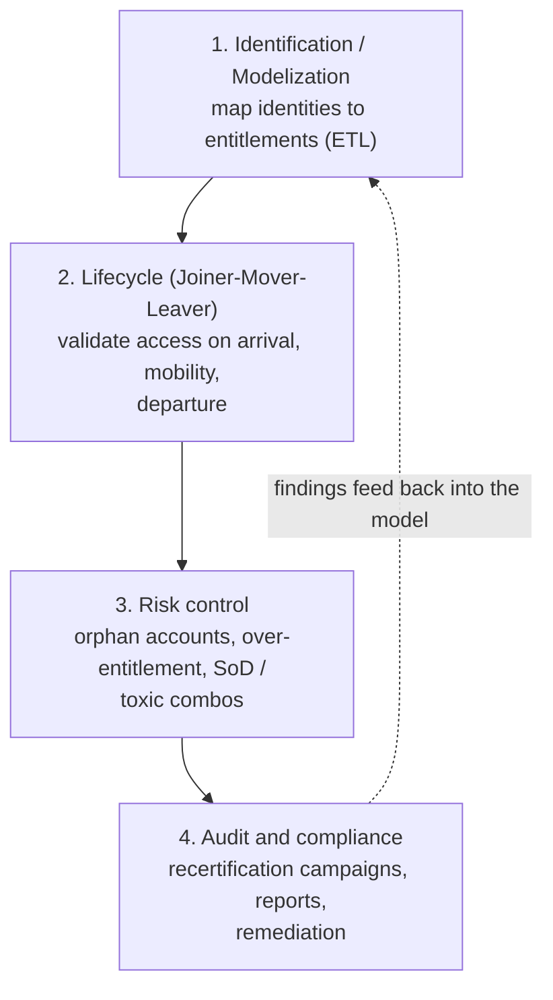
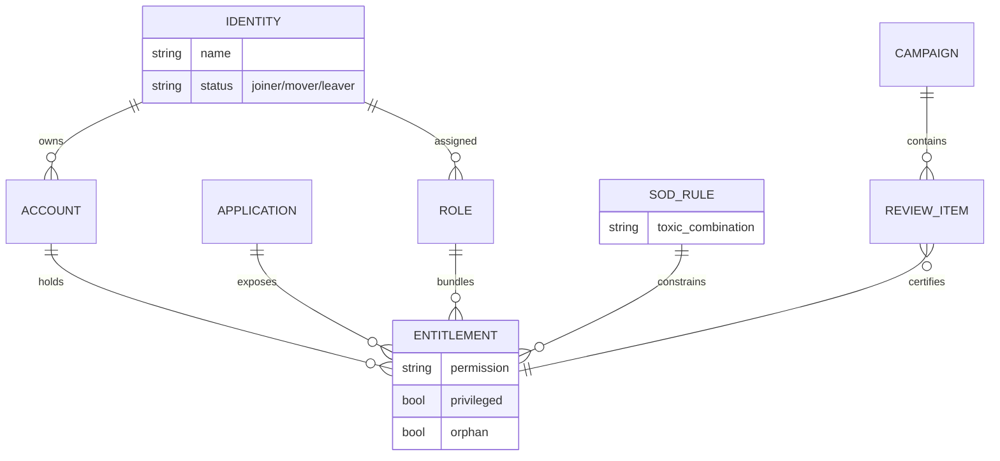
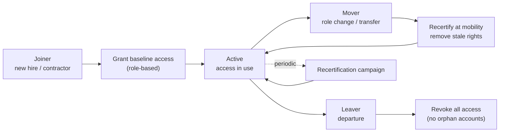
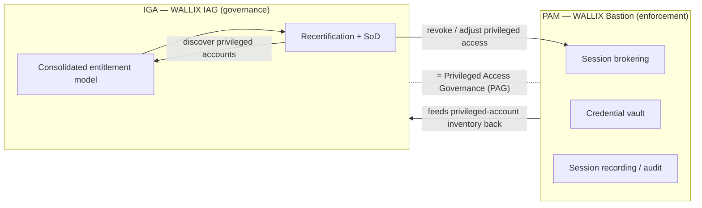

# WALLIX IAG — Identity & Access Governance — Technical Deep Dive

**WALLIX IAG (Identity & Access Governance)** is the governance layer of the WALLIX
portfolio — the product (ex-**Kleverware**, acquired 16 May 2023) that answers the
auditor's question: **"who has access to what — and *should* they?"** Where the
[Bastion (PAM)](bastion-architecture.md) *enforces* privileged access and
[Trustelem (IDaaS)](idaas-trustelem.md) *authenticates* users, IAG **maps, reviews,
certifies, and flags** access entitlements across the whole estate. It can run standalone
or overlay an existing IAM.

This page is the technical companion to the
[eWCP-G — WALLIX Certified Professional – IAG](../docs/iag/ewcp-g-professional.md)
certification. For the product-level summary and its sourcing, start at the
[product portfolio — IAG section](../docs/00-overview/product-portfolio.md#5-wallix-iag--identity--access-governance).

**Acronyms (first use):** IAG = Identity & Access Governance · IGA = Identity Governance &
Administration · IAM = Identity & Access Management · PAM = Privileged Access Management ·
PAG = Privileged Access Governance · SoD = Segregation (Separation) of Duties · JML =
Joiner-Mover-Leaver · ETL = Extract, Transform, Load · ITSM = IT Service Management ·
RBAC = Role-Based Access Control · IDaaS = Identity-as-a-Service · SCIM = System for
Cross-domain Identity Management · UAP = User Administration and Provisioning · NIS2 =
Network and Information Security Directive 2 · DORA = Digital Operational Resilience Act.
Full list: [../reference/acronyms.md](../reference/acronyms.md).

## Learning objectives

By the end of this file you should be able to:

- Explain **IAG / IGA** and how it differs from **IAM**.
- Describe the **four pillars**: identification/modelization, JML lifecycle, risk control/SoD, audit & recertification.
- Explain **ETL data consolidation** — why IAG ingests *copies* of entitlement data.
- Read a **governance data model** (identity → account → entitlement → application).
- Walk through a **Joiner-Mover-Leaver** lifecycle and a **recertification campaign**.
- Explain **remediation** routed through **PAM / ITSM / IAM**.
- Define **Privileged Access Governance (PAG)** = IGA + PAM convergence.

---

## 1. IAG vs IAM — governance vs plumbing

The cleanest distinction from WALLIX: *"Identity and Access Management (IAM) is the
broader framework for managing identities and access, covering authentication,
authorization, and security controls. Identity and Access Governance (IAG) focuses
specifically on governance — providing visibility, enforcing access policies, detecting
risks, and ensuring compliance."* In one line: **IAM manages access; IAG ensures access
remains appropriate and auditable.**

IAG is WALLIX's name for what the industry calls **IGA (Identity Governance &
Administration)**. WALLIX frames IGA as an evolution of the older **UAP (User
Administration and Provisioning)**: it has moved *"beyond static provisioning to become
more dynamic and granular,"* and it *"manages access entitlements across the identity
lifecycle,"* aggregating and correlating identity + permission data across many systems.

| Concern | IAM (e.g. Trustelem IDaaS) | IAG (governance overlay) |
|---|---|---|
| Core question | "Can this user log in / reach this app **now**?" | "Should this user **still** have this access?" |
| Acts in… | Real time (authentication / authorization) | Review cycles (campaigns, audits) |
| Typical output | A session / token | A certified (or revoked) entitlement, an audit report |
| Data | Live directory / token | **Consolidated copy** of entitlements (read via ETL) |

IAG **does not enforce** access by itself in real time — when a reviewer flags access for
removal, the **remediation** is executed by a third-party system (PAM, ITSM, or IAM). That
hand-off is central to the product (see [§7](#7-remediation--via-pam--itsm--iam)).

---

## 2. The four pillars

WALLIX organizes IAG around four pillars. The exam (eWCP-G) is structured as a *project
lifecycle* (scoping → iterations → go-live → campaigns), but the *concepts* underneath are
these four.



| Pillar | What it does |
|---|---|
| **Access Identification / Modelization** | A unified, exhaustive view of *who can do what* across internal IT and cloud apps, directories, file systems and applications — consolidated via an **ETL**. Includes an exhaustive map of **privileged accounts** and role-based attribution models (**RBAC**). |
| **Lifecycle (Joiner-Mover-Leaver)** | Continuous control of access at **arrivals**, **transfers/mobility**, and **departures**; business-line managers validate consistency of authorizations; access is **recertified at mobility**. |
| **Risk control** | Detect **orphan** and **over-allocated** accounts; enforce **Segregation of Duties (SoD)** and identify *"toxic combinations of permissions."* Remediation is executed via third-party systems. |
| **Audit & compliance** | Auditability of (privileged) accounts; auditor-tailored reports; **review/recertification campaigns** (configurable duration, periodicity, scope, approvers); a **built-in remediation workflow**; compliance dashboards (ISO 27001, SOX, NIS2, DORA, GDPR, PCI DSS, etc.). |

---

## 3. ETL data consolidation

IAG cannot govern what it cannot see, and the entitlement truth is scattered: Active
Directory groups, application roles, file-system ACLs, cloud-app permissions, HR data.
IAG uses an **ETL (Extract, Transform, Load)** to pull *copies* of this data into a single
consolidated model:

- **Extract** — read entitlements from each source (directory, application, file system,
  cloud) **read-only**; IAG does not need to write to the source to govern it.
- **Transform** — normalize heterogeneous formats into a common identity/account/
  entitlement schema (the eWCP-G calls this *"files transformation"* and *"create data
  model"*).
- **Load** — populate the governance model that campaigns, SoD checks, and reports run
  against.

Because the model is a **point-in-time consolidated copy**, IAG can compute SoD
violations, orphan accounts, and over-entitlement *offline*, without touching production —
and re-ingest periodically to stay current. This is why IAG is **decoupled** from
real-time IAM.

---

## 4. Governance data model

The vocabulary an eWCP-G candidate must hold in their head: an **identity** (a person)
owns one or more **accounts** (per system); each account holds **entitlements**
(permissions / group memberships); entitlements live on **applications/systems**; and
**roles** bundle entitlements for RBAC. **SoD rules** sit across entitlements/roles to
flag toxic combinations.



Key derived states IAG computes from this model: **orphan account** (an account with no
owning identity — e.g. a leaver's account that was never disabled), **over-entitlement**
(more permissions than the role warrants), and **SoD violation** (an identity holding a
toxic combination, e.g. *create supplier* + *approve payment*).

---

## 5. Joiner-Mover-Leaver lifecycle

The **JML** lifecycle is the operational heartbeat of governance — every access risk
traces back to a poorly handled joiner, mover, or leaver.



- **Joiner** — provision a *baseline* of access from the person's role (RBAC), validated
  by the business-line manager. Over-granting here is the root of most over-entitlement.
- **Mover** — the dangerous one: people *accumulate* rights as they change roles
  ("privilege creep"). IAG **recertifies at mobility** so old-role rights are stripped, not
  layered on top of new-role rights.
- **Leaver** — full revocation; the test of a good leaver process is **zero orphan
  accounts** afterward.

IAG's job across JML is *validation and consistency* (managers confirm authorizations) plus
*continuous control*; the actual provisioning/deprovisioning action is executed by the
downstream IAM/PAM/ITSM (IAG governs, it does not provision in real time).

---

## 6. Recertification (access-certification) campaigns

A **recertification campaign** is a time-boxed review in which the right approvers confirm
or revoke each access. This is IAG's flagship workflow and a guaranteed exam topic
(eWCP-G Module 5: *"certify campaign (recertification); certify movements"*).

Configurable per campaign: **scope** (which identities/apps/entitlements), **periodicity**
(e.g. quarterly), **duration** (the review window), and **approvers** (e.g. business-line
managers, application owners).

```mermaid
sequenceDiagram
    participant Admin as "IAG administrator"
    participant IAG as "WALLIX IAG"
    participant Mgr as "Reviewer (manager/app owner)"
    participant Rem as "Remediation (PAM / ITSM / IAM)"
    Admin->>IAG: "1. Define campaign (scope, period, approvers)"
    IAG->>IAG: "2. Generate review items from consolidated model"
    IAG->>Mgr: "3. Assign review items + alert"
    Mgr->>IAG: "4. Certify (keep) or flag (revoke) each access"
    IAG->>IAG: "5. Track progress until window closes"
    IAG->>Rem: "6. Send revocations to remediation workflow"
    Rem-->>IAG: "7. Confirm action; record evidence"
    IAG->>Admin: "8. Compliance report / audit trail"
```

The campaign produces an **audit trail and compliance report** that demonstrates, to an
auditor, that access was reviewed and inappropriate access was removed — the evidence
regulators ask for under ISO 27001, SOX, NIS2, DORA, etc.

---

## 7. Remediation — via PAM / ITSM / IAM

IAG **detects and decides**, but the **enforcement happens elsewhere**. When a reviewer
revokes access or an SoD/orphan finding requires action, IAG routes the remediation to a
third-party system:

- **PAM (WALLIX Bastion)** — revoke/adjust **privileged** access; this is the
  highest-value path and the basis of **PAG** (below).
- **ITSM** — open a change/ticket in the customer's service-management tool so the action
  is tracked and executed by operations (request workflows integrate with the customer's
  ITSM; campaigns emit automated alerts).
- **IAM** — push the change back into the provisioning/IAM system that owns the live
  entitlement.

This separation is deliberate: governance stays vendor-neutral and audit-focused, while
enforcement uses whatever tooling already owns the access.

---

## 8. Convergence — IGA + PAM = Privileged Access Governance (PAG)

The strategic story WALLIX tells with IAG + Bastion: *"Unifying IGA and PAM enables a
central locus of policy definition and enforcement for all forms of identity
management."* IGA brings the **governance** (who should have privileged access, reviewed
and certified); PAM brings the **enforcement** (brokering, vaulting, recording the actual
privileged sessions). Together they yield **Privileged Access Governance (PAG)**:
governance campaigns and SoD applied specifically to **privileged** accounts, with the
Bastion as the enforcement/remediation arm.



> **Mapping note:** WALLIX's blog confirms the IGA+PAM convergence and the "central locus"
> framing; the explicit term **"Privileged Access Governance (PAG)"** for the IAG+Bastion
> pairing comes from WALLIX's IAG positioning material. Treat PAG as **WALLIX positioning**
> rather than a separately-engineered SKU. Verify on
> <https://www.wallix.com/products/identity-and-access-governance/>.

---

## 9. Exam-relevant cheat sheet

- **IAG (= IGA) governs; IAM manages.** IAG gives visibility, certification, risk
  detection, compliance — it does **not** enforce in real time.
- **Four pillars:** identification/modelization · JML lifecycle · risk control (SoD,
  orphans, over-entitlement) · audit & recertification.
- **ETL** ingests a **read-only consolidated copy** of entitlements from directories,
  apps, file systems, cloud — so analysis runs without touching production.
- **JML:** Joiner (baseline RBAC), Mover (**recertify at mobility** to kill privilege
  creep), Leaver (full revoke → **zero orphan accounts**).
- **SoD** flags **toxic combinations** of permissions; IAG also finds **orphan** and
  **over-entitled** accounts.
- **Recertification campaign:** configurable **scope / periodicity / duration /
  approvers**; produces an **audit trail + compliance report**.
- **Remediation is routed to PAM / ITSM / IAM** — IAG decides, they enforce.
- **PAG = IGA + PAM** convergence (WALLIX IAG + Bastion), governance applied to
  privileged accounts.
- **No PAM prerequisite** for eWCP-G; the course is a **project lifecycle** (scoping →
  iterations → go-live → campaigns).

---

## Sources

- WALLIX IAG product page: <https://www.wallix.com/products/identity-and-access-governance/>
- WALLIX blog — "What is Identity and Access Governance (IAG)?": <https://www.wallix.com/blogpost/what-is-identity-and-access-governance-iag/>
- WALLIX blog — "IGA and PAM: how Identity Governance Administration connects with PAM": <https://www.wallix.com/blogpost/iga-and-pam-how-identity-governance-administration-connects-with-pam/>
- WALLIX IAG datasheet (2024): <https://www.wallix.com/wp-content/uploads/2024/02/DATASHEET_2024_WALLIX_IAG_ENG.pdf>
- WALLIX acquires Kleverware (16 May 2023): <https://www.actusnews.com/en/wallix/pr/2023/05/16/wallix-acquires-kleverware-a-leading-player-in-identity-and-access-governance>
- KuppingerCole — Identity and Access Governance, WALLIX: <https://www.kuppingercole.com/research/bc81430/identity-and-access-governance-wallix>
- Repo: [product portfolio](../docs/00-overview/product-portfolio.md) · [eWCP-G cert](../docs/iag/ewcp-g-professional.md) · [IDaaS deep dive](idaas-trustelem.md) · [Bastion architecture](bastion-architecture.md)
