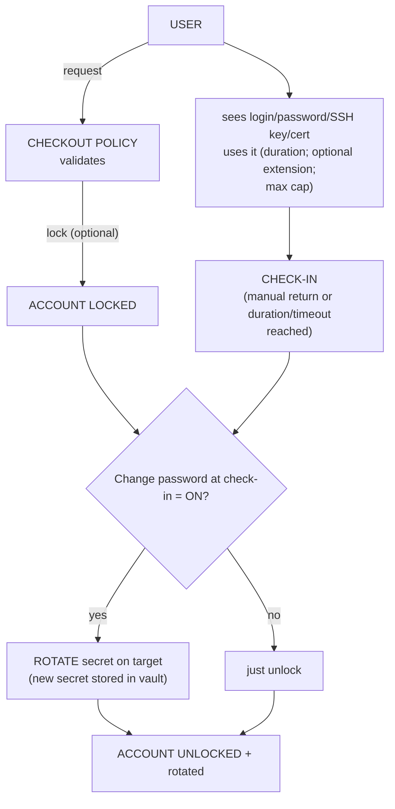
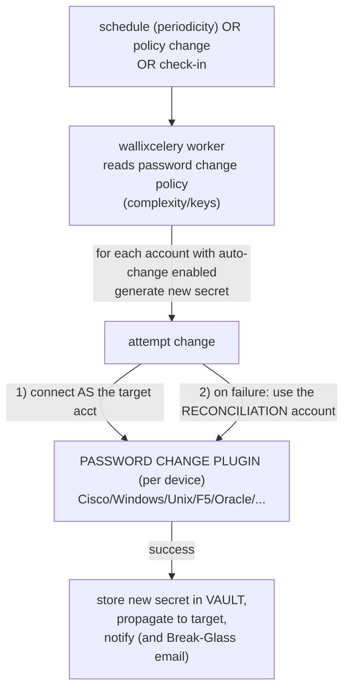
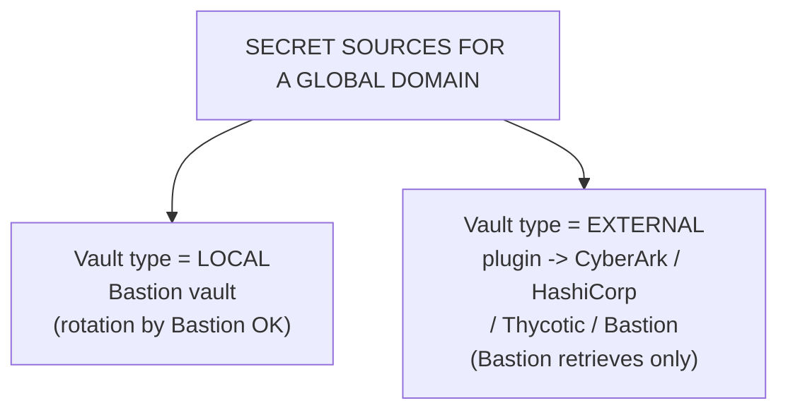
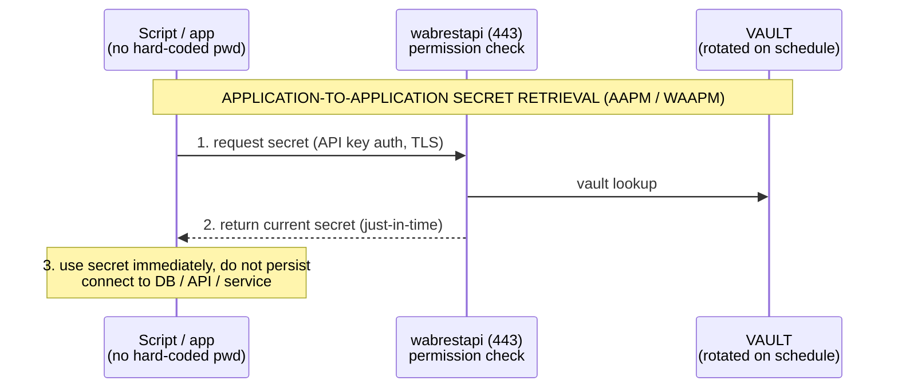

# WALLIX Bastion Password Manager — Vault, Check-out/Check-in, Rotation, External Vaults

The **Password Manager / Vault** is the half of WALLIX Bastion that *stores, hands out, rotates, and reconciles* the secrets (passwords and SSH keys) of human and non-human **target accounts**, so that administrators never need to know them. It is licence-gated by the **Secrets** right on an authorization (see [./bastion-data-model.md](./bastion-data-model.md#3-the-authorization-object-in-detail)). This file goes deep on the **vault lifecycle**: check-out/check-in with locking and change-on-check-in, automatic rotation, the password-change plugin matrix, reconciliation accounts, external vaults, **Break-Glass**, and **AAPM/WAAPM** application-to-application retrieval.

For the back-leg injection that *uses* these secrets see [./session-management.md](./session-management.md) and the mapping modes in [./bastion-data-model.md](./bastion-data-model.md#5-user-mapping--secondary-connection-modes). Portfolio summary: [product portfolio](../docs/00-overview/product-portfolio.md#password--secrets-management). Acronyms: [../reference/acronyms.md](../reference/acronyms.md).

> **Served document version:** WALLIX Bastion **12.3.2** *Functional Administration Guide*.

---

## Key points

- The **vault** ("secrets vault") securely stores passwords and SSH keys and enforces usage through **checkout policies** and **password change policies**.
- **Check-out** retrieves/displays a secret (login, password, SSH private key, signed SSH certificate); **check-in** returns it. **Account lock** can prevent concurrent use during the checkout window.
- **Change password at check-in** forces rotation when the secret is returned — the core "one-time password" pattern.
- **Secret rotation** changes passwords, SSH keys, or both — **manual or automatic**, scheduled per domain (cron-style periodicity), with tunable **parallelism**.
- The **default password change policy** requires **≥16 characters** (≥1 special, number, upper, lower) and **RSA 4096** SSH keys (raised from 8 chars in **12.0.6**; older policy preserved as `default (legacy)`).
- **Password-change plugins** (~20, e.g. Cisco, Windows, Unix, F5, FortiGate, Oracle…) drive the change on the target; a **reconciliation (administrator) account** recovers when the stored secret has diverged.
- **External vault plugins**: **CyberArk**, **HashiCorp Vault** (API v1), **Thycotic Secret Server**, and a **remote Bastion** vault — mapped via **global domains**.
- **Break-Glass** delivers an encrypted (GPG) dump of all credentials for emergencies (nightly at 02:34, or to remote storage in the alternative mechanism).
- **AAPM/WAAPM** removes hard-coded passwords from scripts by fetching secrets via the **REST API** at runtime.

---

## 1. The vault and what a checkout returns

> Glossary: *Secrets vault* = "Structure allowing the **secure storage of secrets** (passwords, SSH keys) and their automatic rotation. The external or local vault also allows account configuration through **policies** meant to enforce a specific account usage."

When a user **checks out** a credential they can be shown:

- the **login** of the account;
- the **password** (from the local or a remote Bastion);
- the **SSH private key** (if defined);
- the **certificate** = the **signed SSH public key**, if the account's domain is associated with an SSH **Certificate Authority (CA)**.

Whether they may do this at all is the **Secrets** right on an authorization, plus their permission profile.

---

## 2. Checkout policies — check-out / check-in / lock / change-on-check-in

> Glossary: *Checkout* = "retrieving and displaying a target account's credentials. **Account locking** can be set during this operation to prevent simultaneous use." *Check-in* = "restitution of temporarily borrowed authentication credentials."

A **checkout policy** is attached to a target account (`Targets > Checkout policies`). A built-in `default` policy exists (editable, not deletable). Its fields:

| Field | Meaning |
|---|---|
| **Enable lock** | If on, **stops other users from using the account at the same time** (the *account lock*). |
| **Checkout duration** | How long the lock/checkout lasts. |
| **Checkout duration extension** | Optional prolongation. |
| **Maximum checkout duration** | Optional hard cap (≥ duration + extension; set extension `0` if unused). |
| **Change password at check-in** | If on, **forces a password rotation when the credential is returned** — the secret the user saw is now dead. |

> A locked account that is **mid-password-change stays locked for the policy duration**. The Bastion plugin (remote vault) can also **extend** a checkout depending on the original Bastion's policies. While a password change is in progress, the secret cannot be checked out.

---

## 3. Secret rotation and password-change policies

> §15: *Secret rotation* = "manually or automatically changing **passwords, SSH keys, or both** for the accounts … Any changes are **immediately applied to the target accounts**."

Three building blocks (all for **local-vault** global/local domains):

1. **Password change policy** — *requirements*: complexity, key type/size, **change periodicity** (the rotation schedule). **Must always be coupled with a plugin** on a domain.
2. **Password change plugin** — *the mechanism* that actually changes the secret on the target (per device type).
3. **Password vault plugin** — for **external-vault** global domains (retrieve, not rotate).

**Default password change policy** (`default`, not editable/deletable):

- **No automatic scheduled rotation** by default.
- **≥ 16 characters**, with **≥ 1 special, 1 number, 1 uppercase, 1 lowercase**.
- **RSA** SSH key, size **4096**.

> **12.0.6 change:** the default minimum rose from **8 → 16** characters. Upgrading (or restoring from < 12.0.6) renames the old policy to **`default (legacy)`**; domains keep using legacy until you switch them. Supports **RSA/DSA/ECDSA** key generation.

**Automatic rotation triggers** (per account where the option is enabled): modifying the policy on a domain, applying a new policy to a domain, the scheduled periodicity, or **change-on-check-in**. Parallelism is tunable (`Modify the maximum number of parallel secret rotations`).

Manual options also exist: enter your own secret and **Propagate credential change**, or **Automatic credential change** for one/many accounts (only where *Password change on domain* is enabled).

---

## 4. Password-change plugins and reconciliation accounts

> §15.2: most plugins follow — (1) the Bastion **connects/executes as the target account** to change its own secret; (2) **if that fails, it uses the reconciliation account** to connect/execute and change the target account's secret.

> "Defining a **reconciliation account** is **optional**. However, WALLIX Bastion cannot define the new secret of a target account if the **former secret is unknown**. As a result, WALLIX recommends to **always provide a reconciliation account**."

The **reconciliation / administrator account** is a privileged account on the domain (e.g. `root` with `su`/`passwd`, a Windows admin, a network-device super-user) used to recover when the Bastion's stored secret has drifted from reality (manual change on the box, restore from backup, etc.).

**Bundled password-change plugins** (the 12.3.2 compatibility matrix, Table 14):

| Plugin | Typical scope / rotation | Example vendor versions |
|---|---|---|
| **Check Point Gaia** | Local domain (device): password | Gaia R77–R82 |
| **Cisco** | Global / local: password | IOS 15.0–15.9 |
| **Cisco Nexus** | Global / local: password | Current LTS |
| **Citrix ADC** | Global / local / app: password | Current LTS |
| **Dell iDRAC** | password | — |
| **F5 BIG-IP** | password | — |
| **Fortinet FortiGate** | password (needs admin account on local domain) | — |
| **HP iLO** | password | — |
| **IBM 3270**, **IBM AIX** | password (+ SSH key for AIX; admin via `su`) | — |
| **Juniper SRX** | password (admin = super-user) | — |
| **LDAP** | password (STARTTLS/TLS/None; AD option) | port 389 default |
| **MySQL**, **Oracle** | password | — |
| **Palo Alto PAN-OS** | password | — |
| **Ultra VNC** | password | — |
| **Unix** | password, SSH key | Debian/Ubuntu/RedHat/SUSE families |
| **VMware ESX** | password | — |
| **Windows**, **WindowsService** | password (WindowsService can use Kerberos transport) | — |

Each plugin documents whether an **administrator account is required on the domain** and whether a **host key is shared with proxies**. If a needed plugin isn't listed, WALLIX support can supply one.

---

## 5. External vaults

> §15.3: external vault plugins let the Bastion **retrieve target secrets from a third-party vault** (rotation by the Bastion is *not* applied to such accounts). **External-vault accounts are mapped into the local Bastion through global domains**, which act as containers; multiple domains can link to the same external vault. Requires the **External Vaults** licence feature.

**Plugin matrix (Table 15):**

| Plugin | Type | Notes |
|---|---|---|
| **Bastion Vault** (remote Bastion) | Vault | Access another WALLIX Bastion's vault via its **REST API** (min API v2.3, URL ends `/api/vX.Y`). Enables splitting **password management** and **session management** onto separate Bastions. |
| **CyberArk Enterprise Password Vault** | Vault | Current LTS. |
| **HashiCorp Vault** | Vault / **API v1** | Current LTS. |
| **Thycotic Secret Server** | Vault | Current LTS. |

> **HA note:** with Master/Slave HA and *change-on-check-in*, **all Slaves must have a Bastion plugin connected to the Master** so password changes converge.

---

## 6. Break-Glass

> §15.10: an **emergency** feature so a trusted user/group can obtain **all credentials** for the Bastion's target groups when normal access is impossible (Bastion down, restore needed, etc.). Credentials include **login, common name (cn), passwords, and SSH keys**.

Two variants:

- **Standard** — sends an **encrypted (GPG) archive by e-mail**, **automatically every night at 02:34** (Bastion's time zone), scoped to each recipient's profile limitations; optionally also when an account's secret changes (batched within 15 minutes). Setup needs a profile with **Credential recovery = Execute** and a valid **GPG key** per recipient (the served `wab-backupdaemon` produces the export; see [architecture](./bastion-architecture.md#4-internal-components--services)).
- **Alternative** (on request from WALLIX Support) — writes the GPG-encrypted credentials to a **directory or remote storage** daily, **avoiding the e-mail subsystem**; can also push a single account's password on real-time change.

> Watch for **expired GPG keys** — recipients silently stop receiving the archive. Removing a recipient = change their profile.

---

## 7. AAPM / WAAPM — application-to-application secret retrieval

**AAPM (Application-to-Application Password Management)** / **WAAPM (WALLIX Application to Application Password Manager)** removes **hard-coded passwords from scripts, config files, and RPA/DevOps jobs**: instead of storing a secret in code, the application requests it from the Bastion **at runtime over the REST API**, authenticating with an **API key** (governed by a permission profile).

> **Flag (from the portfolio):** "AAPM" is a marketing term; technically it is realised via the **Bastion REST API + vault plugins** — the term itself does not appear by name in the 12.3.2 administration-guide chapters reviewed. WAAPM is the packaged WALLIX client/library around this API.

Because the vault keeps rotating the underlying secret, the application **always fetches the current value** — eliminating stale, plaintext credentials on disk. (See [architecture](./bastion-architecture.md#4-internal-components--services) for `wabrestapi`.)

---

## Acronyms

| Acronym | Expansion |
|---|---|
| AAPM | Application-to-Application Password Management |
| WAAPM | WALLIX Application to Application Password Manager |
| API / REST | Application Programming Interface / Representational State Transfer |
| CA | Certificate Authority |
| GPG / PGP | GNU Privacy Guard / Pretty Good Privacy |
| SSH | Secure Shell |
| RSA / DSA / ECDSA | Public-key algorithms (Rivest–Shamir–Adleman / Digital Signature Algorithm / Elliptic Curve DSA) |
| HA | High Availability |
| LTS | Long-Term Support |
| RPA | Robotic Process Automation |
| cn | Common Name (directory attribute) |
| TLS / STARTTLS | Transport Layer Security / opportunistic TLS upgrade |

Full list: [../reference/acronyms.md](../reference/acronyms.md).

---

## Sources

- WALLIX Bastion **12.3.2** *Functional Administration Guide*: §11.5 (Checkout policies — lock, duration, change-on-check-in), §15 (Secrets rotation): §15.1 (password change policies + default 16-char/RSA-4096 + 12.0.6 legacy note), §15.2 (password change plugins, reconciliation account, Table 14 plugin matrix), §15.3 (external password vault plugins, Table 15: Bastion/CyberArk/HashiCorp/Thycotic), §15.4–15.9 (automatic/manual rotation, change-at-check-in), §15.10 (Break-Glass standard + alternative), §18.1 (Glossary — Account lock, Break Glass, Check-in, Checkout, Checkout policy, Secret rotation, Secrets vault, Secret vault plugin). https://pam.wallix.one/documentation/admin-doc/bastion_en_administration_guide.pdf
- Cross-reference: [../docs/00-overview/product-portfolio.md](../docs/00-overview/product-portfolio.md#password--secrets-management) (AAPM flag, external-vault list, plugin count).

> **Flagged uncertainties:** "AAPM/WAAPM" is WALLIX marketing terminology realised via the REST API + vault plugins; the specific terms are **not used by name** in the 12.3.2 admin-guide chapters reviewed — treat the AAPM flow above as the documented API-based mechanism, not a single named feature. Exact plugin count (~20) and a few vendor version ranges come from the matrix as served; some rows list "current LTS" rather than explicit versions.
