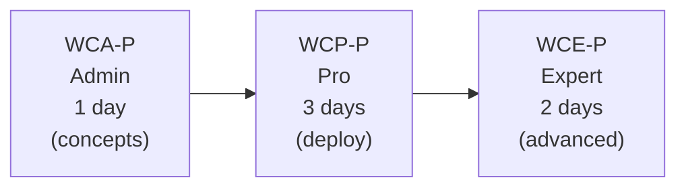

# PAM / WALLIX Bastion Certification Track

The **core and most complete** WALLIX certification track, covering **WALLIX Bastion**
(Privileged Access Management) and **WALLIX Access Manager**. It is the only track with
all three levels and the only one offered in instructor-led classroom formats.

## Progression

> *"Each certification level is designed to build upon the previous, ensuring a
> comprehensive understanding of WALLIX solutions from basic administration to advanced
> deployment and integration."*

| Cert | Level | Duration | Prerequisite | Doc |
|------|-------|----------|--------------|-----|
| **WCA-P** | Administrator | 1 day (7 h) | None (entry level) | [wca-p-administrator.md](wca-p-administrator.md) |
| **WCP-P** | Professional  | 3 days (21 h) | None formally (natural step after WCA-P) | [wcp-p-professional.md](wcp-p-professional.md) |
| **WCE-P** | Expert        | 2 days (14 h) | **WCP-P** + GNU/Linux CLI | [wce-p-expert.md](wce-p-expert.md) |

Each level is available **instructor-led** (`WCA-P`/`WCP-P`/`WCE-P`) and as **e-learning**
(`eWCA-P`/`eWCP-P`/`eWCE-P`). E-learning is *only* offered for PAM trainings.

## Common facts (all three levels)

- **Audience:** engineers & technicians of WALLIX customers and reseller partners.
- **Prerequisites (technical knowledge):** SSH, RDP, proxy concepts, Linux; system/
  network/infrastructure fundamentals; technical English.
- **Exam:** final **MCQ, 70% to pass** → certification + digital badge/diploma.
  Pre-test + continuous assessment during the course — instructor-led: oral questions,
  MCQs and labs; **e-learning: MCQs and labs (no oral questions)**.
- **Class size:** **6 trainees max** (instructor-led); e-learning is nominative.
- **Labs:** WALLIX-provided preconfigured VMs (Azure for instructor-led; OVA for e-learning).
- **Booking:** via your WALLIX sales representative; WALLIX Academy replies within ~2 days.
  Courses are accessible to people with disabilities (`academy@wallix.com`).
- **Product covered:** WALLIX Bastion (Session Manager, Password Manager/Vault) +
  WALLIX Access Manager. See [product portfolio](../00-overview/product-portfolio.md#1-wallix-bastion--privileged-access-management-pam).

> **Not specified in any WALLIX source** (do not assume): the **number of exam questions**,
> the **exam time limit**, the **certification validity/renewal period**, and the **price**.

## Study companion

Each cert doc maps its modules to the in-repo **[deep dives](../../deep-dives/README.md)**
(sourced from the official WALLIX Bastion guides), so you can study the *why* behind the
syllabus. Foundation first: [What is PAM?](../../foundations/what-is-pam.md). Self-test:
[practice questions](../../exam-prep/practice-questions.md).

## Related PAM-family certifications

Built on top of WCP-P (documented in their own tracks):
- **[eWCP-P-OT](../ot-pam4ot/ewcp-p-ot-professional.md)** — PAM4OT (Operational Technology).
- **[eWCP-I / WCP-I](../idaas/ewcp-i-professional.md)** — WALLIX One IDaaS.
