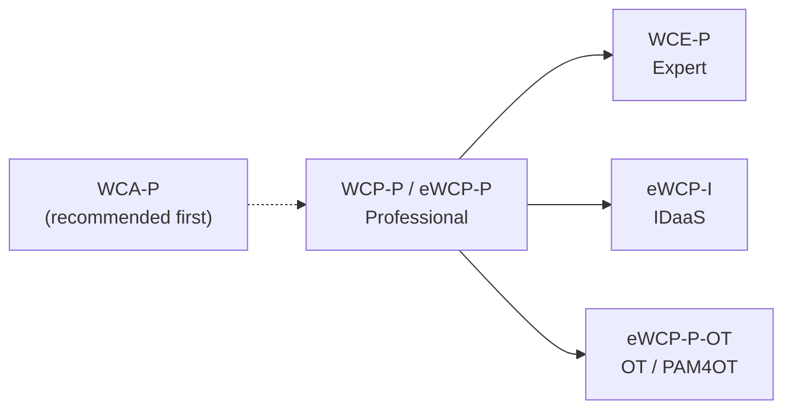

# WCP-P — WALLIX Certified Professional – PAM (Bastion)

The **core deployment-level** certification. Covers **installation, configuration,
deployment and administration** of WALLIX Bastion in a classic architecture, alternating
theory with extensive hands-on labs. It is the prerequisite for **WCE-P**, **WCP-I**
(IDaaS) and **eWCP-P-OT** (OT).

| | |
|---|---|
| **Code** | `WCP-P` (instructor-led) · `eWCP-P` (e-learning) |
| **Level** | Professional (2 of 3) |
| **Product** | WALLIX Bastion + WALLIX Access Manager |
| **Duration** | 3 days (21 hours) |
| **Formats** | Inter-company, intra-company, online/e-learning |
| **Class size** | 6 trainees max (instructor-led); nominative (e-learning) |
| **Language** | Technical English; PAM courses available with English subtitles |
| **Prerequisite** | None formally (natural step after WCA-P) |
| **Exam** | Final MCQ, **70% to pass** |
| **Unlocks** | WCE-P · WCP-I · eWCP-P-OT |

## Target audience

Engineers and technicians of WALLIX end-users and reseller partners who want to master
the **configuration, deployment and administration** of WALLIX Bastion.

## Prerequisites

- **SSH, RDP, proxy concepts, and Linux**; system/network/infrastructure fundamentals.
  *(Brush up via the repo [prerequisites](../../prerequisites/README.md).)*
- **Technical-English** proficiency; **Microsoft Teams** (instructor-led); admin rights
  on laptop for e-learning.
- No prior WALLIX certification formally required, though it is the natural step after
  [WCA-P](wca-p-administrator.md) and is itself the prerequisite for WCE-P.

## Objective

> *"This 3-day technical training covers the installation, configuration, deployment, and
> administration of the WALLIX Bastion solution, providing essential knowledge of its core
> concepts and functions."* — 2025–2026 catalog

Discover and take control of WALLIX Bastion for deployment in a **classical
architecture**, alternating theory and hands-on practice on a LAB platform.

## Curriculum / modules

| # | Module | Topics & labs |
|---|--------|---------------|
| 0 | **Introduction** | WALLIX presentation |
| 1 | **Installing & Handling** | Concept and Installation, Web configuration, System Management · *Lab 1: Installing & Handling WALLIX Bastion* |
| 2 | **Session Manager** | See breakdown below · *Labs 2.1–2.4* |
| 3 | **Password Manager** | 3.1 Password Checkout (intro, global concept, password visualization — *Lab 3.1*); 3.2 Password Change (Password Change, Break Glass — *Lab 3.2*) |
| 4 | **Approval** | Introduction; Approval workflow for Session Manager; for Password Manager · *Lab 4* |
| 5 | **Audit** | Web audit; Session/Account/Approval/Authentication history; Connection statistics; Session recording parameters; Management session records · *Lab 5: Session Audit GUI* |
| 6 | **Access Manager** | Introduction, Global concepts, Configuring the Access Manager Part 1 (*Lab 6.1*) & Part 2 (*Lab 6.2: Advanced Configuration*) |
| 7 | **High Availability** | Introduction, Global concepts, HA Solutions, HA in Architecture · *Lab 7: Replication* |
| 8 | **Customer Support Center** | Introduction; Before / Opening / After / Closing a case |

### Module 2 — Session Manager (detailed)

The catalog labels the 2.1 sub-modules with explicit learning verbs:

| Sub | Topic |
|-----|-------|
| 2.1 | **Global Concepts** — *Explore* Session Management; *Discover* Secondary Connection Methods; *Manage* Primary Groups; *Differentiate* Primary Account Types; *Understand* Secondary Accounts; *Differentiate* Global and Local Domains; *Understand* Checkout Policy |
| 2.2 | **Main Configuration** — create/configure primary account & group; target device, account & group; an authorization |
| 2.3 | **User Access** — configure the Bastion User Web Interface; connect via RDP; connect via SSH · *Lab 2.1: RDP & SSH Connections* |
| 2.4 | **Applications** — prerequisites; application creation & publishing; AppDriver concept & configuration · *Lab 2.2: Applications* |
| 2.5 | **Advanced Configuration Part 1** — connection policies & parameters; Session Probe · *Lab 2.3: Advanced Configuration and Connection Policies* |
| 2.6 | **Advanced Configuration Part 2** — SSH Startup scenario; external authentication for Bastion; mass import · *Lab 2.4: External Authentication* |

## Lab environment

**6 preconfigured VMs:** Domain Controller (Win 2016), Windows Server 2016, Linux
Server, **2× WALLIX Bastion**, **1× Access Manager** (Azure for instructor-led / OVA for
e-learning). Minimum **4 CPU / i5, 32 GB RAM, 40 GB free**.

## Study companion — map each module to a deep dive

| Module | Go deeper |
|--------|-----------|
| 1 Installing & Handling | [Bastion architecture](../../deep-dives/bastion-architecture.md) |
| 2 Session Manager | [Session management](../../deep-dives/session-management.md) · [data model](../../deep-dives/bastion-data-model.md) |
| 3 Password Manager | [Secrets & password management](../../deep-dives/secrets-and-password-management.md) |
| 4 Approval | [Session management → approval workflows](../../deep-dives/session-management.md) |
| 5 Audit | [Troubleshooting & logs](../../deep-dives/troubleshooting-and-logs.md) |
| 6 Access Manager | [Authentication & Access Manager](../../deep-dives/authentication-and-access-manager.md) |
| 7 High Availability | [High availability & DR](../../deep-dives/high-availability-and-dr.md) |
| 8 Customer Support Center | [Troubleshooting & logs → support process](../../deep-dives/troubleshooting-and-logs.md) |

## Concepts worth mastering for the exam

See the [product portfolio — Bastion ACL data model](../00-overview/product-portfolio.md#core-pam-concepts--the-acl-data-model):
*users → user groups → (authorization: Sessions + Secrets rights) → target groups →
targets (resource + account)*; user-mapping modes (account mapping / session account /
interactive login); checkout policies; connection policies & Session Probe.
Self-test: [practice questions](../../exam-prep/practice-questions.md).

## Scope, exam focus & study tips

> *Study guidance **derived** from the published curriculum and product documentation —
> not official WALLIX exam content; question count and weighting are not published.*

**Scope — what WCP-P validates:** that you can **install, configure, deploy and
administer** WALLIX Bastion in a classical architecture — stand up the appliance, build
the full access model, configure the Session and Password Managers, approvals and audit,
set up Access Manager, and apply basic high-availability replication.

**Likely focus areas (mapped from the modules):**
- The **Access Control List (ACL) data model** and how an *authorization* binds **one user group to one target group**, carrying **Sessions** and **Secrets** rights (Module 2).
- **User-mapping / secondary-connection modes** — account mapping vs session/specific account vs interactive login.
- **Global vs local domains** and **checkout policies**.
- **Connection policies** and the **Session Probe**; **Applications / AppDriver**; **external authentication** and **mass import** (Modules 2.4–2.6).
- Password **check-out / change / Break-Glass** (3); **approval** (4); **audit** (5).
- **Access Manager** configuration (6) and **HA replication** concepts (7).

**Study tips:**
- This is the **data-model-heavy** level — be able to draw *users → user groups →
  authorization → target groups → targets (resource + account)* from memory. See the
  [data-model deep dive](../../deep-dives/bastion-data-model.md).
- Practice building **one authorization end to end** in a lab, then connecting over RDP and SSH.
- Memorize the **three user-mapping modes** and when each applies.
- Know **AppDriver**, **connection policies**, and exactly what the **Session Probe** captures.
- Understand **HA replication** at concept level (what is and isn't replicated) — see
  [HA & DR](../../deep-dives/high-availability-and-dr.md).

## Assessment

Pre-test; **final MCQ exam, 70% to pass** → `WCP-P` / `eWCP-P` certification (digital
badge + diploma). Continuous assessment during the course:
- **Instructor-led (WCP-P):** oral questions, MCQs, and hands-on labs.
- **E-learning (eWCP-P):** MCQs and hands-on labs (no oral questions).

> **Not specified in any WALLIX source:** the **number of exam questions**, the **exam
> time limit**, the **certification validity/renewal period**, and the **price**. Confirm
> with WALLIX Academy (`academy@wallix.com`).

## Path

⬅️ [WCA-P — Administrator](wca-p-administrator.md) · ➡️ [WCE-P — Expert](wce-p-expert.md)

## Sources

- WALLIX Academy: https://www.wallix.com/support-services/wallix-academy/
- Training catalog 2025–2026 (EN) — primary, retrieved full (35 pp.): https://www.wallix.com/wp-content/uploads/2024/04/WALLIX_TRAINING_2025-2026_ENG.pdf
