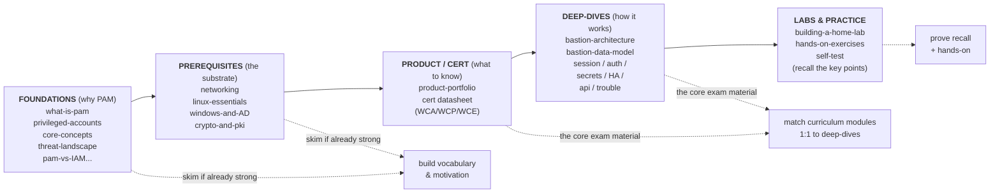

# Study Plan — Recommended Paths Through This Repo

Ordered reading sequences through **this repository** for each WALLIX certification, with
**suggested** time estimates, the **exam-format facts**, and study tips. Pick the path for
the certification you are sitting and work top to bottom.

> ⏱️ **All time estimates below are *suggested* self-study figures**, not official course
> durations. They assume a sysadmin moving into PAM, studying part-time. Official course
> durations come from the cert datasheets (e.g. WCP-P = 3 days / 21 hours of *instruction*).

---

## Exam format (cite the cert docs)

Identical across **all** current WALLIX tracks (see
[certification framework](../docs/00-overview/certification-framework.md#common-exam--assessment-model)):

- **Pre-test** at the start of the course.
- **Continuous assessment** throughout — oral questions, MCQs, and hands-on labs.
- **Final exam: a multiple-choice questionnaire (MCQ)** requiring **≥ 70% to pass**.
- On success: a **digital badge + diploma**.
- **Not specified in sources:** the exact **number of questions** and any **validity /
  renewal period** (a web snippet suggested "2 years" but is unconfirmed).

This is stated per-cert in [WCA-P](../docs/pam-bastion/wca-p-administrator.md#assessment),
[WCP-P](../docs/pam-bastion/wcp-p-professional.md#assessment), and
[WCE-P](../docs/pam-bastion/wce-p-expert.md#assessment).

---

## The general learning ladder

Everything in this repo is arranged so you climb the same ladder, going deeper at each
cert level:

### FLOW — learning path

**Rule of thumb:** read **left to right**, but if you are an experienced sysadmin you may
**skim foundations/prerequisites** and spend your time on **product + deep-dives + labs**.

---

## Path A — WCA-P (Administrator, entry level)

*Goal: understand and operate Bastion day-to-day. No install/deploy. ~1 day of official
instruction.* **Suggested self-study: ~8–12 hours.**

| Step | Read | Suggested time |
|---|---|---|
| 1 | [foundations/what-is-pam](../foundations/what-is-pam.md) + [core-concepts](../foundations/core-concepts-least-privilege-jit-zero-trust.md) | 1.5 h |
| 2 | [foundations/privileged-accounts-and-credentials](../foundations/privileged-accounts-and-credentials.md) | 1 h |
| 3 | [prerequisites/networking-and-protocols](../prerequisites/networking-and-protocols.md) (skim if strong) | 1 h |
| 4 | [product-portfolio — Bastion section](../docs/00-overview/product-portfolio.md#1-wallix-bastion--privileged-access-management-pam) | 1.5 h |
| 5 | [WCA-P datasheet](../docs/pam-bastion/wca-p-administrator.md) — match each module to a topic | 0.5 h |
| 6 | [deep-dives/bastion-data-model](../deep-dives/bastion-data-model.md) — the ACL spine | 1.5 h |
| 7 | [deep-dives/session-management](../deep-dives/session-management.md) §1–4 + [secrets](../deep-dives/secrets-and-password-management.md) §1–2 | 2 h |
| 8 | **Labs:** [exercises 1–4](../labs/hands-on-exercises.md) (RDP/SSH, checkout, approval, audit) | as available |
| 9 | Self-test: re-state the **"Key points"** of each deep-dive from memory | 0.5 h |

**Focus for the MCQ:** the **data model** (users → user groups → authorization → target
groups → targets), **Sessions vs. Secrets** rights, checkout basics, approval, and where
audit lives.

---

## Path B — WCP-P (Professional, the core deployment cert)

*Goal: install, configure, deploy, administer in a classic architecture. ~3 days / 21 h
of official instruction. Prerequisite for WCE-P, WCP-I, eWCP-P-OT.* **Suggested
self-study: ~20–30 hours.**

| Step | Read | Suggested time |
|---|---|---|
| 1 | Re-skim the **WCA-P path** if you have not done that cert | 2 h |
| 2 | [prerequisites/linux-essentials](../prerequisites/linux-essentials-for-pam.md) + [windows-and-active-directory](../prerequisites/windows-and-active-directory.md) | 3 h |
| 3 | [prerequisites/cryptography-and-pki](../prerequisites/cryptography-and-pki.md) | 1.5 h |
| 4 | [WCP-P datasheet](../docs/pam-bastion/wcp-p-professional.md) — note every `Lab x.x` | 0.5 h |
| 5 | [deep-dives/bastion-architecture](../deep-dives/bastion-architecture.md) — proxy model, services, deployment | 2.5 h |
| 6 | [deep-dives/bastion-data-model](../deep-dives/bastion-data-model.md) — full read incl. worked example & runtime flow | 2.5 h |
| 7 | [deep-dives/session-management](../deep-dives/session-management.md) — all sections (incl. approvals) | 2.5 h |
| 8 | [deep-dives/secrets-and-password-management](../deep-dives/secrets-and-password-management.md) — full | 2 h |
| 9 | [deep-dives/authentication-and-access-manager](../deep-dives/authentication-and-access-manager.md) — LDAP/AD + WAM (module 6) | 3 h |
| 10 | [deep-dives/high-availability-and-dr](../deep-dives/high-availability-and-dr.md) §1–4 (module 7 = *Lab 7 Replication*) | 2 h |
| 11 | **Labs:** [exercises 1–6](../labs/hands-on-exercises.md) on the [home lab](../labs/building-a-home-lab.md) | as available |
| 12 | Self-test on every deep-dive's **"Key points"** + acronym tables | 1.5 h |

**Focus for the MCQ:** installation/web-config concepts, the full data model + user-mapping
modes, connection policies & Session Probe, checkout policies, the **Access Manager** role,
**external authentication**, and **HA Database Replication** (DRBD is gone; what is/ isn't
replicated).

---

## Path C — WCE-P (Expert, advanced & large-scale)

*Goal: Active/Active, automatic provisioning, DR, advanced auth, scripting, REST API,
troubleshooting. ~2 days / 14 h. **Requires WCP-P first** + GNU/Linux CLI.* **Suggested
self-study: ~16–24 hours (on top of a solid WCP-P base).**

| Step | Read | Suggested time |
|---|---|---|
| 1 | Confirm WCP-P mastery (you should hold the cert) — re-skim [data-model](../deep-dives/bastion-data-model.md) + [architecture](../deep-dives/bastion-architecture.md) | 1.5 h |
| 2 | [WCE-P datasheet](../docs/pam-bastion/wce-p-expert.md) — map modules 1–6 to deep-dives | 0.5 h |
| 3 | [deep-dives/authentication-and-access-manager](../deep-dives/authentication-and-access-manager.md) — **advanced** auth (Kerberos transparent/explicit, X.509, SAML, RADIUS, 2FA) | 3 h |
| 4 | [deep-dives/secrets-and-password-management](../deep-dives/secrets-and-password-management.md) §4–7 — plugins, external vaults, **WAAPM** | 2 h |
| 5 | [deep-dives/high-availability-and-dr](../deep-dives/high-availability-and-dr.md) — **full** (Master/Master, `bastion-replication`, failover, DR/backup) | 3 h |
| 6 | [deep-dives/rest-api-and-automation](../deep-dives/rest-api-and-automation.md) — **full** (module 5 = *Lab 5*) | 3 h |
| 7 | [deep-dives/troubleshooting-and-logs](../deep-dives/troubleshooting-and-logs.md) — **full** (module 6) | 3 h |
| 8 | **Labs:** [exercises 5–7](../labs/hands-on-exercises.md) (ext-auth, HA replication, REST API) | as available |
| 9 | Self-test: trace the **"user cannot connect"** decision tree + recite HA constraints | 1 h |

**Focus for the MCQ:** advanced authentication methods and where each is configured;
proxy/AutoIt application tuning concepts; external vaults + WAAPM; **REST API** auth,
methods, response codes; HA/DR procedures; and **troubleshooting** (log locations, the
decision tree, plugin debugging).

---

## Path D — eWCP-I (IDaaS / Trustelem)

*Online cert for WALLIX One IDaaS. ~7 h online. **Requires WCP-P first.*** **Suggested
self-study: ~8–12 hours.**

| Step | Read | Suggested time |
|---|---|---|
| 1 | Hold/complete **WCP-P** first (it is the prerequisite) | — |
| 2 | [foundations/pam-iam-iga-idaas-epm](../foundations/pam-iam-iga-idaas-epm.md) — where IDaaS sits in the acronym soup | 1 h |
| 3 | [product-portfolio — Trustelem section](../docs/00-overview/product-portfolio.md#3-wallix-trustelem--idaas-sso--mfa--identity-federation) | 1.5 h |
| 4 | [eWCP-I datasheet](../docs/idaas/ewcp-i-professional.md) — modules + Labs 1–6 | 0.5 h |
| 5 | [prerequisites/windows-and-active-directory](../prerequisites/windows-and-active-directory.md) — AD objects, IWA | 1.5 h |
| 6 | [deep-dives/authentication-and-access-manager](../deep-dives/authentication-and-access-manager.md) — SAML/OIDC sections (shared with PAM auth) | 2 h |
| 7 | Self-test: SSO vs. MFA factors, SCIM provisioning, AD/Azure AD connectors, access rules | 1 h |

**Focus for the MCQ:** SSO (SAML 2.0 / OIDC / OAuth 2.0), MFA factors (WALLIX
Authenticator push/TOTP, FIDO/WebAuthn, SMS/email OTP), LDAP/RADIUS for non-federated
apps, SCIM 2.0 provisioning, ADConnect / Trustelem Connect, access rules.

---

## Path E — eWCP-G (IAG / Identity & Access Governance)

*Online cert for WALLIX IAG (ex-Kleverware). ~21 h online (estimated). **No PAM
prerequisite**; Windows Server basics recommended.* **Suggested self-study: ~12–18 hours.**

| Step | Read | Suggested time |
|---|---|---|
| 1 | [foundations/pam-iam-iga-idaas-epm](../foundations/pam-iam-iga-idaas-epm.md) — IGA/IAG vs. PAM vs. IAM | 1.5 h |
| 2 | [product-portfolio — IAG section](../docs/00-overview/product-portfolio.md#5-wallix-iag--identity--access-governance) | 1.5 h |
| 3 | [eWCP-G datasheet](../docs/iag/ewcp-g-professional.md) — the project-lifecycle modules + labs | 0.5 h |
| 4 | [prerequisites/windows-and-active-directory](../prerequisites/windows-and-active-directory.md) (recommended baseline) | 1.5 h |
| 5 | Self-test: the four IAG pillars; certification campaigns; Segregation of Duties (SoD); Joiner-Mover-Leaver | 1 h |

**Focus for the MCQ:** access identification/modelization, lifecycle (Joiner-Mover-Leaver),
risk control (orphan/over-entitled accounts, **SoD**/toxic combinations), and audit /
recertification campaigns. Note: IAG is **governance**, not authentication — keep it
distinct from IDaaS. *(WCA-G is announced but has no datasheet yet — see
[WCA-G](../docs/iag/wca-g-administrator.md).)*

---

## Path F — eWCP-P-OT (OT / PAM4OT)

*Online cert for PAM4OT (Bastion packaged for Operational Technology). ~4 h, the shortest
WALLIX cert; **demos rather than a full lab**. **Requires WCP-P first.*** **Suggested
self-study: ~5–8 hours.**

| Step | Read | Suggested time |
|---|---|---|
| 1 | Hold/complete **WCP-P** first (prerequisite) — PAM4OT *is* Bastion | — |
| 2 | [product-portfolio — PAM4OT section](../docs/00-overview/product-portfolio.md#6-wallix-pam4ot--operational-technology-ot-security) | 1.5 h |
| 3 | [eWCP-P-OT datasheet](../docs/ot-pam4ot/ewcp-p-ot-professional.md) — OT universe, third-party access, architectures | 0.5 h |
| 4 | Re-skim [deep-dives/session-management](../deep-dives/session-management.md) + [secrets](../deep-dives/secrets-and-password-management.md) (same engine, OT framing) | 1.5 h |
| 5 | Self-test: agentless on PLCs, industrial-protocol encapsulation in SSH tunnels, IT/OT boundary, ISA/IEC 62443, the three architectures (centralized/hybrid/distributed) | 1 h |

**Focus for the MCQ:** that **PAM4OT = Bastion packaged for OT** (sessions flow through
the Bastion), agentless on PLCs/HMIs, third-party maintenance access, protocol
encapsulation, and the centralized / hybrid / distributed architectures.

---

## Study tips

- **Learn the data model cold.** Almost every PAM-track question reduces to *users →
  user groups → authorization → target groups → targets*, plus the rule that **one
  authorization links exactly one user group to one target group**. → [bastion-data-model](../deep-dives/bastion-data-model.md).
- **Separate the two rights.** **Sessions** (open a session) vs. **Secrets** (see the
  password) trips people up — they are cumulative but independent.
- **Use the "Key points" boxes as flashcards.** Every deep-dive opens with one; cover the
  page and re-state it.
- **Watch the version-specific facts.** WALLIX changed real things in v12 — **DRBD removed
  → HA Database Replication**; default password length **8 → 16** chars. Exam questions
  love these deltas.
- **Do the labs in order.** Concepts stick once you have opened a real session and replayed
  its recording. → [hands-on-exercises](../labs/hands-on-exercises.md).
- **Mind the prerequisites between certs:** **WCE-P, WCP-I, and eWCP-P-OT all require
  WCP-P first**; **eWCP-G does not**.
- **Don't fabricate exam internals.** Question count and validity period are **not
  specified** in WALLIX sources — don't rely on numbers you can't verify.
- **Acronym discipline.** Each deep-dive has an acronym table — the MCQ will use the
  abbreviations (RDP, SSH, ACL, MFA, LDAP, HA, REST, AAPM/WAAPM …).

---

## Sources

- WALLIX Academy: https://www.wallix.com/support-services/wallix-academy/
- Training catalog 2025–2026 (EN, exam model & durations): https://www.wallix.com/wp-content/uploads/2024/04/WALLIX_TRAINING_2025-2026_ENG.pdf
- Repo grounding: [certification framework](../docs/00-overview/certification-framework.md), cert datasheets under [docs/pam-bastion](../docs/pam-bastion/), [docs/idaas](../docs/idaas/ewcp-i-professional.md), [docs/iag](../docs/iag/ewcp-g-professional.md), [docs/ot-pam4ot](../docs/ot-pam4ot/ewcp-p-ot-professional.md); deep-dives in [../deep-dives/](../deep-dives/); labs in [../labs/](../labs/)
