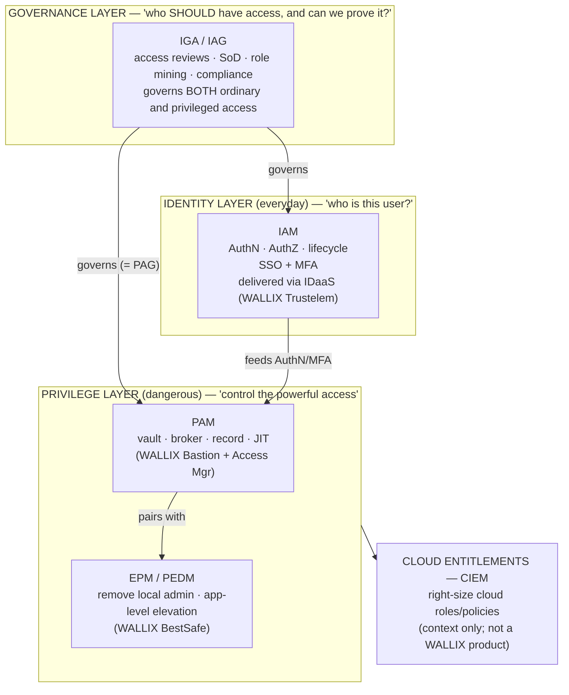

# PAM vs IAM, IGA, IDaaS, EPM & the Acronym Soup

The identity-security market is a thicket of overlapping three- and four-letter
acronyms — **IAM, IGA/IAG, IDaaS, SSO, MFA, PAM, PEDM/EPM, CIEM**. This page
disambiguates each one, shows how they overlap, and maps them onto the **WALLIX**
product line so you always know which tool does what. A big comparison table and a
"map of the identity landscape" diagram tie it together.

> Builds on [what-is-pam.md](what-is-pam.md). For the WALLIX products themselves, the
> authoritative reference is the
> [product portfolio](../docs/00-overview/product-portfolio.md) — this page links into
> it rather than repeating it.

## Learning objectives

- Expand and define every acronym in the identity-security stack.
- Explain how **IAM, IGA, IDaaS, PAM, EPM, and CIEM** overlap and differ.
- State the **central question** each discipline answers.
- Map each discipline to its **WALLIX product**.
- Read a single diagram that places all of them in one landscape.

---

## 1. The one-question test

The fastest way to keep these straight is to ask **what question each one answers**.

| Acronym | Expanded | The question it answers |
|---|---|---|
| **IAM** | Identity & Access Management | *Who is this user, and what may they access?* (the plumbing) |
| **IGA / IAG** | Identity Governance & Administration / Identity & Access Governance | *Who **should** have access — and can we prove it?* |
| **IDaaS** | Identity-as-a-Service | *Can we deliver identity (SSO/MFA) from the cloud?* |
| **SSO** | Single Sign-On | *Can the user log in once and reach many apps?* |
| **MFA** | Multi-Factor Authentication | *Is the user really who they claim — with a second factor?* |
| **PAM** | Privileged Access Management | *How do we control & record the **dangerous** (privileged) access?* |
| **PEDM** | Privilege Elevation & Delegation Management | *How do we elevate **specific actions** without making the user an admin?* |
| **EPM** | Endpoint Privilege Management | *How do we remove local admin on endpoints yet keep users productive?* |
| **CIEM** | Cloud Infrastructure Entitlement Management | *Who can do what across our **cloud** entitlements/roles?* |

> **Mnemonic:** IAM = *everyday* identity for *everyone*; PAM = *privileged* access for
> *admins & machines*; IGA/IAG = the *governance* overlay that audits both; EPM/PEDM =
> *privilege on the endpoint itself*; CIEM = *the same idea, but for cloud entitlements*.

---

## 2. The definitions, in order

### IAM — Identity & Access Management

The broad foundation. IAM creates and manages **digital identities** for the whole
workforce and decides **what applications/resources each may access**. It covers
authentication (**AuthN** — proving who you are) and authorization (**AuthZ** — what you
may do), the **identity lifecycle** (joiner/mover/leaver), and usually bundles **SSO**
and **MFA**. IAM is *horizontal* — it touches every user. PAM is the *deep, narrow*
specialization for the dangerous subset.

### SSO — Single Sign-On (a feature within IAM/IDaaS)

Authenticate **once**, then reach many trusting applications without re-entering
credentials, via federation standards (**SAML 2.0**, **OpenID Connect/OAuth 2.0**). SSO
improves usability *and* security (fewer passwords to phish or reuse).

### MFA — Multi-Factor Authentication (a feature within IAM/IDaaS)

Require **two or more independent factors** — *something you know* (password),
*something you have* (phone/token/FIDO key), *something you are* (biometric). MFA is the
single highest-impact control against stolen passwords, and a PAM gateway typically
**requires MFA** before granting privileged access.

### IDaaS — Identity-as-a-Service

**IAM delivered from the cloud** as a subscription: cloud-hosted SSO, MFA, and identity
federation, with no on-prem identity servers to run. IDaaS is a *delivery model* for IAM
features, not a separate discipline. (WALLIX delivers this via Trustelem / WALLIX One
IDaaS.)

### IGA / IAG — Identity Governance & Administration / Identity & Access Governance

The **governance** layer on top of IAM. Where IAM *operates* access, IGA/IAG **governs**
it: **access reviews / certification campaigns** (periodically re-confirm who has what),
**Separation of Duties (SoD)** / toxic-combination detection, **role mining**, **orphan
& over-entitled account** clean-up, and **compliance reporting**. The two acronyms are
near-synonyms; analysts (e.g. Gartner) prefer **IGA**, while WALLIX brands its product
**IAG** (the acquired Kleverware technology — see
[IAG section](../docs/00-overview/product-portfolio.md#5-wallix-iag--identity--access-governance)).
Pairing IGA with PAM yields **Privileged Access Governance (PAG)** — governance applied
specifically to privileged accounts.

### PAM — Privileged Access Management

The subject of this whole folder: control, vault, broker, record, and audit
**privileged** access. The deep specialization for the access that can break or take
over infrastructure. Full treatment in [what-is-pam.md](what-is-pam.md).

### PEDM — Privilege Elevation & Delegation Management

A model **inside the PAM family**: rather than making a user a permanent admin, **elevate
just the specific command/application** that needs it, when it needs it. Think `sudo`
done granularly and centrally. It is *least privilege at the action level*.

### EPM — Endpoint Privilege Management

The **endpoint-side** application of PEDM: remove local administrator rights from
workstations/servers, then grant elevation **per application/process** as policy allows.
This kills the "everyone is local admin" risk that fuels malware and lateral movement.
WALLIX delivers EPM via **BestSafe**, which assigns privilege to **applications, not
users** — see
[BestSafe section](../docs/00-overview/product-portfolio.md#4-wallix-bestsafe--endpoint-privilege-management-epm).

> **PAM vs EPM — the key distinction:** PAM controls the **session/credential to a
> remote target** (the *gateway* side). EPM controls **privilege on the local machine
> itself** (the *endpoint* side). They are complementary halves of least privilege;
> WALLIX markets the pair as its **"PAM4ALL"** vision.

### CIEM — Cloud Infrastructure Entitlement Management

The newest neighbour. Cloud platforms (AWS/Azure/GCP) sprawl into thousands of fine-
grained **entitlements** (roles, policies, permissions). CIEM **discovers, analyzes, and
right-sizes** those entitlements to enforce least privilege in the cloud — essentially
"IGA-style governance + PAM-style least privilege, specialized for cloud IAM." *Flag: no
dedicated WALLIX CIEM product is identified in the
[product portfolio](../docs/00-overview/product-portfolio.md); treat CIEM here as
context for the landscape, not a WALLIX offering.*

> **Acronyms:** **AuthN** = Authentication · **AuthZ** = Authorization ·
> **SAML** = Security Assertion Markup Language · **OIDC** = OpenID Connect ·
> **FIDO** = Fast IDentity Online · **PAG** = Privileged Access Governance.
> Full list: [reference/acronyms.md](../reference/acronyms.md).

---

## 3. Big comparison table

| Discipline | Expanded | Scope (who/what) | Core question | Typical capabilities | WALLIX product |
|---|---|---|---|---|---|
| **IAM** | Identity & Access Management | All workforce identities | Who is this user & what may they access? | AuthN, AuthZ, lifecycle, SSO, MFA | (foundation; WALLIX adds IDaaS + governance on top) |
| **IDaaS** | Identity-as-a-Service | Cloud delivery of IAM | Identity from the cloud? | Cloud SSO, MFA, federation, SCIM | **Trustelem** / **WALLIX One IDaaS** |
| **SSO** | Single Sign-On | Feature of IAM/IDaaS | Log in once for many apps? | SAML/OIDC federation | (within Trustelem) |
| **MFA** | Multi-Factor Authentication | Feature of IAM/IDaaS | Prove identity with 2nd factor? | Push, TOTP, FIDO2, OTP | **WALLIX Authenticator** (powered by inWebo) in Trustelem |
| **IGA / IAG** | Identity Governance & Admin / Identity & Access Governance | Governance over all access | Who *should* have access; provable? | Access reviews, SoD, role mining, compliance | **WALLIX IAG** (ex-Kleverware) |
| **PAM** | Privileged Access Management | Privileged accounts & sessions | Control & record dangerous access? | Vault, broker/proxy, recording, JIT, audit | **WALLIX Bastion** (+ Access Manager) |
| **PEDM** | Privilege Elevation & Delegation Mgmt | Specific elevated actions | Elevate the action, not the user? | Per-command/app elevation | within **BestSafe** / Bastion |
| **EPM** | Endpoint Privilege Management | Endpoints (workstations/servers) | Remove local admin, keep users working? | Local-admin removal, app-level privilege, anti-ransomware | **WALLIX BestSafe** |
| **CIEM** | Cloud Infrastructure Entitlement Mgmt | Cloud entitlements/roles | Right-size cloud permissions? | Entitlement discovery & least-privilege for cloud | *not a WALLIX product (context only)* |

> **Corrections to preserve** (from the portfolio's "Key uncertainties"): **inWebo was
> NOT acquired** — it is a technology partner powering WALLIX Authenticator; **WALLIX
> IAG = the acquired Kleverware product**; **BestSafe = a product** built on the Simarks
> acquisition, not an acquired company.

---

## 4. Map of the identity landscape

How the disciplines overlap. Read top-to-bottom as *governance → identity →
privilege*, and note where the circles touch.

> AuthN = Authentication · AuthZ = Authorization · SoD = Separation of Duties ·
> JIT = Just-In-Time · PAG = Privileged Access Governance (IGA applied to PAM).

**How to read the overlaps:**

- **IAM ↔ PAM:** IAM authenticates the human; PAM takes over for the *privileged* leg.
  PAM consumes IAM's **SSO/MFA** at its gateway.
- **IGA/IAG ↔ everything:** governance sits above both and audits who-should-have-what;
  applied to privileged accounts it becomes **PAG**.
- **PAM ↔ EPM:** session/credential side (PAM) + endpoint side (EPM) = full least
  privilege ("PAM4ALL").
- **IDaaS** is simply *how* IAM (SSO/MFA) is delivered — from the cloud.
- **CIEM** extends least-privilege governance into cloud entitlements.

---

## 5. Key takeaways

- **IAM** is the broad foundation (identity for everyone); **PAM** is the deep
  specialization for privileged access.
- **IDaaS** is a *delivery model* (cloud IAM); **SSO** and **MFA** are *features* within
  it.
- **IGA/IAG** is governance — *who should have access* — sitting above both IAM and PAM;
  applied to privileged accounts it is **PAG**.
- **EPM/PEDM** handle privilege *on the endpoint*; together with PAM they complete least
  privilege.
- **CIEM** does the same right-sizing for *cloud entitlements* (not a WALLIX product).
- WALLIX mapping: **Bastion = PAM**, **Trustelem / One IDaaS = IDaaS (SSO/MFA)**,
  **IAG = governance**, **BestSafe = EPM**.

---

## See also

- [What is PAM?](what-is-pam.md)
- [Privileged accounts & credentials](privileged-accounts-and-credentials.md)
- [PAM threat landscape](pam-threat-landscape.md)
- [Core concepts: least privilege, JIT, Zero Trust](core-concepts-least-privilege-jit-zero-trust.md)
- [WALLIX product portfolio](../docs/00-overview/product-portfolio.md)
- [Acronyms](../reference/acronyms.md) · [Glossary](../reference/glossary.md)

---

## Sources

- WALLIX product portfolio (this repo): ../docs/00-overview/product-portfolio.md
- WALLIX — IDaaS / Trustelem: https://www.wallix.com/products/idaas/
- WALLIX — Multi-Factor Authentication: https://www.wallix.com/products/multi-factor-authentication-mfa/
- WALLIX — Identity & Access Governance (IAG): https://www.wallix.com/products/identity-and-access-governance/
- WALLIX — "IGA and PAM: how identity governance connects with PAM": https://www.wallix.com/blogpost/iga-and-pam-how-identity-governance-administration-connects-with-pam/
- WALLIX — Endpoint Privilege Management (BestSafe): https://www.wallix.com/endpoint-privilege-management/
- Gartner — Identity Governance and Administration (IGA) glossary: https://www.gartner.com/en/information-technology/glossary/iga-identity-governance-and-administration
- Gartner — IDaaS / Access Management glossary: https://www.gartner.com/en/information-technology/glossary/idaas-identity-as-a-service
- Gartner — Cloud Infrastructure Entitlement Management (CIEM): https://www.gartner.com/en/information-technology/glossary/cloud-infrastructure-entitlement-management-ciem
- KuppingerCole — Leadership Compass categories (IGA, PAM, Access Management): https://www.kuppingercole.com/research
- NIST SP 800-63 Digital Identity Guidelines (AuthN/AuthZ, MFA): https://pages.nist.gov/800-63-3/
