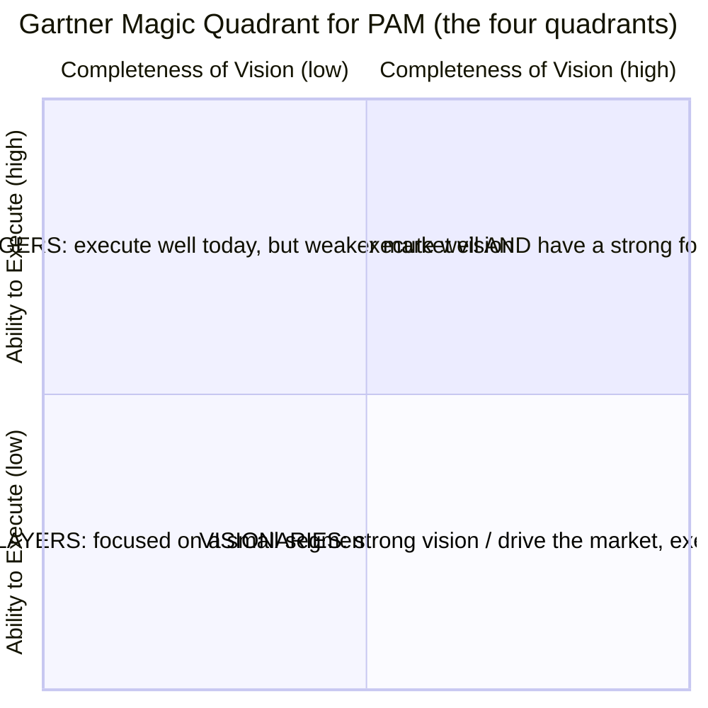
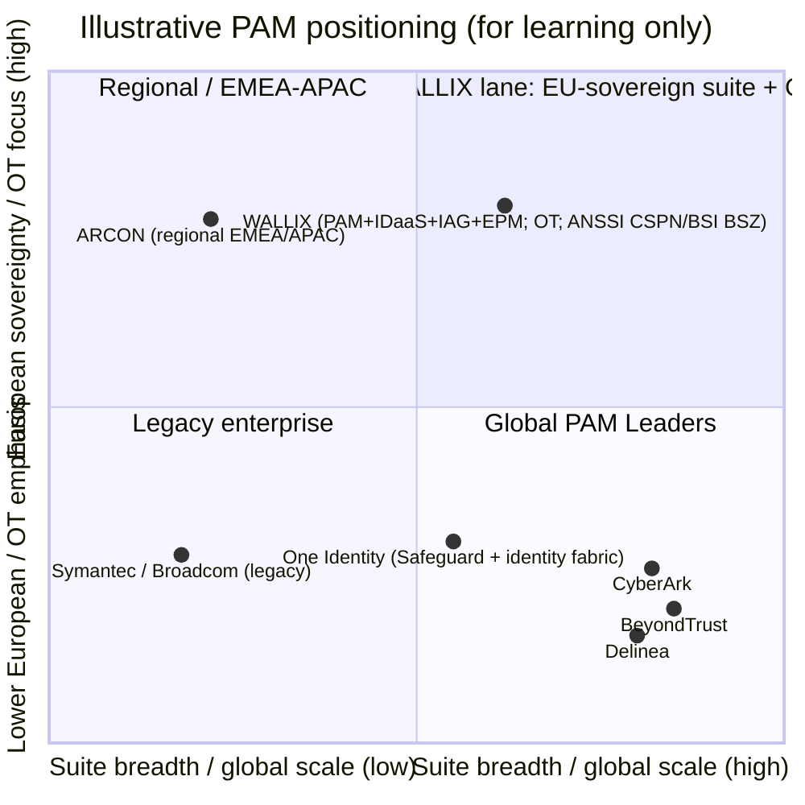

# The PAM Market Landscape — Vendors, Analysts, and WALLIX's Position

*Compiled 2026-06-17 from analyst press summaries, vendor product pages, and WALLIX press releases. Placements and rankings change every year — each one below is tagged with the year of the report it comes from. Where a fact could not be confirmed in the sources consulted, it is marked "not specified in sources."*

This page is written for a systems administrator beginning a cybersecurity career in **Privileged Access Management (PAM)**. It explains the two analyst frameworks buyers rely on, compares the major vendors factually, and shows where **WALLIX** — the European (French) PAM vendor whose certifications this repository documents — sits in that market and why.

For the WALLIX product details referenced throughout, see [../docs/00-overview/product-portfolio.md](../wallix/overview/product-portfolio.md). For how a sysadmin builds toward a PAM role, see [../career/sysadmin-to-pam-roadmap.md](../wallix/career/sysadmin-to-pam-roadmap.md).

---

## Key points

- **PAM (Privileged Access Management)** is a mature, consolidated market with a small number of large global vendors and several regional specialists.
- Two analyst frameworks dominate buyer shortlists: the **Gartner Magic Quadrant (MQ) for PAM** and the **KuppingerCole Leadership Compass for PAM**.
- In the **2025 Gartner MQ for PAM**, the Leaders were **CyberArk, BeyondTrust, and Delinea**; **WALLIX** was a **Visionary** (its third consecutive year as a Visionary, 2023–2025) and is described as the **only European vendor** in the quadrant.
- In the **KuppingerCole Leadership Compass for PAM 2026**, **WALLIX** was named an **Overall Leader** for the **fifth consecutive year**, alongside the usual global leaders.
- WALLIX's differentiators are **European digital sovereignty**, sovereign security certifications (**ANSSI CSPN** in France, **BSI BSZ** in Germany), simplicity and an SME/mid-market focus, strong **OT (Operational Technology)** coverage, and an integrated suite (**PAM + IDaaS + IAG + EPM**).

---

## Acronyms used on this page

| Acronym | Expansion | One-line meaning |
|---|---|---|
| **PAM** | Privileged Access Management | Securing, brokering, and auditing high-privilege accounts/sessions |
| **MQ** | Magic Quadrant | Gartner's 2-axis vendor positioning chart |
| **PASM** | Privileged Account & Session Management | Vaulting credentials + brokering/recording sessions |
| **PEDM** | Privilege Elevation & Delegation Management | Least-privilege/elevation on endpoints and servers |
| **JIT** | Just-in-Time (access) | Privilege granted only for a task, then revoked |
| **ZSP** | Zero Standing Privileges | No permanent admin rights left lying around |
| **EPM** | Endpoint Privilege Management | Removing local admin / controlling app privileges on endpoints |
| **IDaaS** | Identity-as-a-Service | Cloud SSO / MFA / federation |
| **IAG / IGA** | Identity & Access Governance / Identity Governance & Administration | "Who has access to what, and should they?" |
| **OT** | Operational Technology | Industrial control systems (ICS/SCADA/PLCs) |
| **CPS** | Cyber-Physical Systems | Systems bridging the digital and physical (OT + IoT) |
| **SaaS** | Software-as-a-Service | Vendor-hosted, subscription, auto-updated |
| **ANSSI** | Agence nationale de la sécurité des systèmes d'information | France's national cybersecurity agency |
| **CSPN** | Certification de Sécurité de Premier Niveau | ANSSI's first-level security certification |
| **BSI** | Bundesamt für Sicherheit in der Informationstechnik | Germany's federal cybersecurity office |
| **BSZ** | Beschleunigte Sicherheitszertifizierung | BSI's "accelerated security certification" |
| **NIS2 / DORA** | Network & Information Security Directive 2 / Digital Operational Resilience Act | EU cybersecurity regulations driving PAM demand |

---

## 1. What PAM is, and why analysts rank it

Privileged accounts (root, domain admin, service accounts, cloud IAM roles, OT engineering logins) are the keys to the kingdom: stolen or misused privileged credentials are a leading breach vector. A PAM platform typically provides:

- a **vault** for privileged credentials and secrets, with automatic rotation;
- a **session broker/proxy** that connects an admin to a target without exposing the password, and **records** the session;
- **JIT** access and **least-privilege**/**ZSP** controls to remove standing admin rights;
- **audit** trails for compliance.

Because every regulated organization needs this and the products are complex, buyers lean heavily on independent analyst evaluations to build shortlists. The two that matter most in PAM are Gartner's Magic Quadrant and KuppingerCole's Leadership Compass.

---

## 2. The analyst frameworks

### 2.1 Gartner Magic Quadrant (MQ) for PAM

The **Magic Quadrant** is Gartner's signature comparison chart. It plots vendors on **two axes** and splits the field into **four quadrants**:

- **Ability to Execute** (vertical axis) — financial viability, market responsiveness, product maturity, sales/support, customer base. *How well do they deliver today?*
- **Completeness of Vision** (horizontal axis) — innovation and understanding of where the market is going. *Do they lead or follow the market?*

- **Leaders (upper-right):** execute well and are well positioned for the future.
- **Challengers (upper-left):** execute strongly today but show less market vision.
- **Visionaries (lower-right):** understand or drive where the market is heading, but do not yet execute as broadly (often smaller, more innovative, or regionally focused).
- **Niche Players (lower-left):** succeed in a specific segment, or are still building out.

> **Reading tip:** "Visionary" is **not** a lesser grade than "Leader" on the same scale — it means strong *vision* with narrower *execution/scale* (frequently a smaller or regional vendor). For a buyer who values innovation and fit over sheer global footprint, Visionaries are legitimate shortlist candidates.

**WALLIX in the Gartner MQ for PAM:**

| Report year | WALLIX placement | Notes |
|---|---|---|
| 2022 | **Leader** | Per WALLIX company communications (see product portfolio). |
| 2023 | **Visionary** | First of three consecutive Visionary years. |
| 2024 | **Visionary** | |
| 2025 | **Visionary** (3rd consecutive year) | Report published 13 Oct 2025; WALLIX press release 14 Oct 2025. WALLIX states it remains the **only European player** represented in the quadrant. Cited strengths: **WALLIX One Remote Access** (all major session protocols), **OT/CPS** (industrial / cyber-physical) coverage, and customer proximity. |

In the **2025** edition, the **Leaders** were **CyberArk, BeyondTrust, and Delinea** (CyberArk positioned furthest in Completeness of Vision; BeyondTrust highest in Ability to Execute). **One Identity** was also a **Visionary** alongside WALLIX. *(Source: vendor press releases below; the full quadrant graphic is behind Gartner's paywall.)*

### 2.2 KuppingerCole Leadership Compass for PAM

**KuppingerCole** is a European (German) analyst firm. Its **Leadership Compass** evaluates a market and rates vendors across **four leadership categories** rather than a single chart:

- **Product Leadership** — functional completeness of the product.
- **Innovation Leadership** — forward-looking capabilities and roadmap.
- **Market Leadership** — customer base, partner ecosystem, financial/market reach.
- **Overall Leadership** — a combined view of the three above.

A vendor named an **Overall Leader** scores strongly across all dimensions. The PAM Leadership Compass evaluates a large field — **35+ vendors** in the 2026 edition.

**WALLIX in the KuppingerCole Leadership Compass for PAM:**

| Report year | WALLIX placement | Notes |
|---|---|---|
| Through **2026** edition | **Overall Leader — 5th consecutive year** | 2026 edition published 28 May 2026; 35+ vendors evaluated. Cited strengths: **agentless** identity/session management, **OT/industrial** support (called a "rare differentiator"), Web Session Manager (browser-based access), metadata-enriched session recording with real-time alerts, standing-privilege reduction, and **alignment with European digital sovereignty**. KuppingerCole notes WALLIX is "particularly relevant for organizations with strong European assurance requirements." |

> **Why two frameworks differ for the same vendor:** Gartner's single MQ blends scale-heavy "execution" with "vision," so a strong-but-smaller regional vendor like WALLIX lands as a **Visionary**. KuppingerCole rates **Product/Innovation/Market separately** and combines them, so the same vendor can reach **Overall Leader**. Neither is "wrong" — they weight market footprint differently. Always read the *year* and the *methodology*, not just the label.

---

## 3. Major PAM vendors — balanced comparison

The table below is a factual snapshot for orientation, not an endorsement. "Adjacent" rows are tools often discussed alongside PAM but whose primary job is different (secrets management or cloud privileged identity), included because buyers frequently compare them.

| Vendor / Product | Primary focus | Deployment | Notable strengths | Typical buyer |
|---|---|---|---|---|
| **CyberArk** (Privileged Access Manager; Privilege Cloud) | Full-suite PAM + broader Identity Security platform | SaaS **and** self-hosted (on-prem / private / public cloud) | Most widely deployed enterprise PAM; deep vaulting, session isolation, JIT/ZSP; endpoint-to-cloud-to-DevOps breadth under one platform; **2025 Gartner Leader** | Large enterprises, regulated industries, complex multi-cloud estates |
| **BeyondTrust** (Password Safe; Privileged Remote Access; Privilege Management) | Full-suite PAM with strong remote-access and endpoint privilege | SaaS, on-prem, hybrid (virtual/physical appliances; AWS/Azure) | Strong session recording/audit; secure remote access; flexible deployment; **2025 Gartner Leader** (often cited highest in Ability to Execute) | Enterprises prioritizing third-party/remote access and session visibility |
| **Delinea** (Secret Server; Privilege Manager; Connection Manager; Cloud Suite) | Full-suite PAM; ease-of-use heritage | SaaS (Secret Server Cloud) **and** on-prem | Formed Apr 2021 from the **Thycotic + Centrify** merger (rebranded Delinea 2022); Secret Server vaulting is widely adopted and quick to deploy; **2025 Gartner Leader** | Mid-market to enterprise wanting fast time-to-value |
| **One Identity** (Safeguard) | PAM (PASM) within the One Identity Fabric (IAM/IGA/AD mgmt) | Appliance / virtual / cloud | Vaulting + session management + behavioral analytics; integrates with broader identity governance; **2025 Gartner Visionary** | Organizations standardizing on the One Identity ecosystem |
| **ARCON** (PAM) | PAM with built-in analytics | On-prem and cloud | Access control, MFA/SSO, session mgmt, JIT, ITDR; AI/ML anomaly detection ("Knight Analytics"); strong in EMEA/APAC/Middle East | Cost-sensitive enterprises in emerging markets; regional buyers |
| **Broadcom / Symantec** (Symantec Privileged Access Manager) | PAM within Broadcom's enterprise security portfolio | On-prem and cloud (appliance-based) | Originally CA Technologies; vaulting, session management, granular access; integrates with the wider Broadcom/Symantec stack | Existing Broadcom/Symantec enterprise customers |
| **HashiCorp Vault** *(adjacent — secrets management)* | Machine/application **secrets management**, dynamic secrets, PKI, encryption-as-a-service | Self-managed (Enterprise) or managed (HCP Vault); cloud-agnostic | De facto standard for app/DevOps secrets; **dynamic, short-lived credentials**; broad multi-cloud reach | DevOps/platform teams securing application-to-application secrets |
| **Microsoft Entra Privileged Identity Management (PIM)** *(adjacent — cloud privileged identity)* | **JIT, time-/approval-based activation** of privileged roles | SaaS (part of Microsoft Entra ID / ID Governance) | Native JIT role activation and access reviews for Entra ID, Azure, Microsoft 365/Intune; tight Microsoft ecosystem fit | Microsoft-centric orgs governing cloud admin roles |
| **WALLIX** (Bastion; WALLIX One; Trustelem; IAG; BestSafe) | Full-suite PAM + integrated identity security, **European-sovereign**, IT **and** OT | On-prem, private/public cloud, **SaaS** (WALLIX One), hybrid; **agentless** on targets | European sovereignty + sovereign certifications (ANSSI CSPN, BSI BSZ); simplicity/SME focus; strong **OT** coverage; integrated **PAM + IDaaS + IAG + EPM**; **2025 Gartner Visionary**, **KuppingerCole Overall Leader (2026)** | European public sector, SMEs/mid-market, industrial/OT operators, sovereignty-sensitive buyers |

> **Caveats:** Vendor product names and deployment options evolve; confirm current details on each vendor's site. The "typical buyer" column is generalized positioning. Gartner placements cited are from the **2025** MQ specifically.

---

## 4. WALLIX differentiators

WALLIX competes less on raw scale (where CyberArk/BeyondTrust/Delinea lead) and more on **sovereignty, simplicity, and breadth of integrated coverage**.

| Differentiator | What it means | Why it matters |
|---|---|---|
| **European digital sovereignty** | French vendor; solutions developed in Europe; data residency in EU data centers; the **only European vendor** in the Gartner MQ for PAM (per WALLIX, 2025). | EU public sector and regulated firms increasingly require sovereign suppliers (avoiding exposure to non-EU jurisdiction). Aligns with **NIS2** and **DORA**. |
| **Sovereign security certifications** | **ANSSI CSPN** (France) on WALLIX Bastion; **BSI BSZ** (Germany) awarded **29 Sep 2025** on WALLIX PAM **v12.0.14** — with **ANSSI↔BSI mutual recognition** so one certification is honored in both countries. WALLIX states it is the only PAM vendor certified via the BSI BSZ process recognized in both Germany and France. | Independent, government-grade assurance — a procurement gate for sovereign and critical-infrastructure buyers. *(No Common Criteria EAL level is confirmed in sources — see product portfolio.)* |
| **Simplicity & SME/mid-market focus** | Agentless on targets; fast deployment; SaaS delivery via **WALLIX One** aimed at organizations without large security teams ("WALLIX takes care of it for you"). | Lowers the skills/effort barrier — attractive where the cybersecurity skills shortage bites hardest. |
| **OT / industrial security** | **PAM4OT** under the *OT.security by WALLIX* brand; agentless access to PLCs/HMIs; industrial-protocol encapsulation in SSH; alliances with Schneider Electric, Cisco, Nozomi. Analysts (Gartner 2025, KuppingerCole 2026) call OT/CPS coverage a genuine differentiator. | Industrial operators need privileged-access control without disrupting production — an area many IT-only PAM tools cover weakly. |
| **Integrated suite (PAM + IDaaS + IAG + EPM)** | One vendor across **Bastion (PAM)**, **Trustelem (IDaaS — SSO/MFA)**, **IAG (governance, ex-Kleverware)**, and **BestSafe (EPM/PEDM)**. | Fewer vendors to integrate; converges PAM with identity governance and endpoint least-privilege under a single roof. |

See [../docs/00-overview/product-portfolio.md](../wallix/overview/product-portfolio.md) for the full technical detail and certification caveats behind each of these.

---

## 5. A simple positioning sketch

This is an **illustrative** sketch (not a reproduction of any analyst chart) to help a newcomer visualize where vendors tend to sit. Horizontal axis = **breadth/scale of the global suite**; vertical axis = **European sovereignty / regional + OT focus**. Positions are approximate and for learning only.

Adjacent tools (different primary job, often compared to PAM, sitting outside the core PAM box):

| Tool | Primary job |
|---|---|
| **HashiCorp Vault** | machine/app secrets, dynamic creds (DevOps) |
| **Microsoft Entra PIM** | JIT activation of cloud admin roles (Microsoft ecosystem) |

**How to read it:** The global **Leaders** (CyberArk, BeyondTrust, Delinea) dominate the high-scale right side. **WALLIX** occupies the upper-right blend of **suite breadth plus European sovereignty and OT** — the lane that earns it "Visionary" at Gartner and "Overall Leader" at KuppingerCole. The adjacent tools sit outside the core PAM box because their primary purpose is secrets management (Vault) or cloud-role JIT (Entra PIM), not full session-brokering PAM.

---

## 6. Takeaways for a PAM career starter

- **Learn the leaders' concepts, not just one product.** Vaulting, session brokering/recording, JIT, ZSP, and PEDM are universal across CyberArk, BeyondTrust, Delinea, and WALLIX — skills transfer.
- **Know the frameworks by name and year.** Saying "WALLIX was a Gartner *Visionary* in the 2025 MQ and a KuppingerCole *Overall Leader* in 2026" is precise; "WALLIX is top-rated" is not.
- **Sovereignty and OT are growth lanes.** EU regulation (NIS2, DORA) and industrial security are where European specialists like WALLIX differentiate — useful context if you target EU public-sector or industrial employers.
- **Adjacent tools are not substitutes.** Expect to integrate PAM with secrets managers (Vault) and cloud-identity JIT (Entra PIM) rather than replace one with the other.

Next: [../career/sysadmin-to-pam-roadmap.md](../wallix/career/sysadmin-to-pam-roadmap.md).

---

## Sources

- Gartner — Magic Quadrant Research Methodology: https://www.gartner.com/en/research/methodologies/magic-quadrants-research
- Gartner — Magic Quadrant for Privileged Access Management (document landing): https://www.gartner.com/en/documents/7051198
- WALLIX — "Recognized as a Visionary for the third consecutive year in the 2025 Gartner Magic Quadrant for PAM Solutions": https://www.wallix.com/press/wallix-recognized-as-a-visionary-for-the-third-consecutive-year-in-the-2025-gartner-magic-quadrant-for-pam-solutions/
- Euronext — WALLIX 2025 Gartner Visionary (company news, 14 Oct 2025): https://live.euronext.com/en/products/equities/company-news/2025-10-14-wallix-recognized-visionary-third-consecutive-year-2025
- CyberArk — "Named a Leader in the 2025 Gartner Magic Quadrant for PAM": https://www.cyberark.com/press/cyberark-named-a-leader-in-the-2025-gartner-magic-quadrant-for-privileged-access-management/
- BeyondTrust — 2025 Gartner Magic Quadrant for PAM: https://www.beyondtrust.com/blog/entry/gartner-pam-magic-quadrant
- Delinea — "Named a Leader in 2025 Gartner Magic Quadrant for PAM for seventh consecutive time": https://delinea.com/news/delinea-named-a-leader-in-2025-gartner-magic-quadrant-for-pam-for-seventh-consecutive-time
- One Identity — "Named a Visionary in the 2025 Gartner Magic Quadrant for PAM": https://www.oneidentity.com/analyst-report/one-identity-is-named-a-visionary-in-the-2025-gartner-magic-quadrant-for-pam/
- KuppingerCole — Leadership Compass: Privileged Access Management: https://www.kuppingercole.com/research/lc80830/privileged-access-management
- WALLIX — "Recognized for the fifth consecutive year as an Overall Leader in KuppingerCole's Leadership Compass PAM 2026": https://www.wallix.com/press/wallix-recognized-for-the-fifth-consecutive-year-as-an-overall-leader-in-kuppingercole-s-leadership-compass-pam-2026/
- CyberArk — Privileged Access Manager product page: https://www.cyberark.com/products/privileged-access-manager/
- BeyondTrust — Password Safe: https://www.beyondtrust.com/products/password-safe
- BeyondTrust — Privileged Remote Access: https://www.beyondtrust.com/products/privileged-remote-access
- Delinea — "ThycoticCentrify is now Delinea" (merger/rebrand): https://delinea.com/news/thycoticcentrify-is-now-delinea
- Thoma Bravo / TPG — "TPG Announces merger of Thycotic and Centrify": https://delinea.com/news/tpg-led-investor-group-announces-combination-thycotic-and
- One Identity — Safeguard: https://www.oneidentity.com/one-identity-safeguard/
- Broadcom — Symantec Privileged Access Manager: https://www.broadcom.com/products/identity/pam
- ARCON / industry overview — Top PAM companies 2026: https://gbhackers.com/best-privileged-access-management-pam-companies/
- HashiCorp Vault vs. Microsoft Entra ID (comparison): https://www.g2.com/compare/hashicorp-vault-vs-microsoft-azure-active-directory
- Microsoft Learn — "What is Privileged Identity Management?" (Entra PIM): https://learn.microsoft.com/en-us/entra/id-governance/privileged-identity-management/pim-configure
- WALLIX — "Achieves dual certifications in Germany and France (ANSSI CSPN / BSI BSZ)": https://www.wallix.com/press/wallix-achieves-dual-certifications-in-germany-and-france-reinforcing-its-position-as-a-trusted-european-cybersecurity/
- Actusnews — WALLIX dual certification (8 Oct 2025, BSZ on v12.0.14, 29 Sep 2025): https://www.actusnews.com/en/wallix/pr/2025/10/08/wallix-achieves-dual-certifications-in-germany-and-france-reinforcing-its-position-as-a-trusted-european-cybersecurity-partner
- Magic Quadrant overview (background): https://en.wikipedia.org/wiki/Magic_Quadrant
