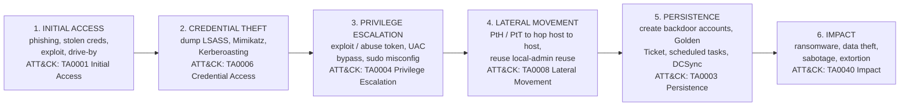
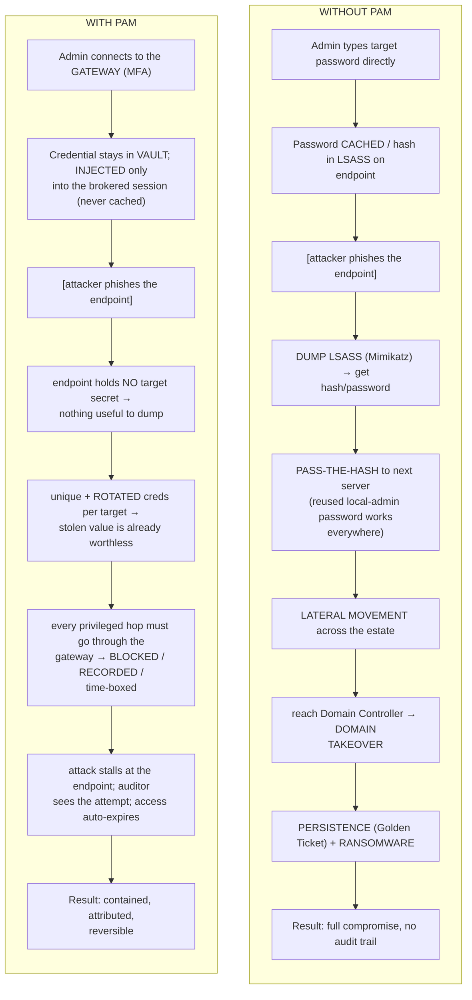

# The PAM Threat Landscape

Why privileged accounts are the attacker's favourite target, the **attack chain**
they follow to reach and abuse them, the specific **techniques** they use (phishing,
Pass-the-Hash, Kerberoasting, credential dumping, and more), how those map to
**MITRE ATT&CK** tactics, and — most importantly — **how Privileged Access
Management (PAM) mitigates each one**. Two flow diagrams: the attack kill-chain, and
a "with vs without PAM" comparison.

> Background: [what-is-pam.md](what-is-pam.md) and
> [privileged-accounts-and-credentials.md](privileged-accounts-and-credentials.md).

## Learning objectives

- Explain *why* privileged accounts are disproportionately attacked.
- Recite the **attack chain**: initial access → credential theft → privilege
  escalation → lateral movement → persistence → impact.
- Define the headline techniques (**PtH, PtT, Kerberoasting, Golden/Silver Ticket,
  credential dumping / LSASS / Mimikatz**) in plain language.
- Map each stage and technique to **MITRE ATT&CK** tactics.
- Describe the specific PAM control that breaks each stage.

---

## 1. Why privileged accounts are attacked

An attacker rarely wants the first machine they land on — they want **control**. The
fastest route to control is a **privileged credential**, because it lets them act as a
trusted insider. Three reasons make privileged accounts the prize:

1. **Maximum blast radius.** One Domain Admin credential can equal control of the
   entire Windows estate. (See the catastrophic-risk rows in
   [privileged-accounts-and-credentials.md](privileged-accounts-and-credentials.md#2-catalogue-of-privileged-account-types-with-risk).)
2. **Blend-in / "living off the land."** Using legitimate admin credentials and
   built-in tools looks like normal administration, evading detection. In ATT&CK terms,
   reusing real accounts is **Valid Accounts (T1078)**.
3. **Soft targets exist.** Shared, default, hard-coded, and never-rotated credentials
   (the "villains" of the previous page) are everywhere and easy to harvest.

> **Acronyms:** **PtH** = Pass-the-Hash · **PtT** = Pass-the-Ticket ·
> **LSASS** = Local Security Authority Subsystem Service (Windows process holding
> credential material) · **NTLM** = NT LAN Manager (hash-based auth) ·
> **KDC** = Key Distribution Center · **TGT/TGS** = Ticket-Granting Ticket / Service ·
> **C2** = Command-and-Control · **DCSync** = a technique to replicate AD password data.
> Full list: [reference/acronyms.md](../reference/acronyms.md).

---

## 2. The attack chain (kill-chain)

The stages below combine the Lockheed Martin **Cyber Kill Chain** idea with
**MITRE ATT&CK** tactic names. Privileged credentials are the fuel for the middle
stages.

> The middle four stages (2–5) all turn on PRIVILEGED CREDENTIALS. That is where PAM
> intervenes. (Left → right = the attacker's journey.)

**Reading the chain:** the attacker gets a foothold (1), steals a credential (2),
escalates to a more powerful one (3), uses it to move across the network (4),
entrenches so they survive reboots and password changes (5), then acts on their
objective (6). **Stages 2–5 are exactly what PAM is built to disrupt.**

---

## 3. The headline techniques (plain-language)

| Technique | What it is, in plain words | Targets |
|---|---|---|
| **Phishing** | Trick a user into giving up a password or running malware (the usual *initial access*). | Any user; ideally an admin |
| **Credential dumping / LSASS / Mimikatz** | Scrape credential material (password hashes, tickets, plaintext) from memory — especially the Windows **LSASS** process — using tools like **Mimikatz**. | Logged-on credentials on a host |
| **Pass-the-Hash (PtH)** | Authenticate using a stolen **NTLM password hash** *without ever cracking it* — the hash itself is the key. | NTLM auth across Windows hosts |
| **Pass-the-Ticket (PtT)** | Reuse a stolen **Kerberos ticket** (TGT/TGS) to impersonate a user without the password. | Kerberos auth in AD |
| **Kerberoasting** | Request service tickets for **service accounts**, then crack them *offline* to recover the service-account password. | Service accounts with weak passwords |
| **Golden Ticket** | Forge a TGT using the AD **krbtgt** account's key — grants near-unlimited, long-lived domain access. | Whole AD domain (post-DA) |
| **Silver Ticket** | Forge a TGS for one specific service using that service's key — quieter, scoped to one service. | A single service/host |
| **DCSync** | Impersonate a domain controller to pull password hashes (incl. krbtgt) via replication. | AD directory (enables Golden Ticket) |

> These are **credential-centric** attacks. The common thread: they all rely on a
> usable secret (hash, ticket, or password) being **present on an endpoint** the
> attacker controls, or being **weak enough to crack**. Remove the secret from the
> endpoint, rotate it constantly, and require strong unique secrets — and most of these
> collapse. That is the PAM thesis.

---

## 4. Map to MITRE ATT&CK + how PAM mitigates each

**MITRE ATT&CK** is the industry-standard knowledge base of adversary tactics
(the *why*, e.g. "Credential Access") and techniques (the *how*, e.g. "OS Credential
Dumping, T1003"). Mapping defences to ATT&CK shows coverage gaps clearly.

| Technique | ATT&CK ID | ATT&CK tactic | How PAM mitigates it |
|---|---|---|---|
| **Phishing** | T1566 | Initial Access | Stolen *standard* password is useless for privileged targets — privileged access requires going through the **gateway + MFA**, and there is **no target password to phish** (it lives in the vault). |
| **Credential dumping / LSASS** | T1003 | Credential Access | **Credential injection** + brokering mean the **target password never lands on the admin's endpoint**, so there is little of value to dump. Frequent **rotation** voids anything scraped. |
| **Pass-the-Hash (PtH)** | T1550.002 | Lateral Movement / Defense Evasion | No standing local-admin secret on endpoints; **unique, rotated** credentials per account/host stop hash reuse across machines. EPM removes local-admin to begin with. |
| **Pass-the-Ticket (PtT)** | T1550.003 | Lateral Movement | Sessions are **brokered and time-boxed (JIT)**; short-lived access + recording limit ticket reuse and make abuse visible. |
| **Kerberoasting** | T1558.003 | Credential Access | **Vault + automatic rotation** give service accounts **long, random, frequently-changed** passwords that cannot be cracked offline in time. |
| **Golden / Silver Ticket** | T1558.001 / .002 | Persistence / Cred. Access | PAM doesn't forge-proof Kerberos itself, but by **preventing the Domain-Admin compromise** that enables krbtgt theft (no standing DA, brokered+recorded access), it removes the precondition. |
| **DCSync** | T1003.006 | Credential Access | Same logic: blocking the path to high-privilege accounts denies the replication rights DCSync needs. |
| **Valid Accounts (reuse)** | T1078 | Defense Evasion / Persistence | **Check-out/check-in + recording + JIT** mean every privileged use is attributed, time-limited, and auditable — reuse is no longer silent. |

> **Honest framing (flag):** PAM is a powerful *control layer*, not a magic shield.
> Golden Ticket and DCSync are post-compromise AD attacks that also need AD hardening
> (tiering, Protected Users, `krbtgt` rotation, monitoring). PAM's contribution is to
> **make the high-privilege compromise that precedes them far harder**, and to make any
> abuse **visible and reversible**. Defense-in-depth still applies.

---

## 5. FLOW — with vs. without PAM

The clearest way to see PAM's value is to run the same attack against two environments.

> MFA = Multi-Factor Authentication · LSASS = Local Security Authority Subsystem Service.

**The single sentence to remember:** *PAM breaks the attack chain at stages 2–5 by
keeping the credential out of the attacker's reach (vault + injection), making any
stolen secret short-lived (rotation), forcing every privileged hop through a recorded
gateway (brokering + JIT), and making everything auditable (non-repudiation).*

The complementary **endpoint** control — removing local admin so there is no
standing privilege to escalate or reuse in the first place — is **Endpoint Privilege
Management (EPM)**; WALLIX delivers it via BestSafe. See
[pam-iam-iga-idaas-epm.md](pam-iam-iga-idaas-epm.md) and the
[product portfolio](../docs/00-overview/product-portfolio.md#4-wallix-bestsafe--endpoint-privilege-management-epm).

---

## 6. Key takeaways

- Attackers chase **privileged credentials** because they give maximum control and let
  them blend in as trusted insiders.
- The attack chain — **initial access → credential theft → privilege escalation →
  lateral movement → persistence → impact** — turns on credentials in its middle stages.
- Credential-centric techniques (**PtH, PtT, Kerberoasting, Golden/Silver Ticket,
  LSASS dumping**) all depend on a usable secret sitting on a controlled endpoint or
  being weak enough to crack.
- PAM mitigates them with **vaulting, credential injection, aggressive rotation,
  brokered + JIT access, and full recording/audit** — mapped cleanly to MITRE ATT&CK.
- PAM is a control layer within **defense-in-depth**, not a replacement for AD
  hardening and detection.

---

## See also

- [What is PAM?](what-is-pam.md)
- [Privileged accounts & credentials](privileged-accounts-and-credentials.md)
- [Core concepts: least privilege, JIT, Zero Trust](core-concepts-least-privilege-jit-zero-trust.md)
- [PAM vs IAM / IGA / IDaaS / EPM](pam-iam-iga-idaas-epm.md)
- [WALLIX product portfolio](../docs/00-overview/product-portfolio.md)
- [Acronyms](../reference/acronyms.md) · [Glossary](../reference/glossary.md)

---

## Sources

- MITRE ATT&CK — Enterprise matrix (tactics & techniques): https://attack.mitre.org/matrices/enterprise/
- MITRE ATT&CK — OS Credential Dumping (T1003): https://attack.mitre.org/techniques/T1003/
- MITRE ATT&CK — Use Alternate Authentication Material: Pass-the-Hash (T1550.002): https://attack.mitre.org/techniques/T1550/002/
- MITRE ATT&CK — Pass-the-Ticket (T1550.003): https://attack.mitre.org/techniques/T1550/003/
- MITRE ATT&CK — Steal or Forge Kerberos Tickets (T1558), incl. Golden/Silver Ticket & Kerberoasting: https://attack.mitre.org/techniques/T1558/
- MITRE ATT&CK — Phishing (T1566): https://attack.mitre.org/techniques/T1566/
- MITRE ATT&CK — Valid Accounts (T1078): https://attack.mitre.org/techniques/T1078/
- Lockheed Martin — Cyber Kill Chain: https://www.lockheedmartin.com/en-us/capabilities/cyber/cyber-kill-chain.html
- WALLIX Bastion product page (PAM as breach mitigation): https://www.wallix.com/products/privileged-access-management/
- Verizon Data Breach Investigations Report (DBIR): https://www.verizon.com/business/resources/reports/dbir/
- ENISA Threat Landscape: https://www.enisa.europa.eu/topics/cyber-threats/threats-and-trends
