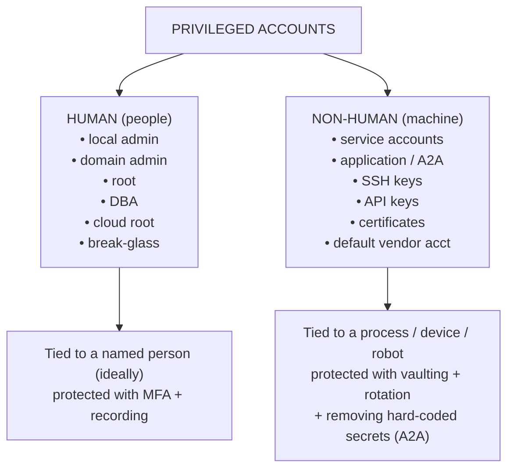
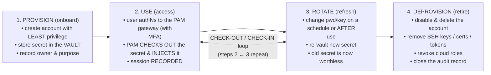
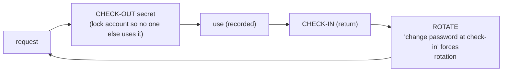

# Privileged Accounts & Credentials

The "things" that **Privileged Access Management (PAM)** protects. This page
catalogues the types of **privileged accounts** you will meet in a real environment,
the **credential types** that authenticate them, and the **risk** each one carries.
A flow diagram traces the **privileged-account lifecycle** — provision, use, rotate,
deprovision.

> Read [what-is-pam.md](what-is-pam.md) first if "privileged access" is new to you.
> For *how* attackers go after these accounts, see
> [pam-threat-landscape.md](pam-threat-landscape.md).

## Learning objectives

- Distinguish the major **types of privileged account** and the risk of each.
- Tell **human** accounts apart from **non-human / machine** accounts (service, A2A).
- List the common **credential types** (password, SSH key, API key, certificate…).
- Understand why **shared, default, and standing** accounts are so dangerous.
- Walk the **provision → use → rotate → deprovision** lifecycle and where PAM hooks in.

---

## 1. Two big families: human vs. non-human

Before the catalogue, fix this distinction in your head — it drives everything in PAM.

> DBA = Database Administrator · A2A = Application-to-Application · MFA = Multi-Factor
> Authentication.

> **Why it matters:** non-human accounts often **vastly outnumber human ones** (industry reports commonly cite ratios on the order of 10:1 or higher),
> rarely get their passwords changed, frequently have credentials *hard-coded* in
> scripts, and almost never have MFA. They are a quiet, sprawling attack surface — and a
> core reason PAM emphasizes the **vault** and **automatic rotation** pillars.

---

## 2. Catalogue of privileged account types (with risk)

| Account type | Family | What it is | Why it is privileged | Risk if compromised |
|---|---|---|---|---|
| **Local administrator** | Human | `Administrator` on a single Windows host; member of local `Administrators` | Full control of that machine | Beachhead for malware; if the *same* local-admin password is reused across machines, enables mass **lateral movement** |
| **Domain / Enterprise Admin** | Human | Top AD groups (`Domain Admins`, `Enterprise Admins`) | Controls the entire Windows domain/forest | **Catastrophic** — full takeover of all domain-joined systems |
| **root (UNIX/Linux)** | Human | UID 0 superuser | Unrestricted control of the host | Total host compromise; tamper with logs, install rootkits |
| **Service account** | Non-human | Identity a service/daemon runs under (Windows service, systemd unit) | Often high privilege, runs unattended 24/7 | Rarely rotated, no MFA, password often known to many; prime **Kerberoasting** target |
| **Application / A2A account** | Non-human | Credential one app uses to call another (app→database, app→API) | Holds standing access to back-end systems | If **hard-coded** in source/config, it leaks via code repos, backups, memory |
| **Break-glass / emergency** | Human | Highly privileged account for "in case of disaster" | Bypasses normal controls during an outage | If left unmonitored, an unaudited master key; if neglected, password drifts/expires |
| **Shared / generic** | Human | One account used by many people (e.g. shared `admin`) | Convenient, so often over-used | **Destroys accountability** (no non-repudiation); leaks widely; never reliably changed |
| **Default vendor account** | Non-human | Built-in account shipped by a vendor (`admin/admin`, `cisco/cisco`, `sa`) | Frequently high privilege | Publicly documented credentials; first thing attackers and bots try |
| **Cloud root / superuser** | Human | The master account of a cloud tenant (AWS *root user*, Azure Global Admin, GCP Org Admin) | Can do *anything* in the tenant, incl. billing & delete-all | **Catastrophic** cloud takeover; should be locked away with hardware MFA and used almost never |
| **Cloud IAM role / policy** | Non-human | Assumable role or attached policy granting cloud permissions | Grants programmatic privilege to workloads/users | Over-broad roles enable privilege escalation; managed by **CIEM** discipline |
| **SSH key (private)** | Credential | Asymmetric key pair; the private half authenticates to UNIX/Linux/network gear | Often grants passwordless root/admin login | Keys rarely inventoried/rotated; a stolen private key is a silent skeleton key |
| **API key / token** | Credential | Long string proving a caller's identity to an API | Programmatic access, often broad scope | Leaks in code/logs/URLs; usually no expiry, no MFA |
| **Certificate (X.509) / signing key** | Credential | PKI certificate + private key for auth, TLS, or code signing | Establishes trust/identity machine-to-machine | Stolen signing keys let attackers sign malware as "trusted"; expiry causes outages |

> **The cross-cutting villains:** *shared*, *default*, *hard-coded*, and *never-rotated*
> credentials. PAM exists largely to kill these four patterns — by **vaulting**,
> **injecting** (so humans never see secrets), and **rotating** them.

For the WALLIX data model that represents many of these (accounts, domains, devices,
services, the vault), see the
[Bastion ACL data model](../wallix/overview/product-portfolio.md#core-pam-concepts--the-acl-data-model).

---

## 3. Credential types — how an account proves who it is

An **account** is *who*; a **credential** is *what it presents* to authenticate. PAM
must vault, inject, and rotate each credential type differently.

| Credential | Used by | Notes / PAM handling |
|---|---|---|
| **Password / passphrase** | Humans & service accounts | Vaulted, complexity-enforced, auto-rotated; never shown when injected |
| **SSH key pair** | UNIX/Linux/network admins, automation | Private key vaulted; public key on targets; rotate by regenerating pairs |
| **API key / bearer token** | Apps, scripts, CI/CD | Vaulted and retrieved at runtime via API instead of hard-coding |
| **X.509 certificate + private key** | TLS, machine auth, code signing | Vaulted with the key; watch expiry; supports signed-cert checkout in some PAM tools |
| **Kerberos ticket (TGT/TGS)** | Windows/AD logon | Not vaulted, but PAM reduces exposure (no password on the endpoint to steal) |
| **OTP / MFA factor** | Humans, second factor | A *step-up*, not a primary secret; provided by IDaaS/MFA, consumed at the PAM gateway |
| **Smart card / hardware token** | High-assurance human auth | Physical possession factor; used to authenticate to the PAM gateway |

> **Acronyms:** **OTP** = One-Time Password · **MFA** = Multi-Factor Authentication ·
> **TGT/TGS** = Ticket-Granting Ticket / Ticket-Granting Service (Kerberos) ·
> **PKI** = Public Key Infrastructure · **CI/CD** = Continuous Integration / Continuous
> Delivery · **CIEM** = Cloud Infrastructure Entitlement Management ·
> **TLS** = Transport Layer Security. Full list:
> [reference/acronyms.md](../reference/acronyms.md).

---

## 4. FLOW — the privileged-account lifecycle

Every privileged account should travel a controlled lifecycle. Without PAM, accounts
get *provisioned* and then live forever ("standing" privilege). With PAM, the
credential is vaulted at birth, injected (never exposed) during use, rotated on a
schedule or after every use, and cleanly retired at the end.

The CHECK-OUT / CHECK-IN model (zoom on steps 2–3):

> authN = authenticate · MFA = Multi-Factor Authentication.

**Where PAM adds value at each stage:**

1. **Provision** — Create the account with the *minimum* rights needed (Principle of
   Least Privilege) and immediately place its secret in the vault. The human owner is
   recorded for accountability.
2. **Use** — The user authenticates to the *gateway*, the secret is **checked out** and
   **injected** into the session, and the whole session is **recorded**. The user never
   learns the password.
3. **Rotate** — The secret is changed automatically — on a schedule, or (stronger)
   **after every single check-out**. A leaked password becomes useless almost
   immediately. This is the core of **credential rotation**.
4. **Deprovision** — When the person leaves or the system is retired, the account is
   disabled/deleted, keys and tokens revoked, cloud roles removed, and the audit record
   closed. This prevents **orphaned accounts** — a classic blind spot that governance
   tools (IGA/IAG) also hunt for.

The **check-out / check-in** loop (with optional account locking and "change password
at check-in") is exactly how WALLIX Bastion's Password Manager implements steps 2–3 —
see the
[Bastion password/secrets management section](../wallix/overview/product-portfolio.md#password--secrets-management).

---

## 5. Quick decision guide — "is this account privileged?"

| Can the account ... | Verdict |
|---|---|
| ... administer an OS, directory, DB, hypervisor, or cloud? | **PRIVILEGED — vault it** (YES) |
| ... read or modify data belonging to other users? | **PRIVILEGED — vault it** (YES) |
| ... run unattended automation with elevated rights? | **PRIVILEGED — vault it** (YES, non-human) |
| ... change security settings or disable logging? | **PRIVILEGED — vault it** (YES) |
| ... unlock other systems (holds a key/cert/API token)? | **PRIVILEGED — vault it** (YES, credential) |
| Otherwise | standard user (managed by IAM/IDaaS, not PAM) |

---

## 6. Key takeaways

- Privileged accounts split into **human** and **non-human (machine)** families; the
  machine side is larger, quieter, and often neglected.
- The most dangerous patterns are **shared**, **default vendor**, **hard-coded**, and
  **never-rotated** credentials.
- Credentials come in several forms — **passwords, SSH keys, API keys, certificates,
  Kerberos tickets** — each vaulted, injected, and rotated differently.
- The healthy lifecycle is **provision → use → rotate → deprovision**, with a
  **check-out / check-in** loop and rotation in the middle.
- PAM's job is to *vault the secret, inject it without revealing it, rotate it
  aggressively, and retire it cleanly.*

---

## See also

- [What is PAM?](what-is-pam.md)
- [PAM threat landscape](pam-threat-landscape.md) — how each account type is attacked.
- [Core concepts: least privilege, JIT, vaulting, rotation](core-concepts-least-privilege-jit-zero-trust.md)
- [PAM vs IAM / IGA / IDaaS / EPM / CIEM](pam-iam-iga-idaas-epm.md)
- [WALLIX product portfolio](../wallix/overview/product-portfolio.md)
- [Acronyms](../reference/acronyms.md) · [Glossary](../reference/glossary.md)

---

## Sources

- WALLIX Bastion datasheet (2021): https://www.wallix.com/wp-content/uploads/2021/10/DATASHEET_2021_BASTION_EN.pdf
- WALLIX Bastion Functional Administration Guide (served v12.3.2): https://pam.wallix.one/documentation/admin-doc/bastion_en_administration_guide.pdf
- NIST SP 800-63B Digital Identity Guidelines (authenticators/credentials): https://pages.nist.gov/800-63-3/sp800-63b.html
- NIST SP 800-53 Rev. 5 (AC-2 Account Management, AC-6 Least Privilege): https://csrc.nist.gov/pubs/sp/800/53/r5/upd1/final
- CISA — Identity & Access Management / default credentials guidance: https://www.cisa.gov/topics/cybersecurity-best-practices/identity-and-access-management
- AWS — Root user best practices: https://docs.aws.amazon.com/IAM/latest/UserGuide/best-practices.html
- MITRE ATT&CK — Valid Accounts (T1078): https://attack.mitre.org/techniques/T1078/
- Gartner — Privileged Access Management glossary: https://www.gartner.com/en/information-technology/glossary/privileged-access-management-pam
