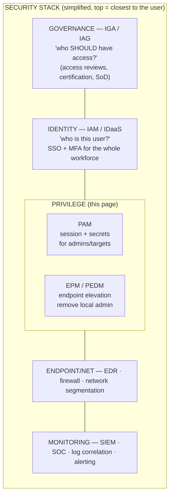
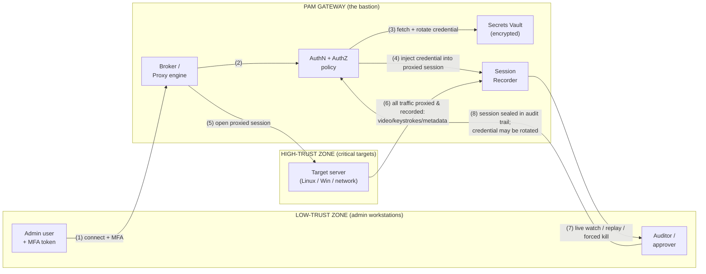

# What Is Privileged Access Management (PAM)?

A first-principles introduction for a system administrator moving into
cybersecurity. This page defines **Privileged Access Management (PAM)**, explains
what makes access "privileged," states why PAM exists, walks through the pillars
that every PAM solution is built on, and shows where PAM sits in the wider security
stack. A flow diagram traces how a single privileged session travels through a PAM
gateway.

> This is a *concepts* page. It is product-neutral. For how WALLIX implements these
> ideas (Bastion, Access Manager, the Vault), see the
> [product portfolio](../docs/00-overview/product-portfolio.md).

## Learning objectives

- Define **privileged access** and **PAM** in plain language.
- Explain *why* PAM is a distinct discipline from ordinary identity management.
- Name and describe the six **PAM pillars**.
- Read a flow diagram of a brokered privileged session.
- Place PAM correctly inside the security stack relative to IAM, MFA, and EDR.

---

## 1. First principles: what is "privileged access"?

Every account on a system has a set of **permissions** — what it is allowed to do.
Most accounts are *unprivileged*: a normal user can read their own email, edit their
own documents, and little else. **Privileged access** is access that can change the
system itself, bypass security controls, reach other people's data, or affect many
users at once.

Concretely, an account is **privileged** when it can do one or more of these:

| Capability | Example |
|---|---|
| Administer an operating system | `root` on Linux, `Administrator` on Windows |
| Manage a directory of identities | **Domain Admin** in Active Directory (AD) |
| Configure infrastructure | Switches, routers, firewalls, hypervisors |
| Read or change *anyone's* data | Database administrator (DBA) accounts |
| Run automation with elevated rights | **Service accounts**, scripts, robots |
| Control cloud tenants | Cloud **root** account, broad IAM roles |
| Hold a secret that unlocks other systems | SSH keys, API keys, signing certificates |

The common thread: **a privileged account, if misused, can cause damage far beyond
its single owner.** That is exactly why attackers want it (see
[the PAM threat landscape](pam-threat-landscape.md)) and why it needs special
controls.

> **Acronyms used here:**
> **PAM** = Privileged Access Management · **IAM** = Identity & Access Management ·
> **AD** = Active Directory · **DBA** = Database Administrator ·
> **MFA** = Multi-Factor Authentication · **EDR** = Endpoint Detection & Response ·
> **SIEM** = Security Information & Event Management ·
> **JIT** = Just-In-Time · **A2A** = Application-to-Application.
> Full list: [reference/acronyms.md](../reference/acronyms.md).

---

## 2. What is Privileged Access Management (PAM)?

> **Privileged Access Management (PAM)** is the cybersecurity discipline — and the
> category of tools — that **controls, secures, monitors, and audits all access by
> privileged accounts to critical systems.** Its goal is to make sure that *the right
> person uses the right privileged account, on the right target, at the right time,
> for the right reason — and that everything they do is recorded and reversible.*

PAM is **not** the same as ordinary IAM. IAM answers *"who is this user, and which
applications may they log into?"* for the whole workforce. PAM zooms in on the small,
dangerous subset of access that can break or take over the infrastructure, and applies
much stronger controls to it. (The full landscape — IAM, IGA, IDaaS, EPM, CIEM — is
disambiguated in
[pam-iam-iga-idaas-epm.md](pam-iam-iga-idaas-epm.md).)

A useful one-line mental model:

```
PAM = a controlled gateway + a secrets vault + a session recorder + an audit trail
```

---

## 3. Why does PAM exist? (The problem it solves)

Before PAM, organizations managed privileged access with shared spreadsheets of
passwords, sticky notes, "the admin password everyone knows," and standing accounts
that never expired. That model fails in five ways:

1. **Credential theft is the #1 breach vector.** Industry breach studies (e.g.
   Verizon's annual *Data Breach Investigations Report*) repeatedly show that stolen
   or abused credentials are involved in a large share of breaches. Privileged
   credentials are the most valuable of all.
2. **Shared accounts destroy accountability.** If five admins share one `root`
   password, you cannot prove *who* did what — there is no **non-repudiation**.
3. **Standing privilege is a standing target.** An always-on admin account is a
   permanent attack surface, whether it is used once a year or every hour.
4. **No recording = no forensics.** Without session recording you cannot reconstruct
   an incident or satisfy an auditor.
5. **Compliance demands it.** Regulations and frameworks expect controlled,
   audited privileged access — e.g. NIST SP 800-53 (AC-6 Least Privilege),
   ISO/IEC 27001, PCI DSS, the EU **NIS2** Directive, and **DORA** for finance.

PAM exists to replace that broken model with **brokered, vaulted, recorded,
time-limited** privileged access.

---

## 4. The pillars of PAM

Every credible PAM solution rests on these six pillars. Think of them as the
"job description" of the discipline.

| # | Pillar | Plain-language job | What it stops |
|---|---|---|---|
| 1 | **Discover & inventory** | Continuously find every privileged account, asset, secret, and SSH key | Unknown / forgotten "shadow" admin accounts |
| 2 | **Vault secrets** | Store passwords, keys, and certificates in an encrypted vault; rotate them automatically | Hard-coded, shared, never-changed passwords |
| 3 | **Broker & proxy access** | Stand between the user and the target so the user never touches the real credential | Credential theft from the admin's machine |
| 4 | **Monitor & record sessions** | Capture every privileged session as video/transcript; allow live watch and forced cut-off | Untraceable, unsupervised admin activity |
| 5 | **Audit** | Produce a tamper-resistant log + dashboards + SIEM feed of who-did-what-when | "We don't know what happened" after a breach |
| 6 | **Enforce least privilege & JIT** | Grant only the minimum rights, only when needed, then auto-revoke | Standing, always-on, over-broad privilege |

These map directly to the deeper
[core concepts page](core-concepts-least-privilege-jit-zero-trust.md)
(Least Privilege, JIT, Zero Standing Privileges, four-eyes, vaulting, non-repudiation).

### A note on each pillar

- **Discover & inventory** — You cannot protect what you do not know exists. PAM
  scanners sweep directories, hosts, databases, and cloud tenants to find privileged
  accounts and credentials.
- **Vault secrets** — The vault is an encrypted store. Critically, it can **rotate**
  (change) a secret automatically on a schedule or after each use, so a leaked
  password is quickly worthless.
- **Broker & proxy access** — This is the heart of PAM. A *proxy* (also called a
  *gateway*, *jump host*, or **bastion**) injects the credential into the connection
  on the user's behalf. The human never sees or types the target password.
- **Monitor & record sessions** — Recording gives **non-repudiation** (proof of who
  did what) and forensics. Real-time monitoring allows an auditor to watch — or even
  kill — a live session.
- **Audit** — Beyond recordings, PAM emits structured logs to a **SIEM** for
  correlation, alerting, and compliance reporting.
- **Enforce least privilege & JIT** — Rather than permanent admin rights, access is
  granted **Just-In-Time** for a task and expires automatically. The ideal end state
  is **Zero Standing Privileges (ZSP)**.

---

## 5. Where PAM sits in the security stack

PAM is one layer in a defense-in-depth stack. It is closely related to identity tools
but plays a distinct, narrower, deeper role.



> **Acronyms:** IGA = Identity Governance & Administration · IAG = Identity & Access
> Governance · IAM = Identity & Access Management · IDaaS = Identity-as-a-Service ·
> SSO = Single Sign-On · MFA = Multi-Factor Authentication · EPM = Endpoint Privilege
> Management · PEDM = Privilege Elevation & Delegation Mgmt · EDR = Endpoint Detection &
> Response · SIEM = Security Information & Event Mgmt · SoD = Separation of Duties.

- **PAM relies on IAM/IDaaS** to authenticate the human in the first place (often via
  **SSO** and **MFA**) — then takes over for the privileged leg of the journey.
- **PAM feeds the SIEM** with session and audit events.
- **PAM complements EPM/PEDM**: PAM controls the *session* to a target; EPM controls
  *privilege on the endpoint itself* (removing local admin). WALLIX pairs Bastion (PAM)
  with BestSafe (EPM) under its "PAM4ALL" least-privilege vision — see the
  [product portfolio](../docs/00-overview/product-portfolio.md#4-wallix-bestsafe--endpoint-privilege-management-epm).

---

## 6. FLOW — how a privileged session travels through a PAM gateway

This is the single most important diagram in PAM. A user wants to administer a target
server. Instead of connecting directly, the connection is **brokered** through the PAM
gateway, which authenticates the user, fetches the target credential from the vault,
**injects** it (so the user never sees it), proxies the protocol (RDP/SSH/etc.), and
**records** everything.



**STEP-BY-STEP**

1. User connects to the GATEWAY (never to the target). Identity proven with MFA.
2. Gateway checks AuthN (who you are) + AuthZ (are you allowed THIS target now?).
3. Gateway retrieves the target's credential from the VAULT (and may rotate it).
4. Gateway INJECTS the credential into the connection — the user never sees it.
5. Gateway opens the proxied session to the target on the user's behalf.
6. Every keystroke / screen is RECORDED; metadata streamed for analysis.
7. An auditor can watch LIVE, or replay later, or force-terminate the session.
8. On disconnect: session sealed in the audit trail; credential may be rotated.

> AuthN = Authentication (who you are) · AuthZ = Authorization (what you may do) ·
> MFA = Multi-Factor Authentication.

**Why this design is powerful:** the admin's workstation (a low-trust, malware-prone
environment) **never holds the target credential** and **never has a direct path** to
the target. Even if the workstation is compromised, the attacker cannot extract a
target password from it, and cannot reach the target except through the recorded,
policed gateway.

For the WALLIX-specific realization of this flow (Session Manager, Password
Manager/Vault, Access Manager, credential injection, "Redemption" RDP proxy), see the
[product portfolio Bastion section](../docs/00-overview/product-portfolio.md#1-wallix-bastion--privileged-access-management-pam).

---

## 7. Key takeaways

- **Privileged access** is access that can change the system, bypass controls, or
  affect many users — and is therefore the prime target for attackers.
- **PAM** controls, secures, monitors, and audits that access through a brokered
  gateway, an encrypted vault, session recording, and time-limited grants.
- The six pillars are **discover, vault, broker/proxy, monitor/record, audit,
  least-privilege/JIT**.
- PAM sits *below* governance (IGA/IAG) and *beside* endpoint privilege (EPM/PEDM),
  *consumes* identity from IAM/IDaaS, and *feeds* the SIEM.
- The defining mechanic: **the user never sees the credential and never has a direct
  path to the target.**

---

## See also

- [Privileged accounts & credentials](privileged-accounts-and-credentials.md) — the
  account types PAM protects.
- [PAM threat landscape](pam-threat-landscape.md) — why these accounts are attacked.
- [Core concepts: least privilege, JIT, Zero Trust](core-concepts-least-privilege-jit-zero-trust.md)
- [PAM vs IAM / IGA / IDaaS / EPM](pam-iam-iga-idaas-epm.md) — the acronym soup.
- [WALLIX product portfolio](../docs/00-overview/product-portfolio.md)
- [Acronyms](../reference/acronyms.md) · [Glossary](../reference/glossary.md)

---

## Sources

- WALLIX — Privileged Access Management product page: https://www.wallix.com/products/privileged-access-management/
- WALLIX Bastion datasheet (2021): https://www.wallix.com/wp-content/uploads/2021/10/DATASHEET_2021_BASTION_EN.pdf
- NIST SP 800-53 Rev. 5 (AC-6 Least Privilege): https://csrc.nist.gov/pubs/sp/800/53/r5/upd1/final
- NIST SP 800-207 Zero Trust Architecture: https://csrc.nist.gov/pubs/sp/800/207/final
- Gartner — Privileged Access Management (PAM) glossary definition: https://www.gartner.com/en/information-technology/glossary/privileged-access-management-pam
- Verizon Data Breach Investigations Report (DBIR) — credential-driven breaches: https://www.verizon.com/business/resources/reports/dbir/
- ISO/IEC 27001 (information security management): https://www.iso.org/standard/27001
- EU NIS2 Directive (Directive (EU) 2022/2555): https://eur-lex.europa.eu/eli/dir/2022/2555/oj
