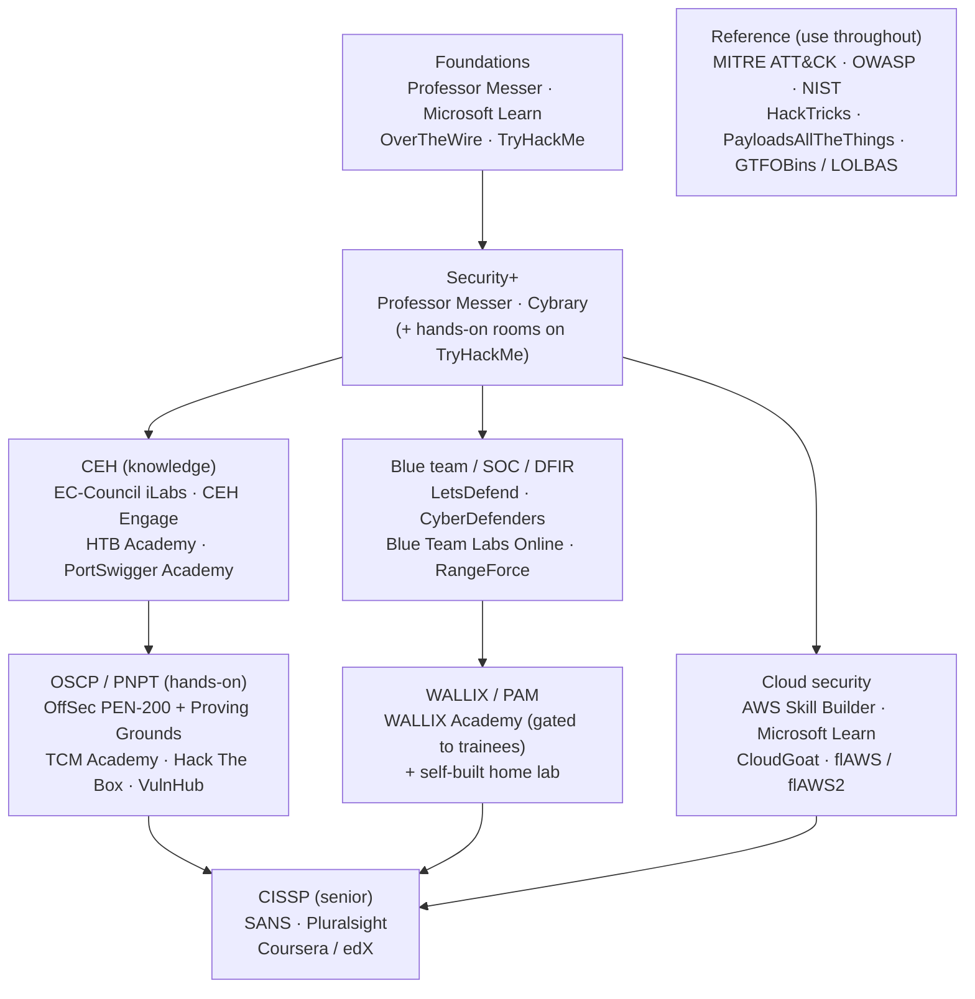

# Best Platforms to Learn and Practice Cybersecurity

A curated, honest guide to the strongest third-party platforms for **learning** and
**practising** cybersecurity, grouped by purpose and mapped to this repo's
[learning roadmap](learning-roadmap.md). It is aimed at a systems administrator moving into
security who wants to know where to actually build skill — not just read about it. Free
options are highlighted throughout, and offensive practice is deliberately balanced with
defensive (blue-team) practice.

> **These are independent third-party platforms, not WALLIX or this repo.** Details change.
> Anything volatile — pricing, exact subscription tiers, free-vs-paid boundaries — is stated
> only in general terms; always **check current pricing on each platform's own site** before
> committing. This page is the broader master list; the CEH hands-on subset lives in
> [ceh/labs/practice-ranges.md](ceh/labs/practice-ranges.md).

> **Authorised use only.** The hands-on offensive platforms below are legal to attack
> **only inside the platform's own provided environment** (its hosted labs, its downloadable
> vulnerable VMs run in your isolated lab, or your own cloud account for cloud-security tools).
> Pointing these techniques at any system you do not own or are not explicitly authorised to
> test is illegal in most jurisdictions. See
> [ceh/00-overview/legal-and-ethics.md](ceh/00-overview/legal-and-ethics.md).

## Learning objectives

- Identify reputable platforms for each stage and purpose of a security learning path.
- Distinguish course/training platforms from hands-on practice ranges.
- Prefer free, hands-on resources first, and balance offensive practice with defensive.
- Map a platform (or two) to each step of the [roadmap](learning-roadmap.md).

## Foundations and exam-prep courses

Structured courses and certification preparation — the "read and watch" layer. Pair every one
of these with hands-on practice from the sections below; passive study alone does not build
skill.

| Platform | What it is | Free / paid | Best for | Link |
| --- | --- | --- | --- | --- |
| Professor Messer | Free instructional video courses for CompTIA certs (A+, Network+, Security+), with quizzes | Both — videos free; optional paid notes/practice-exam bundles | Self-studying CompTIA [Security+](adjacent-certs/security-plus.md) on a budget | https://www.professormesser.com |
| Microsoft Learn | Microsoft's official training: modules and paths for Azure, Microsoft Security, and the SC-/AZ- certifications, with hands-on sandboxes | Both — training content free; exams paid | Microsoft/Azure identity and cloud-security paths | https://learn.microsoft.com |
| AWS Skill Builder | Amazon's official cloud-skills centre: on-demand courses, learning plans, labs, and AWS exam prep | Both — large free catalogue; paid subscription adds labs/practice exams | AWS cloud and AWS security foundations | https://skillbuilder.aws |
| TCM Security Academy | Affordable hands-on courses and cert pathways (Practical Ethical Hacking, PNPT) from TCM Security | Both — some free fundamentals; paid courses / all-access membership | Budget-friendly offensive learning and the [PNPT](adjacent-certs/pnpt.md) | https://tcm-sec.com/academy/ |
| Cybrary | Online security education: cert-prep courses, virtual labs, and career/skill paths | Both — free intro content; paid subscription and business plans | Broad self-paced cert prep and skill paths | https://www.cybrary.it |
| INE (formerly eLearnSecurity) | Scenario-based networking and security training; INE Security now offers the eJPT / eCPPT certs | Primarily paid — subscription plans; limited free demos | Lab-driven offensive learning and INE certs | https://ine.com |
| Pluralsight | Broad tech-skills platform with expert-led courses and hands-on labs across cloud, security, and IT | Both — free trial; paid individual/enterprise plans | Filling specific topic gaps across a wide catalogue | https://www.pluralsight.com |
| Coursera / edX | University- and company-backed MOOC platforms with courses, professional certificates, and degrees | Both — audit/preview free; certificates and programs paid | Structured, accredited intro courses and specialisations | https://www.coursera.org · https://www.edx.org |
| SANS Institute | Premium instructor-led training across offence, defence, DFIR, cloud, and ICS; exam-prep partner for GIAC certs | Both — paid courses are the core; free webinars, whitepapers, posters, and tools | Employer-funded, deep, practitioner-grade training | https://www.sans.org |

## Hands-on hacking ranges (offensive)

Hosted vulnerable machines and challenges where you practise the attacker's perspective.
**Authorised use applies — attack only the platform's provided targets.** Start guided
(TryHackMe), then move to open-ended boxes.

| Platform | What it is | Free / paid | Best for | Link |
| --- | --- | --- | --- | --- |
| TryHackMe | Browser-based, beginner-friendly guided "rooms" and learning paths covering networking, Linux, and ethical hacking | Both — free rooms; paid premium subscription | Your first hands-on steps; gentle, structured practice | https://tryhackme.com |
| Hack The Box | Subscription platform of hosted vulnerable machines and challenges for open-ended practice | Both — free community labs; paid subscriptions | Realistic, less-guided boxes once fundamentals click | https://www.hackthebox.com |
| Hack The Box Academy | HTB's structured, curriculum-driven training with modules, skill paths, and certifications | Both — free tier; paid skill paths and certs | Guided theory + practice alongside the HTB labs | https://academy.hackthebox.com |
| OffSec Proving Grounds | Pentest lab platform — PG Play (free, community machines) and PG Practice (paid, OffSec-designed, Windows/Linux/macOS) | Both — PG Play free; PG Practice paid | [OSCP](adjacent-certs/oscp.md)-style practice and exam warm-up | https://www.offsec.com/products/proving-grounds/ |
| pwn.college | Free hands-on education (belt/dojo progression) maintained by a team at Arizona State University | Free | Binary exploitation and low-level fundamentals | https://pwn.college |
| VulnHub | Library of downloadable, intentionally vulnerable VMs you run in your own isolated lab | Free | Fully offline practice in your [home lab](ceh/labs/building-a-ceh-lab.md) | https://www.vulnhub.com |

## Web security

The single best place to learn web-application security, and it is free.

| Platform | What it is | Free / paid | Best for | Link |
| --- | --- | --- | --- | --- |
| PortSwigger Web Security Academy | Free, best-in-class interactive web-security training with browser-based vulnerable labs, from the makers of Burp Suite | Free (pairs with free Burp Suite Community Edition) | Learning web vulnerabilities hands-on, start to finish | https://portswigger.net/web-security |

## Blue team / defensive / SOC / DFIR

Most beginners over-index on offence. These platforms build the defensive, SOC (Security
Operations Centre), and DFIR (Digital Forensics and Incident Response) skills that most
security jobs — including a PAM/identity engineer's — actually use day to day.

| Platform | What it is | Free / paid | Best for | Link |
| --- | --- | --- | --- | --- |
| LetsDefend | Hands-on blue-team training in a simulated SOC environment (courses, labs, alert triage); now part of Hack The Box | Both — free intro courses; paid subscription tiers | Practising the day-to-day SOC analyst workflow | https://letsdefend.io |
| CyberDefenders | Blue-team and DFIR platform with labs and real-world incident/CTF scenarios | Both — free labs/challenges; paid certs and enterprise plans | Forensics, threat hunting, and incident analysis | https://cyberdefenders.org |
| Blue Team Labs Online (BTLO) | Gamified defensive challenges and investigations (IR, DFIR, threat hunting), by Security Blue Team | Both — free challenges; paid PRO unlocks investigations | Defensive practice for those with some experience | https://blueteamlabs.online |
| RangeForce | Cloud-based defensive cyber range using real security tools, aimed at teams and enterprises | Both — a free edition exists; core offering is enterprise | Team/employer-led SOC and IR exercises | https://www.rangeforce.com |

## Wargames and CTF (Capture The Flag)

Free, gamified fundamentals and competitions — great for sharpening specific skills cheaply.

| Platform | What it is | Free / paid | Best for | Link |
| --- | --- | --- | --- | --- |
| OverTheWire | Free SSH-based "wargames" teaching security from Linux basics to binary exploitation (start with "Bandit") | Free (donation-supported) | Command-line and fundamentals warm-up | https://overthewire.org/wargames/ |
| picoCTF | Free CTF education from Carnegie Mellon University, with the year-round picoGym and an annual competition | Free | Beginner-to-intermediate CTF practice | https://picoctf.org |
| CTFtime | Aggregator/tracker for CTF competitions worldwide — calendar, team rankings, and writeups | Free | Finding live competitions and learning from writeups | https://ctftime.org |

## Cloud security practice

Practise attacking and defending cloud misconfigurations. **Authorised use:** these run in
**your own** cloud account or a sandbox the project provides — never against someone else's
account. Deploying the AWS tools may incur charges in your own account.

| Platform | What it is | Free / paid | Best for | Link |
| --- | --- | --- | --- | --- |
| CloudGoat | Open-source "vulnerable by design" tool (Rhino Security Labs) that deploys intentionally vulnerable AWS/Azure environments for CTF-style practice | Free (open source; your own cloud usage costs apply) | Hands-on cloud-attack scenarios in your own account | https://github.com/RhinoSecurityLabs/cloudgoat |
| flAWS / flAWS2 | Free interactive challenges (Scott Piper / Summit Route) teaching AWS-specific misconfigurations; flAWS2 adds attacker and defender paths | Free | Guided, no-setup intro to AWS security mistakes | http://flaws.cloud · http://flaws2.cloud |
| Microsoft Learn sandboxes | Free, time-boxed Azure sandboxes inside Microsoft Learn modules for hands-on practice without your own subscription | Free (within Microsoft Learn) | Practising Azure/identity tasks safely | https://learn.microsoft.com |

## Vendor / certification-specific

Official environments tied to a specific certification. See each cert's overview under
[adjacent-certs/](adjacent-certs/README.md).

| Platform | What it is | Free / paid | Best for | Link |
| --- | --- | --- | --- | --- |
| EC-Council iLabs · CEH Engage · CEH Compete | Official CEH practical components — a virtualised lab range (iLabs), a four-phase mock engagement (Engage), and monthly CTF challenges (Compete) | Paid (part of the CEH program) | Practice aligned to the [CEH](ceh/README.md) curriculum | https://www.eccouncil.org/train-certify/certified-ethical-hacker-ceh/ |
| OffSec PEN-200 (OSCP) | OffSec's hands-on penetration-testing course and lab that prepares you for the OSCP/OSCP+ exam | Paid (course + labs + exam bundles) | The [OSCP](adjacent-certs/oscp.md) journey | https://www.offsec.com/courses/pen-200/ |
| TCM Security Academy (PNPT) | The Practical Ethical Hacking path and PNPT exam from TCM Security | Both — free fundamentals; paid courses/exam | The [PNPT](adjacent-certs/pnpt.md), an affordable practical cert | https://tcm-sec.com/academy/ |
| WALLIX Academy | WALLIX's official training and certification for its products (PAM/Bastion, plus IAG/IDaaS/OT), across the WCA-P → WCP-P → WCE-P levels | Paid instructor-led training; some free partner e-learning | The WALLIX/PAM certs — see the [WALLIX hub](README.md) | https://www.wallix.com/support-services/wallix-academy/ |

> **WALLIX Academy labs are gated to enrolled trainees.** This repo's
> [labs/README.md](labs/README.md) and [home-lab build](labs/building-a-home-lab.md) explain
> what you can practise on a self-built AD + Windows + Linux substrate where the official
> labs are not available to you.

## Reference / knowledge bases

Free references you will return to constantly. GTFOBins and LOLBAS catalogue
"living-off-the-land" techniques — **for use only on systems you are explicitly authorised
to test.**

| Resource | What it is | Free / paid | Best for | Link |
| --- | --- | --- | --- | --- |
| MITRE ATT&CK | Free knowledge base of real-world adversary tactics and techniques | Free | Modelling attacks and mapping them to defences | https://attack.mitre.org |
| OWASP | Nonprofit application-security resources: the OWASP Top 10, cheat sheets, ASVS, and tools | Free | Web/app security fundamentals and standards | https://owasp.org |
| NIST CSRC | The US standards body's cybersecurity guidance — the Cybersecurity Framework and SP 800-series | Free | Frameworks, controls, and authoritative definitions | https://csrc.nist.gov |
| HackTricks | Community pentest/red-team methodology wiki (web, cloud, privilege escalation, and more) | Free | A practical "how do I attack this?" reference | https://book.hacktricks.xyz |
| PayloadsAllTheThings | Community GitHub repo of payloads and bypass techniques across many vulnerability classes | Free | A payload/technique cheat-sheet during practice | https://github.com/swisskyrepo/PayloadsAllTheThings |
| GTFOBins | Reference of Unix binaries abusable to bypass local restrictions (living-off-the-land) | Free | Unix privilege-escalation lookups (authorised use only) | https://gtfobins.org |
| LOLBAS | The Windows equivalent of GTFOBins — abusable Windows binaries/scripts, mapped to ATT&CK | Free | Windows living-off-the-land lookups (authorised use only) | https://lolbas-project.github.io |

## Which platform at which stage

Aligned to the [learning roadmap](learning-roadmap.md). Pick one or two per stage rather than
spreading thin.

## How to choose

- **Free first.** You can get a long way before paying: Professor Messer, PortSwigger Web
  Security Academy, the free tiers of TryHackMe and Hack The Box, pwn.college, OverTheWire,
  picoCTF, LetsDefend's intro content, and every reference above are free.
- **Hands-on beats passive.** Watching a course is not learning a skill. Treat courses as
  scaffolding and spend most of your time on labs, ranges, and CTFs.
- **Balance offence with defence.** It is easy to chase only hacking platforms. For most
  roles — including a [PAM/identity engineer](README.md) — defensive practice
  (LetsDefend, CyberDefenders, Blue Team Labs Online) is at least as valuable.
- **Match the platform to the cert.** Use the vendor-specific environments
  (EC-Council for CEH, OffSec for OSCP, TCM for PNPT, WALLIX Academy for the PAM certs) when
  you are preparing for that specific exam.
- **As a sysadmin, you start ahead.** Your OS, networking, and Active Directory experience
  transfers directly — move quickly through the beginner material and dwell on the
  attacker's-perspective and detection parts that are new to you.

## Where to go next

- [learning-roadmap.md](learning-roadmap.md) — the certification path these platforms support.
- [ceh/labs/practice-ranges.md](ceh/labs/practice-ranges.md) — the CEH hands-on subset of this list.
- [ceh/labs/building-a-ceh-lab.md](ceh/labs/building-a-ceh-lab.md) — build the isolated home lab the offline platforms complement.
- [labs/README.md](labs/README.md) — the WALLIX/PAM hands-on lab pages.
- [adjacent-certs/README.md](adjacent-certs/README.md) — overviews of the certs the vendor platforms map to.

## Sources

- Professor Messer — https://www.professormesser.com
- Microsoft Learn — https://learn.microsoft.com
- AWS Skill Builder — https://skillbuilder.aws
- TCM Security Academy — https://tcm-sec.com/academy/
- Cybrary — https://www.cybrary.it
- INE — https://ine.com
- Pluralsight — https://www.pluralsight.com
- Coursera — https://www.coursera.org
- edX — https://www.edx.org
- SANS Institute — https://www.sans.org
- TryHackMe — https://tryhackme.com
- Hack The Box — https://www.hackthebox.com
- Hack The Box Academy — https://academy.hackthebox.com
- OffSec Proving Grounds — https://www.offsec.com/products/proving-grounds/
- OffSec PEN-200 — https://www.offsec.com/courses/pen-200/
- pwn.college — https://pwn.college
- VulnHub — https://www.vulnhub.com
- PortSwigger Web Security Academy — https://portswigger.net/web-security
- LetsDefend — https://letsdefend.io
- CyberDefenders — https://cyberdefenders.org
- Blue Team Labs Online — https://blueteamlabs.online
- RangeForce — https://www.rangeforce.com
- OverTheWire wargames — https://overthewire.org/wargames/
- picoCTF — https://picoctf.org
- CTFtime — https://ctftime.org
- CloudGoat (Rhino Security Labs) — https://github.com/RhinoSecurityLabs/cloudgoat
- flAWS — http://flaws.cloud · flAWS2 — http://flaws2.cloud
- EC-Council Certified Ethical Hacker (CEH) — https://www.eccouncil.org/train-certify/certified-ethical-hacker-ceh/
- WALLIX Academy — https://www.wallix.com/support-services/wallix-academy/
- MITRE ATT&CK — https://attack.mitre.org
- OWASP — https://owasp.org
- NIST Computer Security Resource Center — https://csrc.nist.gov
- HackTricks — https://book.hacktricks.xyz
- PayloadsAllTheThings — https://github.com/swisskyrepo/PayloadsAllTheThings
- GTFOBins — https://gtfobins.org
- LOLBAS — https://lolbas-project.github.io
