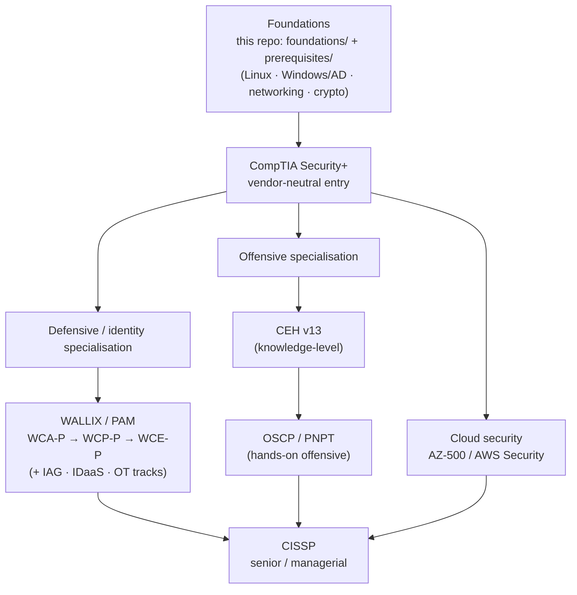

# Cybersecurity Certification Learning Roadmap

A suggested path that ties this repo's hubs together — from systems-administration
fundamentals to a privileged-access / blue-team specialisation, with offensive, cloud, and
senior tracks alongside. It connects the **[WALLIX/PAM](../README.md)**, **[CEH](../ceh/README.md)**,
and **[adjacent-cert](../adjacent-certs/README.md)** material into one journey.

> *This is **suggested guidance**, not a prescriptive or official path — order it to your
> goals and employer. Certification specifics change; verify on each provider's site. No
> salary/demand figures are asserted here.*

## Learning objectives

- See how the certifications relate (entry → specialise → senior).
- Know which repo section supports each stage.

## The path

## Stage → repo resources

| Stage | What & why | In this repo |
|-------|-----------|--------------|
| **0 · Foundations** | The infrastructure PAM and security sit on | [foundations/](../foundations/README.md) · [prerequisites/](../prerequisites/README.md) · [protocols/](../protocols/README.md) |
| **1 · Entry** | Broad, vendor-neutral baseline (Security+) | [adjacent-certs/security-plus.md](../adjacent-certs/security-plus.md) |
| **2a · Identity / PAM** | Specialise in privileged access (the repo's core) | [WALLIX hub](../README.md) · [PAM/Bastion track](../docs/pam-bastion/README.md) · [deep dives](../deep-dives/README.md) |
| **2b · Offensive** | Understand the attacker (CEH → hands-on) | [CEH hub](../ceh/README.md) → [OSCP](../adjacent-certs/oscp.md) · [PNPT](../adjacent-certs/pnpt.md) |
| **2c · Cloud** | Secure cloud identities & workloads | [adjacent-certs/cloud-security.md](../adjacent-certs/cloud-security.md) · [CEH cloud module](../ceh/domains/19-cloud-computing.md) |
| **3 · Senior** | Breadth & management | [adjacent-certs/cissp.md](../adjacent-certs/cissp.md) |

> 🧰 **Where to practice each stage:** see **[learning-platforms.md](platforms.md)** —
> the best platforms (free & paid) for every step, from Professor Messer and TryHackMe to
> Hack The Box, PortSwigger, blue-team ranges, and cloud labs.

## How the offensive and defensive sides reinforce each other

A PAM engineer who understands the [attack chain](../ceh/domains/01-introduction-to-ethical-hacking.md)
and [credential attacks](../foundations/pam-threat-landscape.md) configures better controls; a
pentester who understands [how PAM brokers and records sessions](../deep-dives/bastion-architecture.md)
writes more useful findings. The two hubs are deliberately cross-linked — see the
**[attack → defense matrix](../attack-to-defense-matrix.md)** for the concrete mapping of
attack techniques to the controls that stop them.

## Sources

- Certification specifics: see each cert's page under [adjacent-certs/](../adjacent-certs/README.md),
  the [CEH hub](../ceh/README.md), and the [WALLIX certification framework](../docs/00-overview/certification-framework.md),
  each of which cites its provider.
