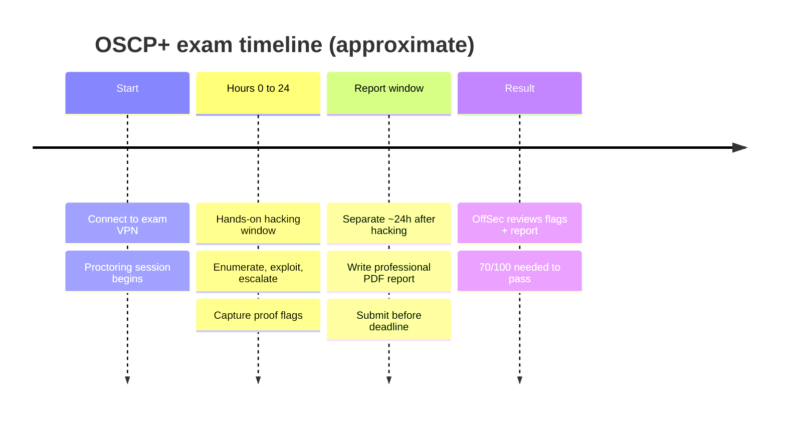
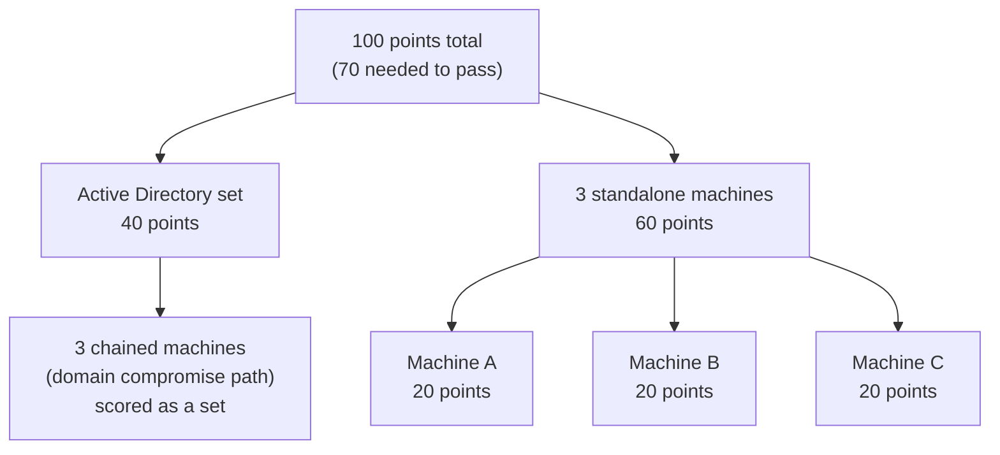

# The OSCP / OSCP+ Exam Structure

The OSCP exam is **the certification** — there is no separate written test. It is a single, intensive, proctored exercise: roughly **24 hours of live hacking** followed by a **separate ~24-hour window to write and submit a professional report**. You compromise machines to collect proof flags, and you must *document* what you did well enough that another tester could reproduce it. You can pass the hacking and still fail the cert by submitting a poor report.

> **Educational & authorized use only.** The exam is conducted against OffSec's own dedicated lab over a private Virtual Private Network (VPN). In the real world, the same activity is legal **only** with explicit written authorization, a defined scope, and Rules of Engagement (RoE). See the CEH hub's [legal & ethics](../../ceh/00-overview/legal-and-ethics.md).

> **Unofficial & no fabrication.** Specifics below are from OffSec's official PEN-200 page and OSCP+ exam guide. Volatile details (exact machine counts, weighting, proctoring rules, price) change — **verify on OffSec**. Compiled **2026-06-20**.

## Learning objectives

- State the verified exam format: hands-on time, report window, total points, and pass mark.
- Explain how points are distributed across the Active Directory (AD) set and standalone machines.
- Describe `local.txt` / `proof.txt` proof flags and what each represents.
- Explain proctoring and exam-integrity expectations at a high level.
- Explain why the **report** is a mandatory, gradeable deliverable.

## The exam at a glance (verified)

| Item | Detail | Source note |
| --- | --- | --- |
| Hands-on exam | **24-hour proctored** assessment over a private VPN (the active hacking window is just under 24 hours) | OffSec PEN-200 / OSCP+ guide |
| Report | **Separate ~24-hour window** after the hacking phase to write and submit a professional PDF report | OffSec OSCP+ exam guide |
| Total points | **100** | OffSec OSCP+ exam guide |
| Passing score | **70 / 100** | OffSec OSCP+ exam guide |
| Active Directory set | **1 AD set of 3 machines = 40 points** | OffSec OSCP+ exam guide |
| Standalone machines | **3 standalone machines = 60 points** | OffSec OSCP+ exam guide |
| Bonus points | **None** — removed as of **1 November 2024**; score is exam performance only | OffSec OSCP+ exam guide |
| Proctoring | **Live remote proctoring** for the duration of the hacking window | OffSec OSCP+ exam guide |
| Price | **Not quoted here — verify on OffSec** (bundle / Learn subscription prices change) | omitted to avoid stale figures |

## Exam timeline

> The two phases are separate deliverables of one exam: the **hands-on compromise** and the **written report**. Both are required. Timings are approximate — confirm exact start/stop and submission deadlines in the current OffSec exam guide.

## How the 100 points are distributed

- **The AD set (40 points)** is a connected environment of **3 machines** that you progress through as a chain — a foothold, then lateral movement and privilege escalation toward domain compromise. It is weighted as a set; partial progress is scored according to the current guide. AD skills are covered in [../topics/05-active-directory-attacks.md](../topics/05-active-directory-attacks.md) and [../topics/06-pivoting-and-tunneling.md](../topics/06-pivoting-and-tunneling.md).
- **The 3 standalone machines (60 points)** are independent targets, each worth up to **20 points**, typically split between an initial foothold and full privilege escalation on that host.

> **Why no bonus?** Before 1 November 2024, lab/exercise completion could add bonus points. That was removed — your score now reflects **exam performance only**, so plan to clear enough machines outright.

## Proof flags: `local.txt` and `proof.txt`

Compromised machines contain text files that prove your access. You collect their contents (and supporting screenshots) as evidence.

| Flag file | Represents | Typical location concept |
| --- | --- | --- |
| `local.txt` | **Low-privilege / initial foothold** access on the host | Readable by an unprivileged user account once you have a foothold |
| `proof.txt` | **Full privilege escalation** (administrative / root) on the host | Readable only after escalating to the highest-privilege account |

You must capture the flag **and** show, in the report, the context that you legitimately obtained it (for example, a command-output screenshot showing the host and the current user). A flag value alone, without documented method, does not earn the points.

## Proctoring and integrity

- The hacking window is **live-proctored** — you share screen and webcam, and verify identity before starting.
- Standard restrictions apply (no unauthorized assistance, limited automated/spray-style tooling, specific rules on Metasploit-style frameworks). **The exact allowed/disallowed tooling and proctoring requirements are defined in the OffSec exam guide and change — read the current version before you sit.**

## The report: a deliverable you can fail on

The exam is not just "get the flags." OffSec requires a **professional penetration-test report** in the separate window, and it is graded:

- It must let a reader **reproduce** each compromise: enumeration findings, the vulnerability, the steps taken, and the resulting access — with supporting screenshots and the proof flags.
- Insufficient documentation can **fail an otherwise-passing exam**, even if you captured enough flags.
- This mirrors real engagements, where the report is the actual product the client pays for. Reporting discipline is a core PenTest+ theme too — see [../../pentest-plus/README.md](../../pentest-plus/README.md).

> Treat note-taking as part of the exam from minute one. Capture commands, outputs, and screenshots **as you go** — reconstructing them afterward, against the clock, is where many candidates lose points.

## Exam tips

- **Enumerate exhaustively before exploiting.** Most stalls are missed enumeration, not missing exploits. See [../topics/01-enumeration-and-information-gathering.md](../topics/01-enumeration-and-information-gathering.md).
- **Manage the clock and your energy.** 24 hours is a marathon; schedule breaks and don't rabbit-hole on one machine.
- **Screenshot everything as you go**, including the host identity and current user with each flag.
- **Bank points early.** Secure the standalone footholds you can, then push escalation and the AD chain.
- **Read the current exam guide cover to cover** — proctoring setup, allowed tooling, and submission format are the rules you'll be graded against.

> **Authorized use only.** Everything practiced for this exam is legal only against systems you own or are explicitly authorized in writing to test. See [../../ceh/00-overview/legal-and-ethics.md](../../ceh/00-overview/legal-and-ethics.md).

## Sources

- OffSec — PEN-200 / OSCP official course page (24-hour proctored exam, 3 standalone machines = 60 pts, 1 AD set of 3 machines = 40 pts): https://www.offsec.com/courses/pen-200/
- OffSec — OSCP+ Exam Guide / Exam FAQ (100 total points, 70/100 to pass, AD set = 40 pts, no bonus points since 1 November 2024, separate report window, proctoring): https://help.offsec.com/hc/en-us/articles/360040165632-OSCP-Exam-Guide
- NIST SP 800-115, Technical Guide to Information Security Testing and Assessment (reporting and evidence-handling framing): https://csrc.nist.gov/pubs/sp/800/115/final
- Related in this repo: [what-is-oscp.md](./what-is-oscp.md) · [../topics/README.md](../topics/README.md) · [../../adjacent-certs/oscp.md](../../adjacent-certs/oscp.md)
- Verify all volatile specifics (exact machine counts, weighting, proctoring rules, price) on OffSec's site — programs change.
