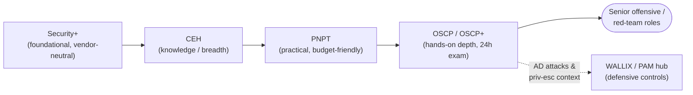

# What is OSCP / OSCP+?

The **Offensive Security Certified Professional (OSCP)** is a hands-on penetration-testing certification from **OffSec** (formerly Offensive Security). Unlike knowledge-based exams, it is earned by *actually compromising live machines* in a 24-hour proctored lab and then writing a professional report. It is widely regarded as a benchmark proof of **practical** offensive skill, and it is tied to the **PEN-200: Penetration Testing with Kali Linux** course.

> **Educational & authorized use only.** Penetration testing is legal **only** with explicit written authorization, an agreed scope, and Rules of Engagement (RoE). This hub explains techniques **conceptually** — for understanding, methodology, and defense — and names tools by **purpose**. It contains no weaponized step-by-step playbooks or exploit code. See the CEH hub's [legal & ethics](../../ceh/00-overview/legal-and-ethics.md).

> **Unofficial & no fabrication.** Not affiliated with or endorsed by OffSec. Exam and course specifics are from OffSec's official PEN-200 page and OSCP+ exam guide; anything volatile (price, exact structure, validity/CPE terms) should be re-checked there. Compiled **2026-06-20**.

## Learning objectives

- Describe what OSCP / OSCP+ is and how it relates to the PEN-200 course.
- Explain OffSec's "Try Harder" hands-on philosophy.
- Identify who OSCP is for and the assumed technical background.
- Distinguish OSCP (does not expire) from OSCP+ (3-year validity, maintained via CPE).
- Place OSCP in an offensive learning path and contrast it with knowledge-based certs like CEH.

## What it is

| Attribute | Detail |
| --- | --- |
| Provider | **OffSec** (Offensive Security), vendor-neutral |
| Course | **PEN-200: Penetration Testing with Kali Linux** |
| Style | **Fully hands-on** — exploit live targets in a lab, then write a professional report |
| Level | Intermediate; respected, demanding practical credential (not entry-level) |
| Credential | **OSCP** (legacy / non-AD) and **OSCP+** (current AD-inclusive exam) |
| Validity | **OSCP does not expire.** **OSCP+ expires 3 years** from issuance, maintained via Continuing Professional Education (CPE) or higher OffSec certs *(verify on OffSec — terms change)* |

**PEN-200** is the official course: structured material, lab access, and practice machines that build toward the exam. OSCP/OSCP+ is the *certification* you earn by passing the exam at the end. There is no separate multiple-choice test — the exam **is** the lab.

## The "Try Harder" philosophy

OffSec's well-known motto is **"Try Harder."** It captures the program's deliberate teaching style:

- **Self-reliance over hand-holding.** You are taught a methodology and given tools, then expected to research, adapt, and persist when something does not work on the first attempt. Public exploits often need modification to fit the target.
- **Methodology over memorization.** The goal is a repeatable *process* — enumerate thoroughly, form hypotheses, test, pivot — not a memorized list of commands. Enumeration is treated as the master skill (see [../topics/01-enumeration-and-information-gathering.md](../topics/01-enumeration-and-information-gathering.md)).
- **Practical proof.** Because you must compromise real machines and document them, the credential proves you can *perform* an end-to-end assessment, not just recognize the right answer.

> "Try Harder" is a learning philosophy, not a license to brute-force without thinking. In real engagements the discipline that matters is methodical enumeration, careful note-taking, and staying inside scope — exactly the habits the exam rewards.

## Who it's for

- Aspiring and working **penetration testers / red-teamers** who need to prove practical skill.
- **Sysadmins and security pros moving into offensive work** who already have a hands-on technical foundation.

OffSec's assumed background:

| Area | What's expected |
| --- | --- |
| **TCP/IP networking** | Comfort with the Transmission Control Protocol / Internet Protocol (TCP/IP) stack, ports, routing, subnetting. See [../../prerequisites/networking-and-protocols.md](../../prerequisites/networking-and-protocols.md). |
| **Windows + Linux administration** | Day-to-day operation of both, including the file system, services, users/groups, and the registry/permissions models. See [../../prerequisites/windows-and-active-directory.md](../../prerequisites/windows-and-active-directory.md) and [../../prerequisites/linux-essentials-for-pam.md](../../prerequisites/linux-essentials-for-pam.md). |
| **Bash / Python scripting** | Reading and writing basic scripts to automate tasks and adapt tooling. |

There is no formal prerequisite exam, but OSCP is **not entry-level**. A sysadmin should shore up scripting and exploitation fundamentals first.

## Where OSCP sits in an offensive path

OSCP is usually the **hands-on depth milestone** earned after a foundational baseline and a breadth-oriented knowledge cert.

The arrows show one common progression, not a hard requirement — many candidates approach OSCP directly from a strong sysadmin or networking background.

## CEH (knowledge) vs OSCP (hands-on)

This contrast is the key to placing OSCP correctly:

| | **CEH** (EC-Council) | **OSCP** (OffSec) |
| --- | --- | --- |
| Primary mode | **Knowledge** — mostly multiple-choice (CEH Practical is an optional hands-on add-on) | **Hands-on** — you must actually exploit live machines |
| Breadth vs depth | Broad survey of attacks and tools | Deep, practical exploitation workflow |
| Proves | You *understand* attacker tactics, techniques, and procedures (TTPs) | You *can perform* an end-to-end compromise and report it |
| Typical order | Often earned first, for breadth and job-filter coverage | Often the next, harder milestone on an offensive track |

A common progression is **CEH for breadth/methodology vocabulary → a practical lead-in → OSCP for depth.** See this repo's [CEH hub](../../ceh/README.md) and the [PenTest+ hub](../../pentest-plus/README.md) for vendor-neutral hands-on coverage.

## Why this matters to defenders (and PAM)

OSCP's focus on **Active Directory (AD) attacks, privilege escalation, and lateral movement** is exactly the credential-abuse and lateral-movement activity that Privileged Access Management (PAM) platforms such as WALLIX are designed to constrain. Understanding how attackers chain a foothold into domain compromise makes you a sharper defender. See the [attack-to-defense matrix](../../attack-to-defense-matrix.md) and the [WALLIX / PAM hub](../../wallix/pam-bastion/README.md).

## Where to go next

- [exam-structure.md](exam-structure.md) — the 24-hour exam, scoring, and the report requirement in depth.
- [../topics/README.md](../topics/README.md) — the PEN-200 practical skill areas.
- [../../adjacent-certs/oscp.md](../../adjacent-certs/oscp.md) — this repo's concise adjacent-certs summary.

## Sources

- OffSec — PEN-200 / OSCP official course page (course scope, fully hands-on, OSCP vs OSCP+ validity): https://www.offsec.com/courses/pen-200/
- OffSec — OSCP+ Exam Guide / Exam FAQ (exam format, scoring, report window): https://help.offsec.com/hc/en-us/articles/360040165632-OSCP-Exam-Guide
- OffSec — "Try Harder" / OffSec methodology and learning philosophy (verify current wording on OffSec): https://www.offsec.com/
- NIST SP 800-115, Technical Guide to Information Security Testing and Assessment (methodology framing): https://csrc.nist.gov/pubs/sp/800/115/final
- Related in this repo: [../../ceh/README.md](../../ceh/README.md) · [../../pentest-plus/README.md](../../pentest-plus/README.md) · [../../adjacent-certs/oscp.md](../../adjacent-certs/oscp.md)
- Verify all volatile specifics (price, exact exam structure, validity/CPE terms) on OffSec's site — programs change.
