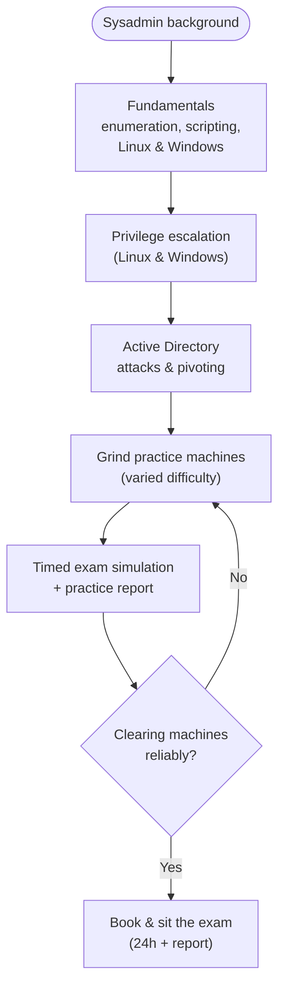

# OSCP / OSCP+ Study Plan

The OSCP / OSCP+ (OffSec PEN-200, *Penetration Testing with Kali Linux*) is passed by **doing**, not by reading. The exam is a **24-hour proctored hacking window plus a separate ~24-hour report window**, scored out of **100 with 70 to pass** — an Active Directory (AD) set worth **40** points and three standalone machines worth **60** (no bonus points since **1 November 2024**). This plan turns that into a realistic preparation path for a sysadmin moving into hands-on offensive work: build fundamentals, grind practice machines, internalize the "Try Harder" methodology, keep disciplined notes, and treat the **report as a deliverable you can fail on**.

> **Educational & authorized use only.** Everything here is practiced **only** on systems you own or are explicitly authorized in writing to test — OffSec Proving Grounds, Hack The Box, or this repo's labs. See the CEH hub's [legal & ethics](../../ceh/00-overview/legal-and-ethics.md).

> **Unofficial & no fabrication.** Exam facts are from OffSec's official PEN-200 page and OSCP+ exam guide; the **timeline below is a labeled suggestion**, not an OffSec requirement, and pace varies by background. Compiled **2026-06-21**.

## Learning objectives

- Sequence OSCP preparation: fundamentals → practice machines → AD → exam simulation → report.
- Apply the "Try Harder" methodology as disciplined enumeration, not blind persistence.
- Build note-taking and reporting habits before the exam, not during it.
- Plan exam-day logistics around the 24-hour hacking window and the report.
- Choose legitimate, authorized practice platforms.

## The study path at a glance

## Phase 1 — Build the fundamentals

These are assumed background; shore up any gaps before exploitation work.

| Skill | Why it matters | Repo reference |
| --- | --- | --- |
| **Enumeration** | The master skill — most stalls are missed enumeration, not missing exploits | [../topics/04-privilege-escalation.md](../topics/04-privilege-escalation.md) (enumeration-driven mindset) |
| **Scripting (Bash + Python)** | Automate repetitive tasks and adapt public tooling to a target | OffSec PEN-200 prerequisites |
| **Linux & Windows administration** | You exploit what you understand: services, permissions, the registry, users/groups | [../../prerequisites/linux-essentials-for-pam.md](../../prerequisites/linux-essentials-for-pam.md) · [../../prerequisites/windows-and-active-directory.md](../../prerequisites/windows-and-active-directory.md) |
| **Networking** | Ports, routing, and subnetting underpin scanning and pivoting | [../../prerequisites/networking-and-protocols.md](../../prerequisites/networking-and-protocols.md) |

## Phase 2 — Privilege escalation and AD

- **Privilege escalation**, Linux and Windows, until the enumeration checklists are second nature — see [../topics/04-privilege-escalation.md](../topics/04-privilege-escalation.md).
- **Active Directory** is 40% of the exam: enumeration, credential-attack concepts, lateral movement, domain compromise — see [../topics/05-active-directory-attacks.md](../topics/05-active-directory-attacks.md).
- **Pivoting and tunneling** to reach segmented networks — see [../topics/06-pivoting-and-tunneling.md](../topics/06-pivoting-and-tunneling.md).

## Phase 3 — Grind practice machines

Volume and variety build the pattern-recognition the exam rewards. Work machines across difficulty levels, and **finish each with a write-up** — the write-up *is* report practice.

| Platform | Use | Note |
| --- | --- | --- |
| **OffSec Proving Grounds** | OffSec's own practice machines, closest in style to the exam | Practice/Play tiers; authorized lab use |
| **Hack The Box** | Large, varied machine and AD-scenario library | Includes AD chains for the 40-point set |
| **This repo's labs** | Self-hosted, authorized practice environment | [../../labs/README.md](../../wallix/labs/README.md) and the CEH lab build [../../ceh/labs/building-a-ceh-lab.md](../../ceh/labs/building-a-ceh-lab.md) |
| **Platform overview** | Compare legitimate practice options | [../../learning/platforms.md](../../learning/platforms.md) |

> **Stay authorized.** Practice only on platforms that explicitly permit it or systems you own. Never point exam techniques at third-party systems.

## The "Try Harder" methodology — done right

"Try Harder" is **disciplined persistence**, not flailing:

- **Enumerate before exploiting**, then re-enumerate after every new access — fresh foothold, fresh enumeration.
- **Form a hypothesis, test it, record the result.** If a path dead-ends, document why and move on; don't rabbit-hole.
- **Adapt, don't just copy.** Public exploits often need modification; understand what they do.
- **Stay methodical under time pressure** — the candidates who pass have a *process*, not a memorized command list.

## Note-taking and the report

The report is a **graded deliverable**: a strong hacking run with a weak report can still fail. Build the habit during practice, not on exam day.

- **Capture as you go** — every command, its output, and a screenshot showing the **host and current user**, for both `local.txt` (foothold) and `proof.txt` (full compromise).
- **Structure for reproducibility** — a reader must be able to repeat each compromise: enumeration finding → vulnerability → steps → resulting access.
- **Keep a clean template** and fill it live; reconstructing notes afterward against the clock is where points are lost. Reporting discipline is a core PenTest+ theme too — see [../../pentest-plus/README.md](../../pentest-plus/README.md).

## Suggested timeline (illustrative — not an OffSec requirement)

| Window | Focus | Notes |
| --- | --- | --- |
| **Months 1–2** | Fundamentals: enumeration, scripting, Linux/Windows refresh | Close prerequisite gaps |
| **Months 3–4** | Privilege escalation + AD + pivoting; work easy/medium machines | Build checklists |
| **Months 5–6** | Grind varied machines + AD chains; write a report for each | Volume and variety |
| **Final weeks** | Full **timed 24-hour simulation** + a complete practice report | Validate stamina and process |

> Pace varies widely with starting background — a strong sysadmin may move faster, a newcomer slower. Track readiness by **whether you clear machines reliably**, not by the calendar.

## Exam-day logistics

- **Two phases, both required:** ~24-hour live-proctored hacking window, then a **separate ~24-hour** window to write and submit the report. **70/100** passes.
- **Points:** AD set = 40, three standalone machines = 60 (20 each). **No bonus points** since 1 November 2024 — plan to clear enough machines outright.
- **Set up early:** identity verification, screen/webcam proctoring, and a working VPN connection before the clock matters.
- **Plan the marathon:** schedule breaks, eat, and sleep — fatigue costs more points than any single exploit.
- **Bank points first:** secure the footholds you can, then push escalation and the AD chain.
- **Read the current OffSec exam guide cover to cover** — allowed tooling, proctoring, and submission format are the rules you're graded against, and they change. Full structure: [../00-overview/exam-structure.md](../00-overview/exam-structure.md).

## Exam tips

- **Simulate the full 24 hours at least once**, including the report — stamina and note discipline are tested as much as skills.
- **Trust your enumeration** — when stuck, you've usually missed something, not lacked an exploit.
- **Document continuously**; treat screenshots and command logs as part of "owning" each box.
- **Don't over-rely on any single automated tool** — know the manual method behind it, since exam tooling rules are restrictive.

> **Authorized use only.** All practice and exam techniques are legal solely against systems you own or are explicitly authorized in writing to test.

## Sources

- OffSec — PEN-200 / OSCP official course page (course scope, fundamentals, hands-on methodology): https://www.offsec.com/courses/pen-200/
- OffSec — OSCP+ Exam Guide / Exam FAQ (24h exam + report window, 100 pts / 70 to pass, AD set = 40, no bonus since 1 Nov 2024): https://help.offsec.com/hc/en-us/articles/360040165632-OSCP-Exam-Guide
- OffSec — Proving Grounds (authorized practice machines): https://www.offsec.com/labs/
- Hack The Box (authorized practice platform): https://www.hackthebox.com/
- NIST SP 800-115, Technical Guide to Information Security Testing and Assessment (methodology & reporting): https://csrc.nist.gov/pubs/sp/800/115/final
- Related in this repo: [../00-overview/exam-structure.md](../00-overview/exam-structure.md) · [../topics/04-privilege-escalation.md](../topics/04-privilege-escalation.md) · [../topics/05-active-directory-attacks.md](../topics/05-active-directory-attacks.md) · [../topics/06-pivoting-and-tunneling.md](../topics/06-pivoting-and-tunneling.md) · [../../ceh/labs/building-a-ceh-lab.md](../../ceh/labs/building-a-ceh-lab.md) · [../../learning/platforms.md](../../learning/platforms.md)
- Verify all volatile specifics (exam structure, tooling rules, pricing) on OffSec's site — programs change.
