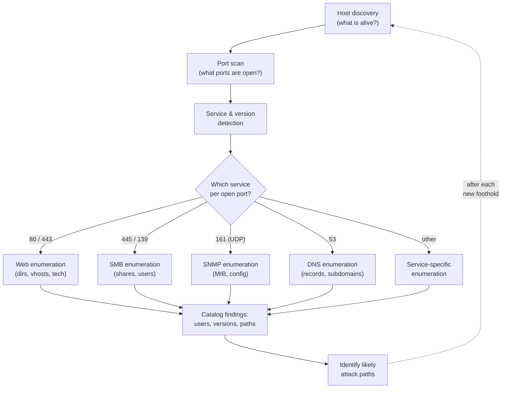

# Enumeration & Information Gathering

Enumeration is the **master skill** of OSCP (Offensive Security Certified Professional) and the PEN-200 course. The unofficial mantra of the program — "enumerate everything" — captures it: most failed exam attempts trace back to *missed* information, not missed exploits. Before any attack, you build a complete picture of the target: which hosts are alive, which ports are open, what service and version sits behind each port, and what each service is willing to tell you. This page treats enumeration **conceptually** and names tools by purpose.

> **Educational & authorized use only.** Scanning and enumeration create real connections and are highly visible in logs. They are legal **only** with explicit written authorization, an agreed scope, and Rules of Engagement (RoE). This page is conceptual and defense-oriented; it provides no operational playbooks or exploit code. See [../00-overview/what-is-oscp.md](../00-overview/what-is-oscp.md).

## Learning objectives

- Distinguish passive from active reconnaissance and explain when each is used.
- Sequence the enumeration workflow: discovery → port scan → service/version → per-service deep dive.
- Explain what common services (web, SMB, SNMP, DNS) can reveal and why.
- Apply the "enumerate everything / re-enumerate after every foothold" methodology.
- Match enumeration tools to their purpose without memorizing command lines.

## Passive vs. active reconnaissance

| | **Passive recon** | **Active recon** |
| --- | --- | --- |
| Interaction | No packets sent to the target; uses third-party data | Direct probes/connections to the target |
| Examples | WHOIS, public DNS records, search engines, certificate transparency logs | Port scanning, banner grabbing, service queries |
| Visibility | Effectively invisible to the target | Appears in the target's logs |
| OSCP relevance | Light — exam targets are lab machines | Primary — most exam work is active |

In an authorized engagement, passive recon maps the public footprint first; active recon then confirms and deepens it. On the OSCP exam the targets are isolated lab machines, so the work is overwhelmingly **active**. For the broader recon discipline see the CEH treatment in [../../ceh/domains/02-footprinting-and-reconnaissance.md](../../ceh/domains/02-footprinting-and-reconnaissance.md).

## The enumeration workflow

The dashed loop is the heart of the methodology: a foothold on one host opens a new vantage point, so you **re-enumerate from scratch** each time. For the scanning concepts that feed this, see [../../ceh/domains/03-scanning-networks.md](../../ceh/domains/03-scanning-networks.md); for the deeper per-service extraction, see [../../ceh/domains/04-enumeration.md](../../ceh/domains/04-enumeration.md).

## Port and service enumeration

- **Host discovery** confirms which addresses respond before you spend time scanning dead hosts.
- **Port scanning** finds open Transmission Control Protocol (TCP) and User Datagram Protocol (UDP) ports. UDP is slow and lossy but easy to forget — and **SNMP lives on UDP**, so skipping UDP is a classic OSCP mistake.
- **Service and version detection** identifies the exact software and version behind a port. A specific version string is often the single most valuable piece of data, because it points to known weaknesses and the right enumeration follow-up.
- **Banner grabbing** reads the greeting a service sends on connection, frequently disclosing product and version.

A short list of high-yield default ports (full table in [../../ceh/domains/04-enumeration.md](../../ceh/domains/04-enumeration.md)):

| Service | Port(s) | Typical yield |
| --- | --- | --- |
| HTTP / HTTPS | TCP 80 / 443 | Web app, technology stack, hidden paths |
| SMB (Server Message Block) | TCP 445 (139) | Shares, users, OS version |
| SNMP (Simple Network Management Protocol) | UDP 161 | Device config, processes, accounts |
| DNS (Domain Name System) | UDP/TCP 53 | Records, subdomains, zone data |
| FTP / SSH | TCP 21 / 22 | Anonymous access, version, key/auth method |

## Per-service deep dives

- **Web (HTTP/HTTPS).** Identify the server, framework, and content-management system; discover hidden directories and files; enumerate virtual hosts; read source, comments, and error messages. This is the most common OSCP initial-access surface — see [./02-web-application-attacks.md](02-web-application-attacks.md).
- **SMB.** Enumerate shares, share permissions, users, groups, and the OS/version. Misconfigured anonymous/guest access can hand over files or a user list with no credentials.
- **SNMP.** When default community strings (`public`/`private`) survive, the Management Information Base (MIB) can leak interfaces, routing tables, running processes, installed software, and user accounts.
- **DNS.** Records and (on misconfigured servers) zone transfers map internal hosts and subdomains.

For how these protocols work in detail, see [../../protocols/README.md](../../protocols/README.md).

## Tools and their purpose

OSCP rewards understanding *what each tool is for*, not memorized flags.

| Tool | Purpose |
| --- | --- |
| Nmap (Network Mapper) | Host discovery, port scanning, and service/version detection — the foundation that tells you what to enumerate next. |
| Nmap Scripting Engine (NSE) | Pluggable scripts that automate service-specific enumeration (SMB, SNMP, HTTP, and more). |
| Web content/dir discovery tools | Brute-force hidden directories, files, and virtual hosts on web servers. |
| SMB enumeration tools | Consolidated extraction of SMB/NetBIOS shares, users, groups, and password policy. |
| SNMP walk/check tools | Walk the MIB to report system, interface, and configuration data. |
| DNS enumeration tools | Resolve records, brute-force subdomains, and test for zone transfers. |

## Exam tips

- **Enumeration is the exam.** When stuck, re-enumerate — you almost certainly missed a port, path, version, or share rather than an exploit.
- **Scan all ports, then go deep.** A fast top-ports sweep is a start; a full TCP port scan plus targeted UDP catches the outliers.
- **Don't forget UDP** — SNMP on UDP 161 is a recurring miss.
- **Re-enumerate after every foothold:** each new host is a fresh starting point and may expose internal-only services.
- **Take structured notes per host** (ports, versions, findings) — they become your report evidence.

> Authorized use only: run these techniques solely against systems you are explicitly permitted to test, within scope and Rules of Engagement.

## Sources

- OffSec — PEN-200 / OSCP official course page (information gathering, enumeration emphasis): https://www.offsec.com/courses/pen-200/
- OffSec — OSCP+ Exam Guide: https://help.offsec.com/hc/en-us/articles/360040165632-OSCP-Exam-Guide
- Nmap reference (host/port/service discovery): https://nmap.org/book/man.html
- NIST SP 800-115, Technical Guide to Information Security Testing and Assessment: https://csrc.nist.gov/pubs/sp/800/115/final
- Related in this repo: [../../ceh/domains/02-footprinting-and-reconnaissance.md](../../ceh/domains/02-footprinting-and-reconnaissance.md) · [../../ceh/domains/03-scanning-networks.md](../../ceh/domains/03-scanning-networks.md) · [../../ceh/domains/04-enumeration.md](../../ceh/domains/04-enumeration.md) · [../../protocols/README.md](../../protocols/README.md)
