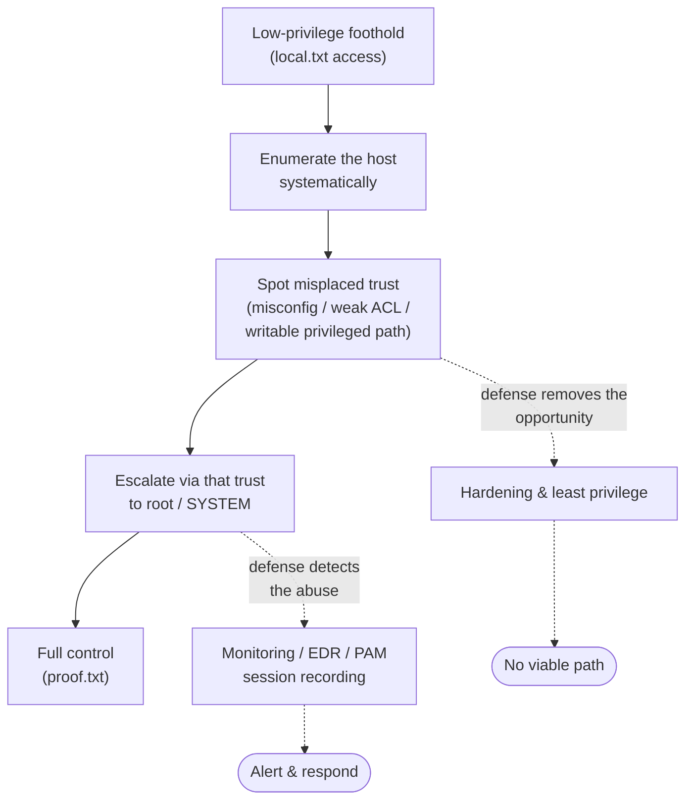

# Privilege Escalation — Linux and Windows (concepts)

**Privilege escalation** is the step that turns a low-privilege foothold into administrative control of a host — `root` on Linux, `SYSTEM` / local Administrator on Windows. In the OSCP / OSCP+ (OffSec PEN-200) exam it is what takes a `local.txt` foothold to a `proof.txt` full compromise, so it is worth real points on every machine. The skill is **not** memorizing exploits: it is **enumeration-driven**. You systematically inventory a host, spot a misconfiguration or weakness an over-privileged process trusts, and let that trust carry you up. This page covers *what to look for and why*, paired with the **hardening** that closes each gap.

> **Educational & authorized use only.** This is conceptual — methodology and defense, tools named by **purpose**. No exploit code or weaponized step-by-step. Privilege escalation is legal only on systems you own or are authorized in writing to test. See the CEH hub's [legal & ethics](../../ceh/00-overview/legal-and-ethics.md).

> **Unofficial & no fabrication.** OSCP/PEN-200 facts are from OffSec's official pages; verify volatile specifics there. Compiled **2026-06-21**.

## Learning objectives

- Explain why privilege escalation is **enumeration-driven**, not exploit-driven.
- Identify the main Linux escalation classes: sudo/SUID, weak permissions, services, kernel, credentials in files, cron/scheduled jobs.
- Identify the main Windows escalation classes: service misconfigurations, weak permissions, token/privilege abuse, stored credentials, scheduled tasks, kernel.
- For each class, state the **defensive control** that removes or detects the opportunity.
- Connect host escalation to least-privilege and PAM as the strategic mitigation.

## The mental model: enumerate, then escalate

Escalation almost always exploits **misplaced trust**: a privileged process, file, or schedule that an unprivileged user can influence. The workflow is the same on both platforms.

Enumeration tools (manual checks; automated collectors that *report* findings) exist to **list** these conditions — they are inventory aids, not exploits. The judgement is yours: which finding actually grants a path.

## Linux privilege escalation — what to look for and why

| Class | What you look for | Why it escalates | Defense / hardening |
| --- | --- | --- | --- |
| **sudo rules** | What the current user may run via `sudo` and as whom | A permitted command that can spawn a shell, read arbitrary files, or run a script you control hands you the target's privileges | Minimal, explicit `sudoers` entries; no wildcards/`ALL`; avoid binaries with shell escapes; require passwords; log via `sudo` + auditd |
| **SUID / SGID binaries** | Files that run as their **owner** (often root) regardless of caller | A SUID-root binary with a shell escape, or that trusts a relative path / environment, runs your code as root | Remove needless SUID bits; vet custom SUID binaries; mount with `nosuid` where possible; baseline and monitor the SUID set |
| **Weak file/dir permissions** | World-writable files read or executed by root; writable scripts in privileged jobs | Editing a file root trusts makes root execute your content | Correct ownership/modes; least-privilege ACLs; integrity monitoring on sensitive paths |
| **Service misconfig & `PATH`** | Privileged services calling binaries by relative path or from a writable directory | A planted binary earlier in `PATH` runs with the service's privileges | Absolute paths in services; sanitized environments; non-writable service directories |
| **Credentials in files** | History files, configs, scripts, backups, `.env`, keys, world-readable secrets | Reused admin credentials or private keys grant a direct privileged login | Secrets in a vault, never on disk; rotate exposed creds; restrict key permissions; PAM-brokered credentials (below) |
| **Scheduled jobs (cron)** | `cron`/`systemd` timers running as root that invoke writable scripts or wildcards | A job executing your writable script, or a tar/`*` wildcard you influence, runs as root on schedule | Root jobs own non-writable scripts; avoid wildcards on attacker-influenced input; review crontabs |
| **Kernel / capabilities** | Kernel version vs known issues; files with Linux **capabilities** | An unpatched kernel or an over-granted capability (e.g. one allowing privileged operations) yields root | Patch promptly; grant minimal capabilities; baseline `getcap` output |

Linux fundamentals behind these — users/groups, permission bits, SUID, `sudo`, services — are in [../../prerequisites/linux-essentials-for-pam.md](../../prerequisites/linux-essentials-for-pam.md).

## Windows privilege escalation — what to look for and why

| Class | What you look for | Why it escalates | Defense / hardening |
| --- | --- | --- | --- |
| **Service misconfigurations** | Services whose executable path or config a non-admin can change; unquoted paths with spaces; weak service ACLs | A service running as `SYSTEM` that launches an attacker-controlled binary executes it as `SYSTEM` | Strong service ACLs; quoted/absolute `ImagePath`; least-privilege service accounts (gMSA); restrict who can reconfigure services |
| **Weak file/registry permissions** | Writable program files or autostart registry keys referenced by privileged processes | Replacing a binary or autostart entry a privileged process trusts runs your code elevated | Correct NTFS/registry ACLs; protect autostart locations; application allow-listing |
| **Token & privilege abuse** | Accounts/services holding powerful privileges (impersonation-class, backup/restore-class rights) | Certain Windows privileges let a process act as a more privileged token or read protected data | Grant sensitive privileges only where required; separate service identities; tier admin accounts |
| **Stored credentials** | Saved Windows credentials, autologon secrets, config/script passwords, unattended-install files, credential stores | Recovered admin credentials or hashes give a direct elevated logon or lateral move | Credential Guard; no plaintext secrets in files/GPO; LAPS for unique local-admin passwords; PAM-brokered access |
| **Scheduled tasks** | Tasks running as a privileged user that call writable scripts/binaries | A privileged task executing a path you control runs elevated on its trigger | Tasks own non-writable targets; least-privilege run-as accounts; audit task changes |
| **Always-elevated installers / misconfig policies** | Policies that install packages with elevated rights; misconfigured elevation settings | A crafted package installs with `SYSTEM` rights | Disable always-elevated install policies; restrict who can install software |
| **Missing patches / kernel** | OS build vs known privilege issues | An unpatched local issue yields `SYSTEM` | Timely patching; vulnerability management; reduce local attack surface |

Windows and AD account/permission concepts are in [../../prerequisites/windows-and-active-directory.md](../../prerequisites/windows-and-active-directory.md); the broader system-hacking methodology is covered conceptually in [../../ceh/domains/06-system-hacking.md](../../ceh/domains/06-system-hacking.md).

## The unifying defense: least privilege and PAM

Every class above is, at root, **excess privilege or excess trust** — a process, account, file, or schedule that has or trusts more than it needs. The strategic mitigations are the same regardless of platform:

- **Least privilege & just-in-time (JIT) access** — accounts and processes get only the rights they need, only when they need them, so a compromised foothold has little to escalate *to*. See [../../foundations/core-concepts-least-privilege-jit-zero-trust.md](../../foundations/core-concepts-least-privilege-jit-zero-trust.md).
- **No standing secrets on hosts** — a PAM platform brokers privileged credentials, injects them at session time, and rotates them, so "credentials in files" yields nothing reusable.
- **Monitoring & detection** — endpoint detection and response (EDR), host auditing, and PAM session recording turn an escalation attempt into an alerting, reviewable event even when a path exists. See the [attack-to-defense matrix](../../attack-to-defense-matrix.md).

> For the exam you *find and use* these paths; as a defender you *remove and detect* them. Learning both sides is what makes the OSCP skill set valuable to a PAM-focused practitioner.

## Exam tips

- **Run a complete enumeration pass before trying anything** — escalation stalls are almost always missed enumeration, not a missing exploit.
- **Read what enumeration actually reports**: a SUID binary, a sudo rule, a writable service path. Triage the highest-confidence path first.
- **Keep platform checklists** (Linux: sudo, SUID, cron, creds, kernel; Windows: services, permissions, tokens, stored creds, tasks) so nothing is skipped under time pressure.
- **Document every step with screenshots** showing host and current user before and after — an undocumented escalation earns no points.
- **Stay in scope.** Practice only on OffSec Proving Grounds, Hack The Box, or this repo's [../../labs/README.md](../../wallix/labs/README.md).

> **Authorized use only.** Privilege escalation is legal solely against systems you own or are explicitly authorized in writing to test.

## Sources

- OffSec — PEN-200 / OSCP official course page (privilege-escalation modules, hands-on scope): https://www.offsec.com/courses/pen-200/
- OffSec — OSCP+ Exam Guide / Exam FAQ (`local.txt` foothold vs `proof.txt` full compromise, scoring): https://help.offsec.com/hc/en-us/articles/360040165632-OSCP-Exam-Guide
- NIST SP 800-53, security & privacy controls (AC least privilege, CM configuration management, AU auditing): https://csrc.nist.gov/pubs/sp/800/53/r5/final
- Microsoft — securing privileged access / tiered administration model: https://learn.microsoft.com/en-us/security/privileged-access-workstations/privileged-access-access-model
- Related in this repo: [../../prerequisites/linux-essentials-for-pam.md](../../prerequisites/linux-essentials-for-pam.md) · [../../prerequisites/windows-and-active-directory.md](../../prerequisites/windows-and-active-directory.md) · [../../ceh/domains/06-system-hacking.md](../../ceh/domains/06-system-hacking.md) · [../../foundations/core-concepts-least-privilege-jit-zero-trust.md](../../foundations/core-concepts-least-privilege-jit-zero-trust.md)
- Verify volatile OSCP specifics on OffSec's site — programs change.
