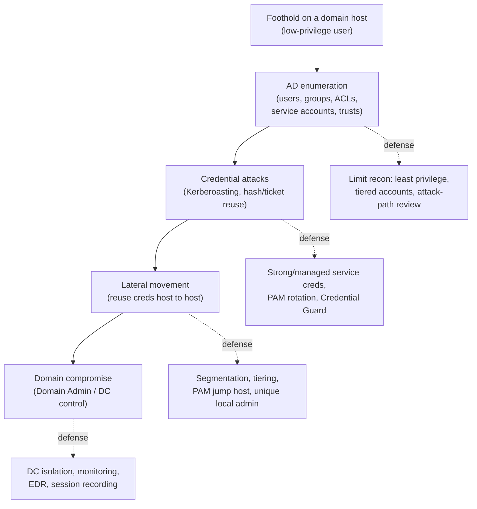

# Active Directory Attacks (concepts) — and how PAM defends

**Active Directory (AD)** is the identity backbone of most Windows enterprises, and it is central to OSCP / OSCP+ (OffSec PEN-200): the exam's **AD set is worth 40 of 100 points** — three chained machines where you take a foothold, move laterally, and drive toward **domain compromise**. AD attacks rarely rely on "exploits" in the classic sense; they **abuse the protocol's own trust** — tickets, hashes, and over-privileged accounts. That is exactly why every attack concept below has a clear **defensive counterpart**: Privileged Access Management (PAM), tiering, segmentation, endpoint detection and response (EDR), and monitoring. This page pairs each attack idea with how defenders **prevent and detect** it.

> **Educational & authorized use only.** Conceptual coverage — methodology and defense, tools by **purpose**, no exploit code or step-by-step. AD testing is legal only with written authorization and scope. See the CEH hub's [legal & ethics](../../ceh/00-overview/legal-and-ethics.md).

> **Unofficial & no fabrication.** OSCP/PEN-200 facts are from OffSec's official pages; verify volatile specifics there. Compiled **2026-06-21**.

## Learning objectives

- Describe the OSCP AD attack chain: enumeration → credential attacks → lateral movement → domain compromise.
- Explain **conceptually** Pass-the-Hash, Pass-the-Ticket, and Kerberoasting — what trust each abuses.
- Pair each attack stage with the PAM, tiering, segmentation, EDR, and monitoring controls that defend and detect it.
- Explain why standing privileged credentials are the attacker's fuel and why brokering/rotating them breaks the chain.
- Connect AD attacks to the repo's protocol, PAM, and threat-landscape references.

## The AD attack chain — and where defenses sit

The attacker's chain runs left-to-right; the **defender's job is to break any single link**. PAM and tiering are most decisive at the credential and lateral-movement stages — the exact stages where the WALLIX hub's controls apply.

## Enumeration — the recon stage

| Attack idea | What it abuses | Defense / detection |
| --- | --- | --- |
| Map users, groups, group memberships, ACLs, service accounts, and trusts; identify privileged accounts and attack paths | AD is **readable by any authenticated user** by design; misconfigured ACLs and over-privileged groups reveal escalation paths | Least privilege and **tiered administration** (Tier 0/1/2) shrink what recon finds; regular attack-path review (graph-style analysis); monitor for unusual directory queries; restrict who holds sensitive group membership |

AD structure, Security Identifiers (SIDs), and Group Policy are in [../../protocols/active-directory.md](../../protocols/active-directory.md).

## Credential attacks (conceptual)

These are the heart of AD compromise. Each **reuses authentication material** rather than cracking a login at the front door.

- **Pass-the-Hash (PtH)** — Windows NTLM authentication can accept a password's **hash** in place of the plaintext. An attacker who recovers a hash from a compromised host can authenticate **without ever knowing the password**. NTLM internals are in [../../protocols/active-directory.md](../../protocols/active-directory.md#7-authentication-ntlm-legacy).
- **Pass-the-Ticket (PtT)** — Kerberos issues **tickets** as proof of authentication. Stolen tickets can be **replayed** to access services as the victim until they expire. See [../../protocols/kerberos.md](../../protocols/kerberos.md).
- **Kerberoasting (concept)** — any authenticated user can request a **service ticket** for an account that has a Service Principal Name (SPN). Part of that ticket is encrypted with the service account's key, so a **weak service-account password** can be attacked **offline**, away from any lockout or alerting. The mechanism is the TGS exchange in [../../protocols/kerberos.md](../../protocols/kerberos.md#5-exchange-b-tgs-req--tgs-rep).

| Credential attack | Abuses | Defense / detection |
| --- | --- | --- |
| **Pass-the-Hash** | NTLM accepting a hash as proof | Reduce/disable legacy NTLM; **Credential Guard**; LAPS for unique local-admin passwords; tiering so a workstation hash can't reach Tier 0; PAM so admins never type reusable passwords on endpoints |
| **Pass-the-Ticket** | Kerberos ticket replay | Protect/limit ticket caches; short ticket lifetimes; constrain delegation; EDR detection of ticket abuse; PAM-brokered sessions keep credentials off the endpoint |
| **Kerberoasting** | Offline crack of SPN-account keys | **Strong, long, managed service-account passwords (gMSA)**; minimal SPN exposure; PAM rotation of service credentials; alert on abnormal service-ticket request volumes |

> The common thread: **standing, reusable privileged credentials on endpoints are the attacker's fuel.** PAM brokers and rotates them, and EDR/monitoring detects their abuse — see [../../foundations/pam-threat-landscape.md](../../foundations/pam-threat-landscape.md).

## Lateral movement

| Attack idea | What it abuses | Defense / detection |
| --- | --- | --- |
| Reuse recovered credentials/hashes/tickets to authenticate host-to-host (remote execution, remote management), hunting for higher-privileged sessions to harvest | **Shared or reused admin credentials** and **flat networks** let one compromise spread; an admin logged into a workstation leaves credential material to steal | **Network segmentation / microsegmentation** limits reachable hosts; **tiered admin** stops workstation creds reaching servers/DCs; **unique local-admin passwords (LAPS)**; a **PAM jump host** is the only sanctioned admin path, with session recording; EDR flags anomalous remote logons. Pivoting mechanics: [06-pivoting-and-tunneling.md](./06-pivoting-and-tunneling.md) |

A PAM bastion that **mediates and records every privileged session** removes the attacker's free movement and gives defenders a reviewable trail — the WALLIX model in [../../docs/pam-bastion/README.md](../../docs/pam-bastion/README.md) and [../../deep-dives/session-management.md](../../deep-dives/session-management.md).

## Domain compromise

| Attack idea | What it abuses | Defense / detection |
| --- | --- | --- |
| Reach a Domain Admin account or the Domain Controller (DC) and assert control over the directory | A single tier with reachable, over-privileged admin accounts means one lateral step lands on the crown jewels | **DC isolation** (Tier 0 separation, admin-workstation model); minimize Domain Admins; protected-users group; comprehensive **monitoring + EDR** on DCs; **PAM session recording** of every DC access so even authorized administration is reviewable and attributable |

## Why this maps cleanly to defense

Each stage has a control that either **prevents** it or **detects** it — that one-to-one mapping is the whole point of the repo's [attack-to-defense matrix](../../attack-to-defense-matrix.md). For a PAM-focused practitioner, OSCP's AD chain is the concrete justification for tiering, segmentation, credential brokering, rotation, and session recording: you have *seen* the attack the control stops.

## Exam tips

- **Enumerate AD exhaustively first** — the 40-point AD set rewards mapping users, groups, ACLs, and service accounts before any credential attack.
- **Think in chains, not single hosts** — a foothold's value is the credential material it yields for the next hop.
- **Understand the *concept* of PtH/PtT/Kerberoasting** (what trust each abuses) so you recognize when a target is vulnerable, rather than blindly running tools.
- **Document the full path** — initial access, each lateral move, and final domain compromise must be reproducible in the report.
- **Practice only in authorized AD labs** — OffSec Proving Grounds, Hack The Box AD scenarios, or [../../labs/README.md](../../labs/README.md).

> **Authorized use only.** AD attack techniques are legal solely against systems you own or are explicitly authorized in writing to test.

## Sources

- OffSec — PEN-200 / OSCP official course page (Active Directory attack modules; AD set = 40 of 100 exam points): https://www.offsec.com/courses/pen-200/
- OffSec — OSCP+ Exam Guide / Exam FAQ (AD set scoring, domain-compromise chain): https://help.offsec.com/hc/en-us/articles/360040165632-OSCP-Exam-Guide
- MITRE ATT&CK — credential access & lateral movement (Pass-the-Hash, Pass-the-Ticket, Kerberoasting techniques): https://attack.mitre.org/
- Microsoft — securing privileged access / tiered administration model: https://learn.microsoft.com/en-us/security/privileged-access-workstations/privileged-access-access-model
- Related in this repo: [../../protocols/kerberos.md](../../protocols/kerberos.md) · [../../protocols/active-directory.md](../../protocols/active-directory.md) · [../../attack-to-defense-matrix.md](../../attack-to-defense-matrix.md) · [../../foundations/pam-threat-landscape.md](../../foundations/pam-threat-landscape.md) · [../../docs/pam-bastion/README.md](../../docs/pam-bastion/README.md) · [../../deep-dives/session-management.md](../../deep-dives/session-management.md)
- Verify volatile OSCP specifics on OffSec's site — programs change.
