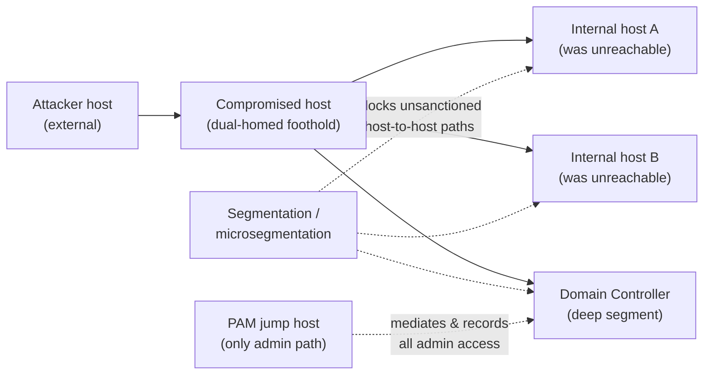

# Pivoting and Tunneling (concepts) — and the segmentation that stops them

Real networks are not flat. A compromised, internet-reachable host is rarely the goal — it is a **doorway** into segmented internal networks the attacker cannot reach directly. **Pivoting** is using that foothold as a relay to reach systems behind it; **port forwarding** and **tunneling** are the techniques that carry traffic through the foothold to otherwise-unreachable services. In OSCP / OSCP+ (OffSec PEN-200), the Active Directory set and multi-network scenarios often require pivoting from a first machine to reach the next. This page explains *why* an attacker pivots and *how defenders cut the path* — through segmentation, microsegmentation, monitoring, and a Privileged Access Management (PAM) jump host that owns every admin route.

> **Educational & authorized use only.** Conceptual coverage — methodology and defense, tools named by **purpose**, no exploit code or step-by-step. Pivoting is legal only with written authorization and scope. See the CEH hub's [legal & ethics](../../ceh/00-overview/legal-and-ethics.md).

> **Unofficial & no fabrication.** OSCP/PEN-200 facts are from OffSec's official pages; verify volatile specifics there. Compiled **2026-06-21**.

## Learning objectives

- Define pivoting, port forwarding, and tunneling, and explain why an attacker needs them.
- Distinguish local, remote, and dynamic forwarding **conceptually**.
- Explain how network segmentation and microsegmentation remove an attacker's reachable targets.
- Explain how a PAM jump host and session monitoring make admin paths controlled and reviewable.
- Name pivoting tool categories by **purpose**, not as a how-to.

## Why an attacker pivots

The attacker compromises an exposed host that **straddles two networks** — it can talk to both the entry network and an internal segment the attacker cannot reach directly. By relaying traffic through it, the attacker's tooling effectively gains a presence on the internal segment.

- **Port forwarding** maps a port through the foothold so the attacker can reach **one specific internal service** as if it were local.
- **Tunneling** wraps traffic (often inside an encrypted channel such as Secure Shell, SSH) so multiple connections route through the foothold; **dynamic forwarding** turns the foothold into a general proxy reaching many internal hosts. SSH's channel model is in [../../protocols/ssh.md](../../protocols/ssh.md).

## Forwarding concepts (no commands)

| Concept | What it does | Attacker's use |
| --- | --- | --- |
| **Local forwarding** | Exposes a remote internal service on a local port via the foothold | Reach one internal service (a database, an admin panel) through the pivot |
| **Remote forwarding** | Exposes the attacker's local service to the internal network via the foothold | Make a callback/listener reachable from inside |
| **Dynamic forwarding (proxy)** | Turns the foothold into a SOCKS-style proxy | Route many tools toward many internal hosts through one pivot |
| **Layered pivoting** | Chains pivots across several footholds | Reach deep segments the first pivot still cannot see |

> Tool **categories** by purpose: SSH (built-in forwarding/tunneling), lightweight pivot/proxy relays, and proxy-aware connectors that send a tool's traffic through a SOCKS proxy. They are named here only to recognize techniques in a report and on defense — not as a playbook.

## The defense: segmentation and controlled admin paths

Pivoting only works because internal hosts are **reachable** from the foothold and admin paths are **uncontrolled**. Defenders close both.

| Defense | What it does | Why it stops/limits pivoting |
| --- | --- | --- |
| **Network segmentation** | Splits the network into zones with filtered boundaries | A compromised zone cannot freely reach others — the pivot has far fewer targets |
| **Microsegmentation** | Per-workload policy down to host/service level | Even within a zone, only explicitly allowed flows exist, so lateral relaying is denied by default |
| **PAM jump host / bastion** | A single mandated, brokered path for all privileged/admin access | Admins never connect host-to-host directly; the bastion mediates, brokers credentials, and **records** every session, so an ad-hoc pivot is both blocked and conspicuous |
| **Monitoring & EDR** | Watches for anomalous internal connections and tunneling | Pivot traffic and unexpected cross-segment flows become detectable, alertable events |
| **Egress / east-west filtering** | Restricts outbound and lateral traffic | Limits tunnels reaching back out and relays moving sideways |

Segmentation and zoning as an architecture discipline are covered in [../../security-plus/domains/03-security-architecture.md](../../security-plus/domains/03-security-architecture.md). The PAM bastion as the **single controlled admin path** is the WALLIX model in [../../docs/pam-bastion/README.md](../../wallix/pam-bastion/README.md).

## Pivot vs. jump host — same shape, opposite intent

A PAM **jump host** and an attacker's **pivot** are architecturally similar — both relay through one host into a protected network — but their intent and governance are opposite:

- A **pivot** is unsanctioned, hidden, and uses stolen access to reach hosts the attacker shouldn't see.
- A **jump host / bastion** is sanctioned, mandatory, and *removes* direct paths: all admin traffic is funneled through one mediated, recorded chokepoint, so there is no flat network for an attacker to relay across in the first place.

That is the core defensive insight: **make the only relay into sensitive segments one you control and record.** See the [attack-to-defense matrix](../../attack-to-defense-matrix.md) for the full mapping.

## Exam tips

- **Recognize when you've outgrown one host** — if scanning from your machine can't see a target the foothold can, you need to pivot.
- **Map the foothold's networks first** (its interfaces, reachable subnets, internal hosts) before forwarding anything.
- **Keep your tunnels organized and documented** — note which port maps to which internal service so the report is reproducible.
- **Prefer the simplest forwarding that reaches the target**; layered pivots add fragility and clock cost.
- **Practice only in authorized multi-network labs** — OffSec Proving Grounds, Hack The Box, or [../../labs/README.md](../../wallix/labs/README.md).

> **Authorized use only.** Pivoting and tunneling are legal solely against systems you own or are explicitly authorized in writing to test.

## Sources

- OffSec — PEN-200 / OSCP official course page (port forwarding, tunneling, pivoting modules): https://www.offsec.com/courses/pen-200/
- OffSec — OSCP+ Exam Guide / Exam FAQ (multi-network / AD set requiring pivoting): https://help.offsec.com/hc/en-us/articles/360040165632-OSCP-Exam-Guide
- NIST SP 800-207, Zero Trust Architecture (segmentation, controlled access paths): https://csrc.nist.gov/pubs/sp/800/207/final
- MITRE ATT&CK — lateral movement & proxy/tunneling techniques: https://attack.mitre.org/
- Related in this repo: [../../attack-to-defense-matrix.md](../../attack-to-defense-matrix.md) · [../../security-plus/domains/03-security-architecture.md](../../security-plus/domains/03-security-architecture.md) · [../../docs/pam-bastion/README.md](../../wallix/pam-bastion/README.md) · [../../protocols/ssh.md](../../protocols/ssh.md)
- Verify volatile OSCP specifics on OffSec's site — programs change.
