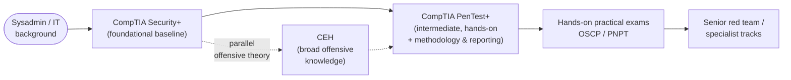

# What is CompTIA PenTest+ (PT0-003)?

CompTIA **PenTest+** is a vendor-neutral, **intermediate** cybersecurity certification from
**CompTIA (the Computing Technology Industry Association)** focused on **penetration
testing** — authorised, simulated attacks against an organisation's systems to find and
report exploitable weaknesses before a real adversary does. Unlike a purely knowledge-based
exam, PenTest+ is **hands-on and offensive**, but it gives equal weight to the
**methodology, planning, and reporting** that turn raw findings into business value. The
current exam is **PT0-003**. This page explains what the credential is, who it is for, the
experience CompTIA recommends, and where it sits relative to Security+, this repo's CEH hub,
and hands-on certifications such as OSCP and PNPT.

> [!IMPORTANT]
> **Authorised use only.** Penetration testing is legal **only** with explicit **written
> authorisation** from the system owner, a defined **scope**, and agreed **Rules of
> Engagement (RoE)**. The same actions that make you a penetration tester make you a
> criminal without that permission — the difference is **permission, not tooling**. This
> hub teaches techniques **conceptually**, for understanding and for **defence and
> methodology**; it contains **no operational, weaponised, step-by-step attack playbooks**.
> See the shared ethics page: [../../ceh/00-overview/legal-and-ethics.md](../../ceh/00-overview/legal-and-ethics.md).

> **Unofficial & no fabrication.** This hub is not affiliated with or endorsed by CompTIA.
> Exam specifics come from CompTIA's official PenTest+ page; anything volatile (exam code,
> retirement date, price, renewal terms, scoring model) is flagged **"verify on CompTIA"**
> and should be re-checked there before you rely on it.

## Learning objectives

- Explain what PenTest+ is and who issues it (CompTIA).
- Describe what "vendor-neutral", "intermediate", and "hands-on offensive" mean here.
- Identify who PenTest+ is for and the experience CompTIA recommends.
- Place PenTest+ relative to Security+ (before), this repo's CEH hub, and OSCP/PNPT (after).
- Internalise the authorised-use, written-authorisation framing that governs all of it.

## Who issues PenTest+? (CompTIA)

PenTest+ is produced by **CompTIA (the Computing Technology Industry Association)**, a
non-profit trade body and one of the largest vendor-neutral IT certification providers.
CompTIA's security track runs from **Security+** (foundational) through analyst-level
**CySA+ (Cybersecurity Analyst)** and offensive **PenTest+**, up to the advanced
**CASP+/SecurityX**. PenTest+ sits at the **intermediate, offensive** point of that track.

Always treat the official CompTIA PenTest+ page as the authoritative source for the current
exam code, format, languages, price, and renewal terms, because these change between exam
versions: https://www.comptia.org/en-us/certifications/pentest/ *(verify — specifics change)*.

## "Vendor-neutral", "intermediate", and "hands-on offensive"

Three properties define where PenTest+ fits:

- **Vendor-neutral** — it is not tied to one product or platform. It tests penetration-
  testing *concepts, methodology, and tooling categories* rather than how to drive a single
  vendor's tool. This contrasts with product certifications such as the **WALLIX Academy**
  credentials in this repo's [main hub](../../README.md), which certify a specific
  Privileged Access Management (PAM) product.
- **Intermediate** — it assumes a working security baseline (the level of **Security+** plus
  some real experience). It is **not** a first certification; it is a specialisation step.
- **Hands-on offensive + methodology/reporting** — it covers the **full engagement
  lifecycle**: planning and scoping, reconnaissance and enumeration, vulnerability discovery
  and analysis, attacks and exploits, post-exploitation and lateral movement, and — heavily
  weighted across the exam — **engagement management and reporting**. The exam includes
  **performance-based questions (PBQs)** that ask you to *do* tasks, which is why real
  practice in an **authorised lab** matters.

> For a systems administrator moving toward penetration testing: PenTest+ reframes skills
> you may already touch — networking, Active Directory, scripting, log and config reading —
> as the offensive tester's toolkit, then wraps them in the **planning, authorisation, and
> reporting discipline** that distinguishes a professional engagement from "just hacking".

## Who PenTest+ is for

PenTest+ suits people moving into **offensive security / penetration testing** from an IT or
defensive-security background, including:

- **Systems and network administrators** moving toward penetration testing (this hub's
  primary audience).
- **Penetration testers, red-team and vulnerability-assessment analysts** who want a
  recognised, methodology-and-reporting-focused credential.
- **Security analysts and SOC (Security Operations Center) staff** broadening into offensive
  testing to better understand the attacks they defend against.
- US federal and defence-contractor staff who need a credential aligned to the
  **DoD 8140** cyber-workforce framework *(verify current mapping on DoD / CompTIA)*.

### Recommended experience *(verify on CompTIA — recommended, not required)*

CompTIA recommends — but does not **require** — the following before attempting PenTest+:

| Recommendation | Detail |
| --- | --- |
| Prior certifications | **CompTIA Network+** and **Security+**, or equivalent knowledge |
| Hands-on experience | **About three to four years** of hands-on information-security or penetration-testing experience *(verify on CompTIA)* |

These are guidance, not gatekeeping: there is no mandatory prerequisite exam or formal
eligibility application. A sysadmin's existing networking, operating-system, identity, and
scripting knowledge maps directly onto the material. See
[exam-and-objectives.md](./exam-and-objectives.md) for the full exam detail.

## Where PenTest+ sits in an offensive path

PenTest+ is typically an **intermediate, mid-path** certification: you earn a foundational
baseline first, take PenTest+ to formalise penetration-testing methodology and reporting,
then prove deeper hands-on exploitation skill with practical exams afterwards.

How it relates to the other study hubs in this repository:

- **Relative to Security+ (before):** **Security+** is the **foundational, defensive-leaning**
  baseline; PenTest+ assumes that level and turns the lens **offensive and hands-on**. A
  natural order is Security+ then PenTest+. See
  [../../security-plus/README.md](../../security-plus/README.md).
- **Relative to this repo's CEH hub:** the **CEH (Certified Ethical Hacker)** and PenTest+
  are both vendor-neutral and offensive, and they overlap heavily. The practical difference:
  CEH leans toward **broad knowledge of attack techniques and tools** across a large module
  set, while PenTest+ is **more hands-on and noticeably more report- and methodology-
  focused**, structured around the **engagement lifecycle**. Many testers hold both. See
  [../../ceh/README.md](../../ceh/README.md) and the
  [CEH career & adjacent certs page](../../ceh/career/ceh-career-and-adjacent-certs.md).
- **Relative to OSCP / PNPT (after):** practical, fully hands-on exams — **OSCP (Offensive
  Security Certified Professional)** and **PNPT (Practical Network Penetration Tester)** —
  prove sustained, real exploitation skill under exam conditions. PenTest+ is a strong
  **stepping stone** toward them: it builds the methodology and breadth, and its PBQs
  introduce hands-on tasks, but those practical exams go deeper on live exploitation.
  *(OSCP and PNPT are third-party certifications — verify their current formats with their
  vendors.)*
- **Relative to WALLIX / Privileged Access Management (PAM):** much of what a tester targets
  — credentials, privileged accounts, lateral movement — is exactly what PAM products such
  as **WALLIX** are built to contain. The repo's
  [attack-to-defense matrix](../../attack-to-defense-matrix.md) maps offensive techniques to
  the PAM controls that blunt them; see also the [WALLIX/PAM hub](../../README.md).
- **Shared fundamentals:** the cross-cutting [protocols reference](../../protocols/README.md)
  (TLS, Kerberos, LDAP, SAML, SSH) and the [PAM/security foundations](../../foundations/README.md)
  reinforce concepts that appear across Security+, CEH, PenTest+, and PAM.

## A note on professionalism

The technical skill is only half of penetration testing. The other half — and the part
PenTest+ weights heavily — is conducting a **professional, authorised, well-documented
engagement** and delivering a **report** that turns findings into prioritised fixes. The
methodology and ethics framing this hub uses is shared with the CEH hub; read it before the
technique pages: [../../ceh/00-overview/engagement-methodology-and-reporting.md](../../ceh/00-overview/engagement-methodology-and-reporting.md).

## Where to go next

- [exam-and-objectives.md](./exam-and-objectives.md) — exam format, the five domains and
  weightings, performance-based questions (PBQs), and renewal.
- [../domains/README.md](../domains/README.md) — the five domain pages.
- [../../ceh/00-overview/legal-and-ethics.md](../../ceh/00-overview/legal-and-ethics.md) —
  the authorised-use foundation that governs everything here.
- [../../security-plus/README.md](../../security-plus/README.md) — the foundational sibling
  hub you should earn first.

## Sources

- CompTIA — PenTest+ (PT0-003) official certification page (provider, vendor-neutral/
  intermediate/hands-on positioning, recommended experience, exam format): https://www.comptia.org/en-us/certifications/pentest/
- CompTIA — security certification career pathway (where PenTest+ sits relative to Security+,
  CySA+, CASP+/SecurityX): https://www.comptia.org/en-us/explore-careers/certifications/
- US DoD Cyber Workforce, Directive 8140 (formerly 8570) — verify current PenTest+ mapping: https://public.cyber.mil/
- Related in this repo: [../../security-plus/README.md](../../security-plus/README.md) ·
  [../../ceh/README.md](../../ceh/README.md) · [../../attack-to-defense-matrix.md](../../attack-to-defense-matrix.md) ·
  [../../protocols/README.md](../../protocols/README.md)
- Verify all volatile specifics (exam code, retirement date, price, recommended-experience
  years, renewal/CEU terms, DoD mapping, and OSCP/PNPT formats) with CompTIA and the
  respective vendors — programs change.
