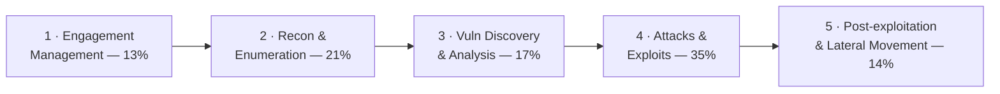

# 🟠 CompTIA PenTest+ — Study Hub

### A source-grounded study hub for **CompTIA PenTest+ (PT0-003)**

*Concepts, methodology, real diagrams, and exam prep* — the **vendor-neutral, hands-on
penetration-testing** certification, with strong engagement-management and reporting coverage.

---

> [!WARNING]
> **Educational & authorized use only.** Penetration testing is legal **only** with explicit
> written authorization, scope, and Rules of Engagement (RoE). This hub explains techniques
> **conceptually** for understanding, methodology, and defense — no weaponized step-by-step
> playbooks. See the CEH hub's [legal & ethics](../ceh/00-overview/legal-and-ethics.md).

> [!NOTE]
> **Unofficial & no fabrication.** Not affiliated with or endorsed by CompTIA. Exam specifics
> are from CompTIA's official PenTest+ page; volatile items (price, exam code, scoring model,
> CEU renewal) should be re-checked there. Compiled **2026-06-20**.

## 📋 At a glance

| Item | Detail |
|------|--------|
| **Exam** | PT0-003 *(launched 2024; verify on CompTIA)* |
| **Format** | Max **90 questions** — multiple-choice + **performance-based (PBQ)** |
| **Duration / pass** | **165 minutes** · passing/scoring model — **verify on CompTIA** |
| **Level / focus** | Intermediate, **vendor-neutral**, hands-on offensive + methodology/reporting |
| **Recommended** | Network+/Security+ and ~3–4 years pentest/security experience *(verify)* |

Full details: **[exam & objectives](00-overview/exam-and-objectives.md)**.

## 🗺️ The five domains

| # | Domain | Weight | Page |
|---|--------|--------|------|
| 1 | Engagement Management | 13% | [01-engagement-management.md](domains/01-engagement-management.md) |
| 2 | Reconnaissance and Enumeration | 21% | [02-reconnaissance-and-enumeration.md](domains/02-reconnaissance-and-enumeration.md) |
| 3 | Vulnerability Discovery and Analysis | 17% | [03-vulnerability-discovery-and-analysis.md](domains/03-vulnerability-discovery-and-analysis.md) |
| 4 | Attacks and Exploits | 35% | [04-attacks-and-exploits.md](domains/04-attacks-and-exploits.md) |
| 5 | Post-exploitation and Lateral Movement | 14% | [05-post-exploitation-and-lateral-movement.md](domains/05-post-exploitation-and-lateral-movement.md) |

*(Weightings per CompTIA — verify on the official objectives.)*

## 📦 What's inside

| Section | Contents |
|---------|----------|
| **[Overview](00-overview/what-is-pentest-plus.md)** | [What is PenTest+](00-overview/what-is-pentest-plus.md) · [Exam & objectives](00-overview/exam-and-objectives.md) |
| **[The 5 domains](domains/README.md)** | Engagement management, recon/enum, vuln discovery, attacks & exploits, post-exploitation — concept + defense |
| **[Exam prep](exam-prep/study-plan.md)** | [Study plan](exam-prep/study-plan.md) · [Practice questions](exam-prep/practice-questions.md) · [Cheat sheet](exam-prep/cheat-sheet.md) |
| **[Reference](reference/glossary.md)** | [Glossary](reference/glossary.md) — acronyms cross-link the [Security+ list](../security-plus/reference/acronyms.md) |

## 🧭 Where it fits

PenTest+ is the **vendor-neutral, report-focused** offensive cert. It pairs with the rest of
this repo:

- **Alongside** the [CEH hub](../ceh/README.md) — CEH is broad knowledge; PenTest+ adds the
  hands-on engagement-and-reporting workflow. Many cross-links go straight to the CEH modules.
- **Defensive flip side** → every attack here maps to a control in the
  [attack → defense matrix](../attack-to-defense-matrix.md); Domain 5 leans on
  [WALLIX / PAM](../wallix/pam-bastion/README.md) as the defense against lateral movement.
- **Practical hands-on next steps** → [OSCP](../oscp/README.md) and [PNPT](../pnpt/README.md).

## 🔗 Quick links

- 🎓 [CompTIA PenTest+ (official)](https://www.comptia.org/en-us/certifications/pentest/)
- ⚖️ [Legal & ethics](../ceh/00-overview/legal-and-ethics.md) · 🧠 [Glossary](reference/glossary.md)
- 🧪 [The 5 domains](domains/README.md)

> CompTIA and PenTest+ are trademarks of CompTIA, used here for identification and educational
> purposes only.
