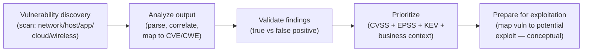
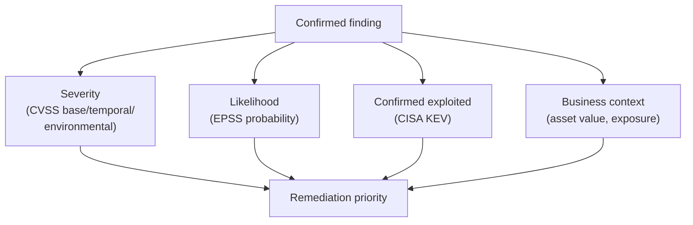

# Domain 3 — Vulnerability Discovery and Analysis

Vulnerability discovery and analysis is the stage where the information gathered during reconnaissance is turned into a **ranked list of weaknesses worth attacking**. It is the bridge between *knowing what exists* (Domain 2) and *proving impact* (the exploitation domains): the tester finds candidate weaknesses, analyzes scanner output, separates real issues from noise, prioritizes by genuine risk, and maps each confirmed finding to a *potential* exploitation path — conceptually, never as working exploit code. On the **CompTIA PenTest+ (PT0-003)** exam this aligns with the vulnerability-discovery objectives weighted at roughly **17%**. For a systems administrator, this is patching and hardening made systematic, sharpened by the attacker's question: *which of these can actually be used, and how badly?*

> **Authorized-use note.** This page is **educational and defense-oriented**. Vulnerability scanning sends real probes to real systems and can disrupt them; mapping vulnerabilities to exploits is described **conceptually only**. All of it is legal **only** with **explicit written authorization**, a defined **scope**, and agreed **Rules of Engagement (RoE)**. This hub names tools by **purpose** and provides **no working exploit code, no weaponized scripts, and no operational playbooks**. It mirrors the defensive framing of the [CEH vulnerability-analysis module](../../ceh/domains/05-vulnerability-analysis.md).

## Learning objectives

- Distinguish a **vulnerability assessment** from a **penetration test**, and **automated** scanning from **manual** discovery.
- Describe vulnerability discovery across **network, host, application, cloud, and wireless** targets, and the main **scanning types**.
- **Analyze** scan output and recognize common scanner findings and limitations.
- Explain **static** vs **dynamic** analysis concepts for application vulnerability discovery.
- **Prioritize** findings using **CVSS** (Base / Temporal / Environmental), **EPSS**, the **CISA KEV** catalog, exploitability, and business context.
- **Validate** findings — distinguishing **true positives** from **false positives** (and false negatives).
- **Prepare for exploitation** by mapping vulnerabilities to *potential* exploits conceptually, with no working exploit code.

## Vulnerability assessment vs penetration test

These are frequently confused and the distinction is exam-relevant.

| Aspect | Vulnerability assessment | Penetration test |
| --- | --- | --- |
| Core question | *What weaknesses exist?* | *Can these weaknesses actually be exploited, and how far?* |
| Emphasis | **Breadth** — enumerate as many issues as possible | **Depth** — prove impact by exploiting selected issues |
| Exploitation | Usually **does not** exploit | **Does** exploit, within scope and RoE |
| Output | A prioritized list of findings | An attack-path narrative with proof and business impact |
| Cadence | Often **continuous / scheduled** | **Point-in-time**, periodic |

Vulnerability discovery is one early activity *inside* a penetration test; the test then goes further by validating and exploiting selected findings.

## Vulnerability discovery: methods and targets

### Automated vs manual discovery

- **Automated scanning** — tools probe targets and match findings against a feed of known vulnerabilities (often keyed to **CVE** identifiers), reporting issues at speed and scale. Excellent coverage and consistency, but prone to **false positives** and blind to logic flaws.
- **Manual discovery** — a tester reasons about the application or system, chains observations, and inspects logic, authentication, and access control that scanners miss. Slower, but finds what automation cannot and confirms what it reports.

The two are complementary: scanners give breadth, manual testing gives depth and validation.

### Scanning types and considerations

- **Credentialed (authenticated) vs uncredentialed** — authenticated scans log in to the target and see far more (installed software, patch level, local config), producing **fewer false positives**; uncredentialed scans model an external attacker's limited view.
- **Active vs passive** — active scans send probes and analyze responses; passive analysis observes existing traffic or reviews configuration without probing (quieter, lower risk).
- **Internal vs external** — internal scans model an insider or assumed-breach position; external scans look from the internet at the public attack surface.
- **Discovery intensity and timing** — scan intensity must respect the RoE; aggressive scans can disrupt fragile systems (operational technology, legacy hosts, embedded devices), so timing windows and safe-check options matter.

### Discovery by target type

| Target | What discovery looks for |
| --- | --- |
| **Network** | Exposed services, protocol weaknesses, default/weak configurations across hosts and segments |
| **Host** | Missing patches, OS hardening gaps, insecure local configuration and privileges |
| **Application** | Injection, broken authentication/authorization, misconfiguration, exposed APIs (often framed by the **OWASP Top 10**) |
| **Cloud** | Misconfigured storage and identity, excessive permissions, exposed management/metadata endpoints |
| **Wireless** | Weak encryption, rogue access points, weak authentication on in-scope radio networks |

The CEH hub covers assessment types and the vulnerability-management lifecycle in [vulnerability analysis](../../ceh/domains/05-vulnerability-analysis.md).

### Static vs dynamic analysis (applications)

For application weaknesses, two complementary analysis styles appear on PT0-003:

- **Static analysis (SAST — Static Application Security Testing)** — examines source code, bytecode, or configuration **without running** the program. Finds insecure patterns early but can over-report (no runtime context).
- **Dynamic analysis (DAST — Dynamic Application Security Testing)** — tests the **running** application from the outside, observing real responses. Finds issues that only appear at runtime but sees less of the internal logic.

A combined approach (sometimes augmented by **IAST**, interactive testing) gives the most complete picture.

## Analyzing scan output

A scanner's report is the *start* of analysis, not the end. Effective analysis means:

- **Normalizing and correlating** results across tools and runs, and de-duplicating overlapping findings.
- **Mapping** each finding to its **CVE (Common Vulnerabilities and Exposures)** identifier and **CWE (Common Weakness Enumeration)** category — the *specific instance* and the *class of weakness*, respectively. The **National Vulnerability Database (NVD)**, run by NIST, enriches CVE entries with analysis and CVSS scores.
- **Reading severity in context** — a scanner-assigned severity is an input, not a verdict.
- **Recognizing limitations** — stale feeds cause **false negatives** (missed real issues); generic checks cause **false positives** (reported issues that are not really there). Both must be reconciled before reporting.

## Prioritizing vulnerabilities

A scan can return thousands of findings; prioritization decides what to act on first. PT0-003 expects you to combine *severity*, *exploitability*, and *business context* rather than relying on any single number.

| Input | What it tells you | Maintained / published by |
| --- | --- | --- |
| **CVSS (Common Vulnerability Scoring System)** | Standardized **severity** (0.0–10.0) | FIRST (Forum of Incident Response and Security Teams) |
| **EPSS (Exploit Prediction Scoring System)** | **Probability** a vulnerability will be exploited in the wild (in the near term) | FIRST |
| **CISA KEV (Known Exploited Vulnerabilities) catalog** | Vulnerabilities **confirmed exploited** in the wild | CISA (U.S. Cybersecurity and Infrastructure Security Agency) |
| **Exploitability** | Whether a working exploit exists and how hard it is to use | Threat intelligence / research |
| **Business context** | Asset criticality, exposure, and data sensitivity to *your* organization | The organization itself |

### CVSS metric groups

- **Base** — intrinsic, unchanging characteristics (how it is accessed and the impact if exploited). This is what most published scores report.
- **Temporal** (called *Threat* in newer versions) — factors that change over time, such as whether a working exploit exists.
- **Environmental** — adjustments for *your* environment (asset importance, compensating controls in place).

> **Key insight:** CVSS alone over-prioritizes. A "Critical" CVSS vulnerability with **no known exploit** may be less urgent than a "High" one that is on the **CISA KEV** list or carries a high **EPSS** probability. Combining **CVSS (severity) + EPSS (likelihood) + KEV (confirmed exploitation) + business context (impact to you)** produces a far better remediation order. The repo's [security-plus threats and mitigations](../../security-plus/domains/02-threats-vulnerabilities-mitigations.md) and [CySA+ vulnerability management](../../cysa-plus/domains/02-vulnerability-management.md) cover this prioritization from the defensive operations side.

## Validating findings: true vs false positives

Before a finding drives effort, it must be **validated**. CompTIA emphasizes this because acting on bad data wastes remediation time and erodes trust in the report.

- **True positive** — a reported vulnerability that **is** genuinely present and confirmed.
- **False positive** — a vulnerability the scanner reports that is **not actually present** (for example, a version banner that does not reflect a back-ported patch).
- **False negative** — a real vulnerability the scanner **missed** (the more dangerous error, often caused by stale feeds or uncredentialed scans).
- **True negative** — correctly reporting that no vulnerability exists.

Validation methods (conceptual) include **manual verification**, cross-checking with a second tool, **credentialed re-scanning**, and safe proof-of-concept confirmation **strictly within scope and RoE**. Penetration testing adds value precisely here: it confirms which scanner findings are *real and exploitable*.

## Preparing for exploitation (conceptual)

The output of this domain is a validated, prioritized set of findings, each **conceptually mapped** to *how* it might be exploited — which feeds the later exploitation domains. This mapping is **analytical, not operational**:

- **Match weakness to technique class** — for example, an injection finding maps to the injection technique class; a missing-patch finding maps to a known **CVE** and its weakness category (**CWE**); a misconfiguration maps to an access or privilege issue.
- **Assess feasibility** — does a usable exploit exist (informed by EPSS/KEV), and do scope and RoE permit attempting it?
- **Plan within scope** — sequence findings by priority and document the intended approach for the engagement.

This hub stops at the *conceptual mapping* and **provides no working exploit code, no payloads, and no step-by-step procedures.** Reference frameworks for the technique *taxonomy* (not execution) include **MITRE ATT&CK** and the **OWASP** testing guides.

## Countermeasures / Defense

Vulnerability analysis is itself a defensive discipline; the countermeasures close what it reveals and reduce how many issues appear:

- **Authorize first.** Never scan without **explicit written authorization**, scope, schedule, and RoE — for legality and to avoid disrupting fragile systems.
- **Patch and configuration management.** Timely patching and secure baselines (hardening guides, CIS Benchmarks) remove the most common findings before a scan runs.
- **Keep feeds current.** A scanner is only as good as its vulnerability database; stale feeds cause false negatives.
- **Prefer authenticated scans** where appropriate — they see more and reduce false positives (with careful credential handling).
- **Prioritize by risk, not raw score.** Combine **CVSS + EPSS + CISA KEV + business context**; the KEV catalog is a strong "fix-now" signal.
- **Validate before remediating.** Confirm findings to weed out false positives and focus effort.
- **Run continuous vulnerability management.** Treat discovery → assess → prioritize → remediate → verify → monitor as an ongoing loop, aligned with **NIST SP 800-30** risk-assessment guidance.
- **Reduce attack surface and segment** so that even discovered services have limited reach.

## Exam tips

- **Vulnerability discovery is roughly 17% of PT0-003** — verify the exact percentage against the current CompTIA objectives.
- **Vulnerability assessment vs penetration test:** assessment finds and lists (breadth, usually no exploitation); penetration test exploits to prove impact (depth).
- **CVSS = "how severe" (0.0–10.0, maintained by FIRST); EPSS = "how likely to be exploited" (probability, FIRST); CISA KEV = "confirmed exploited in the wild."** Combine all three plus business context.
- **CVSS metric groups: Base, Temporal (Threat), Environmental.**
- **CVE = a specific vulnerability; CWE = the class of weakness; NVD = NIST database enriching CVE with CVSS.**
- **False positive** = reported but not real; **false negative** = real but missed (more dangerous). Validate before remediating.
- **Authenticated (credentialed) scans** see more and produce fewer false positives than uncredentialed scans.
- **Static (SAST) = analyze code without running it; Dynamic (DAST) = test the running app from outside.**
- **Automated scanning gives breadth; manual discovery gives depth** and confirms findings.
- Mapping vulnerabilities to exploits on this exam is **conceptual** — know the technique classes, not weaponized code.

## Where to go next

- [Domain 2 — Reconnaissance and enumeration](./02-reconnaissance-and-enumeration.md) — the input to vulnerability discovery.
- [CEH — vulnerability analysis](../../ceh/domains/05-vulnerability-analysis.md) — assessment types and the vulnerability-management lifecycle.
- [CySA+ — vulnerability management](../../cysa-plus/domains/02-vulnerability-management.md) — the defensive operations view of prioritization and remediation.
- [Security+ — threats, vulnerabilities, and mitigations](../../security-plus/domains/02-threats-vulnerabilities-mitigations.md) — foundational concepts.

## Sources

- CompTIA, PenTest+ (PT0-003) certification and exam objectives — https://www.comptia.org/certifications/pentest
- FIRST, Common Vulnerability Scoring System (CVSS) — https://www.first.org/cvss/
- FIRST, Exploit Prediction Scoring System (EPSS) — https://www.first.org/epss/
- CISA, Known Exploited Vulnerabilities (KEV) Catalog — https://www.cisa.gov/known-exploited-vulnerabilities-catalog
- NIST, National Vulnerability Database (NVD) — https://nvd.nist.gov/
- NIST, SP 800-115, *Technical Guide to Information Security Testing and Assessment* — https://csrc.nist.gov/pubs/sp/800/115/final
- NIST, SP 800-30, *Guide for Conducting Risk Assessments* — https://csrc.nist.gov/pubs/sp/800/30/r1/final
- MITRE, Common Vulnerabilities and Exposures (CVE) — https://www.cve.org/
- MITRE, Common Weakness Enumeration (CWE) — https://cwe.mitre.org/
- OWASP, Top 10 and Web Security Testing Guide — https://owasp.org/www-project-top-ten/ and https://owasp.org/www-project-web-security-testing-guide/
- Exact exam objective numbers and domain percentages: *verify against the current CompTIA PT0-003 exam objectives* — https://www.comptia.org/
