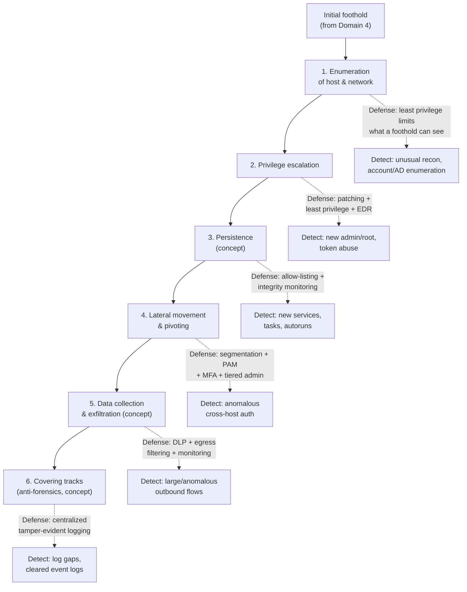

# Domain 5 — Post-exploitation and Lateral Movement

**Post-exploitation and Lateral Movement** is weighted at roughly **14%** of the **CompTIA PenTest+ (PT0-003)** exam (verify the current weighting on CompTIA). It covers what an authorized tester — and a real attacker — does *after* a first foothold: understanding the access gained, expanding it, moving deeper into the network, and demonstrating impact, all while a careful tester preserves evidence and a careful defender watches for exactly these behaviors.

This is the domain where **Privileged Access Management (PAM)**, network **segmentation**, **Endpoint Detection and Response (EDR)**, monitoring, and **least privilege** matter most: post-exploitation is fundamentally about *moving between systems using privileged credentials and trust relationships*, and those are precisely what PAM controls and observes. For a systems administrator, this is the strongest bridge between the offensive material and your existing identity-and-access work.

> **Authorized-use note.** Everything here is **conceptual, for understanding and defense**. These actions are legal **only with explicit written authorization**, a defined **scope**, and agreed **Rules of Engagement (RoE)** — and a professional tester stays within scope, avoids unnecessary disruption, and removes any artifacts created. This page contains **no step-by-step procedures, no persistence/exfiltration tooling recipes, and no anti-forensic how-tos** — only concepts paired with the **defensive control** and **detection**. Tools are named by **purpose only**.

## Learning objectives

- Describe the post-exploitation chain at a concept level: **enumeration of a compromised host/network → privilege escalation → persistence → lateral movement / pivoting → data collection / exfiltration → covering tracks**.
- For each phase, name the **defensive control** that blocks or limits it and the **detection signal** a defender relies on.
- Explain why **PAM, segmentation, EDR, monitoring, and least privilege** are the dominant defenses against this whole domain.
- Recognize the Active Directory credential-reuse concepts — **Pass-the-Hash (PtH)**, **Pass-the-Ticket (PtT)**, **Kerberoasting** — at concept level and their defenses.
- Understand the tester's professional duty to **clean up** and the defender's duty to treat **missing logs as an alert**.

## The post-exploitation chain with defensive controls overlaid

The phases are conceptual goals, not a fixed script — a tester may loop back to enumeration after each new host. The diagram overlays the **defensive control** that addresses each phase.

> Read this chain as a defender: **break any link and the rest of the chain stalls.** PAM and segmentation primarily break **lateral movement** (link 4); least privilege and patching break **escalation** (link 2); centralized logging defeats **covering tracks** (link 6).

## 1. Enumeration of the compromised host and network

**Concept.** With a foothold, the tester inventories the local host (users, groups, services, scheduled tasks, stored secrets, network configuration) and then the surrounding network and **Active Directory (AD)** (other hosts, shares, trust relationships, privileged groups) to plan the next move.

**Why it works.** A standard foothold can often read far more than it should — group memberships, share permissions, and AD objects are frequently world-readable to authenticated users.

**Defense.** **Least privilege** limits what a single foothold can enumerate; restrict and monitor AD read access; reduce the blast radius of any one account.

**Detection.** Alert on unusual reconnaissance from a single host — broad AD/LDAP queries, share enumeration sweeps, and service-account or admin-group lookups that the account does not normally make.

See CEH **[Enumeration](../../ceh/domains/04-enumeration.md)** and **[System Hacking](../../ceh/domains/06-system-hacking.md)**.

## 2. Privilege escalation

**Concept.** Moving from a limited account to **administrator** (Windows) or **root** (Linux), or sideways to another user's access — the bridge from "I have a shell" to "I control this host." This is introduced in [Domain 4 host-based attacks](04-attacks-and-exploits.md#3-host-based-attacks); here it is the engine that drives the rest of the chain.

**Why it works.** Unpatched local privilege-escalation vulnerabilities, weak service/file permissions, and stored or cached privileged credentials.

**Defense.** Prompt patching, strict least privilege (no day-to-day admin use), permission hygiene, and **PAM** so that privileged credentials are vaulted and never sit reusably on endpoints.

**Detection.** EDR alerts on new admin/root sessions, token manipulation, and known escalation signatures.

## 3. Persistence (concept)

**Concept.** Ensuring the access survives a reboot or credential change so the tester (or attacker) can return without repeating the foothold — conceptually via new services, scheduled tasks, autorun entries, or accounts. **Mechanics are kept conceptual here; no recipes.**

**Defense.** **Application allow-listing** and **file-integrity monitoring** to catch unauthorized binaries and changes; baseline the normal set of services, tasks, and accounts.

**Detection.** Alert on new or unexpected services, scheduled tasks, autoruns, accounts, and unsigned drivers. A professional tester **documents and removes** any persistence created during the engagement.

## 4. Lateral movement and pivoting (concept)

**Concept.** Using the access and credentials from one host to reach others — **pivoting** routes traffic *through* a compromised host to reach network segments the tester could not touch directly. In AD environments, lateral movement frequently abuses **reusable credential material** rather than fresh exploits:

| AD credential-reuse concept | What it abuses | Defense | Detection |
| --- | --- | --- | --- |
| **Pass-the-Hash (PtH)** | A captured password hash used to authenticate without the plaintext | Tiered admin, PAM, least privilege, credential protection | Auth using a hash from an unusual host |
| **Pass-the-Ticket (PtT)** | A stolen Kerberos ticket reused for access | Short ticket lifetimes; PAM; monitor ticket use | Tickets used from anomalous endpoints |
| **Kerberoasting** | Requesting service tickets to crack weak service-account passwords offline | **Strong/long service-account passwords**, managed/group-managed accounts, MFA | Spikes in service-ticket requests |

See the protocol detail in **[Kerberos](../../protocols/kerberos.md)** for how PtT and Kerberoasting relate to ticket issuance.

**Why it works.** Flat networks let any host reach any other; reused local-admin passwords and over-privileged service accounts let one captured credential open many doors.

**Defense — this is the PAM/segmentation core of the domain.**

- **Network segmentation** so a foothold cannot reach the whole estate; a pivot must cross a controlled boundary.
- **Privileged Access Management (PAM)** — broker privileged sessions through a bastion, vault and **rotate** credentials so they are never reused on endpoints, and record sessions. This directly breaks PtH/PtT by removing standing reusable secrets and by funneling privileged access through a monitored choke point. See **[PAM Bastion](../../wallix/pam-bastion/README.md)**, **[Session Management](../../wallix/deep-dives/session-management.md)**, and the **[PAM threat landscape](../../foundations/pam-threat-landscape.md)**.
- **Tiered administration** (separate admin tiers for workstations, servers, and domain controllers) so a workstation compromise cannot reach domain-admin credentials.
- **Unique local-admin passwords** per host (e.g., a password-management solution for local admin accounts) so one cracked password does not unlock every machine.
- **MFA** on privileged and remote access.

**Detection.** Anomalous cross-host authentication, a single account authenticating to many systems quickly, privileged logons from non-admin workstations, and use of remote-execution services outside change windows. The recorded sessions a PAM bastion produces are themselves a high-fidelity detection and forensic source.

See CEH **[System Hacking](../../ceh/domains/06-system-hacking.md)** and the **[attack-to-defense matrix](../../attack-to-defense-matrix.md)** for the full mapping of these attacks to WALLIX/PAM controls.

## 5. Data collection and exfiltration (concept)

**Concept.** Identifying and gathering target data, then moving it out of the environment to demonstrate impact. **Concept only — no exfiltration channels or tooling recipes here.**

**Defense.** **Data Loss Prevention (DLP)**, strict **egress filtering** (only known destinations and protocols leave the network), encryption and access control on sensitive data, and least privilege so a single account cannot read everything.

**Detection.** Large or unusual outbound transfers, connections to unfamiliar destinations, traffic on unexpected ports/protocols, and staging behavior (mass file reads, large local archives). A professional engagement agrees in the RoE how *demonstration* of access is handled without exposing real data.

## 6. Covering tracks / anti-forensics (concept)

**Concept.** Reducing the evidence of the intrusion — conceptually, tampering with or clearing logs, command history, and timestamps. **The defensive lesson matters more than any offensive detail: logs an attacker can edit are logs you cannot trust.**

**Defense.** Ship logs **off the host** in near real time to a central, write-restricted store / **Security Information and Event Management (SIEM)** system; use **tamper-evident / append-only** logging; synchronize time so cross-host timestamps correlate.

**Detection.** **Treat cleared or missing logs as an alert in itself** — a log gap is a positive indicator of compromise, not an absence of evidence. PAM session recordings stored off-host give an independent record that an endpoint-level wipe cannot reach.

> **Professional duty.** In an authorized engagement the tester does **not** maliciously destroy logs; the "covering tracks" concept is studied so defenders build logging that resists tampering. The tester's own obligation is to document actions and clean up artifacts, leaving the environment as found.

## Why PAM is central to this whole domain

Post-exploitation is, at its core, **the abuse of privilege and trust to move between systems.** That is exactly the surface PAM is built to control:

| Post-exploitation behavior | PAM/defensive control that counters it |
| --- | --- |
| Reusing privileged credentials across hosts (PtH/PtT) | Vaulting + automatic rotation removes standing reusable secrets |
| Lateral movement across a flat network | Segmentation + bastion brokering forces movement through a monitored boundary |
| Stealthy privileged actions | Full **session recording** and keystroke logging create high-fidelity evidence |
| Standing administrative access | **Just-in-time** access and least privilege shrink the window of usable privilege |
| Covering tracks on the endpoint | Off-host PAM session records survive local log tampering |

See the **[PAM threat landscape](../../foundations/pam-threat-landscape.md)**, **[Session Management deep-dive](../../wallix/deep-dives/session-management.md)**, and the **[attack-to-defense matrix](../../attack-to-defense-matrix.md)**.

## Exam tips

- Know the **chain order**: enumeration → privilege escalation → persistence → lateral movement/pivoting → collection/exfiltration → covering tracks.
- **Pivoting** = routing through a compromised host to reach otherwise-unreachable segments; **lateral movement** = using access/credentials to reach new hosts.
- Match the AD credential-reuse concepts to defenses: **PtH/PtT** → tiered admin + PAM + credential protection; **Kerberoasting** → **strong service-account passwords** + managed accounts.
- The dominant defenses for this domain are **segmentation, PAM, least privilege, EDR, MFA, and centralized tamper-evident logging** — be ready to pair each behavior with its control.
- **Covering tracks** targets **logs**; the defense is **off-host, tamper-evident logging**, and **missing logs are themselves an alert**.
- A professional tester **stays in scope, avoids disruption, and cleans up** — post-exploitation does not mean "do anything."

> **Authorized-use reminder.** Post-exploitation activity is permitted only within written authorization, scope, and Rules of Engagement. Study these concepts to **defend and detect** — segmentation, PAM, and logging are where this domain is won.

## Sources

- CompTIA — PenTest+ (PT0-003) official certification page (domains and weightings; verify current values): https://www.comptia.org/en-us/certifications/pentest/
- CompTIA — PenTest+ (PT0-003) exam objectives (the authoritative study checklist): https://www.comptia.org/en-us/certifications/pentest/
- MITRE ATT&CK — Enterprise tactics (Persistence, Privilege Escalation, Lateral Movement, Collection, Exfiltration, Defense Evasion): https://attack.mitre.org/tactics/enterprise/
- MITRE ATT&CK — Indicator Removal (T1070): https://attack.mitre.org/techniques/T1070/
- NIST SP 800-115 — Technical Guide to Information Security Testing and Assessment: https://csrc.nist.gov/pubs/sp/800/115/final
- [Domain 4 — Attacks and Exploits](04-attacks-and-exploits.md)
- [Attack-to-Defense Matrix](../../attack-to-defense-matrix.md) · [PAM threat landscape](../../foundations/pam-threat-landscape.md) · [Session Management](../../wallix/deep-dives/session-management.md) · [PAM Bastion](../../wallix/pam-bastion/README.md) · [Kerberos](../../protocols/kerberos.md)
- CEH sibling modules: [Enumeration](../../ceh/domains/04-enumeration.md) · [System Hacking](../../ceh/domains/06-system-hacking.md)
