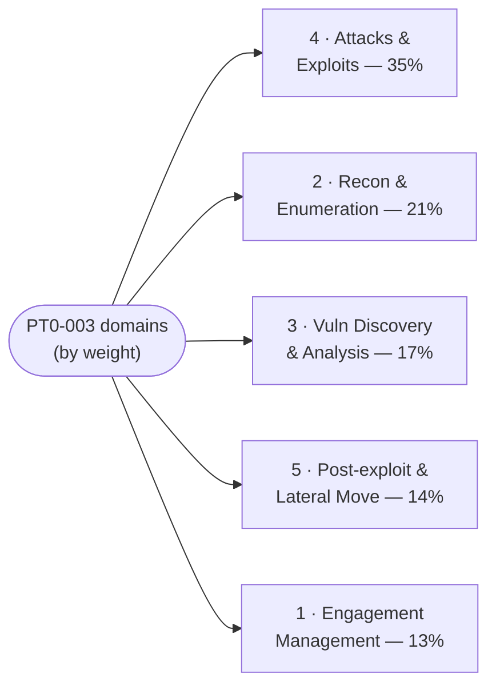

# The Five PenTest+ (PT0-003) Domains

The core knowledge areas of the CompTIA PenTest+ (PT0-003) exam. Each page below is written
**toward the official PT0-003 exam objectives** and covers the domain's concepts, a Mermaid
diagram, and the key terms a sysadmin moving into penetration testing needs — with techniques
explained **conceptually, for understanding and for defence/methodology**, never as
weaponized step-by-step playbooks. The percentages are CompTIA's published weightings (the
share of scored content per domain) *(verify on [CompTIA](https://www.comptia.org/en-us/certifications/pentest/) — weightings change per exam version)*.

> [!IMPORTANT]
> **Authorised use only.** Every technique these pages describe is performed in practice
> **only** with explicit **written authorisation** from the system owner, a defined **scope**,
> and agreed **Rules of Engagement (RoE)**. Penetration testing without that permission is a
> crime — the difference is **permission, not tooling**. This hub mirrors the CEH hub's
> framing: techniques are taught conceptually and defensively, with no operational exploit
> code. See [../../ceh/00-overview/legal-and-ethics.md](../../ceh/00-overview/legal-and-ethics.md).

> The objectives PDF is the canonical checklist for exact wording and every listed term, tool,
> and acronym — see [how to get it](../00-overview/exam-and-objectives.md#how-to-get-the-official-exam-objectives).
> These pages follow it but do not replace it.

## Learning objectives

- Identify the five PT0-003 domains, their weightings, and their themes.
- Use the weightings to prioritise study time (Attacks and Exploits is the largest at 35%).
- Navigate to the per-domain page written toward the official objectives.

## Domain index

| # | Domain | Weight | Theme (one line) |
| --- | --- | --- | --- |
| 1 | [Engagement Management](01-engagement-management.md) | **13%** | Pre-engagement scoping, RoE, contracts, ethics, methodology, and reporting |
| 2 | [Reconnaissance and Enumeration](02-reconnaissance-and-enumeration.md) | **21%** | OSINT, scanning, service/host enumeration, and target profiling |
| 3 | [Vulnerability Discovery and Analysis](03-vulnerability-discovery-and-analysis.md) | **17%** | Finding, validating, and prioritising weaknesses (CVSS, false positives) |
| 4 | [Attacks and Exploits](04-attacks-and-exploits.md) | **35%** | Exploiting network, host, web, wireless, cloud, and social-engineering weaknesses |
| 5 | [Post-exploitation and Lateral Movement](05-post-exploitation-and-lateral-movement.md) | **14%** | Persistence, pivoting, privilege escalation, and proving impact within scope |

## How to use these pages

- **Prioritise by weight.** Domain 4 (Attacks and Exploits, 35%) is the largest — but it
  depends entirely on the recon and analysis in Domains 2 and 3 (~38% combined). Domain 1
  (Engagement Management, 13%) carries the planning, ethics, and reporting that make the rest
  lawful and useful; do not skip it because it is the smallest.
- **Pair with the objectives PDF.** Track each sub-objective against the official list; these
  pages are written toward those objectives but the PDF is the authoritative checklist — see
  [exam-and-objectives.md](../00-overview/exam-and-objectives.md).
- **Cross-reference the defensive view.** Where this hub covers an attack, the
  [Security+ hub](../../security-plus/README.md) and the
  [attack-to-defense matrix](../../attack-to-defense-matrix.md) cover the controls that stop
  it; the [CEH modules](../../ceh/domains/README.md) cover the same techniques from a parallel
  offensive curriculum; the [protocols reference](../../protocols/README.md) and
  [foundations](../../foundations/README.md) reinforce shared fundamentals.

## Where to go next

- [../00-overview/what-is-pentest-plus.md](../00-overview/what-is-pentest-plus.md) — what
  PenTest+ is and where it sits.
- [../00-overview/exam-and-objectives.md](../00-overview/exam-and-objectives.md) — exam
  format, the weightings, PBQs, and the objectives PDF.
- [../../ceh/domains/README.md](../../ceh/domains/README.md) — the parallel offensive
  curriculum from the CEH hub.

## Sources

- CompTIA — PenTest+ (PT0-003) official certification page and exam objectives (five domains
  and published weightings 13 / 21 / 17 / 35 / 14 percent): https://www.comptia.org/en-us/certifications/pentest/
- Related in this repo: [../../ceh/domains/README.md](../../ceh/domains/README.md) ·
  [../../security-plus/README.md](../../security-plus/README.md) ·
  [../../attack-to-defense-matrix.md](../../attack-to-defense-matrix.md) ·
  [../../protocols/README.md](../../protocols/README.md)
- Domain weightings are version-sensitive — *verify on CompTIA* before relying on them.
