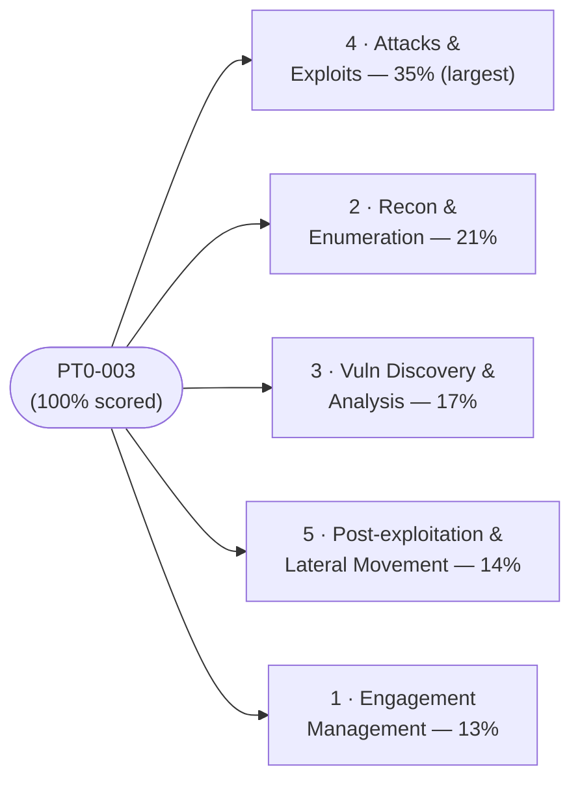
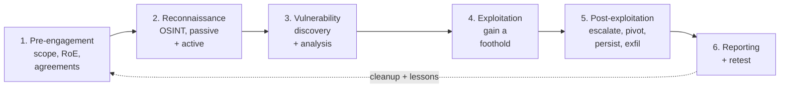

# PenTest+ (PT0-003) Cheat Sheet

A dense, last-mile quick reference for the **CompTIA PenTest+ (PT0-003)** exam. Use it for spaced review and final-week drilling, paired with the [study-plan.md](./study-plan.md) and [practice-questions.md](./practice-questions.md).

> This is a condensed reference, not a teaching page. Each line assumes you have already read the relevant [domain page](../domains/README.md). Acronyms are expanded on first use.
>
> **Authorised-use reminder.** Every technique below is for **educational, explicitly authorised** testing only. You act under a signed scope, Rules of Engagement (RoE), and written authorisation — never against systems you do not own or have permission to test. See [../../ceh/00-overview/legal-and-ethics.md](../../ceh/00-overview/legal-and-ethics.md).

## Exam-day facts

| Item | Detail |
| --- | --- |
| Exam code | **PT0-003** |
| Questions | **Maximum 90** (multiple-choice + performance-based questions, PBQs) |
| Time | **165 minutes** |
| Passing / scoring | scaled score (not a flat percentage) — **verify the current cut-score on CompTIA** |
| Pace | ~1.8 min/item; PBQs cost more — flag and return |
| Recommended | Network+, Security+, and ~3–4 years hands-on security experience (not required) |

- Confirm exam code, retirement date, price, languages, and CEU renewal on **CompTIA** — these change.

## The 5 domains at a glance

| # | Domain | Weight | Theme |
| --- | --- | --- | --- |
| 1 | [Engagement Management](../domains/01-engagement-management.md) | 13% | Pre-engagement, scope, RoE, agreements, methodology, reporting |
| 2 | [Reconnaissance & Enumeration](../domains/02-reconnaissance-and-enumeration.md) | 21% | OSINT, passive/active recon, host/service/user enumeration |
| 3 | [Vulnerability Discovery & Analysis](../domains/03-vulnerability-discovery-and-analysis.md) | 17% | Scanning, validation, prioritisation, CVSS, false positives |
| 4 | [Attacks & Exploits](../domains/04-attacks-and-exploits.md) | 35% | Network/web/app/wireless/cloud/social-engineering exploitation |
| 5 | [Post-exploitation & Lateral Movement](../domains/05-post-exploitation-and-lateral-movement.md) | 14% | Privilege escalation, pivoting, persistence, exfiltration, cleanup |

## The engagement lifecycle at a glance

| Stage | Goal | Typical activity |
| --- | --- | --- |
| 1. Pre-engagement | Define and authorise the job | Scope, RoE, SOW/MSA/NDA, timing, emergency contacts |
| 2. Reconnaissance | Profile the target | OSINT, WHOIS, DNS, then active scanning/enumeration |
| 3. Vulnerability discovery | Find weaknesses | Vuln scanning, manual validation, prioritisation |
| 4. Exploitation | Gain a foothold | Exploits, password attacks, web/app attacks |
| 5. Post-exploitation | Expand and demonstrate impact | Privilege escalation, pivoting, persistence, exfiltration |
| 6. Reporting & retest | Communicate and verify fixes | Findings, evidence, remediation, retest, cleanup |

> Reporting is continuous — capture evidence at every stage. **Cleanup** (removing tools, accounts, artefacts) and a **lessons-learned** loop close the engagement.

## Methodology standards (know which is which)

| Standard | Expansion | What it is |
| --- | --- | --- |
| **PTES** | Penetration Testing Execution Standard | Seven-phase pentest process model (pre-engagement → reporting) |
| **NIST SP 800-115** | NIST Technical Guide to Information Security Testing and Assessment | US government guide to security testing/assessment phases |
| **OWASP** | Open Worldwide Application Security Project | Web/app testing guidance (Top 10, Web/Mobile Security Testing Guides) |
| **OSSTMM** | Open Source Security Testing Methodology Manual | Metrics-driven operational security testing methodology |
| **MITRE ATT&CK** | Adversarial Tactics, Techniques & Common Knowledge | Knowledge base of real-world adversary tactics/techniques (TTPs) |

> NIST = National Institute of Standards and Technology. Related: **CIS Benchmarks** (hardening baselines), **PCI DSS Penetration Testing Guidance** (scope for cardholder environments), **MITRE CWE** (weakness categories behind CVEs).

## Reconnaissance: passive vs active

| | Passive recon | Active recon |
| --- | --- | --- |
| Contact with target | **None** — public sources only | **Direct** — sends packets to the target |
| Detectability | Hard to detect | Logged / can trigger alerts |
| Examples | OSINT, WHOIS, DNS records, search/Google dorking, Shodan, social media, certificate transparency | Port/host scanning, banner grabbing, service/version detection, enumeration |

> **Scanning vs enumeration:** scanning finds what is open (hosts, ports, services); enumeration extracts detail (users, shares, versions). **OSINT** = Open-Source Intelligence.

## Tool categories by purpose (names + purpose only)

Learn one representative tool per category — the exam tests "which tool for which job." Use every tool **only** on systems you own or are explicitly authorised to test.

| Category | Purpose | Representative tools |
| --- | --- | --- |
| Reconnaissance / OSINT | Gather public info, map exposure | WHOIS, nslookup/dig, theHarvester, Maltego, Recon-ng, Shodan, Google dorks |
| Scanning / enumeration | Discover hosts, ports, services, users | Nmap, Masscan, Netcat, enum4linux, SNMP-walk |
| Vulnerability scanning | Identify and rate known weaknesses | Nessus, OpenVAS, Qualys, Nikto (web) |
| Web proxy / app testing | Intercept, fuzz, and test web requests | Burp Suite, OWASP ZAP, dirb/gobuster, sqlmap |
| Exploitation framework | Deliver exploits and payloads | Metasploit Framework, Cobalt Strike (commercial), Sliver, Empire |
| Password attacks | Crack/guess credentials | John the Ripper, Hashcat, Hydra, Medusa |
| Wireless | Test Wi-Fi security | Aircrack-ng suite, Kismet, Wifite |
| Sniffing / traffic | Capture and inspect network traffic | Wireshark, tcpdump, Responder |
| Post-exploitation / C2 | Maintain access, pivot, control | Meterpreter, Cobalt Strike (commercial), Empire, BloodHound (AD mapping) |

> SNMP = Simple Network Management Protocol; AD = Active Directory; C2 = Command and Control. Many tools span categories (e.g. Metasploit also scans; Burp also fuzzes).

## OWASP Top 10 (2021 edition)

The Open Worldwide Application Security Project (OWASP) Top 10 web-application risks — the core of web exploitation in Domain 4:

| # | Category |
| --- | --- |
| A01 | Broken Access Control |
| A02 | Cryptographic Failures |
| A03 | Injection (includes SQL injection and Cross-Site Scripting) |
| A04 | Insecure Design |
| A05 | Security Misconfiguration |
| A06 | Vulnerable and Outdated Components |
| A07 | Identification and Authentication Failures |
| A08 | Software and Data Integrity Failures |
| A09 | Security Logging and Monitoring Failures |
| A10 | Server-Side Request Forgery (SSRF) |

> Verify the current edition on OWASP; the list is revised periodically. Deeper treatment: [../../ceh/exam-prep/cheat-sheet.md](../../ceh/exam-prep/cheat-sheet.md).

## CVSS severity bands (v3.x)

The Common Vulnerability Scoring System (CVSS) base-score ranges — used to **prioritise** findings in Domain 3:

| Band | Score range |
| --- | --- |
| None | 0.0 |
| Low | 0.1 – 3.9 |
| Medium | 4.0 – 6.9 |
| High | 7.0 – 8.9 |
| Critical | 9.0 – 10.0 |

> CVE = Common Vulnerabilities and Exposures (the unique vulnerability identifier); CWE = Common Weakness Enumeration (the underlying flaw category). A pentester confirms a score with **manual validation** and adjusts by business context — a high CVSS on an isolated host may rank below a medium on a crown-jewel system.

## Agreement acronyms

The paperwork that authorises and bounds an engagement — Domain 1 high-yield:

| Acronym | Agreement | Purpose |
| --- | --- | --- |
| **SOW** | Statement of Work | The specific deliverables, scope, timeline, and tasks for this engagement |
| **MSA** | Master Service Agreement | Umbrella contract of general legal/commercial terms (the SOW sits under it) |
| **NDA** | Non-Disclosure Agreement | Protects confidential information uncovered during testing |
| **RoE** | Rules of Engagement | Agreed scope, limits, methods, timing, contacts, and stop conditions |
| **SLA** | Service Level Agreement | Measurable service levels (e.g. report turnaround) and penalties |

> Umbrella = **MSA**; the specific job = **SOW**; confidentiality = **NDA**; how/when/what you may do = **RoE**. Always confirm **written authorisation** ("get-out-of-jail" letter) before touching anything.

## High-yield distinctions to memorise

- **Passive vs active recon:** passive never touches the target; active sends packets (scans, banner grabs).
- **Scanning vs enumeration:** scanning finds what is open; enumeration extracts users/shares/versions.
- **Vulnerability scan vs penetration test:** a scan lists possible weaknesses; a pentest exploits them to prove impact.
- **False positive vs false negative:** reported-but-not-real vs real-but-missed (the dangerous one).
- **Vertical vs horizontal privilege escalation:** user → admin vs sideways to another peer's access.
- **Lateral movement vs pivoting:** moving host-to-host vs using a foothold as a relay into hidden networks.
- **SOW vs MSA:** the specific job vs the umbrella terms.
- **RoE vs scope:** rules/limits/timing vs the explicit boundary of what may be tested.
- **Known/partially known/unknown:** white-box / grey-box / black-box test knowledge levels.
- **CVE vs CWE:** the specific vulnerability ID vs the weakness category behind it.

## Where to go next

- [study-plan.md](./study-plan.md) — the schedule that builds toward this reference.
- [practice-questions.md](./practice-questions.md) — apply these facts under exam conditions.
- [../domains/README.md](../domains/README.md) — the five domain pages.
- [../reference/glossary.md](../reference/glossary.md) — PenTest+-specific terms defined neutrally.

## Sources

- CompTIA — PenTest+ (PT0-003) exam objectives, the five domains and weightings: https://www.comptia.org/en-us/certifications/pentest/
- NIST — SP 800-115, Technical Guide to Information Security Testing and Assessment: https://csrc.nist.gov/pubs/sp/800/115/final
- PTES — Penetration Testing Execution Standard: http://www.pentest-standard.org/
- OWASP — Top 10 (2021) and the Web Security Testing Guide: https://owasp.org/www-project-top-ten/
- OSSTMM — Open Source Security Testing Methodology Manual (ISECOM): https://www.isecom.org/OSSTMM.3.pdf
- MITRE ATT&CK — adversary tactics and techniques (TTPs): https://attack.mitre.org/
- FIRST.org — Common Vulnerability Scoring System (CVSS) severity bands: https://www.first.org/cvss/
- Sibling hub pages: [../../security-plus/exam-prep/cheat-sheet.md](../../security-plus/exam-prep/cheat-sheet.md) · [../../ceh/exam-prep/cheat-sheet.md](../../ceh/exam-prep/cheat-sheet.md) · [../../ceh/00-overview/legal-and-ethics.md](../../ceh/00-overview/legal-and-ethics.md)
- Verified ground truth for this hub: PT0-003; max 90 questions (MCQ + PBQ); 165 minutes; five domains weighted 13 / 21 / 17 / 35 / 14 percent.
- All volatile specifics (exam code, retirement date, passing/cut-score, price, CEU renewal) are version-sensitive — *verify on CompTIA*.
