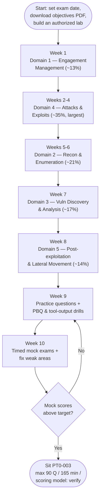

# PenTest+ (PT0-003) Study Plan

An ordered route through this `pentest-plus/` hub for the **CompTIA PenTest+ (PT0-003)** exam. It sequences the five domains by **exam weighting** — so your study time lands where the points are — gives **performance-based question (PBQ)** practice tips, covers **exam-day logistics**, and links the **authorized lab** resources you need to practice legally. It is written for a **systems administrator moving toward penetration testing**: you already operate the systems these techniques target, which is a real head start.

> **Time estimates below are SUGGESTIONS, not requirements.** They assume a working sysadmin studying part-time. CompTIA does not mandate a study duration — compress or stretch to fit your pace, prior knowledge, and exam date. Re-check all volatile specifics (question count, time, scoring model, price, Continuing Education Units) on CompTIA: https://www.comptia.org/en-us/certifications/pentest/

## Learning objectives

- Follow a weight-prioritized path through the five PT0-003 domains, front-loading **Domain 4 (~35%)** and **Domain 2 (~21%)**.
- Allocate study time in proportion to each domain's weighting.
- Prepare specifically for **PenTest+ PBQs** — analyzing tool output, choosing the right tool/technique, and reading scripting logic.
- Know the exam-day logistics: **max 90 questions (MCQ + PBQ), 165 minutes**; passing/scoring model — **verify on CompTIA**.
- Practice **only** in authorized, isolated labs.

## The five domains and weightings

PenTest+ is organized into five domains. The weightings below are the published structure for PT0-003 — **verify the current values on CompTIA**, as exam blueprints change.

| Domain | Title | Weight | Where it lives |
| --- | --- | --- | --- |
| 1 | Engagement Management | ~13% | `../domains/01-engagement-management.md` |
| 2 | Reconnaissance & Enumeration | ~21% | `../domains/02-reconnaissance-and-enumeration.md` |
| 3 | Vulnerability Discovery & Analysis | ~17% | `../domains/03-vulnerability-discovery-and-analysis.md` |
| 4 | **Attacks and Exploits** | **~35%** | [`../domains/04-attacks-and-exploits.md`](../domains/04-attacks-and-exploits.md) |
| 5 | Post-exploitation & Lateral Movement | ~14% | [`../domains/05-post-exploitation-and-lateral-movement.md`](../domains/05-post-exploitation-and-lateral-movement.md) |

> Unlike a defensive cert, PenTest+ is **methodology-ordered**: a real engagement runs 1 → 2 → 3 → 4 → 5. But for *studying*, weight should drive your hours — and **Domain 4 alone is roughly a third of the exam**.

## Weight-driven priority

Spend the most time on **Domain 4 (~35%)** and **Domain 2 (~21%)**; give **Domain 3 (~17%)** and **Domain 5 (~14%)** solid coverage; and treat **Domain 1 (~13%)** as the professional framing the others assume.

| Order | Domain | Weight | Suggested study share | Why this slot |
| --- | --- | --- | --- | --- |
| 1 | Domain 1 — Engagement Management | ~13% | ~12% | Scoping, RoE, legal authorization, reporting — read first; it governs everything else |
| 2 | **Domain 4 — Attacks and Exploits** | **~35%** | **~32%** | Largest domain; the core of the exam and your biggest payoff |
| 3 | **Domain 2 — Reconnaissance & Enumeration** | **~21%** | **~22%** | Second-largest; feeds every attack and is closest to sysadmin skills |
| 4 | Domain 3 — Vulnerability Discovery & Analysis | ~17% | ~17% | Turns recon into prioritized, exploitable findings |
| 5 | Domain 5 — Post-exploitation & Lateral Movement | ~14% | ~17% | Smaller weight but conceptually rich; where PAM/defense ties in |

> Read **Domain 1 first** even though it is small — scoping, written authorization, and Rules of Engagement (RoE) are the legal and professional spine of the whole exam. Then pour hours into **Domain 4** and **Domain 2**.

## The study path at a glance

## Week-by-week milestones

### Week 1 — Domain 1: Engagement Management (~13%) — suggested ~5–7 h
- Lock down **pre-engagement** essentials: **scope**, **written authorization**, **Rules of Engagement (RoE)**, target/asset lists, and communication/escalation paths. Understand **legal and compliance** framing and **report-writing** structure (findings, risk rating, remediation).
- **Milestone:** you can explain why **written authorization + scope + RoE** must exist before any testing, and outline a pentest report.

### Weeks 2–4 — Domain 4: Attacks and Exploits (~35%, largest) — suggested ~16–22 h
- Read [Domain 4](../domains/04-attacks-and-exploits.md). Cover every attack category conceptually: network, authentication/credential, host-based, web-application (**OWASP Top 10**), wireless, cloud, social engineering, physical, and specialized systems (mobile/IoT/OT-ICS).
- For each, be able to state **what it targets, why it works, the countermeasure, and the detection**. Recognize tools by **purpose** (Metasploit, Burp Suite, ZAP, sqlmap, Hydra, Hashcat, Aircrack-ng).
- **Milestone:** you can map any common attack to its category, its OWASP item (if web), and its defense.

### Weeks 5–6 — Domain 2: Reconnaissance & Enumeration (~21%) — suggested ~9–12 h
- Cover **passive vs active reconnaissance**, **Open-Source Intelligence (OSINT)**, network/port **scanning**, service and host **enumeration**, and AD/cloud enumeration concepts.
- Lean on your sysadmin background here — Nmap output, DNS records, and service banners are familiar ground. Cross-reference CEH **[Footprinting](../../ceh/domains/02-footprinting-and-reconnaissance.md)**, **[Scanning](../../ceh/domains/03-scanning-networks.md)**, and **[Enumeration](../../ceh/domains/04-enumeration.md)**.
- **Milestone:** you can read scan/enumeration output and explain what each finding implies for the next step.

### Week 7 — Domain 3: Vulnerability Discovery & Analysis (~17%) — suggested ~7–9 h
- Cover **automated scanning**, interpreting scanner output, **manual analysis**, distinguishing **false positives/negatives**, and **prioritizing** by exploitability and impact (e.g., CVSS context). Cross-reference CEH **[Vulnerability Analysis](../../ceh/domains/05-vulnerability-analysis.md)**.
- **Milestone:** given scanner output, you can triage which findings are real, exploitable, and worth chaining.

### Week 8 — Domain 5: Post-exploitation & Lateral Movement (~14%) — suggested ~6–8 h
- Read [Domain 5](../domains/05-post-exploitation-and-lateral-movement.md). Cover the chain — enumeration of a compromised host, privilege escalation, persistence, lateral movement/pivoting, collection/exfiltration, covering tracks — each with its **defensive control** and **detection**.
- **Milestone:** you can recite the chain and pair each phase with a defense (segmentation, PAM, EDR, least privilege, centralized logging).

### Week 9 — Practice & PBQ rehearsal — suggested ~8–10 h
- Work the [practice questions](practice-questions.md) domain by domain; review every miss against the relevant domain page.
- Rehearse **PBQ-style tasks** hands-on in your authorized lab (see tips below).
- **Milestone:** consistently above your target on each domain set.

### Week 10 — Consolidation — suggested ~6–8 h
- Take **full-length timed mock exams** under exam conditions; re-read your two weakest domains.
- **Milestone:** you finish a full mock within **165 minutes** with margin to spare.

## Performance-based questions (PBQ) practice tips

PenTest+ PBQs are interactive and notoriously hands-on. They differ from a purely defensive exam — expect to **work with real tool output and logic**, not just recall definitions.

- **Analyzing tool output.** Practice reading the *output* of common tools — Nmap scan results, a vulnerability-scanner report, a web-proxy request/response, a captured packet summary — and answering "what does this tell you and what is the next step?" Knowing what a tool *says* matters more than memorizing its flags.
- **Choosing the right tool/technique.** PBQs often present a scenario and ask you to pick the **appropriate tool or technique** for that stage of the engagement (recon vs enumeration vs exploitation vs post-exploitation). Build a mental map of **tool → purpose → engagement phase**.
- **Scripting logic.** PenTest+ expects you to **read and reason about scripts** (Bash, Python, PowerShell). You are tested on *understanding what a snippet does and fixing/predicting its logic*, not on writing weaponized code. Practice tracing variables, loops, and conditionals and spotting an off-by-one or wrong-comparison bug.
- **Read the whole scenario first.** PBQs bury constraints (scope limits, in-scope hosts, allowed actions) in the prompt — one missed line can change the right answer, and staying in scope is part of the correct response.
- **Flag and return.** PBQs are time-consuming; if the interface allows, flag a hard one, clear the multiple-choice items, then come back. *(Verify the current interface permits skipping/returning — delivery can change.)*
- **Budget time.** With **up to 90 items in 165 minutes** you average a little under 2 minutes per item, but PBQs eat several minutes each — bank time on the quick MCQs.

## Practice legally — authorized labs only

You may practice these techniques **only** on systems you own or are explicitly authorized to test. Never point any tool at third-party or production systems without written permission and scope.

- **Build an isolated lab.** Stand up a self-contained, offline-capable lab on your own hardware or in your own cloud tenant. The CEH hub's lab guide applies directly: [building a CEH lab](../../ceh/labs/building-a-ceh-lab.md).
- **Use sanctioned practice platforms.** Intentionally vulnerable targets and gamified ranges exist specifically for legal practice. See the curated list in [learning platforms](../../learning/platforms.md).
- **Keep authorization paperwork in the habit early.** Even in a lab, practice writing a one-line scope and RoE before you start — it builds the discipline Domain 1 tests and a real engagement demands.

> **Authorized-use note.** Penetration testing without written authorization, defined scope, and Rules of Engagement is illegal. Treat the lab discipline as part of the certification, not an afterthought.

## Exam-day logistics

| Item | Detail |
| --- | --- |
| Questions | **Maximum 90** — **multiple-choice (MCQ) + performance-based (PBQ)** |
| Duration | **165 minutes** |
| Passing / scoring | **Scoring model — verify on CompTIA** (do not rely on a third-party "you need X%" claim) |
| Delivery | Testing center or online proctoring — *verify current options on CompTIA* |
| Recommended experience | Network+/Security+ and ~3–4 years of hands-on security experience (recommended, **not** required) |
| Price / renewal (CEUs) | **Not quoted here — verify on CompTIA**; programs change |

- **Do not assert a fixed passing number.** CompTIA's scoring model for PT0-003 should be confirmed on the official page; ignore unofficial percentage claims.
- **Pacing:** a little under 2 minutes per item on average — front-load quick MCQs to bank time for PBQs.
- **On the day:** read each question fully, watch qualifier words (*best*, *most likely*, *first*, *next*), confirm **scope** in scenario items, and use flag-and-review for anything uncertain.

## Where to go next

- [practice-questions.md](practice-questions.md) — 45+ unofficial practice questions grouped by domain.
- [Domain 4 — Attacks and Exploits](../domains/04-attacks-and-exploits.md) — the largest domain.
- [Domain 5 — Post-exploitation and Lateral Movement](../domains/05-post-exploitation-and-lateral-movement.md) — where PAM/defense ties in.
- [building a CEH lab](../../ceh/labs/building-a-ceh-lab.md) · [learning platforms](../../learning/platforms.md) — authorized practice environments.
- [CEH study plan](../../ceh/exam-prep/study-plan.md) · [Security+ study plan](../../security-plus/exam-prep/study-plan.md) — sibling study plans.

## Sources

- CompTIA — PenTest+ (PT0-003) official certification page (max 90 questions, MCQ + PBQ, 165 minutes, five domains; verify scoring model and weightings): https://www.comptia.org/en-us/certifications/pentest/
- CompTIA — PenTest+ (PT0-003) exam objectives download (the authoritative study checklist): https://www.comptia.org/en-us/certifications/pentest/
- NIST SP 800-115 — Technical Guide to Information Security Testing and Assessment: https://csrc.nist.gov/pubs/sp/800/115/final
- All volatile specifics (passing/scoring model, price, delivery, CEU renewal, exact weightings) are version-sensitive — *verify on CompTIA*.
