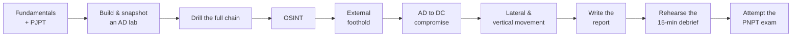

# PNPT Study Plan

A realistic preparation path for the **Practical Network Penetration Tester (PNPT)** from
**TCM Security**. The PNPT is a hands-on engagement, so preparation is mostly **practice
under realistic conditions** — running the full workflow end to end, taking good notes, and
rehearsing the live debrief. This plan suggests an order and a timeline; the timeline is a
**suggested estimate**, not an official requirement.

> **Authorized-use note.** All practice below uses **labs you own** or platforms that
> grant **explicit authorization**. Never practice against systems you do not own or are
> not authorized, in scope, to test. See the CEH hub's
> [legal & ethics](../../ceh/00-overview/legal-and-ethics.md).

## Learning objectives

- Sequence preparation: fundamentals → PJPT → AD lab → full workflow → debrief rehearsal.
- Build a practice **Active Directory (AD)** lab.
- Practice the complete OSINT → external → AD → lateral → report → debrief workflow.
- Develop note-taking habits that make the 2-day report achievable.
- Prepare for exam logistics and the live debrief.

## Prerequisites — start here

| Foundation | Why it matters |
| --- | --- |
| **Networking & protocols** | You must read traffic and understand routing to pivot |
| **Windows & Active Directory** | The PNPT is AD-heavy; comfort with domains is essential |
| **Linux & basic scripting** | Attacker tooling and the report workflow live here |
| **A security baseline** | CompTIA Security+ context helps — see [../../security-plus/README.md](../../security-plus/README.md) |

## Do PJPT / fundamentals first

TCM Security recommends the **Practical Junior Penetration Tester (PJPT)** as the warm-up
*(verify on TCM)*. It drills the **AD attack chain** at smaller scale, building the reflexes
the PNPT depends on. Work the **bundled training** (including TCM Academy) before attempting
the exam. Do not skip straight to the PNPT engagement without AD fluency.

## Build an AD lab

Hands-on AD is non-negotiable. Build a small domain — a Domain Controller plus a couple of
member workstations — so you can safely practice enumeration, credential-attack concepts,
and movement. For a reusable lab build, follow the CEH hub's guide:
[building a CEH lab](../../ceh/labs/building-a-ceh-lab.md). For practice platforms and where
they fit, see [../../learning/platforms.md](../../learning/platforms.md).

| Lab element | Purpose |
| --- | --- |
| **Domain Controller** | Practice AD enumeration and the path to DC compromise |
| **2+ member hosts** | Practice lateral movement and pivoting between machines |
| **A "perimeter" service** | Rehearse the external-to-internal foothold transition |
| **Snapshots** | Reset cleanly between attempts |

## Practice the full workflow

The exam is **one continuous engagement**, so rehearse it as one — not as isolated skills.
Run the whole chain repeatedly until it is routine.

Each topic page in this hub maps to a phase to drill:
[01 OSINT](../topics/01-osint-and-reconnaissance.md) →
[02 external](../topics/02-external-penetration-testing.md) →
[03 AD](../topics/03-active-directory-exploitation.md) →
[04 lateral](../topics/04-lateral-movement-and-pivoting.md) →
[05 report & debrief](../topics/05-reporting-and-the-debrief.md).

## Note-taking — the make-or-break habit

The 2-day report window is **only achievable if you took good notes during the assessment**.

- **Capture as you go**: timestamped commands, screenshots, and the host/credential that
  enabled each step.
- **Structure notes by finding** so they drop straight into the report template.
- **Record the full path** to DC, not just the final access — the debrief asks for it.

## Rehearse the debrief

The **live 15-minute debrief** is graded and surprises many candidates.

- Practice a **2-minute executive summary** and a deeper **technical walk-through** out loud.
- Be ready to **justify each step** and recommend prioritized remediation.
- Rehearse explaining impact to a **non-technical** listener.

See [05 — Reporting & the debrief](../topics/05-reporting-and-the-debrief.md) for the report
structure and debrief evaluation criteria.

## Suggested timeline (estimate — adjust to your background)

| Phase | Suggested time | Focus |
| --- | --- | --- |
| **Fundamentals refresh** | 2–4 weeks | Networking, Windows/AD, Linux, scripting |
| **PJPT + bundled training** | 4–8 weeks | AD attack-chain reflexes via TCM Academy |
| **Lab + full-workflow drills** | 3–6 weeks | Run OSINT → DC → report end to end, repeatedly |
| **Debrief rehearsal** | Ongoing | Explain your methodology aloud each run |

These figures are a **labeled suggestion**, not an official TCM schedule — a sysadmin with
strong AD and Linux already may move faster.

## Exam logistics

| Item | Detail *(verify on TCM)* |
| --- | --- |
| **Assessment** | **5-day** practical engagement against a simulated network |
| **Report** | **2-day** window to write the professional report |
| **Debrief** | **Live 15-minute** methodology defense with TCM assessors |
| **Retake** | **1 free retake** included |
| **Validity** | **Non-expiring** (per TCM) |
| **Training** | Bundled supporting courses included with the voucher |

For full exam context see [../00-overview/exam-structure.md](../00-overview/exam-structure.md)
and [../00-overview/what-is-pnpt.md](../00-overview/what-is-pnpt.md).

## Exam tips

- **Treat practice runs like the real exam**: time-box, take notes, and produce a report
  each time.
- **Use the free retake as a safety net, not a plan** — the debrief feedback is valuable
  either way.
- **Drill AD until enumeration and the path to DC are second nature** — it is the bulk of
  the engagement.

> Authorized-use note: practice only in labs you own or platforms that grant explicit,
> in-scope authorization.

## Sources

- TCM Security — PNPT certification page: <https://certifications.tcm-sec.com/pnpt/>
  (5-day assessment + 2-day report + live 15-minute debrief, 1 free retake, bundled
  training, non-expiring; PJPT recommended first; volatile details marked "verify on TCM").
- Cross-reference — CEH hub:
  [building a CEH lab](../../ceh/labs/building-a-ceh-lab.md); learning hub:
  [platforms](../../learning/platforms.md). Compiled **2026-06-21**.
